---
title: Java 知识点完整整合大全
tags: [后端, Java, 基础, 面试]
created: 2026-08-12
updated: 2026-08-12
---

# Java 知识点完整整合大全（优化版）

> **优化版说明**：本文档在原有内容基础上，为每个三级标题知识点补充了「🔍 深度解析」（作用+原理+用法要点），所有原有内容完整保留，未做任何修改。


> **文档说明**：本文档由两份 Java 学习资料完整整合而成，严格保留两份文档的全部原始内容，未做任何删减或改动。在此基础上，依据知识点之间的逻辑关联与重要程度进行了合理的排序与结构调整，并补充了有助于理解的流程图、对比表格与总结说明。
>
> **整合来源**：
> - 文档 A：《Java学习知识点大全》（WorkBuddy 版，13 部分 74 个知识点）
> - 文档 B：《java-knowledge-guide-v2》（DouBao 版，5 篇 33 章 222 个小节）
>
> **适用人群**：Java 初学者、面试备考者、需要系统复习的开发者

---

# 第一篇：Java 语言基础

> **本篇导言**：本篇涵盖 Java 语言的基础语法与面向对象核心概念，是学习 Java 的起点。内容包括 Java 技术体系、基础语法（数据类型、运算符、流程控制、权限修饰符）、面向对象基础（封装、继承、多态）、面向对象进阶（抽象类、接口、内部类、枚举、Record、Object 方法）、常用基础类库（字符串、包装类、数学与随机数、正则表达式、系统与运行时、工具类）、数组，以及值传递、初始化顺序、自动拆箱陷阱等易混淆概念。建议初学者按顺序学习，重点掌握面向对象思想和常用类库的使用。

---

## 1. Java 语言概述

### 1.1 Java 技术体系（Java SE/EE/ME）

| 版本 | 全称 | 说明 |
|------|------|------|
| Java SE | Standard Edition | 标准版，包含核心类库和 JVM，是其他版本的基础 |
| Java EE | Enterprise Edition | 企业版，在 SE 基础上增加了 Web 开发、分布式等企业级功能（Servlet、JSP、EJB 等），现更名为 Jakarta EE |
| Java ME | Micro Edition | 微型版，用于嵌入式设备和移动设备，已逐渐被 Android 等取代 |


> 🔍 **知识点深度解析**
>
> **作用**：Java技术体系分Java SE（标准版，基础语法/JVM/集合）、Java EE（企业版，Servlet/EJB，已被Spring替代）、Java ME（微型版，已淘汰）。
>
> **原理**：JDK包含JRE+开发工具。
>
> **用法要点**：① Java技术体系分Java SE（标准版，基础语法/JVM/集合）、Java EE（企业版，Servlet/EJB，已被Spring替代）、Java ME（微型版，已淘汰） ② JDK包含JRE+开发工具

### 1.2 Java 核心特性

- **跨平台性**：一次编写，到处运行（Write Once, Run Anywhere），通过 JVM 实现
- **面向对象（OOP）**：封装、继承、多态三大特性
- **健壮性**：强类型检查、异常处理、垃圾回收
- **安全性**：字节码验证、安全管理器、沙箱机制
- **多线程**：内置多线程支持
- **简单性**：去除了 C++ 中的指针、多继承等复杂特性


> 🔍 **知识点深度解析**
>
> **作用**：跨平台原理是JVM（一次编译到处运行）；。
>
> **原理**：面向对象（封装/继承/多态）；。
>
> **用法要点**：① 跨平台原理是JVM（一次编译到处运行） ② 面向对象（封装/继承/多态） ③ 自动内存管理（GC回收无用对象） ④ 多语言支持（Kotlin/Scala运行在JVM上）

### 1.3 JDK / JRE / JVM

<div style="background:linear-gradient(135deg,#667eea,#764ba2);border-radius:16px;padding:20px;margin:16px 0;font-family:-apple-system,'Segoe UI','PingFang SC','Microsoft YaHei',sans-serif;color:#fff;overflow:hidden;box-shadow:0 8px 28px rgba(0,0,0,.14),0 3px 10px rgba(0,0,0,.08)">
<style>@keyframes pulse{0%,100%{transform:scale(1);opacity:.9}50%{transform:scale(1.03);opacity:1}}@keyframes glow{0%,100%{box-shadow:0 0 8px rgba(255,255,255,.3)}50%{box-shadow:0 0 20px rgba(255,255,255,.6)}}.dk-layer{border-radius:8px;padding:12px 16px;margin:6px auto;text-align:center;font-weight:600;animation:pulse 3s ease-in-out infinite}.dk-jdk{background:rgba(255,255,255,.15);border:2px solid rgba(255,255,255,.5);max-width:320px;animation-delay:0s}.dk-jre{background:rgba(255,255,255,.2);border:2px solid rgba(255,255,255,.6);max-width:260px;animation-delay:.5s}.dk-jvm{background:rgba(255,255,255,.25);border:2px solid rgba(255,255,255,.7);max-width:200px;animation-delay:1s}.dk-arrow{text-align:center;font-size:18px;animation:glow 2s ease-in-out infinite;margin:2px 0}.dk-label{font-size:12px;opacity:.85;font-weight:400;margin-top:4px}</style>
<div style="text-align:center;font-size:15px;font-weight:700;margin-bottom:14px;padding-bottom:10px;border-bottom:1.5px solid rgba(255,255,255,.22);letter-spacing:1px;text-shadow:0 1px 3px rgba(0,0,0,.12)">JDK ⊃ JRE ⊃ JVM 三层包含关系</div>
<div class="dk-layer dk-jdk">JDK（Java Development Kit）<div class="dk-label">开发工具包：编译器 javac + 调试器 + JRE</div></div>
<div class="dk-arrow">▼ 包含</div>
<div class="dk-layer dk-jre">JRE（Java Runtime Environment）<div class="dk-label">运行环境：核心类库 + JVM</div></div>
<div class="dk-arrow">▼ 包含</div>
<div class="dk-layer dk-jvm">JVM（Java Virtual Machine）<div class="dk-label">虚拟机：字节码执行引擎</div></div>
</div>

| 名称 | 全称 | 说明 |
|------|------|------|
| JVM | Java Virtual Machine | Java 虚拟机，负责执行字节码，是跨平台的核心 |
| JRE | Java Runtime Environment | Java 运行时环境，包含 JVM 和核心类库，用于运行 Java 程序 |
| JDK | Java Development Kit | Java 开发工具包，包含 JRE 和开发工具（javac、java、javadoc 等） |

**关系**：JDK ⊃ JRE ⊃ JVM

**LTS 版本推荐**：
- Java 8（LTS，2014）：长期支持版本，企业广泛使用
- Java 11（LTS，2018）：长期支持版本
- Java 17（LTS，2021）：当前推荐的 LTS 版本
- Java 21（LTS，2023）：最新 LTS 版本，支持虚拟线程

**Java 11+ 单文件运行**：
```bash
# Java 11+ 支持直接运行 .java 文件，无需先编译
java HelloWorld.java
```


> 🔍 **知识点深度解析**
>
> **作用**：JDK=JRE+开发工具（javac/java等），JRE=JVM+核心类库，JVM执行字节码。
>
> **原理**：开发装JDK，运行只装JRE。
>
> **用法要点**：① JDK=JRE+开发工具（javac/java等），JRE=JVM+核心类库，JVM执行字节码 ② 开发装JDK，运行只装JRE ③ Java 9后模块化，JRE可定制（jlink）

### 1.4 Java 程序执行流程

<div style="background:linear-gradient(135deg,#f093fb,#f5576c);border-radius:16px;padding:20px;margin:16px 0;font-family:-apple-system,'Segoe UI','PingFang SC','Microsoft YaHei',sans-serif;color:#fff;overflow:hidden;box-shadow:0 8px 28px rgba(0,0,0,.14),0 3px 10px rgba(0,0,0,.08)">
<style>@keyframes flow{0%{transform:translateX(-10px);opacity:0}15%{transform:translateX(0);opacity:1}85%{transform:translateX(0);opacity:1}100%{transform:translateX(10px);opacity:0}}@keyframes dash{to{stroke-dashoffset:-20}}.flow-step{display:inline-block;background:rgba(255,255,255,.2);border:2px solid rgba(255,255,255,.5);border-radius:8px;padding:10px 14px;margin:4px;text-align:center;font-weight:600;font-size:13px;animation:flow 4s ease-in-out infinite;min-width:90px}.flow-step:nth-child(2){animation-delay:.5s}.flow-step:nth-child(4){animation-delay:1s}.flow-step:nth-child(6){animation-delay:1.5s}.flow-step:nth-child(8){animation-delay:2s}.flow-arrow{display:inline-block;font-size:20px;animation:flow 4s ease-in-out infinite;vertical-align:middle}.flow-code{background:rgba(0,0,0,.2);border-radius:6px;box-shadow:0 2px 8px rgba(0,0,0,.06);padding:8px 12px;margin-top:10px;font-family:monospace;font-size:12px;text-align:center}</style>
<div style="text-align:center;font-size:15px;font-weight:700;margin-bottom:14px;padding-bottom:10px;border-bottom:1.5px solid rgba(255,255,255,.22);letter-spacing:1px;text-shadow:0 1px 3px rgba(0,0,0,.12)">Java 程序执行流程（一次编译，到处运行）</div>
<div style="text-align:center;white-space:nowrap;overflow-x:auto">
<span class="flow-step">.java 源码</span><span class="flow-arrow">→</span><span class="flow-step">javac 编译</span><span class="flow-arrow">→</span><span class="flow-step">.class 字节码</span><span class="flow-arrow">→</span><span class="flow-step">JVM 加载执行</span>
</div>
<div class="flow-code">java HelloWorld → 类加载器 → 字节码校验 → 解释器/JIT → 操作系统执行</div>
<div style="text-align:center;font-size:12px;opacity:.85;margin-top:8px">跨平台原理：同一 .class 文件可在任意安装了 JVM 的平台运行</div>
</div>

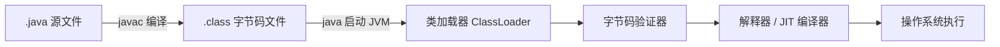

1. **编写**：开发者编写 `.java` 源文件
2. **编译**：`javac` 编译器将 `.java` 编译为 `.class` 字节码文件
3. **类加载**：JVM 的类加载器将 `.class` 文件加载到内存
4. **字节码验证**：验证字节码的安全性和正确性
5. **执行**：解释器逐行解释执行，或 JIT 编译器编译为本地机器码执行

---

> 💡 **深度讲解**：Java 之所以能"一次编写，到处运行"，核心在于 JVM 这层抽象——不同操作系统上有不同的 JVM 实现，但它们都能执行同一份 `.class` 字节码。JDK 是开发时用的大礼包（含编译器 javac、打包工具 jar、文档工具 javadoc 等），JRE 是运行时环境（含 JVM + 核心类库），JVM 是真正执行字节码的虚拟机。三者是包含关系：JDK ⊃ JRE ⊃ JVM。企业选型时优先考虑 LTS（长期支持）版本：Java 8 是存量最多的经典版本，Java 17 是当前主流推荐，Java 21 带来了虚拟线程等革命性特性。Java 11+ 还支持直接用 `java HelloWorld.java` 单文件运行，省去编译步骤，适合快速验证。
>
> **📝 精简总结**：Java 通过 JVM 实现跨平台，JDK 包含 JRE，JRE 包含 JVM；开发选 LTS 版本（8/17/21），核心特性是面向对象、健壮性、多线程和垃圾回收。

---

## 2. 基础语法


> 🔍 **知识点深度解析**
>
> **作用**：执行流程：.java→javac编译→.class字节码→JVM类加载→字节码验证→解释执行/JIT编译→机器码。
>
> **原理**：JIT热点代码编译为本地机器码提升性能。
>
> **用法要点**：① 执行流程：.java→javac编译→.class字节码→JVM类加载→字节码验证→解释执行/JIT编译→机器码 ② JIT热点代码编译为本地机器码提升性能

### 2.1 数据类型

#### 8 种基本数据类型

| 类型 | 大小 | 默认值 | 取值范围 | 包装类 |
|------|------|--------|---------|--------|
| byte | 1 字节 | 0 | -128 ~ 127 | Byte |
| short | 2 字节 | 0 | -32768 ~ 32767 | Short |
| int | 4 字节 | 0 | -2^31 ~ 2^31-1 | Integer |
| long | 8 字节 | 0L | -2^63 ~ 2^63-1 | Long |
| float | 4 字节 | 0.0f | 约 ±3.4e38 | Float |
| double | 8 字节 | 0.0d | 约 ±1.8e308 | Double |
| char | 2 字节 | '\u0000' | '\u0000' ~ '\uFFFF' | Character |
| boolean | 1 位 | false | true / false | Boolean |

#### 引用类型

- 类（Class）
- 接口（Interface）
- 数组（Array）
- 枚举（Enum）
- 记录（Record）

引用类型的默认值为 `null`。

#### 类型转换

**自动类型转换（隐式）**：小范围 → 大范围，自动进行
```
byte → short → int → long → float → double
              char ↗
```

**强制类型转换（显式）**：大范围 → 小范围，可能丢失精度
```java
int i = 100;
byte b = (byte) i;  // 强制转换
```

#### 值传递机制

Java 中只有值传递：
- 基本类型：传递值的副本
- 引用类型：传递引用地址的副本（不是对象本身）

> 详见 [第7章：值传递与引用传递](#7-值传递与引用传递)

#### 字面量

```java
// 整数字面量
int decimal = 100;       // 十进制
int binary = 0b1010;     // 二进制（Java 7+）
int octal = 012;         // 八进制
int hex = 0xFF;          // 十六进制
long big = 10000000000L; // long 类型加 L 后缀

// 浮点字面量
float f = 3.14f;         // float 加 f 后缀
double d = 3.14;         // 默认 double
double scientific = 1.5e3; // 科学计数法

// 字符字面量
char c = 'A';
char unicode = '\u0041'; // Unicode 转义

// 数字下划线（Java 7+，提高可读性）
int million = 1_000_000;
long ssn = 123_45_6789L;
```


> 🔍 **知识点深度解析**
>
> **作用**：基本类型8种（byte/short/int/long/float/double/char/boolean）存栈，引用类型存堆。
>
> **原理**：类型转换小到大自动，大到小强制。
>
> **用法要点**：① 基本类型8种（byte/short/int/long/float/double/char/boolean）存栈，引用类型存堆 ② 自动装箱拆箱 ③ 类型转换小到大自动，大到小强制 ④ float精度问题用BigDecimal

### 2.2 运算符

#### 算术运算符

| 运算符 | 说明 | 示例 |
|--------|------|------|
| + | 加法 / 字符串连接 | `a + b`, `"hello" + "world"` |
| - | 减法 | `a - b` |
| * | 乘法 | `a * b` |
| / | 除法 | `a / b`（整数除法取整） |
| % | 取模（求余） | `a % b` |
| ++ | 自增 | `a++`（先用后加）, `++a`（先加后用） |
| -- | 自减 | `a--`, `--a` |

#### 赋值运算符

| 运算符 | 说明 | 示例 |
|--------|------|------|
| = | 赋值 | `a = 10` |
| += | 加后赋值 | `a += b` 等价于 `a = a + b` |
| -= | 减后赋值 | `a -= b` |
| *= | 乘后赋值 | `a *= b` |
| /= | 除后赋值 | `a /= b` |
| %= | 取模后赋值 | `a %= b` |

#### 比较运算符

| 运算符 | 说明 | 示例 |
|--------|------|------|
| == | 等于 | `a == b` |
| != | 不等于 | `a != b` |
| > | 大于 | `a > b` |
| < | 小于 | `a < b` |
| >= | 大于等于 | `a >= b` |
| <= | 小于等于 | `a <= b` |

> **注意**：`==` 比较引用类型时比较的是地址，比较内容应使用 `equals()` 方法。

#### 逻辑运算符

| 运算符 | 说明 | 特点 |
|--------|------|------|
| && | 短路与 | 左边为 false 则不计算右边 |
| \|\| | 短路或 | 左边为 true 则不计算右边 |
| & | 非短路与 | 两边都计算 |
| \| | 非短路或 | 两边都计算 |
| ! | 非 | 取反 |
| ^ | 异或 | 不同为 true，相同为 false |

#### 位运算符

| 运算符 | 说明 | 示例 |
|--------|------|------|
| & | 按位与 | `a & b` |
| \| | 按位或 | `a \| b` |
| ^ | 按位异或 | `a ^ b` |
| ~ | 按位取反 | `~a` |
| << | 左移 | `a << 2`（相当于乘 4） |
| >> | 右移（带符号） | `a >> 2`（相当于除 4） |
| >>> | 无符号右移 | `a >>> 2` |

#### 三元运算符

```java
// 条件 ? 表达式1 : 表达式2
int max = (a > b) ? a : b;
```

#### instanceof 运算符

```java
// 判断对象是否是某个类的实例
if (obj instanceof String) {
    String s = (String) obj;
}

// Java 16+ 模式匹配（自动类型转换）
if (obj instanceof String s) {
    System.out.println(s.length());  // 直接使用 s
}
```


> 🔍 **知识点深度解析**
>
> **作用**：算术/赋值/比较/逻辑/位/三元运算符。
>
> **原理**：&&短路（左边false不执行右边），&不短路。
>
> **用法要点**：① 算术/赋值/比较/逻辑/位/三元运算符 ② &&短路（左边false不执行右边），&不短路 ③ 位运算<< >>性能高（2的幂乘除） ④ instanceof判断类型

### 2.3 流程控制

#### if-else

```java
if (condition) {
    // 条件为 true
} else if (otherCondition) {
    // 其他条件
} else {
    // 都不满足
}
```

#### switch

**传统 switch**：
```java
switch (day) {
    case 1:
        System.out.println("周一");
        break;
    case 2:
        System.out.println("周二");
        break;
    default:
        System.out.println("其他");
}
```

**switch 箭头表达式（Java 14+）**：
```java
switch (day) {
    case 1, 2, 3, 4, 5 -> System.out.println("工作日");
    case 6, 7 -> System.out.println("周末");
    default -> System.out.println("无效");
}
```

**switch 表达式 + yield（Java 14+）**：
```java
String result = switch (day) {
    case 1, 2, 3, 4, 5 -> "工作日";
    case 6, 7 -> "周末";
    default -> {
        String msg = "无效日期: " + day;
        yield msg;  // yield 返回值
    }
};
```

#### 循环

```java
// for 循环
for (int i = 0; i < 10; i++) {
    System.out.println(i);
}

// 增强 for 循环（for-each）
for (String item : list) {
    System.out.println(item);
}

// while 循环
while (condition) {
    // 循环体
}

// do-while 循环（至少执行一次）
do {
    // 循环体
} while (condition);
```

#### 跳转语句

```java
break;      // 跳出循环或 switch
continue;   // 跳过本次循环，继续下一次

// 带标签的 break / continue
outer:
for (int i = 0; i < 10; i++) {
    for (int j = 0; j < 10; j++) {
        if (j == 5) {
            break outer;  // 跳出外层循环
        }
    }
}
```


> 🔍 **知识点深度解析**
>
> **作用**：if-else/switch/for/while/do-while/break/continue。
>
> **原理**：增强for遍历数组和集合。
>
> **用法要点**：① if-else/switch/for/while/do-while/break/continue ② switch支持String（Java 7+）、枚举，Java 14+支持switch表达式（->和yield） ③ 增强for遍历数组和集合

### 2.4 权限修饰符

| 修饰符 | 同类 | 同包 | 子类 | 所有类 |
|--------|------|------|------|--------|
| public | ✓ | ✓ | ✓ | ✓ |
| protected | ✓ | ✓ | ✓ | ✗ |
| default（包私有） | ✓ | ✓ | ✗ | ✗ |
| private | ✓ | ✗ | ✗ | ✗ |


> 🔍 **知识点深度解析**
>
> **作用**：public（所有类）>protected（同包+子类）>default（同包）>private（本类）。
>
> **原理**：成员变量推荐private，通过getter/setter访问（封装）。
>
> **用法要点**：① public（所有类）>protected（同包+子类）>default（同包）>private（本类） ② 类只能public或default ③ 成员变量推荐private，通过getter/setter访问（封装）

### 2.5 关键字总结

| 分类 | 关键字 |
|------|--------|
| 数据类型 | byte、short、int、long、float、double、char、boolean、void |
| 流程控制 | if、else、switch、case、default、for、while、do、break、continue、return |
| 面向对象 | class、interface、extends、implements、new、this、super、instanceof、abstract、final、static、enum、record、sealed、permits |
| 异常处理 | try、catch、finally、throw、throws |
| 包相关 | package、import |
| 权限修饰 | public、protected、private |
| 其他 | true、false、null、synchronized、volatile、transient、native、strictfp、assert、var、yield、_（保留字） |

---

> 💡 **深度讲解**：Java 是强类型语言，8 种基本数据类型各有明确的内存大小和取值范围，选择时要注意范围溢出（如 byte 最大 127）和精度丢失（float 只有 7 位有效数字）。运算符中最容易踩坑的是 `==`：比较基本类型时值相等即可，比较引用类型时比的是内存地址，要比内容必须用 `equals()`。逻辑运算符 `&&` 和 `||` 是短路的——左边能确定结果就不执行右边，这在判空时非常有用（`if (str != null && str.length() > 0)`），但也可能导致右边的副作用代码不执行。Java 14+ 的 switch 箭头表达式和 yield 让分支代码更简洁，模式匹配的 instanceof 则省去了强制类型转换。权限修饰符的可见性从大到小是 public > protected > default > private，设计类时应遵循"最小暴露原则"。
>
> **📝 精简总结**：8 种基本类型各有范围，引用类型用 equals 比内容；短路运算符高效但注意副作用；switch 表达式和 instanceof 模式匹配是现代 Java 的简洁写法；权限遵循最小暴露原则。

---

## 3. 面向对象基础


> 🔍 **知识点深度解析**
>
> **作用**：50个关键字，goto/const保留未使用。
>
> **原理**：synchronized同步，volatile可见性。
>
> **用法要点**：① 50个关键字，goto/const保留未使用 ② this指代当前对象，super指代父类 ③ static静态（类级别），final不可变 ④ synchronized同步，volatile可见性 ⑤ transient不序列化

### 3.1 类与对象

#### 类定义

```java
public class Person {
    // 字段（属性）
    private String name;
    private int age;

    // 构造方法
    public Person(String name, int age) {
        this.name = name;
        this.age = age;
    }

    // 方法（行为）
    public void sayHello() {
        System.out.println("你好，我是" + name);
    }

    // getter / setter
    public String getName() { return name; }
    public void setName(String name) { this.name = name; }
    public int getAge() { return age; }
    public void setAge(int age) { this.age = age; }
}
```

#### 对象创建

```java
Person p = new Person("张三", 25);
p.sayHello();
```

#### this 关键字

- `this` 指向当前对象
- 用于区分成员变量和局部变量
- 用于调用本类的其他构造方法（必须在第一行）

```java
public class Person {
    private String name;

    public Person() {
        this("默认名称");  // 调用本类其他构造方法
    }

    public Person(String name) {
        this.name = name;  // this.name 指成员变量，name 指参数
    }
}
```


> 🔍 **知识点深度解析**
>
> **作用**：类是模板，对象是实例。
>
> **原理**：new对象：分配内存→默认初始化→构造器初始化→返回引用。
>
> **用法要点**：① 类是模板，对象是实例 ② new对象：分配内存→默认初始化→构造器初始化→返回引用 ③ 对象存堆，引用存栈 ④ ==比较地址，equals比较内容（需重写）

### 3.2 封装

**封装的概念**：将数据和操作数据的方法绑定在一起，隐藏内部实现细节，对外提供访问接口。

**封装的优点**：
- 提高代码安全性
- 减少耦合
- 便于维护和修改

**实现方式**：
- 字段用 `private` 修饰
- 提供 `public` 的 getter/setter 方法

```java
public class User {
    private String password;  // 私有字段

    public String getPassword() {
        return password;
    }

    public void setPassword(String password) {
        // 可以在 setter 中添加校验逻辑
        if (password.length() >= 6) {
            this.password = password;
        }
    }
}
```


> 🔍 **知识点深度解析**
>
> **作用**：封装隐藏内部实现，暴露公共接口。
>
> **原理**：成员变量private，getter/setter控制访问。
>
> **用法要点**：① 封装隐藏内部实现，暴露公共接口 ② 成员变量private，getter/setter控制访问 ③ 好处：数据安全、降低耦合、便于维护 ④ JavaBean规范：私有属性+getter/setter+无参构造

### 3.3 继承

#### extends 关键字

```java
public class Animal {
    protected String name;

    public void eat() {
        System.out.println(name + "在吃东西");
    }
}

public class Dog extends Animal {
    public void bark() {
        System.out.println(name + "在汪汪叫");
    }
}
```

#### super 关键字

- `super` 指向父类对象
- 用于调用父类的构造方法（必须在第一行）
- 用于调用父类被重写的方法

```java
public class Dog extends Animal {
    public Dog(String name) {
        super(name);  // 调用父类构造方法
    }

    @Override
    public void eat() {
        super.eat();  // 调用父类方法
        System.out.println("狗在啃骨头");
    }
}
```

#### 继承的特点

- Java 只支持**单继承**（一个类只能有一个直接父类）
- 子类继承父类的所有非私有成员
- 构造方法不能被继承，但可以通过 `super` 调用
- 所有类都直接或间接继承自 `Object` 类


> 🔍 **知识点深度解析**
>
> **作用**：继承（extends）复用父类代码，子类拥有父类非private成员。
>
> **原理**：单继承，多层继承。
>
> **用法要点**：① 继承（extends）复用父类代码，子类拥有父类非private成员 ② 单继承，多层继承 ③ super调用父类构造器/方法 ④ 方法重写（@Override）实现运行时多态

### 3.4 多态

#### 多态的前提

1. 继承关系
2. 方法重写
3. 父类引用指向子类对象

#### 方法重写（Override）

```java
public class Animal {
    public void makeSound() {
        System.out.println("动物发出声音");
    }
}

public class Cat extends Animal {
    @Override
    public void makeSound() {
        System.out.println("喵喵喵");
    }
}
```

#### 重写 vs 重载

| 区别 | 重写（Override） | 重载（Overload） |
|------|-----------------|-----------------|
| 发生位置 | 子类与父类之间 | 同一个类中 |
| 方法签名 | 必须相同 | 必须不同（参数列表） |
| 返回类型 | 相同或协变 | 无要求 |
| 权限修饰符 | 不能更严格 | 无要求 |
| 异常 | 不能抛出更宽泛的异常 | 无要求 |
| 发生阶段 | 运行时（动态绑定） | 编译时（静态绑定） |

#### 向上转型与向下转型

```java
// 向上转型（自动）
Animal animal = new Cat();  // 父类引用指向子类对象
animal.makeSound();  // 运行时调用 Cat 的方法（动态绑定）

// 向下转型（强制，需要先判断）
if (animal instanceof Cat) {
    Cat cat = (Cat) animal;
    cat.bark();  // 调用子类特有方法
}
```


> 🔍 **知识点深度解析**
>
> **作用**：多态：父类引用指向子类对象，运行时调用子类方法。
>
> **原理**：前提：继承+方法重写+父类引用。
>
> **用法要点**：① 多态：父类引用指向子类对象，运行时调用子类方法 ② 前提：继承+方法重写+父类引用 ③ 编译看左边，运行看右边 ④ instanceof判断真实类型后强转

### 3.5 static 关键字

#### 静态变量

- 属于类，不属于对象
- 所有对象共享一份
- 通过类名直接访问

```java
public class Counter {
    private static int count = 0;  // 静态变量

    public Counter() {
        count++;
    }

    public static int getCount() {
        return count;
    }
}
```

#### 静态方法

- 属于类，通过类名调用
- 不能直接访问实例变量和实例方法
- 不能使用 `this` 和 `super`

```java
public class MathUtils {
    public static int add(int a, int b) {
        return a + b;
    }
}

// 调用
MathUtils.add(1, 2);
```

#### 静态代码块

- 类加载时执行，只执行一次
- 用于初始化静态变量

```java
public class Config {
    private static Properties props;

    static {
        props = new Properties();
        try {
            props.load(new FileInputStream("config.properties"));
        } catch (IOException e) {
            e.printStackTrace();
        }
    }
}
```

#### 静态内部类

```java
public class Outer {
    private static int staticField = 10;

    public static class StaticInner {
        public void method() {
            System.out.println(staticField);  // 可以访问外部类的静态成员
        }
    }
}

// 创建静态内部类对象（不需要外部类对象）
Outer.StaticInner inner = new Outer.StaticInner();
```


> 🔍 **知识点深度解析**
>
> **作用**：static修饰成员属于类（所有实例共享），静态方法不能访问非静态成员。
>
> **原理**：静态代码块类加载时执行一次。
>
> **用法要点**：① static修饰成员属于类（所有实例共享），静态方法不能访问非静态成员 ② 静态代码块类加载时执行一次 ③ 静态内部类不依赖外部实例 ④ 工具类方法常用static

### 3.6 final 关键字

#### final 变量

- 基本类型：值不能改变
- 引用类型：引用不能改变，但对象内容可以改变
- 必须在声明时或构造方法中初始化

```java
final int MAX = 100;
// MAX = 200;  // 编译错误

final List<String> list = new ArrayList<>();
list.add("hello");  // 可以修改对象内容
// list = new ArrayList<>();  // 编译错误，不能改变引用
```

#### final 方法

- 不能被子类重写
- 可以被重载

```java
public class Parent {
    public final void method() {
        System.out.println("final 方法");
    }
}
```

#### final 类

- 不能被继承
- 所有方法默认都是 final 的

```java
public final class String {
    // ...
}
```

---

> 💡 **深度讲解**：面向对象的三大特性是封装、继承、多态。封装把数据和操作数据的方法绑在一起，用 private 隐藏字段、用 public 方法暴露访问入口，这样可以在 setter 中加校验逻辑，外部代码无法直接破坏内部状态。继承实现代码复用，Java 只支持单继承（一个类只能有一个直接父类），但可以通过接口实现多继承的效果。多态是面向对象最强大的特性——父类引用指向子类对象，运行时动态绑定到子类的重写方法，这让代码可以面向抽象编程，无需关心具体实现。重写（Override）和重载（Overload）是完全不同的概念：重写是子类覆盖父类方法（运行时绑定），重载是同名方法参数不同（编译时绑定）。static 成员属于类而非对象，所有对象共享一份；final 修饰基本类型时值不可变，修饰引用类型时引用不可变但对象内容可变。
>
> **📝 精简总结**：封装隐藏细节、继承复用代码、多态灵活扩展；重写是运行时动态绑定，重载是编译时静态绑定；static 属于类，final 基本类型值不变、引用类型指向不变。

---

## 4. 面向对象进阶


> 🔍 **知识点深度解析**
>
> **作用**：final类不可继承（String），final方法不可重写，final变量不可重新赋值（常量）。
>
> **原理**：与finally（异常）、finalize（GC）区别。
>
> **用法要点**：① final类不可继承（String），final方法不可重写，final变量不可重新赋值（常量） ② final对象引用不可变但内容可变 ③ 与finally（异常）、finalize（GC）区别

### 4.1 抽象类与接口

#### 抽象类

```java
public abstract class Shape {
    protected String color;

    public Shape(String color) {
        this.color = color;
    }

    // 抽象方法（没有方法体，子类必须实现）
    public abstract double area();

    // 普通方法
    public void describe() {
        System.out.println("这是一个" + color + "的图形，面积为" + area());
    }
}

public class Circle extends Shape {
    private double radius;

    public Circle(String color, double radius) {
        super(color);
        this.radius = radius;
    }

    @Override
    public double area() {
        return Math.PI * radius * radius;
    }
}
```

#### 接口

```java
public interface Flyable {
    // 常量（默认 public static final）
    int MAX_SPEED = 1000;

    // 抽象方法（默认 public abstract）
    void fly();

    // 默认方法（Java 8+）
    default void land() {
        System.out.println("正在降落");
    }

    // 静态方法（Java 8+）
    static void takeOff() {
        System.out.println("起飞");
    }

    // 私有方法（Java 9+）
    private void helper() {
        System.out.println("辅助方法");
    }
}

public class Bird implements Flyable {
    @Override
    public void fly() {
        System.out.println("鸟在飞翔");
    }
}
```

#### 抽象类 vs 接口

| 区别 | 抽象类 | 接口 |
|------|--------|------|
| 关键字 | abstract class | interface |
| 继承 | 单继承（extends） | 多实现（implements） |
| 构造方法 | 有 | 无 |
| 字段 | 任意 | 只能是常量 |
| 方法 | 抽象方法、普通方法、静态方法、final 方法 | 抽象方法、默认方法、静态方法、私有方法 |
| 设计目的 | 代码复用、模板模式 | 定义行为规范、契约 |


> 🔍 **知识点深度解析**
>
> **作用**：抽象类（abstract）可有抽象方法和具体方法，不能实例化。
>
> **原理**：接口（interface）全抽象方法（Java 8前），可多实现。
>
> **用法要点**：① 抽象类（abstract）可有抽象方法和具体方法，不能实例化 ② 接口（interface）全抽象方法（Java 8前），可多实现 ③ Java 8+接口可有default/static方法 ④ 抽象类is-a，接口can-do

### 4.2 内部类

#### 成员内部类

```java
public class Outer {
    private int field = 10;

    public class Inner {
        public void method() {
            System.out.println(field);  // 可以访问外部类的私有成员
            System.out.println(Outer.this.field);  // 明确指定外部类
        }
    }
}

// 创建成员内部类对象（需要外部类对象）
Outer outer = new Outer();
Outer.Inner inner = outer.new Inner();
```

#### 静态内部类

```java
public class Outer {
    private static int staticField = 10;

    public static class StaticInner {
        public void method() {
            System.out.println(staticField);  // 只能访问外部类的静态成员
        }
    }
}

// 创建静态内部类对象（不需要外部类对象）
Outer.StaticInner inner = new Outer.StaticInner();
```

#### 局部内部类

```java
public void method() {
    final int x = 10;

    class LocalInner {
        public void print() {
            System.out.println(x);  // 只能访问 final 或 effectively final 的局部变量
        }
    }

    LocalInner inner = new LocalInner();
    inner.print();
}
```

#### 匿名内部类

```java
// 匿名内部类实现接口
Runnable r = new Runnable() {
    @Override
    public void run() {
        System.out.println("匿名内部类");
    }
};

// 匿名内部类继承类
Button btn = new Button();
btn.setOnClickListener(new OnClickListener() {
    @Override
    public void onClick() {
        System.out.println("按钮被点击");
    }
});
```


> 🔍 **知识点深度解析**
>
> **作用**：内部类分成员内部类（依赖外部实例）、静态内部类（不依赖）、局部内部类（方法内）、匿名内部类（无类名，事件监听常用）。
>
> **原理**：Lambda是匿名内部类语法糖。
>
> **用法要点**：① 内部类分成员内部类（依赖外部实例）、静态内部类（不依赖）、局部内部类（方法内）、匿名内部类（无类名，事件监听常用） ② 可访问外部类私有成员 ③ Lambda是匿名内部类语法糖

### 4.3 枚举（Enum）

#### 基本用法

```java
public enum Season {
    SPRING, SUMMER, AUTUMN, WINTER
}

// 使用
Season s = Season.SPRING;
System.out.println(s.ordinal());  // 0（序号）
System.out.println(s.name());     // "SPRING"

// 遍历
for (Season season : Season.values()) {
    System.out.println(season);
}

// 字符串转枚举
Season s2 = Season.valueOf("SUMMER");
```

#### 带属性和方法的枚举

```java
public enum Status {
    SUCCESS(200, "成功"),
    NOT_FOUND(404, "未找到"),
    ERROR(500, "服务器错误");

    private final int code;
    private final String message;

    Status(int code, String message) {
        this.code = code;
        this.message = message;
    }

    public int getCode() { return code; }
    public String getMessage() { return message; }
}
```

#### 枚举实现接口

```java
public interface Operation {
    double apply(double x, double y);
}

public enum Calculator implements Operation {
    ADD {
        @Override
        public double apply(double x, double y) { return x + y; }
    },
    SUBTRACT {
        @Override
        public double apply(double x, double y) { return x - y; }
    };
}
```

#### 枚举实现单例

```java
public enum Singleton {
    INSTANCE;

    public void doSomething() {
        System.out.println("单例方法");
    }
}

// 使用
Singleton.INSTANCE.doSomething();
```

#### EnumSet & EnumMap

```java
// EnumSet
EnumSet<Season> seasons = EnumSet.of(Season.SPRING, Season.SUMMER);
EnumSet<Season> all = EnumSet.allOf(Season.class);
EnumSet<Season> none = EnumSet.noneOf(Season.class);

// EnumMap
EnumMap<Season, String> map = new EnumMap<>(Season.class);
map.put(Season.SPRING, "春天");
```


> 🔍 **知识点深度解析**
>
> **作用**：枚举（enum）是特殊类，实例固定有限。
>
> **原理**：底层final class继承Enum。
>
> **用法要点**：① 枚举（enum）是特殊类，实例固定有限 ② 底层final class继承Enum ③ 可有构造器（private）、方法 ④ values()获取所有实例，valueOf()按名获取 ⑤ 常用于状态码、单例（最佳实践）

### 4.4 Record（Java 16+）

Record 是一种特殊的类，用于创建不可变的数据载体类。

```java
// 定义 Record
public record Point(int x, int y) {
    // 紧凑构造器（Compact Constructor）
    public Point {
        if (x < 0 || y < 0) {
            throw new IllegalArgumentException("坐标不能为负");
        }
    }

    // 实例方法
    public double distanceToOrigin() {
        return Math.sqrt(x * x + y * y);
    }

    // 静态方法
    public static Point origin() {
        return new Point(0, 0);
    }
}

// 使用
Point p = new Point(3, 4);
System.out.println(p.x());  // 3（自动生成的访问器，不是 getX()）
System.out.println(p.y());  // 4
System.out.println(p);      // Point[x=3, y=4]（自动生成的 toString）
```

**Record 的特点**：
- 自动生成 `equals()`、`hashCode()`、`toString()` 方法
- 自动生成访问器方法（方法名与字段名相同，不是 getXxx）
- 所有字段默认 `private final`
- 不能继承其他类，也不能被继承（隐式 final）
- 可以实现接口
- 可以定义静态字段和静态方法


> 🔍 **知识点深度解析**
>
> **作用**：Record（Java 16+）是不可变数据载体，自动生成构造器、getter、equals、hashCode、toString。
>
> **原理**：可实现接口，有实例方法。
>
> **用法要点**：① Record（Java 16+）是不可变数据载体，自动生成构造器、getter、equals、hashCode、toString ② 字段隐式final ③ 适合DTO/值对象 ④ 可实现接口，有实例方法

### 4.5 常用 Object 方法

#### equals 与 hashCode

**约定（三大铁律）**：
1. 重写 `equals()` 必须同时重写 `hashCode()`
2. `equals()` 返回 true 的两个对象，`hashCode()` 必须相等
3. `hashCode()` 相等的两个对象，`equals()` 不一定返回 true

```java
@Override
public boolean equals(Object o) {
    if (this == o) return true;
    if (o == null || getClass() != o.getClass()) return false;
    User user = (User) o;
    return id == user.id && Objects.equals(name, user.name);
}

@Override
public int hashCode() {
    return Objects.hash(id, name);
}
```

#### toString

```java
@Override
public String toString() {
    return "User{id=" + id + ", name='" + name + "'}";
}
```

#### clone（深拷贝与浅拷贝）

```java
// 浅拷贝
public class Person implements Cloneable {
    private String name;
    private Address address;

    @Override
    public Object clone() throws CloneNotSupportedException {
        return super.clone();  // 浅拷贝：address 引用被复制
    }
}

// 深拷贝
@Override
public Object clone() throws CloneNotSupportedException {
    Person cloned = (Person) super.clone();
    cloned.address = (Address) this.address.clone();  // 递归拷贝
    return cloned;
}
```

> 详见 [第20章：深拷贝与浅拷贝](#20-深拷贝与浅拷贝)

#### finalize（已废弃）

- `finalize()` 方法在对象被垃圾回收前调用
- Java 9 标记为废弃，不推荐使用
- 原因：执行时间不确定，可能导致性能问题和死锁

---

> 💡 **深度讲解**：抽象类和接口是面向对象设计的核心工具。抽象类是"is-a"关系（猫是动物），可以有构造方法、普通方法和抽象方法，用于代码复用和模板模式；接口是"can-do"关系（鸟会飞），定义行为契约，Java 8+ 支持默认方法和静态方法，Java 9+ 支持私有方法。一个类只能继承一个抽象类，但可以实现多个接口。内部类分为四种：成员内部类（依赖外部类实例）、静态内部类（不依赖外部类实例，如 HashMap.Node）、局部内部类（方法内定义）、匿名内部类（最常用，如事件监听器）。枚举是特殊的类，实例在编译期确定，天然线程安全，是实现单例的最佳方式。Record（Java 16+）是不可变数据载体，自动生成 equals/hashCode/toString 和访问器，极大简化了 DTO 类的编写。Object 类的 equals 和 hashCode 有严格约定：重写 equals 必须同时重写 hashCode，否则在 HashMap/HashSet 中会出问题。
>
> **📝 精简总结**：抽象类是 is-a 可复用代码，接口是 can-do 定义契约可多实现；枚举是线程安全单例，Record 简化不可变数据类；重写 equals 必须同时重写 hashCode。

---

## 5. 常用类库（基础）


> 🔍 **知识点深度解析**
>
> **作用**：Object是所有类根类。
>
> **原理**：toString默认类名@哈希。
>
> **用法要点**：① Object是所有类根类 ② equals默认==比较地址，重写需遵守自反/对称/传递/一致 ③ hashCode与equals需一致 ④ toString默认类名@哈希 ⑤ clone需Cloneable接口

### 5.1 字符串

<div style="background:linear-gradient(135deg,#4facfe,#00f2fe);border-radius:16px;padding:20px;margin:16px 0;font-family:-apple-system,'Segoe UI','PingFang SC','Microsoft YaHei',sans-serif;color:#fff;overflow:hidden;box-shadow:0 8px 28px rgba(0,0,0,.14),0 3px 10px rgba(0,0,0,.08)">
<style>@keyframes strPool{0%,100%{transform:scale(1);opacity:.85}50%{transform:scale(1.03);opacity:1}}.str-box{display:inline-block;width:46%;vertical-align:top;margin:0 1%;background:rgba(255,255,255,.15);border-radius:8px;box-shadow:0 2px 8px rgba(0,0,0,.08);padding:10px;font-size:11px;text-align:center;animation:strPool 3s ease-in-out infinite}.str-box:nth-child(2){animation-delay:.5s}.str-pool{background:rgba(255,255,255,.2);border-radius:4px;box-shadow:0 2px 8px rgba(0,0,0,.08);padding:4px;margin:4px 0;font-family:monospace;font-size:10px}.str-ref{color:#ffd93d;font-weight:700}</style>
<div style="text-align:center;font-size:15px;font-weight:700;margin-bottom:14px;padding-bottom:10px;border-bottom:1.5px solid rgba(255,255,255,.22);letter-spacing:1px;text-shadow:0 1px 3px rgba(0,0,0,.12)">字符串常量池（String Constant Pool）</div>
<div style="text-align:center">
<div class="str-box"><b>字面量方式</b><div class="str-pool">String s1 = "abc";</div><div class="str-pool">String s2 = "abc";</div><div style="font-size:10px;margin-top:4px"><span class="str-ref">s1 == s2 → true</span><br>都指向常量池同一对象</div></div>
<div class="str-box"><b>new 方式</b><div class="str-pool">String s3 = new String("abc");</div><div class="str-pool">String s4 = new String("abc");</div><div style="font-size:10px;margin-top:4px"><span class="str-ref">s3 == s4 → false</span><br>堆中两个不同对象<br>intern() 可入池</div></div>
</div>
<div style="text-align:center;font-size:10px;opacity:.85;margin-top:6px">Java 7+ 常量池从方法区移至堆；String 不可变（final char[]/byte[]），保证线程安全和哈希值缓存</div>
</div>

#### 不可变性

- String 是不可变类（immutable），一旦创建不能修改
- 所有"修改"操作实际上创建新的字符串对象
- 不可变性保证了线程安全和常量池的实现

```java
String s = "hello";
s = s + " world";  // 创建了新的字符串对象，原 "hello" 不变
```

#### 字符串常量池

```java
String s1 = "hello";        // 从常量池获取
String s2 = "hello";        // 从常量池获取，与 s1 同一对象
String s3 = new String("hello");  // 在堆中创建新对象

System.out.println(s1 == s2);      // true（同一引用）
System.out.println(s1 == s3);      // false（不同对象）
System.out.println(s1.equals(s3)); // true（内容相同）

// intern() 方法：将字符串加入常量池
String s4 = s3.intern();
System.out.println(s1 == s4);      // true
```

#### == vs equals

```java
String a = new String("hello");
String b = new String("hello");

System.out.println(a == b);       // false（比较引用地址）
System.out.println(a.equals(b));  // true（比较内容）
```

#### 常用方法

```java
String s = "Hello, World!";

s.length();              // 13
s.charAt(0);             // 'H'
s.substring(7);          // "World!"
s.substring(0, 5);       // "Hello"
s.indexOf("World");      // 7
s.lastIndexOf("o");      // 8
s.contains("World");     // true
s.startsWith("Hello");   // true
s.endsWith("!");         // true
s.toUpperCase();         // "HELLO, WORLD!"
s.toLowerCase();         // "hello, world!"
s.trim();                // 去除首尾空白
s.replace("World", "Java");  // "Hello, Java!"
s.split(", ");           // ["Hello", "World!"]
String.join("-", "a", "b", "c");  // "a-b-c"
s.isEmpty();             // false
s.isBlank();             // false（Java 11+，空白字符也算空）
```

#### StringBuilder vs StringBuffer

| 特性 | String | StringBuilder | StringBuffer |
|------|--------|---------------|--------------|
| 可变性 | 不可变 | 可变 | 可变 |
| 线程安全 | - | 不安全 | 安全（synchronized） |
| 性能 | 拼接慢（创建新对象） | 快 | 较快（有同步开销） |
| 适用场景 | 少量拼接、常量 | 单线程大量拼接 | 多线程大量拼接 |

```java
// StringBuilder（推荐单线程使用）
StringBuilder sb = new StringBuilder();
sb.append("Hello");
sb.append(" ");
sb.append("World");
String result = sb.toString();  // "Hello World"

// 链式调用
String s = new StringBuilder()
    .append("a")
    .append("b")
    .append("c")
    .toString();
```


> 🔍 **知识点深度解析**
>
> **作用**：String不可变（final char[]），每次修改创建新对象。
>
> **原理**：StringBuilder可变非线程安全，性能高，单线程用。
>
> **用法要点**：① String不可变（final char[]），每次修改创建新对象 ② StringBuilder可变非线程安全，性能高，单线程用 ③ StringBuffer可变线程安全（synchronized） ④ 字符串拼接用StringBuilder

### 5.2 包装类

#### 自动装箱与拆箱

```java
// 自动装箱：基本类型 → 包装类
Integer i = 100;  // 等价于 Integer.valueOf(100)

// 自动拆箱：包装类 → 基本类型
int n = i;  // 等价于 i.intValue()
```

#### 整数缓存池

- Integer 缓存范围：-128 ~ 127（可通过 `-XX:AutoBoxCacheMax` 调整上限）
- 超出范围会创建新对象

```java
Integer a = 127;
Integer b = 127;
System.out.println(a == b);  // true（缓存范围内）

Integer c = 128;
Integer d = 128;
System.out.println(c == d);  // false（超出缓存范围）
System.out.println(c.equals(d));  // true
```

#### 常用方法

```java
Integer.parseInt("123");       // 字符串转 int
Integer.valueOf("123");        // 字符串转 Integer
Integer.toString(123);         // int 转字符串
Integer.toBinaryString(10);    // 转二进制字符串 "1010"
Integer.toHexString(255);      // 转十六进制字符串 "ff"
Integer.max(1, 2);             // 2
Integer.min(1, 2);             // 1
Integer.sum(1, 2);             // 3
```


> 🔍 **知识点深度解析**
>
> **作用**：包装类是基本类型的对象形式，可泛型、可null。
>
> **原理**：Integer缓存-128到127（valueOf复用），==比较注意。
>
> **用法要点**：① 包装类是基本类型的对象形式，可泛型、可null ② 自动装箱（valueOf）拆箱（intValue） ③ Integer缓存-128到127（valueOf复用），==比较注意 ④ parseXxx字符串转基本类型

### 5.3 数学与随机数

#### Math 类

```java
Math.abs(-10);        // 10（绝对值）
Math.max(3, 7);       // 7
Math.min(3, 7);       // 3
Math.pow(2, 10);      // 1024.0（幂运算）
Math.sqrt(16);        // 4.0（平方根）
Math.cbrt(27);        // 3.0（立方根）
Math.ceil(3.2);       // 4.0（向上取整）
Math.floor(3.8);      // 3.0（向下取整）
Math.round(3.5);      // 4（四舍五入）
Math.random();        // [0.0, 1.0) 随机数
Math.PI;              // 圆周率
Math.E;               // 自然常数
Math.sin(Math.PI / 2);  // 1.0
Math.cos(0);          // 1.0
Math.log(Math.E);     // 1.0
Math.log10(100);      // 2.0
```

#### Random

```java
Random random = new Random();
random.nextInt();          // 随机 int
random.nextInt(100);       // [0, 100) 随机整数
random.nextDouble();       // [0.0, 1.0) 随机 double
random.nextBoolean();      // 随机 boolean
random.nextLong();         // 随机 long
```

#### ThreadLocalRandom（Java 7+，推荐）

```java
ThreadLocalRandom random = ThreadLocalRandom.current();
random.nextInt(1, 101);    // [1, 101) 随机整数
random.nextDouble(0, 1);   // [0, 1) 随机 double
```

#### SecureRandom（安全随机数）

```java
SecureRandom secureRandom = new SecureRandom();
int token = secureRandom.nextInt(1000000);  // 用于安全场景（验证码、密钥等）
```


> 🔍 **知识点深度解析**
>
> **作用**：Math数学运算（abs/ceil/floor/round/pow/sqrt/random）。
>
> **原理**：Random伪随机，ThreadLocalRandom多线程随机。
>
> **用法要点**：① Math数学运算（abs/ceil/floor/round/pow/sqrt/random） ② Random伪随机，ThreadLocalRandom多线程随机 ③ SecureRandom安全随机（加密用） ④ BigDecimal精确小数运算（金融用）

### 5.4 正则表达式

#### Pattern & Matcher

```java
// 预编译 Pattern（推荐复用，避免重复编译）
Pattern pattern = Pattern.compile("\\d+");
Matcher matcher = pattern.matcher("abc123def456");

while (matcher.find()) {
    System.out.println(matcher.group());  // 123, 456
}

// 完整匹配
Pattern.matches("\\d+", "12345");  // true

// 替换
String result = "abc123".replaceAll("\\d+", "X");  // "abcX"
```

#### String 正则方法

```java
"abc123".matches("\\w+\\d+");     // true
"a,b,c".split(",");               // ["a", "b", "c"]
"abc123def".replaceFirst("\\d+", "X");  // "abcXdef"
"abc123def".replaceAll("\\d+", "X");    // "abcXdef"
```

#### 常用语法

| 语法 | 说明 |
|------|------|
| . | 任意字符（除换行） |
| \d | 数字 [0-9] |
| \D | 非数字 |
| \w | 单词字符 [a-zA-Z0-9_] |
| \W | 非单词字符 |
| \s | 空白字符 |
| \S | 非空白字符 |
| ^ | 行开头 |
| $ | 行结尾 |
| * | 0次或多次 |
| + | 1次或多次 |
| ? | 0次或1次 |
| {n} | 恰好n次 |
| {n,} | 至少n次 |
| {n,m} | n到m次 |
| [abc] | 字符集 |
| [^abc] | 否定字符集 |
| (abc) | 分组 |
| a\|b | 或 |
| \b | 单词边界 |

#### 常用示例

```java
// 手机号
Pattern.compile("1[3-9]\\d{9}");

// 邮箱
Pattern.compile("^[a-zA-Z0-9._%+-]+@[a-zA-Z0-9.-]+\\.[a-zA-Z]{2,}$");

// 身份证号（18位）
Pattern.compile("^[1-9]\\d{5}(18|19|20)\\d{2}(0[1-9]|1[0-2])(0[1-9]|[12]\\d|3[01])\\d{3}[\\dXx]$");

// URL
Pattern.compile("^https?://[\\w.-]+(?:\\.[\\w.-]+)+[\\w._~:/?#\\[\\]@!$&'()*+,;=-]*$");
```


> 🔍 **知识点深度解析**
>
> **作用**：正则表达式匹配字符串模式。
>
> **原理**：Pattern编译正则，Matcher匹配。
>
> **用法要点**：① 正则表达式匹配字符串模式 ② Pattern编译正则，Matcher匹配 ③ 常用：.任意、*零或多、+一或多、?零或一、[]字符集、()分组、^开始$结束、\d数字 ④ matches全匹配，find部分匹配

### 5.5 系统与运行时

#### System 类

```java
// 标准输入输出
System.out.println("标准输出");
System.err.println("错误输出");
Scanner scanner = new Scanner(System.in);

// 系统属性
System.getProperty("java.version");
System.getProperty("os.name");
System.getProperty("user.home");
System.getProperty("file.encoding");

// 环境变量
System.getenv("PATH");

// 当前时间（毫秒）
long now = System.currentTimeMillis();

// 纳秒级时间（用于计算耗时）
long start = System.nanoTime();
// ... 操作 ...
long elapsed = System.nanoTime() - start;

// 数组拷贝
int[] src = {1, 2, 3, 4, 5};
int[] dest = new int[5];
System.arraycopy(src, 0, dest, 0, src.length);

// 退出 JVM
System.exit(0);  // 0 表示正常退出

// 垃圾回收（建议，不保证立即执行）
System.gc();
```

#### Runtime 类

```java
Runtime runtime = Runtime.getRuntime();

// 内存信息
runtime.maxMemory();      // 最大可用内存
runtime.totalMemory();    // 当前总内存
runtime.freeMemory();     // 空闲内存

// 可用处理器数
runtime.availableProcessors();

// 执行外部命令
Process process = runtime.exec("notepad.exe");

// 注册关闭钩子
runtime.addShutdownHook(new Thread(() -> {
    System.out.println("JVM 关闭前执行");
}));
```


> 🔍 **知识点深度解析**
>
> **作用**：System（out/in/err/arraycopy/currentTimeMillis/getProperty/exit）。
>
> **原理**：Runtime（exec执行命令/maxMemory/totalMemory/freeMemory/gc）。
>
> **用法要点**：① System（out/in/err/arraycopy/currentTimeMillis/getProperty/exit） ② Runtime（exec执行命令/maxMemory/totalMemory/freeMemory/gc） ③ 获取JVM内存、系统属性

### 5.6 工具类

#### Objects

```java
Objects.isNull(obj);        // 是否为 null
Objects.nonNull(obj);       // 是否非 null
Objects.requireNonNull(obj);  // 为 null 抛异常
Objects.requireNonNull(obj, "参数不能为空");
Objects.equals(a, b);       // 安全比较（null 安全）
Objects.deepEquals(a, b);   // 深度比较（数组）
Objects.hashCode(obj);      // 哈希码
Objects.hash(a, b, c);      // 多个对象的哈希码
Objects.toString(obj);      // 转字符串（null 返回 "null"）
Objects.toString(obj, "默认值");
```

#### Arrays

```java
int[] arr = {3, 1, 4, 1, 5, 9, 2, 6};

Arrays.sort(arr);                    // 排序
Arrays.binarySearch(arr, 5);         // 二分查找（需先排序）
Arrays.equals(arr1, arr2);           // 比较数组
Arrays.fill(arr, 0);                 // 填充
Arrays.copyOf(arr, 10);              // 拷贝（指定新长度）
Arrays.copyOfRange(arr, 2, 5);       // 范围拷贝
Arrays.toString(arr);                // 转字符串
Arrays.deepToString(matrix);         // 多维数组转字符串
Arrays.asList(1, 2, 3);              // 转 List（定长）
Arrays.stream(arr).sum();            // 流转流操作
```

#### Collections

```java
List<String> list = new ArrayList<>();

Collections.sort(list);                    // 排序
Collections.sort(list, comparator);        // 自定义排序
Collections.reverse(list);                 // 反转
Collections.shuffle(list);                 // 随机打乱
Collections.max(list);                     // 最大值
Collections.min(list);                     // 最小值
Collections.swap(list, 0, 1);              // 交换元素
Collections.fill(list, "default");         // 填充
Collections.copy(dest, src);               // 拷贝
Collections.frequency(list, "a");          // 元素出现次数
Collections.disjoint(list1, list2);        // 是否无交集
Collections.unmodifiableList(list);        // 不可变视图
Collections.synchronizedList(list);        // 同步视图
Collections.singletonList("only");         // 单元素列表
Collections.emptyList();                   // 空列表
```

---

> 💡 **深度讲解**：String 是 Java 中最常用的类，也是面试高频考点。它的不可变性是核心——一旦创建就不能修改，所有"修改"操作都会创建新对象。不可变性带来了线程安全、常量池复用、哈希码可缓存等好处，但也意味着大量字符串拼接会产生很多临时对象，此时应用 StringBuilder（单线程）或 StringBuffer（多线程）。字符串常量池是方法区的一块内存，字面量字符串会自动入池，`new String("hello")` 会在堆中创建新对象，用 `intern()` 可以将其加入常量池。包装类的整数缓存池是另一个高频考点：Integer 缓存了 -128~127 的对象，超出范围会创建新对象，所以 `Integer a=127; Integer b=127; a==b` 为 true，但 128 就为 false。正则表达式中 Pattern 预编译后复用可以避免重复编译的性能开销。Objects 工具类提供了 null 安全的 equals/hashCode/toString，是 Java 7+ 的推荐写法。
>
> **📝 精简总结**：String 不可变线程安全，大量拼接用 StringBuilder；Integer 缓存 -128~127，超出范围 == 失效；正则 Pattern 预编译复用；Objects 工具类 null 安全，推荐使用。

---

## 6. 数组


> 🔍 **知识点深度解析**
>
> **作用**：Objects工具类（isNull/nonNull/requireNonNull/equals/deepEquals）。
>
> **原理**：Arrays（sort/binarySearch/copyOf/equals/toString/stream）。
>
> **用法要点**：① Objects工具类（isNull/nonNull/requireNonNull/equals/deepEquals） ② Arrays（sort/binarySearch/copyOf/equals/toString/stream） ③ Collections（sort/reverse/max/min/synchronizedList） ④ 减少重复代码

### 6.1 一维数组

```java
// 声明与初始化
int[] arr1 = new int[5];           // 默认值 0
int[] arr2 = {1, 2, 3, 4, 5};     // 静态初始化
int[] arr3 = new int[]{1, 2, 3};  // 动态初始化

// 访问
arr1[0] = 10;
int x = arr1[0];

// 长度
arr1.length;  // 5

// 遍历
for (int i = 0; i < arr.length; i++) {
    System.out.println(arr[i]);
}
for (int num : arr) {
    System.out.println(num);
}
```


> 🔍 **知识点深度解析**
>
> **作用**：一维数组固定长度，new int[10]分配内存默认0。
>
> **原理**：遍历用for或增强for。
>
> **用法要点**：① 一维数组固定长度，new int[10]分配内存默认0 ② 遍历用for或增强for ③ Arrays.sort排序，Arrays.binarySearch二分查找 ④ 长度不可变，需要动态用ArrayList

### 6.2 多维数组

```java
// 二维数组
int[][] matrix = new int[3][4];  // 3行4列
int[][] matrix2 = {{1, 2, 3}, {4, 5, 6}};

// 不规则数组（每行长度不同）
int[][] jagged = new int[3][];
jagged[0] = new int[2];
jagged[1] = new int[4];
jagged[2] = new int[3];

// 遍历
for (int i = 0; i < matrix.length; i++) {
    for (int j = 0; j < matrix[i].length; j++) {
        System.out.print(matrix[i][j] + " ");
    }
    System.out.println();
}
```


> 🔍 **知识点深度解析**
>
> **作用**：多维数组本质数组的数组，int[][] matrix = new int[3][4]。
>
> **原理**：遍历用嵌套for。
>
> **用法要点**：① 多维数组本质数组的数组，int[][] matrix = new int[3][4] ② 不规则数组（每行长度不同）new int[3][] ③ 遍历用嵌套for ④ 注意空指针（未初始化第二维）

### 6.3 数组与集合转换

```java
// 数组 → List
String[] array = {"a", "b", "c"};
List<String> list = Arrays.asList(array);  // 定长列表，不能 add/remove
List<String> mutableList = new ArrayList<>(Arrays.asList(array));  // 可变列表

// List → 数组
List<String> list2 = new ArrayList<>();
list2.add("x");
list2.add("y");
String[] array2 = list2.toArray(new String[0]);  // 推荐写法
```


> 🔍 **知识点深度解析**
>
> **作用**：数组转集合：Arrays.asList(arr)（固定大小，不支持add/remove，基本类型数组会整个作为一个元素）。
>
> **原理**：集合转数组：list.toArray(new String[0])。
>
> **用法要点**：① 数组转集合：Arrays.asList(arr)（固定大小，不支持add/remove，基本类型数组会整个作为一个元素） ② 集合转数组：list.toArray(new String[0]) ③ Stream可互转 ④ 注意asList的坑

### 6.4 数组拷贝

```java
// 方法1：System.arraycopy（性能最好）
int[] src = {1, 2, 3, 4, 5};
int[] dest = new int[5];
System.arraycopy(src, 0, dest, 0, src.length);

// 方法2：Arrays.copyOf
int[] copy1 = Arrays.copyOf(src, src.length);
int[] copy2 = Arrays.copyOf(src, 10);  // 新长度，超出部分补默认值

// 方法3：clone
int[] copy3 = src.clone();
```

---

> 💡 **深度讲解**：数组是 Java 中最基础的数据结构，在内存中是一段连续的存储空间，这使得随机访问非常快（O(1)），但插入删除需要移动元素（O(n)）。数组长度在创建时固定，不能动态扩展，这是它和集合最主要的区别。多维数组本质是"数组的数组"，Java 支持不规则数组（每行长度可以不同），这在某些场景下可以节省内存。数组拷贝有三种方式：`System.arraycopy()` 是 native 方法，性能最好；`Arrays.copyOf()` 内部调用了 arraycopy，使用更方便；`clone()` 是 Object 的方法，也可以用于数组。需要注意 `Arrays.asList()` 返回的是定长列表，不能 add/remove，因为它返回的是 Arrays 内部的 ArrayList 而非 java.util.ArrayList。数组和集合的转换是日常开发中常见操作，`list.toArray(new String[0])` 是推荐写法，传入空数组让 JVM 自动分配正确大小。
>
> **📝 精简总结**：数组定长、连续内存、随机访问快，插入删除慢；拷贝用 System.arraycopy 最快；Arrays.asList 返回定长列表，转可变需 new ArrayList<>()。

---

## 7. 值传递与引用传递

> **重要结论**：Java 中只有值传递，没有引用传递。

<div style="background:linear-gradient(135deg,#ffecd2,#fcb69f);border-radius:16px;padding:20px;margin:16px 0;font-family:-apple-system,'Segoe UI','PingFang SC','Microsoft YaHei',sans-serif;color:#1a1a2e;overflow:hidden;box-shadow:0 6px 20px rgba(0,0,0,.08),0 2px 6px rgba(0,0,0,.04)">
<style>@keyframes vtArrow{0%,100%{transform:translateX(0);opacity:.6}50%{transform:translateX(4px);opacity:1}}.vt-box{display:inline-block;width:46%;vertical-align:top;margin:0 1%;background:rgba(255,255,255,.35);border-radius:8px;box-shadow:0 2px 8px rgba(0,0,0,.08);padding:10px;font-size:11px}.vt-mem{background:rgba(255,255,255,.4);border-radius:4px;box-shadow:0 2px 8px rgba(0,0,0,.08);padding:4px 8px;margin:3px 0;text-align:center;font-family:monospace;font-size:11px}.vt-ref{color:#e63946;font-weight:700}.vt-arrow{display:inline-block;animation:vtArrow 1.5s ease-in-out infinite;margin:0 4px}</style>
<div style="text-align:center;font-size:15px;font-weight:700;margin-bottom:14px;padding-bottom:10px;border-bottom:1.5px solid rgba(255,255,255,.22);letter-spacing:1px;text-shadow:0 1px 3px rgba(0,0,0,.12)">值传递 vs 引用传递（内存示意图）</div>
<div style="text-align:center">
<div class="vt-box"><b>基本类型</b>：传递值的副本<div class="vt-mem">main: a=10</div><div class="vt-mem">method: a'=10 <span class="vt-arrow">→</span> 修改为20</div><div style="font-size:10px;margin-top:4px;opacity:.7">main 的 a 仍为 10，互不影响</div></div>
<div class="vt-box"><b>引用类型</b>：传递地址的副本<div class="vt-mem">main: obj → <span class="vt-ref">0x100</span></div><div class="vt-mem">method: obj' → <span class="vt-ref">0x100</span>（同一对象）</div><div style="font-size:10px;margin-top:4px;opacity:.7">修改对象内容✓ 重新赋值引用✗</div></div>
</div>
</div>


> 🔍 **知识点深度解析**
>
> **作用**：数组拷贝：System.arraycopy（原生，性能最高）、Arrays.copyOf（内部调arraycopy）、clone（浅拷贝）。
>
> **原理**：需要深拷贝用序列化或手动复制。
>
> **用法要点**：① 数组拷贝：System.arraycopy（原生，性能最高）、Arrays.copyOf（内部调arraycopy）、clone（浅拷贝） ② 基本类型深拷贝，引用类型浅拷贝（只复制引用） ③ 需要深拷贝用序列化或手动复制

### 7.1 基本类型的值传递

```java
public class ValueTransfer {
    public static void main(String[] args) {
        int a = 10;
        modify(a);
        System.out.println(a);  // 10（方法内的修改不影响原变量）
    }

    public static void modify(int x) {
        x = 20;  // 修改的是副本
    }
}
```


> 🔍 **知识点深度解析**
>
> **作用**：基本类型值传递：方法参数是值的副本，修改不影响原变量。
>
> **原理**：栈上存储，方法调用时压入新栈帧，参数是局部变量。
>
> **用法要点**：① 基本类型值传递：方法参数是值的副本，修改不影响原变量 ② 栈上存储，方法调用时压入新栈帧，参数是局部变量 ③ 方法结束栈帧销毁，副本消失

### 7.2 引用类型的值传递

```java
public class ReferenceTransfer {
    public static void main(String[] args) {
        Person p = new Person("张三");
        modifyPerson(p);
        System.out.println(p.getName());  // "李四"（对象内容被修改）

        reassignPerson(p);
        System.out.println(p.getName());  // 仍然是 "李四"（引用本身没变）
    }

    // 修改对象内容（有效）
    public static void modifyPerson(Person person) {
        person.setName("李四");  // 通过引用修改对象内容
    }

    // 重新赋值引用（无效，因为传递的是引用的副本）
    public static void reassignPerson(Person person) {
        person = new Person("王五");  // 修改的是引用副本，不影响原引用
    }
}
```


> 🔍 **知识点深度解析**
>
> **作用**：引用类型值传递：传递的是引用地址的副本，副本和原引用指向同一对象。
>
> **原理**：通过副本修改对象内容会影响原对象，但重新赋值副本（指向新对象）不影响原引用。
>
> **用法要点**：① 引用类型值传递：传递的是引用地址的副本，副本和原引用指向同一对象 ② 通过副本修改对象内容会影响原对象，但重新赋值副本（指向新对象）不影响原引用

### 7.3 为什么说 Java 只有值传递

- 基本类型：传递的是值的副本
- 引用类型：传递的是引用地址的副本（不是对象本身，也不是引用本身）
- 方法内修改引用地址副本指向新对象，不会影响原引用
- 但通过引用副本可以修改对象的内容（因为指向同一个对象）

---

> 💡 **深度讲解**："Java 只有值传递"是面试中最容易混淆的概念之一。很多人看到引用类型能修改对象内容，就以为 Java 有引用传递，这是错误的。关键在于理解：传递的是"引用地址的值"，而不是引用本身。可以把引用想象成一张写着对象地址的纸条——方法调用时，JVM 把这张纸条复印了一份传给方法，方法内通过复印件可以找到并修改对象的内容（因为指向同一个对象），但如果把复印件换成另一张纸条（重新赋值），原来的纸条不受影响。基本类型更简单，传递的就是值的复印件，方法内修改完全不影响原变量。理解这一点对于排查方法参数修改不生效的 bug 至关重要。
>
> **📝 精简总结**：Java 只有值传递——基本类型传值的副本，引用类型传引用地址的副本；通过副本可修改对象内容，但重新赋值副本不影响原引用。

---

## 8. 初始化顺序


> 🔍 **知识点深度解析**
>
> **作用**：Java只有值传递，没有引用传递。
>
> **原理**：理解这点才能正确预测方法调用后变量的变化。
>
> **用法要点**：① Java只有值传递，没有引用传递 ② 基本类型传值，引用类型传引用的值（地址） ③ 区别于C++的引用传递（&） ④ 理解这点才能正确预测方法调用后变量的变化

### 8.1 单个类的初始化顺序

```
静态变量 → 静态代码块 → 实例变量 → 实例代码块 → 构造方法
```

```java
public class InitOrder {
    static int staticVar = 1;           // 1. 静态变量
    int instanceVar = 2;                // 3. 实例变量

    static {                            // 2. 静态代码块
        System.out.println("静态代码块: " + staticVar);
    }

    {                                   // 4. 实例代码块
        System.out.println("实例代码块: " + instanceVar);
    }

    public InitOrder() {                // 5. 构造方法
        System.out.println("构造方法");
    }
}
```


> 🔍 **知识点深度解析**
>
> **作用**：单个类初始化顺序：静态变量/静态代码块（类加载时，按声明顺序）→实例变量/实例代码块（创建对象时）→构造器。
>
> **原理**：静态只执行一次，实例每次创建都执行。
>
> **用法要点**：① 单个类初始化顺序：静态变量/静态代码块（类加载时，按声明顺序）→实例变量/实例代码块（创建对象时）→构造器 ② 静态只执行一次，实例每次创建都执行

### 8.2 父子类的初始化顺序

<div style="background:linear-gradient(135deg,#4facfe,#00f2fe);border-radius:16px;padding:20px;margin:16px 0;font-family:-apple-system,'Segoe UI','PingFang SC','Microsoft YaHei',sans-serif;color:#fff;overflow:hidden;box-shadow:0 8px 28px rgba(0,0,0,.14),0 3px 10px rgba(0,0,0,.08)">
<style>@keyframes stepIn{0%{opacity:0;transform:translateY(-8px)}10%{opacity:1;transform:translateY(0)}90%{opacity:1}100%{opacity:.4}}.init-step{background:rgba(255,255,255,.18);border-left:4px solid #fff;border-radius:6px;padding:8px 12px;margin:5px 0;font-size:13px;font-weight:500;animation:stepIn 6s ease-in-out infinite}.init-step:nth-child(1){animation-delay:0s}.init-step:nth-child(2){animation-delay:.8s}.init-step:nth-child(3){animation-delay:1.6s}.init-step:nth-child(4){animation-delay:2.4s}.init-step:nth-child(5){animation-delay:3.2s}.init-step:nth-child(6){animation-delay:4s}.init-tag{display:inline-block;background:rgba(255,255,255,.3);border-radius:4px;box-shadow:0 2px 8px rgba(0,0,0,.08);padding:1px 6px;font-size:11px;margin-right:6px;font-weight:700}</style>
<div style="text-align:center;font-size:15px;font-weight:700;margin-bottom:14px;padding-bottom:10px;border-bottom:1.5px solid rgba(255,255,255,.22);letter-spacing:1px;text-shadow:0 1px 3px rgba(0,0,0,.12)">父子类初始化顺序（静态优先，父类优先）</div>
<div class="init-step"><span class="init-tag">1</span>父类静态变量 / 静态代码块（类加载时执行，仅一次）</div>
<div class="init-step"><span class="init-tag">2</span>子类静态变量 / 静态代码块</div>
<div class="init-step"><span class="init-tag">3</span>父类实例变量 / 实例代码块</div>
<div class="init-step"><span class="init-tag">4</span>父类构造方法</div>
<div class="init-step"><span class="init-tag">5</span>子类实例变量 / 实例代码块</div>
<div class="init-step"><span class="init-tag">6</span>子类构造方法</div>
<div style="text-align:center;font-size:12px;opacity:.85;margin-top:8px">口诀：父静→子静→父实→父构→子实→子构</div>
</div>

```
父类静态变量 → 父类静态代码块 → 子类静态变量 → 子类静态代码块
→ 父类实例变量 → 父类实例代码块 → 父类构造方法
→ 子类实例变量 → 子类实例代码块 → 子类构造方法
```

```java
class A {
    static { System.out.println("A 静态代码块"); }
    { System.out.println("A 实例代码块"); }
    public A() { System.out.println("A 构造方法"); }
}

class B extends A {
    static { System.out.println("B 静态代码块"); }
    { System.out.println("B 实例代码块"); }
    public B() { System.out.println("B 构造方法"); }
}

// new B() 输出：
// A 静态代码块
// B 静态代码块
// A 实例代码块
// A 构造方法
// B 实例代码块
// B 构造方法
```


> 🔍 **知识点深度解析**
>
> **作用**：父子类初始化顺序：父类静态→子类静态→父类实例变量/代码块→父类构造器→子类实例变量/代码块→子类构造器。
>
> **原理**：静态先于实例，父类先于子类。
>
> **用法要点**：① 父子类初始化顺序：父类静态→子类静态→父类实例变量/代码块→父类构造器→子类实例变量/代码块→子类构造器 ② 静态先于实例，父类先于子类

### 8.3 注意事项

- 静态变量和静态代码块在类加载时执行，只执行一次
- 实例变量和实例代码块在每次创建对象时执行
- 静态代码块不能访问实例变量
- 构造方法第一行默认是 `super()`（调用父类构造方法）

---

> 💡 **深度讲解**：初始化顺序是 Java 面试的经典考点，核心规律是"静态优先于实例，父类优先于子类"。静态变量和静态代码块在类加载时执行，整个生命周期只执行一次；实例变量和实例代码块在每次创建对象时执行，在构造方法之前。父子类场景下顺序更复杂：先执行父类静态→子类静态（类加载阶段），然后创建子类对象时先执行父类实例变量和代码块→父类构造方法→子类实例变量和代码块→子类构造方法。这是因为子类构造方法第一行默认是 `super()`，会先调用父类构造。需要注意静态代码块中不能访问实例变量（因为实例还没创建），但可以访问静态变量。理解初始化顺序对于排查静态变量为 null、构造方法中调用重写方法等 bug 非常重要。
>
> **📝 精简总结**：静态优先于实例，父类优先于子类；完整顺序：父类静态→子类静态→父类实例→父类构造→子类实例→子类构造；静态只执行一次，实例每次创建都执行。

---

## 9. 自动拆箱与空指针陷阱

<div style="background:linear-gradient(135deg,#ff9a9e,#fecfef);border-radius:16px;padding:20px;margin:16px 0;font-family:-apple-system,'Segoe UI','PingFang SC','Microsoft YaHei',sans-serif;color:#1a1a2e;overflow:hidden;box-shadow:0 6px 20px rgba(0,0,0,.08),0 2px 6px rgba(0,0,0,.04)">
<style>@keyframes npeFlow{0%,100%{transform:translateX(0);opacity:.6}50%{transform:translateX(4px);opacity:1}}.npe-step{background:rgba(255,255,255,.35);border-left:4px solid #e63946;border-radius:8px;padding:5px 10px;margin:4px 0;font-size:11px;font-weight:600;box-shadow:0 1px 4px rgba(0,0,0,.06);animation:npeFlow 3s ease-in-out infinite}.npe-step:nth-child(2){animation-delay:.5s}.npe-step:nth-child(3){animation-delay:1s}.npe-step:nth-child(4){animation-delay:1.5s}.npe-warn{background:rgba(220,53,69,.15);border:1px dashed #dc3545;border-radius:6px;padding:6px;margin-top:6px;font-size:11px;text-align:center;font-weight:600}</style>
<div style="text-align:center;font-size:15px;font-weight:700;margin-bottom:14px;padding-bottom:10px;border-bottom:1.5px solid rgba(255,255,255,.22);letter-spacing:1px;text-shadow:0 1px 3px rgba(0,0,0,.12)">自动拆箱空指针（NPE）调用链</div>
<div class="npe-step">① Integer count = null（包装类对象为 null）</div>
<div class="npe-step">② int n = count（自动拆箱，编译器插入 count.intValue()）</div>
<div class="npe-step">③ null.intValue() → 抛出 NullPointerException</div>
<div class="npe-step">④ 常见场景：方法返回包装类 null、Map.get(key) 返回 null、数据库查询字段为 null</div>
<div class="npe-warn">⚠ 解决方案：拆箱前判空 / 使用 Optional / 基本类型默认值 0 而非 null</div>
</div>


> 🔍 **知识点深度解析**
>
> **作用**：注意事项：静态代码块不能访问实例变量；。
>
> **原理**：构造器第一行super()或this()（默认super()）；。
>
> **用法要点**：① 注意事项：静态代码块不能访问实例变量 ② 构造器第一行super()或this()（默认super()） ③ final变量必须在声明、代码块或构造器中初始化 ④ 初始化顺序影响字段值

### 9.1 自动拆箱导致的 NPE

```java
public class UnboxingNPE {
    public static void main(String[] args) {
        Integer a = null;
        int b = a;  // 自动拆箱，a 为 null → NullPointerException！
    }
}
```


> 🔍 **知识点深度解析**
>
> **作用**：自动拆箱NPE：包装类为null时自动拆箱（赋值给基本类型/参与运算）抛NullPointerException。
>
> **原理**：如Integer i=null; int j=i;。
>
> **用法要点**：① 自动拆箱NPE：包装类为null时自动拆箱（赋值给基本类型/参与运算）抛NullPointerException ② 如Integer i=null; int j=i; ③ 方法返回包装类可能为null，使用前判空

### 9.2 方法返回包装类可能为 null

```java
public class DatabaseExample {
    // 数据库查询可能返回 null
    public Integer getAge() {
        // 模拟数据库查询
        return null;
    }

    public static void main(String[] args) {
        DatabaseExample example = new DatabaseExample();

        // 错误：直接拆箱，可能 NPE
        // int age = example.getAge();

        // 正确：先判空
        Integer ageWrapper = example.getAge();
        int age = (ageWrapper != null) ? ageWrapper : 0;

        // 或使用 Optional
        int age2 = Optional.ofNullable(example.getAge()).orElse(0);
    }
}
```


> 🔍 **知识点深度解析**
>
> **作用**：方法返回包装类可能为null（查询无结果），直接拆箱会NPE。
>
> **原理**：推荐返回Optional或基本类型+默认值。
>
> **用法要点**：① 方法返回包装类可能为null（查询无结果），直接拆箱会NPE ② 推荐返回Optional或基本类型+默认值 ③ 接收时用if(x!=null)或Optional.ofNullable判断

### 9.3 集合中的包装类

```java
Map<String, Integer> map = new HashMap<>();
map.put("a", 1);

// 错误：get 返回 null，自动拆箱导致 NPE
// int value = map.get("b");

// 正确：使用 getOrDefault
int value = map.getOrDefault("b", 0);
```


> 🔍 **知识点深度解析**
>
> **作用**：集合中的包装类：List<int>不允许（泛型不能用基本类型），必须用List<Integer>。
>
> **原理**：遍历拆箱时注意null。
>
> **用法要点**：① 集合中的包装类：List<int>不允许（泛型不能用基本类型），必须用List<Integer> ② 遍历拆箱时注意null ③ 自动装箱在循环中频繁创建对象影响性能，用基本类型循环

### 9.4 避坑建议

- 数据库查询结果（包装类）必须判空
- 集合的 get 方法返回包装类时要注意 null
- 方法参数尽量使用基本类型而非包装类
- 使用 `Optional` 或 `getOrDefault` 等方法避免 NPE

---

> 💡 **深度讲解**：自动拆箱（unboxing）是 Java 5 引入的语法糖，让包装类和基本类型可以自动转换，但也带来了隐蔽的 NPE 风险。当包装类为 null 时，自动拆箱会调用 `intValue()` 等方法，直接抛出 NullPointerException。最常见的三个坑：一是数据库查询返回包装类可能为 null，直接赋值给基本类型就炸了；二是 Map 的 `get(key)` 方法在 key 不存在时返回 null，自动拆箱导致 NPE；三是方法参数用包装类时，调用方可能传入 null。避坑原则：方法参数优先用基本类型（从源头避免 null），返回值用包装类时必须判空，集合取值用 `getOrDefault`，复杂场景用 `Optional.ofNullable().orElse()`。这是生产环境中最常见的 NPE 来源之一，务必重视。
>
> **📝 精简总结**：包装类为 null 时自动拆箱必抛 NPE；数据库查询、Map.get、方法返回是三大高发场景；用基本类型作参数、getOrDefault、Optional 来防御。

---

# 第二篇：核心类库与进阶

> **本篇导言**：本篇涵盖 Java 核心类库与进阶特性，是 Java 开发中最常用的部分。内容包括集合框架（List/Set/Map/Queue）、HashMap 与 ConcurrentHashMap 底层原理、集合工具类与比较器、异常处理、泛型、注解与反射、IO 与 NIO、序列化、字符编码、BigDecimal 金额计算、深拷贝与浅拷贝，以及 Java 8+ 现代特性（Lambda、Stream、Optional、新日期时间 API、CompletableFuture）。本篇是面试和实战的重点，建议深入理解集合底层原理和并发安全问题。

---

## 10. 集合框架


> 🔍 **知识点深度解析**
>
> **作用**：避坑建议：比较用equals不用==（缓存范围外==失败）；。
>
> **原理**：集合泛型用包装类；。
>
> **用法要点**：① 避坑建议：比较用equals不用==（缓存范围外==失败） ② 运算前判空 ③ 优先用基本类型（性能好，无null） ④ 集合泛型用包装类 ⑤ 注意自动拆箱的隐式NPE

### 10.1 集合框架总览

<div style="background:linear-gradient(135deg,#43e97b,#38f9d7);border-radius:16px;padding:20px;margin:16px 0;font-family:-apple-system,'Segoe UI','PingFang SC','Microsoft YaHei',sans-serif;color:#1a1a2e;overflow:hidden;box-shadow:0 6px 20px rgba(0,0,0,.08),0 2px 6px rgba(0,0,0,.04)">
<style>@keyframes branch{0%,100%{transform:scale(1)}50%{transform:scale(1.04)}}@keyframes leaf{0%,100%{opacity:.7}50%{opacity:1}}.cf-root{background:rgba(255,255,255,.4);border:2px solid #2d6a4f;border-radius:8px;padding:8px 16px;text-align:center;font-weight:700;font-size:14px;margin:0 auto 10px;max-width:200px;animation:branch 3s ease-in-out infinite}.cf-branch{display:inline-block;background:rgba(255,255,255,.35);border:2px solid #40916c;border-radius:6px;padding:6px 12px;margin:4px;font-weight:600;font-size:13px;animation:branch 3s ease-in-out infinite}.cf-leaf{display:inline-block;background:rgba(255,255,255,.25);border-radius:4px;box-shadow:0 2px 8px rgba(0,0,0,.08);padding:3px 8px;margin:2px;font-size:11px;animation:leaf 2s ease-in-out infinite}.cf-col{display:inline-block;vertical-align:top;width:30%;margin:0 1%;text-align:center}</style>
<div style="text-align:center;font-size:15px;font-weight:700;margin-bottom:14px;padding-bottom:10px;border-bottom:1.5px solid rgba(255,255,255,.22);letter-spacing:1px;text-shadow:0 1px 3px rgba(0,0,0,.12)">Java 集合框架总览</div>
<div class="cf-root">Collection 接口</div>
<div style="text-align:center">
<div class="cf-col"><div class="cf-branch">List（有序可重复）</div><div class="cf-leaf">ArrayList</div><div class="cf-leaf">LinkedList</div><div class="cf-leaf">Vector</div></div>
<div class="cf-col"><div class="cf-branch">Set（无序不重复）</div><div class="cf-leaf">HashSet</div><div class="cf-leaf">TreeSet</div><div class="cf-leaf">LinkedHashSet</div></div>
<div class="cf-col"><div class="cf-branch">Queue（队列）</div><div class="cf-leaf">ArrayDeque</div><div class="cf-leaf">PriorityQueue</div><div class="cf-leaf">LinkedList</div></div>
</div>
<div style="text-align:center;margin-top:8px"><div class="cf-root" style="max-width:160px">Map 接口（键值对）</div></div>
<div style="text-align:center"><div class="cf-leaf">HashMap</div><div class="cf-leaf">TreeMap</div><div class="cf-leaf">LinkedHashMap</div><div class="cf-leaf">ConcurrentHashMap</div><div class="cf-leaf">HashTable</div></div>
</div>

```
Collection（接口）
├── List（接口）
│   ├── ArrayList
│   ├── LinkedList
│   ├── Vector（已过时）
│   └── Stack（已过时）
├── Set（接口）
│   ├── HashSet
│   ├── LinkedHashSet
│   └── TreeSet
└── Queue（接口）
    ├── LinkedList
    ├── PriorityQueue
    ├── ArrayDeque
    └── 阻塞队列（并发包）

Map（接口）
├── HashMap
├── LinkedHashMap
├── TreeMap
├── Hashtable（已过时）
└── ConcurrentHashMap
```

**集合与数组的区别**：
- 数组长度固定，集合长度可变
- 数组可以存基本类型和引用类型，集合只能存引用类型（包装类）
- 数组元素类型相同，集合可以存不同类型（不推荐）


> 🔍 **知识点深度解析**
>
> **作用**：Collection（List/Set/Queue）+ Map两大体系。
>
> **原理**：List有序可重复，Set无序不重复，Queue先进先出。
>
> **用法要点**：① Collection（List/Set/Queue）+ Map两大体系 ② List有序可重复，Set无序不重复，Queue先进先出 ③ Map键值对 ④ 面向接口编程（List<String> list = new ArrayList<>()）

### 10.2 List 接口

#### ArrayList

- 底层：动态数组
- 优点：随机访问快（O(1)）
- 缺点：插入删除慢（需要移动元素）
- 默认初始容量：10，扩容为原来的 1.5 倍

```java
List<String> list = new ArrayList<>();
list.add("a");
list.add(1, "b");
list.get(0);
list.set(0, "x");
list.remove(0);
list.size();
list.isEmpty();
list.contains("a");
list.indexOf("a");
list.clear();
```

#### LinkedList

- 底层：双向链表
- 优点：插入删除快（O(1)）
- 缺点：随机访问慢（O(n)）
- 实现了 List 和 Deque 接口，可作为队列、栈使用

```java
LinkedList<String> list = new LinkedList<>();
list.addFirst("a");
list.addLast("b");
list.getFirst();
list.getLast();
list.removeFirst();
list.removeLast();
```

#### List 常用方法

```java
// 遍历
for (int i = 0; i < list.size(); i++) { }
for (String s : list) { }
list.forEach(System.out::println);
list.iterator();

// 子列表
List<String> sub = list.subList(0, 3);  // 视图，修改会影响原列表

// 排序
list.sort(Comparator.naturalOrder());
Collections.sort(list);

// 过滤（Java 8+）
list.removeIf(s -> s.isEmpty());

// 替换
list.replaceAll(String::toUpperCase);
```


> 🔍 **知识点深度解析**
>
> **作用**：ArrayList数组实现，随机访问O(1)，增删O(n)。
>
> **原理**：LinkedList双向链表，增删O(1)，随机访问O(n)。
>
> **用法要点**：① ArrayList数组实现，随机访问O(1)，增删O(n) ② LinkedList双向链表，增删O(1)，随机访问O(n) ③ Vector线程安全（已过时） ④ 查询多用ArrayList，频繁增删用LinkedList

### 10.3 Set 接口

#### HashSet

- 底层：HashMap（哈希表）
- 无序、不重复
- 允许 null
- 去重原理：先比较 hashCode，再比较 equals

```java
Set<String> set = new HashSet<>();
set.add("a");
set.add("a");  // 重复，添加失败
set.size();    // 1
```

#### LinkedHashSet

- 底层：LinkedHashMap（哈希表 + 双向链表）
- 有序（插入顺序）、不重复
- 比 HashSet 稍慢，但遍历时有序

#### TreeSet

- 底层：TreeMap（红黑树）
- 有序（自然排序或自定义排序）、不重复
- 元素必须实现 Comparable 接口或传入 Comparator

```java
Set<Integer> set = new TreeSet<>();
set.add(3);
set.add(1);
set.add(2);
// 遍历结果：1, 2, 3（自然排序）

// 自定义排序
Set<String> set2 = new TreeSet<>(Comparator.reverseOrder());
```

#### 去重原理

```java
// 自定义类需要重写 equals 和 hashCode 才能正确去重
public class User {
    private int id;
    private String name;

    @Override
    public boolean equals(Object o) {
        if (this == o) return true;
        if (o == null || getClass() != o.getClass()) return false;
        User user = (User) o;
        return id == user.id;
    }

    @Override
    public int hashCode() {
        return Objects.hash(id);
    }
}
```


> 🔍 **知识点深度解析**
>
> **作用**：HashSet哈希表（HashMap），无序不重复，O(1)。
>
> **原理**：TreeSet红黑树，排序，O(logn)。
>
> **用法要点**：① HashSet哈希表（HashMap），无序不重复，O(1) ② LinkedHashSet插入有序 ③ TreeSet红黑树，排序，O(logn) ④ 去重需重写hashCode和equals

### 10.4 Map 接口

#### HashMap

- 底层：数组 + 链表 + 红黑树（Java 8+）
- 无序、键不重复
- 允许 null 键和 null 值
- 线程不安全

```java
Map<String, Integer> map = new HashMap<>();
map.put("a", 1);
map.get("a");
map.containsKey("a");
map.containsValue(1);
map.remove("a");
map.size();
map.isEmpty();

// 遍历
for (Map.Entry<String, Integer> entry : map.entrySet()) {
    System.out.println(entry.getKey() + ": " + entry.getValue());
}
map.forEach((k, v) -> System.out.println(k + ": " + v));

// Java 8+ 新方法
map.getOrDefault("b", 0);
map.putIfAbsent("a", 2);
map.computeIfAbsent("c", k -> k.length());
map.computeIfPresent("a", (k, v) -> v + 1);
map.merge("a", 1, Integer::sum);
map.replace("a", 10);
```

#### HashMap 扩容机制

- 默认初始容量：16
- 负载因子：0.75
- 扩容阈值 = 容量 × 负载因子 = 12
- 扩容为原来的 2 倍
- 扩容时需要重新计算哈希位置（rehash）

#### LinkedHashMap

- 继承自 HashMap，底层：数组 + 链表 + 红黑树 + 双向链表
- 有序（插入顺序或访问顺序）
- 可用于实现 LRU 缓存

```java
// LRU 缓存实现
Map<String, String> lru = new LinkedHashMap<>(16, 0.75f, true) {
    @Override
    protected boolean removeEldestEntry(Map.Entry<String, String> eldest) {
        return size() > 100;  // 超过 100 个元素时移除最久未访问的
    }
};
```

#### TreeMap

- 底层：红黑树
- 有序（键的自然排序或自定义排序）
- 键不允许 null（需要比较）

```java
TreeMap<String, Integer> map = new TreeMap<>();
map.firstKey();
map.lastKey();
map.headMap("c");    // 小于 "c" 的子映射
map.tailMap("c");    // 大于等于 "c" 的子映射
map.subMap("a", "c"); // ["a", "c") 范围
```

#### ConcurrentHashMap

- 线程安全的 HashMap
- Java 7：分段锁（Segment）
- Java 8+：CAS + synchronized（锁桶头节点）
- 不允许 null 键和 null 值

> 详见 [第11章：HashMap 与 ConcurrentHashMap 底层](#11-hashmap-与-concurrenthashmap-底层)


> 🔍 **知识点深度解析**
>
> **作用**：HashMap数组+链表+红黑树（Java 8+），默认容量16，负载因子0.75，扩容2倍。
>
> **原理**：ConcurrentHashMap线程安全。
>
> **用法要点**：① HashMap数组+链表+红黑树（Java 8+），默认容量16，负载因子0.75，扩容2倍 ② key的hashCode决定位置，equals判断重复 ③ ConcurrentHashMap线程安全

### 10.5 Queue / Deque

#### Queue

```java
Queue<String> queue = new LinkedList<>();
queue.offer("a");   // 入队（推荐，返回 boolean）
queue.add("b");     // 入队（失败抛异常）
queue.poll();       // 出队（推荐，空返回 null）
queue.remove();     // 出队（空抛异常）
queue.peek();       // 查看队首（推荐，空返回 null）
queue.element();    // 查看队首（空抛异常）
```

#### Deque（双端队列，可作栈）

```java
Deque<String> deque = new ArrayDeque<>();

// 作为栈使用（推荐，比 Stack 性能好）
deque.push("a");    // 入栈
deque.pop();        // 出栈
deque.peek();       // 查看栈顶

// 作为双端队列
deque.offerFirst("a");
deque.offerLast("b");
deque.pollFirst();
deque.pollLast();
```

#### PriorityQueue（优先队列）

- 底层：堆（默认小顶堆）
- 元素按优先级出队
- 元素必须实现 Comparable 或传入 Comparator

```java
PriorityQueue<Integer> pq = new PriorityQueue<>();  // 默认小顶堆
pq.offer(3);
pq.offer(1);
pq.offer(2);
pq.poll();  // 1

// 大顶堆
PriorityQueue<Integer> maxHeap = new PriorityQueue<>(Comparator.reverseOrder());
```


> 🔍 **知识点深度解析**
>
> **作用**：Queue接口（offer/poll/peek）。
>
> **原理**：Deque双端队列（ArrayDeque）。
>
> **用法要点**：① Queue接口（offer/poll/peek） ② Deque双端队列（ArrayDeque） ③ PriorityQueue优先队列（堆排序） ④ BlockingQueue阻塞队列用于生产者消费者

### 10.6 并发集合

| 集合 | 说明 | 适用场景 |
|------|------|---------|
| ConcurrentHashMap | 线程安全 HashMap | 高并发 Map |
| ConcurrentSkipListMap | 线程安全 TreeMap | 高并发有序 Map |
| ConcurrentSkipListSet | 线程安全 TreeSet | 高并发有序 Set |
| CopyOnWriteArrayList | 写时复制 ArrayList | 读多写少 |
| CopyOnWriteArraySet | 写时复制 Set | 读多写少 |
| ArrayBlockingQueue | 数组阻塞队列 | 生产者消费者 |
| LinkedBlockingQueue | 链表阻塞队列 | 生产者消费者 |
| PriorityBlockingQueue | 优先阻塞队列 | 优先级任务 |
| DelayQueue | 延迟队列 | 定时任务 |
| SynchronousQueue | 同步队列（不存储） | 直接传递 |
| LinkedTransferQueue | 传输队列 | 高性能消息传递 |


> 🔍 **知识点深度解析**
>
> **作用**：并发集合：ConcurrentHashMap（分段锁/CAS）、CopyOnWriteArrayList（写时复制，读多写少）、ConcurrentLinkedQueue（无锁队列）、BlockingQueue（阻塞）。
>
> **原理**：比synchronizedXxx性能好。
>
> **用法要点**：① 并发集合：ConcurrentHashMap（分段锁/CAS）、CopyOnWriteArrayList（写时复制，读多写少）、ConcurrentLinkedQueue（无锁队列）、BlockingQueue（阻塞） ② 比synchronizedXxx性能好

### 10.7 集合选型建议

| 场景 | 推荐集合 |
|------|---------|
| 需要快速随机访问 | ArrayList |
| 频繁插入删除 | LinkedList |
| 需要去重 | HashSet |
| 需要去重且保持插入顺序 | LinkedHashSet |
| 需要去重且排序 | TreeSet |
| 键值对存储 | HashMap |
| 键值对且保持顺序 | LinkedHashMap |
| 键值对且排序 | TreeMap |
| 高并发键值对 | ConcurrentHashMap |
| 先进先出 | LinkedList / ArrayDeque |
| 后进先出（栈） | ArrayDeque |
| 按优先级出队 | PriorityQueue |
| 读多写少的并发 List | CopyOnWriteArrayList |


> 🔍 **知识点深度解析**
>
> **作用**：选型：查询多用ArrayList。
>
> **原理**：去重用HashSet、排序用TreeSet。
>
> **用法要点**：① 选型：查询多用ArrayList ② 增删多用LinkedList ③ 去重用HashSet、排序用TreeSet ④ 键值对用HashMap、排序键用TreeMap ⑤ 多线程用ConcurrentHashMap ⑥ 缓存用LinkedHashMap（LRU）

### 10.8 集合常见坑

- `Arrays.asList()` 返回定长列表，不能 add/remove
- `subList()` 返回视图，修改会影响原列表
- 遍历集合时不能直接删除元素（ConcurrentModificationException），用 Iterator 的 remove 方法
- `toArray()` 无参方法返回 Object[]，推荐用 `toArray(new T[0])`
- 集合初始化时指定初始容量，避免频繁扩容
- 不要在 foreach 循环里进行元素的 remove/add 操作

---

> 💡 **深度讲解**：集合框架是 Java 中使用频率最高的 API，核心分为两大分支：Collection（单列）和 Map（双列）。Collection 下有 List（有序可重复）、Set（无序不可重复）、Queue（队列）三大子接口。List 的三个实现各有侧重：ArrayList 基于动态数组，随机访问快但插入删除慢；LinkedList 基于双向链表，插入删除快但随机访问慢；Vector 是线程安全的古老实现，已被 CopyOnWriteArrayList 取代。Set 的实现依赖 Map：HashSet 底层是 HashMap，LinkedHashSet 底层是 LinkedHashMap，TreeSet 底层是 TreeMap。Map 的实现中 HashMap 是绝对主力，允许 null 键值，非线程安全；ConcurrentHashMap 是高并发场景的首选，Java 8 后用 CAS + synchronized 替代了分段锁，性能大幅提升。集合选型的核心原则是：根据访问模式（读多还是写多）、是否需要排序、是否需要线程安全来选择。初始化时指定容量可以避免频繁扩容，是简单有效的性能优化。
>
> **📝 精简总结**：Collection 分 List/Set/Queue，Map 是键值对；ArrayList 读快写慢，LinkedList 写快读慢；HashMap 非线程安全，ConcurrentHashMap 高并发首选；初始化指定容量避免扩容。

---

## 11. HashMap 与 ConcurrentHashMap 底层


> 🔍 **知识点深度解析**
>
> **作用**：集合常见坑：foreach中删除抛ConcurrentModificationException（用Iterator.remove）；。
>
> **原理**：Arrays.asList固定大小；。
>
> **用法要点**：① 集合常见坑：foreach中删除抛ConcurrentModificationException（用Iterator.remove） ② Arrays.asList固定大小 ③ HashMap key可变导致找不到 ④ List.subList返回视图（修改影响原列表）

### 11.1 HashMap 底层结构（Java 8+）

```
数组（Node[] table）
├── 桶 0：链表 / 红黑树
├── 桶 1：链表 / 红黑树
├── ...
└── 桶 n-1：链表 / 红黑树
```

- 数组是 HashMap 的主体，每个元素是一个链表或红黑树的头节点
- 链表长度超过 8 且数组长度 ≥ 64 时，链表转为红黑树
- 红黑树节点数少于 6 时，退化为链表


> 🔍 **知识点深度解析**
>
> **作用**：HashMap底层（Java 8+）：数组（桶）+链表+红黑树。
>
> **原理**：hash(key)%n定位桶，链表解决哈希冲突，链表长度>8且数组长度>64转红黑树（O(n)→O(logn)）。
>
> **用法要点**：① HashMap底层（Java 8+）：数组（桶）+链表+红黑树 ② hash(key)%n定位桶，链表解决哈希冲突，链表长度>8且数组长度>64转红黑树（O(n)→O(logn)）

### 11.2 hash 扰动函数

```java
static final int hash(Object key) {
    int h;
    return (key == null) ? 0 : (h = key.hashCode()) ^ (h >>> 16);
}
```

- 将 hashCode 的高 16 位与低 16 位异或
- 目的：让高位也参与到哈希计算中，减少哈希冲突
- 计算桶位置：`(n - 1) & hash`（n 是数组长度，必须是 2 的幂）


> 🔍 **知识点深度解析**
>
> **作用**：hash扰动函数：(h=key.hashCode())^(h>>>16)，高16位与低16位异或，让高位参与取模，减少哈希冲突。
>
> **原理**：数组长度为2的幂，用&(n-1)代替%运算（性能高）。
>
> **用法要点**：① hash扰动函数：(h=key.hashCode())^(h>>>16)，高16位与低16位异或，让高位参与取模，减少哈希冲突 ② 数组长度为2的幂，用&(n-1)代替%运算（性能高）

### 11.3 put 流程

<div style="background:linear-gradient(135deg,#fa709a,#fee140);border-radius:16px;padding:20px;margin:16px 0;font-family:-apple-system,'Segoe UI','PingFang SC','Microsoft YaHei',sans-serif;color:#1a1a2e;overflow:hidden;box-shadow:0 6px 20px rgba(0,0,0,.08),0 2px 6px rgba(0,0,0,.04)">
<style>@keyframes putStep{0%{opacity:0;transform:translateX(-6px)}12%{opacity:1;transform:translateX(0)}88%{opacity:1}100%{opacity:.35}}@keyframes bucket{0%,100%{background:rgba(255,255,255,.3)}50%{background:rgba(255,100,100,.5)}}.put-step{background:rgba(255,255,255,.3);border-left:4px solid #e63946;border-radius:8px;padding:6px 10px;margin:4px 0;font-size:12px;font-weight:600;box-shadow:0 1px 4px rgba(0,0,0,.06);animation:putStep 5s ease-in-out infinite}.put-step:nth-child(2){animation-delay:.6s}.put-step:nth-child(3){animation-delay:1.2s}.put-step:nth-child(4){animation-delay:1.8s}.put-step:nth-child(5){animation-delay:2.4s}.put-step:nth-child(6){animation-delay:3s}.hm-bucket{display:inline-block;width:36px;height:36px;background:rgba(255,255,255,.3);border:2px solid #e63946;border-radius:4px;margin:2px;vertical-align:top;text-align:center;line-height:36px;font-size:10px;font-weight:700;animation:bucket 2s ease-in-out infinite}.hm-bucket:nth-child(odd){animation-delay:.5s}.hm-node{display:inline-block;background:#e63946;color:#fff;border-radius:3px;padding:1px 4px;font-size:9px;margin:1px}</style>
<div style="text-align:center;font-size:15px;font-weight:700;margin-bottom:14px;padding-bottom:10px;border-bottom:1.5px solid rgba(255,255,255,.22);letter-spacing:1px;text-shadow:0 1px 3px rgba(0,0,0,.12)">HashMap put 流程（Java 8+：数组+链表+红黑树）</div>
<div style="display:inline-block;width:48%;vertical-align:top">
<div class="put-step">① 计算 key 的 hash（扰动函数）</div>
<div class="put-step">② (n-1) & hash 定位数组桶</div>
<div class="put-step">③ 桶为空 → 直接放入节点</div>
<div class="put-step">④ 桶非空 → 遍历链表/红黑树</div>
<div class="put-step">⑤ key 相同 → 覆盖 value</div>
<div class="put-step">⑥ 链表>8且数组>64 → 树化</div>
</div>
<div style="display:inline-block;width:48%;vertical-align:top;text-align:center">
<div style="font-size:12px;font-weight:600;margin-bottom:4px">底层结构（默认容量16，负载因子0.75）</div>
<div><div class="hm-bucket">0</div><div class="hm-bucket">1<div class="hm-node">K1</div></div><div class="hm-bucket">2</div><div class="hm-bucket">3<div class="hm-node">K2→K3</div></div><div class="hm-bucket">4</div><div class="hm-bucket">5</div><div class="hm-bucket">6<div class="hm-node">K4</div></div><div class="hm-bucket">7</div></div>
<div style="font-size:11px;margin-top:6px;background:rgba(255,255,255,.25);border-radius:4px;box-shadow:0 2px 8px rgba(0,0,0,.08);padding:4px">扩容：size > 容量×0.75 → 容量×2，重新哈希 rehash</div>
</div>
</div>

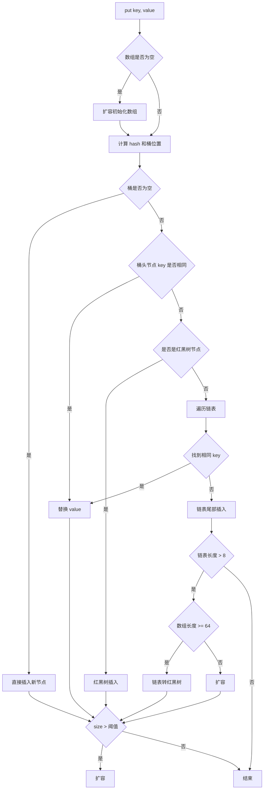


> 🔍 **知识点深度解析**
>
> **作用**：put流程：计算hash→定位桶→桶空直接插入→桶非空遍历链表/红黑树→key存在覆盖value→不存在尾插（Java 8）→插入后size>阈值扩容。
>
> **原理**：多线程扩容可能死循环（Java 7头插），Java 8尾插解决。
>
> **用法要点**：① put流程：计算hash→定位桶→桶空直接插入→桶非空遍历链表/红黑树→key存在覆盖value→不存在尾插（Java 8）→插入后size>阈值扩容 ② 多线程扩容可能死循环（Java 7头插），Java 8尾插解决

### 11.4 扩容机制

- 扩容条件：size > 阈值（容量 × 负载因子）
- 扩容为原来的 2 倍
- 扩容时重新计算每个元素的位置：
  - 元素的新位置 = 原位置 或 原位置 + 旧容量
  - 因为容量是 2 的幂，扩容后 hash 的高位决定是否移动


> 🔍 **知识点深度解析**
>
> **作用**：扩容机制：size超过阈值（容量*负载因子）时扩容2倍，重新计算每个元素位置（要么原位，要么原位+旧容量）。
>
> **原理**：扩容耗时，合理设置初始容量避免频繁扩容。
>
> **用法要点**：① 扩容机制：size超过阈值（容量*负载因子）时扩容2倍，重新计算每个元素位置（要么原位，要么原位+旧容量） ② 扩容耗时，合理设置初始容量避免频繁扩容

### 11.5 ConcurrentHashMap 底层（Java 8+）

- 放弃分段锁，改用 CAS + synchronized
- 锁的粒度是桶头节点
- 空桶用 CAS 插入
- 非空桶用 synchronized 锁头节点
- 扩容时多线程协作扩容


> 🔍 **知识点深度解析**
>
> **作用**：ConcurrentHashMap（Java 8+）：CAS+synchronized实现线程安全。
>
> **原理**：空桶用CAS插入，有桶用synchronized锁桶头。
>
> **用法要点**：① ConcurrentHashMap（Java 8+）：CAS+synchronized实现线程安全 ② 空桶用CAS插入，有桶用synchronized锁桶头 ③ 不允许key/value为null ④ 分段粒度更细，并发度高

### 11.6 面试高频问题

**Q：HashMap 为什么线程不安全？**
- 多线程同时 put 可能导致数据丢失
- Java 7 扩容时可能形成环形链表，导致死循环
- Java 8 修复了死循环问题，但仍可能数据丢失

**Q：HashMap 和 Hashtable 的区别？**
- HashMap 允许 null，Hashtable 不允许
- HashMap 线程不安全，Hashtable 线程安全（synchronized）
- HashMap 性能更好

**Q：ConcurrentHashMap 和 Hashtable 的区别？**
- Hashtable 锁整个表，ConcurrentHashMap 锁桶
- ConcurrentHashMap 并发度更高
- Hashtable 已过时

---

> 💡 **深度讲解**：HashMap 是面试中出现频率最高的知识点，没有之一。Java 8 之后的底层结构是"数组 + 链表 + 红黑树"：数组是主体，每个位置是一个桶，桶内用链表存储冲突的元素，当链表长度超过 8 且数组长度 ≥ 64 时转为红黑树以提升查询效率（O(n) → O(log n)），红黑树节点少于 6 时退化为链表。hash 扰动函数的设计很巧妙：将 hashCode 的高 16 位与低 16 位异或，让高位也参与桶位置计算，减少哈希冲突。桶位置计算用 `(n-1) & hash` 而非取模，因为位运算更快，且要求数组长度必须是 2 的幂。扩容时元素的新位置只有两种可能：原位置或原位置 + 旧容量，这是因为容量翻倍后 hash 的最高位决定是否移动。ConcurrentHashMap 在 Java 8 放弃了分段锁，改用 CAS + synchronized 锁桶头节点，空桶用 CAS 插入，非空桶用 synchronized，并发度等于桶数，性能远优于 Hashtable 的全表锁。
>
> **📝 精简总结**：HashMap = 数组+链表+红黑树，链表超8转红黑树；hash 扰动让高位参与计算，桶位置用位运算；ConcurrentHashMap 用 CAS+synchronized 锁桶，并发度高。

---

## 12. 集合工具类与比较器


> 🔍 **知识点深度解析**
>
> **作用**：面试高频：HashMap为什么线程不安全（扩容死循环/数据丢失）；。
>
> **原理**：红黑树转换条件（链表8+数组64）。
>
> **用法要点**：① 面试高频：HashMap为什么线程不安全（扩容死循环/数据丢失） ② 为什么容量2的幂（&运算快，分布均匀） ③ 为什么负载因子0.75（空间和时间折中） ④ 红黑树转换条件（链表8+数组64）

### 12.1 Collections 工具类

（已在 [5.6 工具类](#56-工具类) 中列出常用方法，此处补充高级用法）

```java
// 排序
Collections.sort(list);
Collections.sort(list, Comparator.comparing(User::getAge));

// 反转
Collections.reverse(list);

// 随机打乱
Collections.shuffle(list);

// 旋转（向右移动 n 位）
Collections.rotate(list, 2);

// 交换
Collections.swap(list, 0, 1);

// 查找（二分查找，需先排序）
Collections.binarySearch(list, "target");

// 最大最小值
Collections.max(list);
Collections.min(list, Comparator.comparing(String::length));

// 频率
Collections.frequency(list, "a");

// 不可变集合
List<String> unmodifiable = Collections.unmodifiableList(list);
Map<String, Integer> unmodifiableMap = Collections.unmodifiableMap(map);

// 同步集合
List<String> syncList = Collections.synchronizedList(list);

// 单元素集合
Collections.singletonList("only");
Collections.singletonMap("key", "value");
Collections.singleton("only");

// 空集合
Collections.emptyList();
Collections.emptyMap();
Collections.emptySet();
```


> 🔍 **知识点深度解析**
>
> **作用**：Collections工具类：sort排序。
>
> **原理**：binarySearch二分查找。
>
> **用法要点**：① Collections工具类：sort排序 ② reverse反转、max/min最大最小 ③ binarySearch二分查找 ④ synchronizedXxx转线程安全（性能差 ⑤ 推荐并发集合）、unmodifiableXxx不可修改、shuffle随机打乱

### 12.2 Comparable vs Comparator

| 区别 | Comparable | Comparator |
|------|-----------|-----------|
| 位置 | 实体类实现 | 独立的比较器类 |
| 方法 | compareTo(T o) | compare(T o1, T o2) |
| 排序方式 | 自然排序（内部比较器） | 自定义排序（外部比较器） |
| 使用 | Collections.sort(list) | Collections.sort(list, comparator) |

#### Comparable（自然排序）

```java
public class User implements Comparable<User> {
    private int age;

    @Override
    public int compareTo(User other) {
        return this.age - other.age;  // 按年龄升序
    }
}

Collections.sort(users);  // 使用自然排序
```

#### Comparator（自定义排序）

```java
// 按年龄升序
Collections.sort(users, new Comparator<User>() {
    @Override
    public int compare(User u1, User u2) {
        return u1.getAge() - u2.getAge();
    }
});

// Lambda 写法
Collections.sort(users, (u1, u2) -> u1.getAge() - u2.getAge());

// Comparator.comparing（推荐）
Collections.sort(users, Comparator.comparing(User::getAge));

// 降序
Collections.sort(users, Comparator.comparing(User::getAge).reversed());

// 多条件排序（先按年龄，再按姓名）
Collections.sort(users, Comparator.comparing(User::getAge)
    .thenComparing(User::getName));

// 空值安全
Collections.sort(users, Comparator.comparing(User::getAge,
    Comparator.nullsLast(Comparator.naturalOrder())));
```


> 🔍 **知识点深度解析**
>
> **作用**：Comparable（compareTo方法，类自身实现，自然排序）vs Comparator（compare方法，外部比较器，灵活多排序规则）。
>
> **原理**：Collections.sort(list, comparator)指定排序。
>
> **用法要点**：① Comparable（compareTo方法，类自身实现，自然排序）vs Comparator（compare方法，外部比较器，灵活多排序规则） ② Collections.sort(list, comparator)指定排序 ③ lambda简化Comparator

### 12.3 Arrays 工具类

（已在 [5.6 工具类](#56-工具类) 中列出，此处补充排序相关）

```java
// 排序
Arrays.sort(arr);
Arrays.sort(arr, Comparator.reverseOrder());  // 对象数组

// 并行排序（大数据量）
Arrays.parallelSort(arr);

// 二分查找
Arrays.binarySearch(arr, key);

// 比较
Arrays.equals(arr1, arr2);
Arrays.deepEquals(matrix1, matrix2);  // 多维数组

// 哈希
Arrays.hashCode(arr);
Arrays.deepHashCode(matrix);

// 转字符串
Arrays.toString(arr);
Arrays.deepToString(matrix);
```

---

> 💡 **深度讲解**：Collections 和 Arrays 是 JDK 提供的两个工具类，分别操作集合和数组。Collections 提供了排序、反转、打乱、查找、最大最小值、不可变包装、同步包装等常用操作。其中 `unmodifiableList` 返回的是视图，原集合修改后视图也会变，并非真正的不可变。`synchronizedList` 是同步包装，但迭代时仍需手动加锁。比较器有两种：Comparable 是"自然排序"，由实体类实现，定义默认排序规则；Comparator 是"自定义排序"，独立于实体类，可以灵活切换排序方式。Java 8 之后 Comparator 新增了 `comparing`、`thenComparing`、`reversed`、`nullsFirst/Last` 等静态和默认方法，配合 Lambda 可以写出非常优雅的多条件排序。Arrays 的 `parallelSort` 在大数据量下利用多线程并行排序，性能优于普通 sort。
>
> **📝 精简总结**：Comparable 是内部自然排序，Comparator 是外部自定义排序；Java 8+ 用 Comparator.comparing + thenComparing 写多条件排序；unmodifiable 是视图非真不可变。

---

## 13. 异常处理


> 🔍 **知识点深度解析**
>
> **作用**：Arrays工具类：sort排序（基本类型双轴快排。
>
> **原理**：对象类型TimSort）、binarySearch二分查找。
>
> **用法要点**：① Arrays工具类：sort排序（基本类型双轴快排 ② 对象类型TimSort）、binarySearch二分查找 ③ copyOf拷贝、equals比较 ④ toString字符串、stream转流 ⑤ fill填充、asList转集合（固定大小）

### 13.1 异常体系

```
Throwable
├── Error（错误，程序无法处理）
│   ├── OutOfMemoryError
│   ├── StackOverflowError
│   ├── NoClassDefFoundError
│   └── VirtualMachineError
└── Exception（异常，程序可以处理）
    ├── RuntimeException（运行时异常，非受检）
    │   ├── NullPointerException
    │   ├── ArrayIndexOutOfBoundsException
    │   ├── ClassCastException
    │   ├── IllegalArgumentException
    │   ├── ArithmeticException
    │   ├── IllegalStateException
    │   └── UnsupportedOperationException
    └── 受检异常（Checked Exception）
        ├── IOException
        ├── SQLException
        ├── FileNotFoundException
        ├── ParseException
        └── InterruptedException
```


> 🔍 **知识点深度解析**
>
> **作用**：Throwable→Error（系统级，OOM/StackOverflow，不处理）和Exception。
>
> **原理**：Exception→RuntimeException（运行时，空指针/数组越界，不强制捕获）和CheckedException（编译时，IO/SQL，必须捕获或声明）。
>
> **用法要点**：① Throwable→Error（系统级，OOM/StackOverflow，不处理）和Exception ② Exception→RuntimeException（运行时，空指针/数组越界，不强制捕获）和CheckedException（编译时，IO/SQL，必须捕获或声明）

### 13.2 异常处理机制

#### try-catch-finally

```java
try {
    // 可能抛出异常的代码
    int result = 10 / 0;
} catch (ArithmeticException e) {
    // 捕获特定异常
    System.out.println("算术异常: " + e.getMessage());
} catch (Exception e) {
    // 捕获其他异常（范围大的放后面）
    e.printStackTrace();
} finally {
    // 无论是否异常都会执行（除非 JVM 退出）
    System.out.println("finally 块");
}
```

#### try-with-resources（Java 7+，推荐）

```java
// 自动关闭实现 AutoCloseable 接口的资源
try (FileInputStream fis = new FileInputStream("file.txt");
     BufferedInputStream bis = new BufferedInputStream(fis)) {
    // 使用资源
    byte[] buffer = new byte[1024];
    bis.read(buffer);
} catch (IOException e) {
    e.printStackTrace();
}
// 资源自动关闭，无需 finally
```

#### 多异常捕获（Java 7+）

```java
try {
    // ...
} catch (IOException | SQLException e) {
    // 同时捕获多种异常
    e.printStackTrace();
}
```


> 🔍 **知识点深度解析**
>
> **作用**：try-catch-finally。
>
> **原理**：try监控，catch捕获处理，finally无论是否异常都执行（释放资源）。
>
> **用法要点**：① try-catch-finally ② try监控，catch捕获处理，finally无论是否异常都执行（释放资源） ③ try-with-resources（Java 7+）自动关闭AutoCloseable资源 ④ 多个catch从小到大

### 13.3 抛出异常

#### throw（抛出异常对象）

```java
public void setAge(int age) {
    if (age < 0 || age > 150) {
        throw new IllegalArgumentException("年龄不合法: " + age);
    }
    this.age = age;
}
```

#### throws（声明方法可能抛出的异常）

```java
// 受检异常必须声明或捕获
public void readFile() throws IOException, FileNotFoundException {
    FileInputStream fis = new FileInputStream("file.txt");
    // ...
}
```

#### 异常链（包装异常）

```java
try {
    // 业务逻辑
} catch (SQLException e) {
    throw new BusinessException("数据库操作失败", e);  // 保留原始异常
}
```


> 🔍 **知识点深度解析**
>
> **作用**：throw抛出异常对象，throws声明方法可能抛出的异常。
>
> **原理**：运行时异常可不声明，检查异常必须声明。
>
> **用法要点**：① throw抛出异常对象，throws声明方法可能抛出的异常 ② 运行时异常可不声明，检查异常必须声明 ③ 自定义异常继承Exception或RuntimeException ④ 异常链initCause包装原始异常

### 13.4 自定义异常

#### 受检异常

```java
public class BusinessException extends Exception {
    public BusinessException(String message) {
        super(message);
    }

    public BusinessException(String message, Throwable cause) {
        super(message, cause);
    }
}
```

#### 运行时异常

```java
public class BusinessRuntimeException extends RuntimeException {
    private final int code;

    public BusinessRuntimeException(int code, String message) {
        super(message);
        this.code = code;
    }

    public int getCode() {
        return code;
    }
}
```


> 🔍 **知识点深度解析**
>
> **作用**：自定义异常继承Exception（检查）或RuntimeException（运行时，推荐）。
>
> **原理**：不要用异常控制流程（性能差）。
>
> **用法要点**：① 自定义异常继承Exception（检查）或RuntimeException（运行时，推荐） ② 提供有参构造器（message）和带cause构造器 ③ 业务异常用枚举错误码 ④ 不要用异常控制流程（性能差）

### 13.5 异常处理最佳实践

1. **不要捕获 RuntimeException**：运行时异常通常是代码 bug，应该修复代码而不是捕获
2. **不要空 catch 块**：至少要记录日志
3. **不要用异常做流程控制**：异常性能差，应该用条件判断
4. **优先捕获具体异常**：不要直接 catch Exception
5. **使用 try-with-resources**：自动关闭资源
6. **保留原始异常**：包装异常时传入 cause
7. **异常信息要有意义**：包含上下文信息，便于排查
8. **finally 中不要 return**：会覆盖 try 中的 return
9. **不要在 finally 中抛异常**：会覆盖原始异常
10. **合理使用受检异常和非受检异常**：可恢复的用受检异常，编程错误用非受检异常

---

> 💡 **深度讲解**：异常体系的根是 Throwable，分为 Error（程序无法处理的严重错误，如 OOM、StackOverflow）和 Exception（程序可以处理的异常）。Exception 又分为 RuntimeException（运行时异常，非受检，如 NPE、数组越界）和受检异常（Checked Exception，如 IOException、SQLException，必须显式捕获或声明）。try-with-resources 是 Java 7 引入的最佳实践，自动关闭实现 AutoCloseable 的资源，比 finally 中手动关闭更安全简洁。异常处理的核心原则：不要捕获 RuntimeException（那是代码 bug，应该修复）、不要空 catch 块（至少记日志）、不要用异常做流程控制（性能差且语义不清）、优先捕获具体异常、包装异常时保留原始 cause。finally 中不要 return 或抛异常，会覆盖 try 中的结果。自定义异常建议继承 RuntimeException，避免受检异常的强制声明污染调用链。
>
> **📝 精简总结**：Throwable 分 Error 和 Exception，Exception 分受检和非受检；try-with-resources 自动关资源；不捕获 RuntimeException、不空 catch、不用异常控流程；包装异常保留 cause。

---

## 14. 泛型


> 🔍 **知识点深度解析**
>
> **作用**：最佳实践：不要空catch。
>
> **原理**：用具体异常类型、日志记录堆栈。
>
> **用法要点**：① 最佳实践：不要空catch ② 不要捕获Exception/Throwable（太宽泛） ③ 用具体异常类型、日志记录堆栈 ④ finally中不要return（覆盖try的return） ⑤ 优先try-with-resources

### 14.1 泛型基础

#### 泛型类

```java
public class Box<T> {
    private T content;

    public Box(T content) {
        this.content = content;
    }

    public T getContent() {
        return content;
    }

    public void setContent(T content) {
        this.content = content;
    }
}

// 使用
Box<String> stringBox = new Box<>("hello");
Box<Integer> intBox = new Box<>(123);
```

#### 泛型方法

```java
public class Utils {
    // 泛型方法
    public static <T> T getFirst(List<T> list) {
        if (list.isEmpty()) {
            return null;
        }
        return list.get(0);
    }

    // 多个类型参数
    public static <K, V> Map<K, V> createMap(K key, V value) {
        Map<K, V> map = new HashMap<>();
        map.put(key, value);
        return map;
    }
}
```

#### 泛型接口

```java
public interface Repository<T, ID> {
    T findById(ID id);
    void save(T entity);
    void deleteById(ID id);
}

public class UserRepository implements Repository<User, Long> {
    @Override
    public User findById(Long id) { /* ... */ }

    @Override
    public void save(User entity) { /* ... */ }

    @Override
    public void deleteById(Long id) { /* ... */ }
}
```

#### 有界类型参数

```java
// 上界：T 必须是 Number 或其子类
public class NumberBox<T extends Number> {
    private T value;

    public double doubleValue() {
        return value.doubleValue();  // 可以调用 Number 的方法
    }
}

// 多边界（& 连接，类必须在接口前面）
public class Demo<T extends Number & Comparable<T> & Serializable> { }
```


> 🔍 **知识点深度解析**
>
> **作用**：泛型编译时类型检查，运行时擦除。
>
> **原理**：类泛型<T>，方法泛型<T>。
>
> **用法要点**：① 泛型编译时类型检查，运行时擦除 ② 类泛型<T>，方法泛型<T> ③ 泛型边界<T extends Number> ④ 好处：类型安全、避免强转、代码复用 ⑤ List<String>和List<Integer>运行时都是List

### 14.2 通配符

#### 无界通配符 `?`

```java
// 可以接收任意泛型类型
public void printList(List<?> list) {
    for (Object item : list) {
        System.out.println(item);
    }
    // list.add("a");  // 编译错误，不能添加（除了 null）
}
```

#### 上界通配符 `? extends T`

```java
// 可以读取 T 及子类，但不能添加（除了 null）
public double sum(List<? extends Number> list) {
    double total = 0;
    for (Number n : list) {
        total += n.doubleValue();
    }
    return total;
}

List<Integer> ints = Arrays.asList(1, 2, 3);
sum(ints);  // 可以传入 Integer 的 List
```

#### 下界通配符 `? super T`

```java
// 可以添加 T 及子类，但读取只能用 Object
public void addNumbers(List<? super Integer> list) {
    list.add(1);
    list.add(2);
    // Integer n = list.get(0);  // 编译错误，读取只能用 Object
    Object obj = list.get(0);
}

List<Number> numbers = new ArrayList<>();
addNumbers(numbers);  // 可以传入 Number 的 List
```

#### PECS 原则

- **Producer Extends**：如果集合是生产者（读取数据），用 `extends`
- **Consumer Super**：如果集合是消费者（添加数据），用 `super`

```java
// Collections.copy 源码
public static <T> void copy(List<? super T> dest, List<? extends T> src) {
    // src 是生产者（读取），用 extends
    // dest 是消费者（写入），用 super
}
```


> 🔍 **知识点深度解析**
>
> **作用**：通配符?：<?>任意类型，<? extends T>上界（可读T，不可写），<? super T>下界（可写T，可读Object）。
>
> **原理**：PECS原则：生产者（读取）用extends，消费者（写入）用super。
>
> **用法要点**：① 通配符?：<?>任意类型，<? extends T>上界（可读T，不可写），<? super T>下界（可写T，可读Object） ② PECS原则：生产者（读取）用extends，消费者（写入）用super

### 14.3 类型擦除

<div style="background:linear-gradient(135deg,#84fab0,#8fd3f4);border-radius:16px;padding:20px;margin:16px 0;font-family:-apple-system,'Segoe UI','PingFang SC','Microsoft YaHei',sans-serif;color:#1a1a2e;overflow:hidden;box-shadow:0 6px 20px rgba(0,0,0,.08),0 2px 6px rgba(0,0,0,.04)">
<style>@keyframes erase{0%{opacity:1;transform:scale(1)}50%{opacity:.3;transform:scale(.95)}100%{opacity:1;transform:scale(1)}}.ge-src{background:rgba(255,255,255,.4);border-radius:6px;box-shadow:0 2px 8px rgba(0,0,0,.08);padding:8px;font-family:monospace;font-size:11px;margin-bottom:6px;text-align:center}.ge-arrow{text-align:center;font-size:16px;font-weight:700;margin:4px 0;animation:erase 2s ease-in-out infinite}.ge-dst{background:rgba(255,255,255,.5);border:2px dashed #2d6a4f;border-radius:6px;padding:8px;font-family:monospace;font-size:11px;text-align:center}</style>
<div style="text-align:center;font-size:15px;font-weight:700;margin-bottom:14px;padding-bottom:10px;border-bottom:1.5px solid rgba(255,255,255,.22);letter-spacing:1px;text-shadow:0 1px 3px rgba(0,0,0,.12)">泛型类型擦除（编译期 → 运行时）</div>
<div class="ge-src">编译前：List&lt;String&gt; list = new ArrayList&lt;&gt;();<br>list.add("hello"); String s = list.get(0);</div>
<div class="ge-arrow">▼ javac 编译（擦除泛型 + 插入强制类型转换）▼</div>
<div class="ge-dst">编译后：List list = new ArrayList();<br>list.add("hello"); String s = (String) list.get(0);</div>
<div style="text-align:center;font-size:10px;opacity:.7;margin-top:6px">运行时泛型信息不存在 → 不能 new T()、不能 instanceof T、不能 new T[]</div>
</div>

#### 擦除规则

- 泛型信息在编译后被擦除
- 无界类型参数擦除为 Object
- 有界类型参数擦除为上界类型
- 泛型类和方法在运行时没有泛型信息

```java
// 编译前
public class Box<T> {
    private T content;
    public T getContent() { return content; }
}

// 编译后（类型擦除）
public class Box {
    private Object content;
    public Object getContent() { return content; }
}
```

#### 桥接方法

```java
// 编译前
public class ComparableString implements Comparable<String> {
    @Override
    public int compareTo(String o) {
        return o.length();
    }
}

// 编译后（生成桥接方法）
public class ComparableString implements Comparable {
    public int compareTo(String o) {  // 实际方法
        return o.length();
    }

    public int compareTo(Object o) {  // 桥接方法
        return compareTo((String) o);
    }
}
```


> 🔍 **知识点深度解析**
>
> **作用**：类型擦除：泛型信息编译后擦除为Object或上界。
>
> **原理**：反射可获取泛型信息（getGenericSuperclass）。
>
> **用法要点**：① 类型擦除：泛型信息编译后擦除为Object或上界 ② 反射可获取泛型信息（getGenericSuperclass） ③ 不能new T()、不能instanceof泛型、泛型类不能extends Throwable ④ 桥接方法保证多态

### 14.4 泛型的限制

1. **不能用基本类型**：`List<int>` 错误，必须用 `List<Integer>`
2. **不能创建泛型数组**：`new T[]` 错误
3. **不能 instanceof 泛型**：`obj instanceof List<String>` 错误
4. **不能直接获取泛型类型**：运行时类型被擦除
5. **静态成员不能使用类的类型参数**
6. **异常类不能是泛型**：不能 `catch (T e)`

---

> 💡 **深度讲解**：泛型是 Java 5 引入的类型安全机制，核心价值是在编译期检查类型，避免运行时的 ClassCastException。泛型的实现方式是"类型擦除"——编译后泛型信息全部被擦除，无界类型参数变为 Object，有界类型参数变为上界类型，所以运行时无法获取泛型的具体类型。这也是为什么不能 `new T[]`、不能 `instanceof List<String>`、不能用基本类型作泛型参数。通配符是泛型中最容易混淆的部分，记住 PECS 原则即可：Producer Extends（读取用 extends）、Consumer Super（写入用 super）。`List<? extends Number>` 可以读 Number 但不能 add（除了 null），因为不知道具体子类；`List<? super Integer>` 可以 add Integer 但读只能用 Object。桥接方法是编译器为了保证多态而生成的合成方法，比如实现 Comparable<String> 后编译器会生成 compareTo(Object) 桥接方法。泛型的限制本质上都是类型擦除的后果。
>
> **📝 精简总结**：泛型编译期类型安全，运行时类型擦除；PECS 原则：读用 extends、写用 super；不能 new 泛型数组、不能 instanceof 泛型、不能用基本类型。

---

## 15. 注解与反射


> 🔍 **知识点深度解析**
>
> **作用**：泛型限制：不能用基本类型（用包装类）、不能new泛型数组、不能instanceof泛型、静态成员不能用类泛型、异常不能泛型。
>
> **原理**：通配符集合不能添加元素（除null）。
>
> **用法要点**：① 泛型限制：不能用基本类型（用包装类）、不能new泛型数组、不能instanceof泛型、静态成员不能用类泛型、异常不能泛型 ② 通配符集合不能添加元素（除null）

### 15.1 注解基础

#### 元注解

| 元注解 | 说明 |
|--------|------|
| @Target | 注解可以用在哪些地方（类、方法、字段等） |
| @Retention | 注解的保留策略（源码、类、运行时） |
| @Documented | 注解会被包含在 Javadoc 中 |
| @Inherited | 子类可以继承父类的注解 |
| @Repeatable | 注解可以重复使用（Java 8+） |

#### RetentionPolicy

| 策略 | 说明 |
|------|------|
| SOURCE | 只在源码中，编译时丢弃（如 @Override） |
| CLASS | 保留到 class 文件，运行时不加载（默认） |
| RUNTIME | 保留到运行时，可以通过反射读取 |

#### ElementType

| 类型 | 说明 |
|------|------|
| TYPE | 类、接口、枚举 |
| FIELD | 字段 |
| METHOD | 方法 |
| PARAMETER | 参数 |
| CONSTRUCTOR | 构造方法 |
| LOCAL_VARIABLE | 局部变量 |
| ANNOTATION_TYPE | 注解 |
| PACKAGE | 包 |

#### 自定义注解

```java
@Target(ElementType.METHOD)
@Retention(RetentionPolicy.RUNTIME)
public @interface Log {
    String value() default "";
    boolean enable() default true;
    Level level() default Level.INFO;

    enum Level { INFO, DEBUG, WARN, ERROR }
}

// 使用
@Log(value = "用户登录", level = Log.Level.INFO)
public void login(String username) {
    // ...
}
```


> 🔍 **知识点深度解析**
>
> **作用**：注解（@interface）是元数据，@Target限定位置，@Retention限定生命周期（SOURCE/CLASS/RUNTIME）。
>
> **原理**：自定义注解+反射实现框架功能（Spring的@Component）。
>
> **用法要点**：① 注解（@interface）是元数据，@Target限定位置，@Retention限定生命周期（SOURCE/CLASS/RUNTIME） ② @Override/@Deprecated内置 ③ 自定义注解+反射实现框架功能（Spring的@Component）

### 15.2 反射基础

#### 获取 Class 对象的三种方式

```java
// 方式1：类名.class
Class<?> clazz1 = String.class;

// 方式2：对象.getClass()
String s = "hello";
Class<?> clazz2 = s.getClass();

// 方式3：Class.forName()（全限定名）
Class<?> clazz3 = Class.forName("java.lang.String");
```

#### 获取类信息

```java
Class<?> clazz = User.class;

clazz.getName();           // 全限定名
clazz.getSimpleName();     // 简单类名
clazz.getPackage();        // 包
clazz.getSuperclass();     // 父类
clazz.getInterfaces();     // 实现的接口
clazz.getModifiers();      // 修饰符（Modifier.isPublic() 等）
clazz.getAnnotations();    // 注解
```

#### 获取构造器

```java
// 获取所有 public 构造器
Constructor<?>[] constructors = clazz.getConstructors();

// 获取指定参数的构造器
Constructor<User> constructor = clazz.getConstructor(String.class, int.class);

// 获取所有构造器（包括私有）
Constructor<?>[] allConstructors = clazz.getDeclaredConstructors();
```

#### 获取方法

```java
// 获取所有 public 方法（包括继承的）
Method[] methods = clazz.getMethods();

// 获取指定方法
Method method = clazz.getMethod("setName", String.class);

// 获取本类所有方法（包括私有）
Method[] declaredMethods = clazz.getDeclaredMethods();
```

#### 获取字段

```java
// 获取所有 public 字段
Field[] fields = clazz.getFields();

// 获取指定字段
Field field = clazz.getField("name");

// 获取本类所有字段（包括私有）
Field[] declaredFields = clazz.getDeclaredFields();
```

#### 获取注解

```java
// 获取类上的注解
Log log = clazz.getAnnotation(Log.class);

// 获取方法上的注解
Log methodLog = method.getAnnotation(Log.class);

// 获取字段上的注解
NotNull notNull = field.getAnnotation(NotNull.class);

// 判断是否有注解
boolean hasAnnotation = clazz.isAnnotationPresent(Log.class);
```


> 🔍 **知识点深度解析**
>
> **作用**：反射在运行时获取类信息、创建实例、调用方法、访问字段。
>
> **原理**：破坏封装（setAccessible(true)）。
>
> **用法要点**：① 反射在运行时获取类信息、创建实例、调用方法、访问字段 ② Class.forName()/类名.class/对象.getClass()获取Class ③ 破坏封装（setAccessible(true)） ④ 性能比直接调用慢，框架大量使用

### 15.3 反射操作

#### 创建对象

```java
// 方式1：newInstance()（已废弃，推荐用构造器）
User user = clazz.newInstance();

// 方式2：通过构造器
Constructor<User> constructor = clazz.getConstructor(String.class, int.class);
User user = constructor.newInstance("张三", 25);
```

#### 调用方法

```java
Method method = clazz.getMethod("setName", String.class);
method.invoke(user, "李四");  // 调用 user.setName("李四")

// 调用私有方法
Method privateMethod = clazz.getDeclaredMethod("privateMethod");
privateMethod.setAccessible(true);  // 突破访问限制
privateMethod.invoke(user);
```

#### 访问字段

```java
Field field = clazz.getDeclaredField("name");
field.setAccessible(true);

// 读取字段值
String name = (String) field.get(user);

// 设置字段值
field.set(user, "王五");
```


> 🔍 **知识点深度解析**
>
> **作用**：反射操作：getDeclaredConstructors/newInstance创建对象，getDeclaredMethod/invoke调用方法，getDeclaredField/set访问字段。
>
> **原理**：getMethods含继承，getDeclaredMethods只本类。
>
> **用法要点**：① 反射操作：getDeclaredConstructors/newInstance创建对象，getDeclaredMethod/invoke调用方法，getDeclaredField/set访问字段 ② getMethods含继承，getDeclaredMethods只本类 ③ setAccessible(true)绕过private

### 15.4 动态代理

<div style="background:linear-gradient(135deg,#a18cd1,#fbc2eb);border-radius:16px;padding:20px;margin:16px 0;font-family:-apple-system,'Segoe UI','PingFang SC','Microsoft YaHei',sans-serif;color:#1a1a2e;overflow:hidden;box-shadow:0 6px 20px rgba(0,0,0,.08),0 2px 6px rgba(0,0,0,.04)">
<style>@keyframes proxyGen{0%,100%{transform:scale(1);opacity:.85}50%{transform:scale(1.03);opacity:1}}.proxy-box{display:inline-block;width:46%;vertical-align:top;margin:0 1%;background:rgba(255,255,255,.35);border-radius:8px;box-shadow:0 2px 8px rgba(0,0,0,.08);padding:10px;font-size:11px;text-align:center;animation:proxyGen 3s ease-in-out infinite}.proxy-box:nth-child(2){animation-delay:.5s}.proxy-title{font-weight:700;font-size:12px;margin-bottom:4px;padding:3px;border-radius:4px;color:#fff}.proxy-flow{background:rgba(255,255,255,.3);border-radius:4px;box-shadow:0 2px 8px rgba(0,0,0,.08);padding:3px 6px;margin:3px 0;font-size:10px}</style>
<div style="text-align:center;font-size:15px;font-weight:700;margin-bottom:14px;padding-bottom:10px;border-bottom:1.5px solid rgba(255,255,255,.22);letter-spacing:1px;text-shadow:0 1px 3px rgba(0,0,0,.12)">JDK 动态代理 vs CGLIB 代理</div>
<div style="text-align:center">
<div class="proxy-box"><div class="proxy-title" style="background:#6c5ce7">JDK 动态代理</div><div class="proxy-flow">基于接口（InvocationHandler）</div><div class="proxy-flow">Proxy.newProxyInstance()</div><div class="proxy-flow">目标类必须实现接口</div><div class="proxy-flow">运行时生成接口实现类</div></div>
<div class="proxy-box"><div class="proxy-title" style="background:#e63946">CGLIB 代理</div><div class="proxy-flow">基于继承（MethodInterceptor）</div><div class="proxy-flow">Enhancer.create()</div><div class="proxy-flow">目标类不能是 final</div><div class="proxy-flow">运行时生成子类（ASM字节码）</div></div>
</div>
<div style="text-align:center;font-size:10px;opacity:.7;margin-top:6px">Spring AOP：有接口用 JDK 代理，无接口用 CGLIB；Spring Boot 2.x 默认 CGLIB（proxyTargetClass=true）</div>
</div>

#### JDK 动态代理

```java
// 接口
public interface UserService {
    void addUser(String name);
}

// 实现类
public class UserServiceImpl implements UserService {
    @Override
    public void addUser(String name) {
        System.out.println("添加用户: " + name);
    }
}

// 调用处理器
public class LogHandler implements InvocationHandler {
    private final Object target;

    public LogHandler(Object target) {
        this.target = target;
    }

    @Override
    public Object invoke(Object proxy, Method method, Object[] args) throws Throwable {
        System.out.println("方法执行前: " + method.getName());
        Object result = method.invoke(target, args);
        System.out.println("方法执行后: " + method.getName());
        return result;
    }
}

// 创建代理
UserService target = new UserServiceImpl();
UserService proxy = (UserService) Proxy.newProxyInstance(
    target.getClass().getClassLoader(),
    target.getClass().getInterfaces(),
    new LogHandler(target)
);

proxy.addUser("张三");
```

#### CGLIB 动态代理

- 基于继承实现，不需要接口
- 通过 ASM 字节码框架生成子类
- Spring AOP 默认策略：有接口用 JDK 动态代理，无接口用 CGLIB


> 🔍 **知识点深度解析**
>
> **作用**：动态代理运行时生成代理类。
>
> **原理**：JDK动态代理（Proxy+InvocationHandler，目标必须实现接口）。
>
> **用法要点**：① 动态代理运行时生成代理类 ② JDK动态代理（Proxy+InvocationHandler，目标必须实现接口） ③ CGLIB（继承目标类，不需要接口） ④ Spring AOP默认JDK代理，无接口用CGLIB

### 15.5 SPI 机制

SPI（Service Provider Interface）是 Java 提供的服务发现机制。

<div style="background:linear-gradient(135deg,#84fab0,#8fd3f4);border-radius:16px;padding:20px;margin:16px 0;font-family:-apple-system,'Segoe UI','PingFang SC','Microsoft YaHei',sans-serif;color:#1a1a2e;overflow:hidden;box-shadow:0 6px 20px rgba(0,0,0,.08),0 2px 6px rgba(0,0,0,.04)">
<style>@keyframes spiFlow{0%,100%{transform:scale(1);opacity:.85}50%{transform:scale(1.03);opacity:1}}.spi-step{background:rgba(255,255,255,.35);border-left:4px solid #e63946;border-radius:8px;padding:5px 10px;margin:4px 0;font-size:11px;font-weight:600;box-shadow:0 1px 4px rgba(0,0,0,.06);animation:spiFlow 4s ease-in-out infinite}.spi-step:nth-child(2){animation-delay:.6s}.spi-step:nth-child(3){animation-delay:1.2s}.spi-step:nth-child(4){animation-delay:1.8s}</style>
<div style="text-align:center;font-size:15px;font-weight:700;margin-bottom:14px;padding-bottom:10px;border-bottom:1.5px solid rgba(255,255,255,.22);letter-spacing:1px;text-shadow:0 1px 3px rgba(0,0,0,.12)">SPI 服务发现机制（ServiceLoader）</div>
<div class="spi-step">① 定义服务接口（如 java.sql.Driver）</div>
<div class="spi-step">② 服务提供者实现接口，在 META-INF/services/ 下创建以接口全限定名命名的文件，内容为实现类全限定名</div>
<div class="spi-step">③ ServiceLoader.load(Interface.class) 扫描 classpath 下所有 META-INF/services/ 配置文件</div>
<div class="spi-step">④ 反射实例化所有实现类，返回迭代器 — 实现解耦，框架可扩展（JDBC驱动、SLF4J绑定、Spring Boot自动配置）</div>
</div>

```java
// 1. 定义接口
public interface Logger {
    void log(String message);
}

// 2. 实现类
public class ConsoleLogger implements Logger {
    @Override
    public void log(String message) {
        System.out.println("[Console] " + message);
    }
}

// 3. 在 META-INF/services/ 下创建配置文件
// 文件名：com.example.Logger
// 文件内容：com.example.ConsoleLogger

// 4. 使用 ServiceLoader 加载
ServiceLoader<Logger> loaders = ServiceLoader.load(Logger.class);
for (Logger logger : loaders) {
    logger.log("Hello SPI");
}
```

**应用场景**：
- JDBC 驱动加载（java.sql.Driver）
- Spring Boot 自动配置
- 日志框架（SLF4J）
-  Dubbo 扩展点

---

> 💡 **深度讲解**：注解和反射是 Java 框架的基石，Spring、MyBatis、JUnit 等框架都深度依赖它们。注解本质是代码上的元数据标记，本身不做任何事，需要通过反射或 APT（注解处理器）来读取并产生行为。元注解有五个：@Target（作用位置）、@Retention（保留策略）、@Documented、@Inherited、@Repeatable。@Retention 是关键：SOURCE 只在源码中（编译时丢弃，如 @Override），CLASS 保留到 class 文件（默认），RUNTIME 保留到运行时（可被反射读取，框架注解都是这个）。反射可以在运行时获取类的构造器、方法、字段、注解，并突破访问限制调用私有成员，但性能比直接调用慢，且破坏封装，所以框架内部用得多，业务代码应尽量避免。动态代理是反射的重要应用：JDK 动态代理基于接口，通过 Proxy.newProxyInstance 创建代理类；CGLIB 基于继承，通过 ASM 生成子类，Spring AOP 默认有接口用 JDK、无接口用 CGLIB。SPI 是服务发现机制，通过 META-INF/services 配置文件加载实现类，JDBC 驱动、Spring Boot 自动配置都用了它。
>
> **📝 精简总结**：注解是元数据，@Retention=RUNTIME 才能被反射读取；反射可运行时操作类成员但性能差、破坏封装；JDK 代理基于接口，CGLIB 基于继承；SPI 通过配置文件发现服务实现。

---

## 16. IO 与 NIO


> 🔍 **知识点深度解析**
>
> **作用**：SPI（Service Provider Interface）服务发现，META-INF/services/接口全限定名写实现类，ServiceLoader.load加载。
>
> **原理**：解耦接口和实现，可插拔扩展。
>
> **用法要点**：① SPI（Service Provider Interface）服务发现，META-INF/services/接口全限定名写实现类，ServiceLoader.load加载 ② JDBC驱动、SLF4J、Dubbo用SPI ③ 解耦接口和实现，可插拔扩展

### 16.1 IO 流分类

| 分类维度 | 类型 |
|---------|------|
| 数据流向 | 输入流（InputStream/Reader）、输出流（OutputStream/Writer） |
| 数据单位 | 字节流（InputStream/OutputStream）、字符流（Reader/Writer） |
| 功能 | 节点流（直接操作数据源）、处理流（包装其他流） |


> 🔍 **知识点深度解析**
>
> **作用**：IO流分字节流（InputStream/OutputStream，二进制）和字符流（Reader/Writer，文本带编码）。
>
> **原理**：节点流直接操作数据源，处理流包装增强（Buffered/Object/Data）。
>
> **用法要点**：① IO流分字节流（InputStream/OutputStream，二进制）和字符流（Reader/Writer，文本带编码） ② 节点流直接操作数据源，处理流包装增强（Buffered/Object/Data） ③ 装饰器模式

### 16.2 字节流

#### 文件字节流

```java
// 文件输入流
try (FileInputStream fis = new FileInputStream("file.txt")) {
    byte[] buffer = new byte[1024];
    int len;
    while ((len = fis.read(buffer)) != -1) {
        System.out.write(buffer, 0, len);
    }
} catch (IOException e) {
    e.printStackTrace();
}

// 文件输出流
try (FileOutputStream fos = new FileOutputStream("output.txt")) {
    fos.write("Hello World".getBytes(StandardCharsets.UTF_8));
}
```

#### 缓冲字节流

```java
try (BufferedInputStream bis = new BufferedInputStream(
        new FileInputStream("file.txt"));
     BufferedOutputStream bos = new BufferedOutputStream(
        new FileOutputStream("output.txt"))) {
    byte[] buffer = new byte[8192];
    int len;
    while ((len = bis.read(buffer)) != -1) {
        bos.write(buffer, 0, len);
    }
}
```


> 🔍 **知识点深度解析**
>
> **作用**：字节流：FileInputStream/FileOutputStream文件操作，BufferedInputStream缓冲（性能提升），ObjectInputStream对象序列化。
>
> **原理**：read()返回-1表示结束。
>
> **用法要点**：① 字节流：FileInputStream/FileOutputStream文件操作，BufferedInputStream缓冲（性能提升），ObjectInputStream对象序列化 ② read()返回-1表示结束 ③ 大文件用缓冲流 ④ try-with-resources自动关闭

### 16.3 字符流

#### 文件字符流

```java
try (FileReader reader = new FileReader("file.txt", StandardCharsets.UTF_8);
     FileWriter writer = new FileWriter("output.txt", StandardCharsets.UTF_8)) {
    char[] buffer = new char[1024];
    int len;
    while ((len = reader.read(buffer)) != -1) {
        writer.write(buffer, 0, len);
    }
}
```

#### 缓冲字符流

```java
try (BufferedReader reader = new BufferedReader(
        new FileReader("file.txt", StandardCharsets.UTF_8));
     BufferedWriter writer = new BufferedWriter(
        new FileWriter("output.txt", StandardCharsets.UTF_8))) {
    String line;
    while ((line = reader.readLine()) != null) {
        writer.write(line);
        writer.newLine();
    }
}
```


> 🔍 **知识点深度解析**
>
> **作用**：字符流：FileReader/FileWriter（默认编码，不推荐），BufferedReader（readLine读行），PrintWriter（格式化输出）。
>
> **原理**：处理文本文件，自动处理编码。
>
> **用法要点**：① 字符流：FileReader/FileWriter（默认编码，不推荐），BufferedReader（readLine读行），PrintWriter（格式化输出） ② 处理文本文件，自动处理编码 ③ 比字节流方便

### 16.4 转换流

```java
// 字节流 → 字符流
try (InputStreamReader isr = new InputStreamReader(
        new FileInputStream("file.txt"), StandardCharsets.UTF_8);
     OutputStreamWriter osw = new OutputStreamWriter(
        new FileOutputStream("output.txt"), StandardCharsets.UTF_8)) {
    // ...
}
```


> 🔍 **知识点深度解析**
>
> **作用**：转换流：InputStreamReader（字节→字符，指定编码）、OutputStreamWriter（字符→字节）。
>
> **原理**：桥接字节流和字符流。
>
> **用法要点**：① 转换流：InputStreamReader（字节→字符，指定编码）、OutputStreamWriter（字符→字节） ② 桥接字节流和字符流 ③ 指定UTF-8/GBK编码 ④ 读取网络数据、指定编码文件时用

### 16.5 其他流

#### 数据流

```java
try (DataOutputStream dos = new DataOutputStream(
        new FileOutputStream("data.bin"))) {
    dos.writeInt(123);
    dos.writeDouble(3.14);
    dos.writeUTF("hello");
}

try (DataInputStream dis = new DataInputStream(
        new FileInputStream("data.bin"))) {
    int i = dis.readInt();
    double d = dis.readDouble();
    String s = dis.readUTF();
}
```

#### 对象流（序列化）

```java
// 序列化
try (ObjectOutputStream oos = new ObjectOutputStream(
        new FileOutputStream("user.obj"))) {
    oos.writeObject(new User("张三", 25));
}

// 反序列化
try (ObjectInputStream ois = new ObjectInputStream(
        new FileInputStream("user.obj"))) {
    User user = (User) ois.readObject();
}
```

> 详见 [第17章：序列化](#17-序列化)

#### 打印流

```java
try (PrintStream ps = new PrintStream(
        new FileOutputStream("output.txt"), true, StandardCharsets.UTF_8)) {
    ps.println("Hello");
    ps.printf("年龄: %d%n", 25);
}
```

#### 字节数组流

```java
ByteArrayOutputStream baos = new ByteArrayOutputStream();
baos.write("hello".getBytes());
byte[] bytes = baos.toByteArray();

ByteArrayInputStream bais = new ByteArrayInputStream(bytes);
```


> 🔍 **知识点深度解析**
>
> **作用**：其他流：DataInputStream/DataOutputStream（基本类型读写）。
>
> **原理**：线程间通信）、ByteArrayInputStream（内存操作）。。
>
> **用法要点**：① 其他流：DataInputStream/DataOutputStream（基本类型读写） ② PrintStream（System.out） ③ SequenceInputStream（合并流） ④ PipedInputStream（管道 ⑤ 线程间通信）、ByteArrayInputStream（内存操作）

### 16.6 NIO

<div style="background:linear-gradient(135deg,#4facfe,#00f2fe);border-radius:16px;padding:20px;margin:16px 0;font-family:-apple-system,'Segoe UI','PingFang SC','Microsoft YaHei',sans-serif;color:#fff;overflow:hidden;box-shadow:0 8px 28px rgba(0,0,0,.14),0 3px 10px rgba(0,0,0,.08)">
<style>@keyframes nioFlow{0%,100%{transform:translateX(0);opacity:.6}50%{transform:translateX(4px);opacity:1}}.nio-core{display:inline-block;width:30%;vertical-align:top;margin:0 1%;background:rgba(255,255,255,.15);border:2px solid rgba(255,255,255,.4);border-radius:8px;padding:8px;text-align:center;font-size:11px;animation:nioFlow 3s ease-in-out infinite}.nio-core:nth-child(2){animation-delay:.5s}.nio-core:nth-child(3){animation-delay:1s}.nio-arrow{text-align:center;font-size:14px;margin:6px 0;animation:nioFlow 1.5s ease-in-out infinite}.nio-buf{background:rgba(255,255,255,.2);border-radius:4px;box-shadow:0 2px 8px rgba(0,0,0,.08);padding:3px 6px;margin:2px;font-family:monospace;font-size:10px}</style>
<div style="text-align:center;font-size:15px;font-weight:700;margin-bottom:14px;padding-bottom:10px;border-bottom:1.5px solid rgba(255,255,255,.22);letter-spacing:1px;text-shadow:0 1px 3px rgba(0,0,0,.12)">NIO 三大核心（非阻塞 IO）</div>
<div style="text-align:center">
<div class="nio-core"><b>Channel 通道</b><div style="font-size:10px;margin-top:4px">双向数据传输<br>FileChannel/SocketChannel</div></div>
<div class="nio-core"><b>Buffer 缓冲区</b><div style="font-size:10px;margin-top:4px">数据存储<br>ByteBuffer/CharBuffer</div><div class="nio-buf">capacity/position/limit</div><div class="nio-buf">flip()切换读写</div></div>
<div class="nio-core"><b>Selector 选择器</b><div style="font-size:10px;margin-top:4px">多路复用<br>单线程管理多Channel</div><div class="nio-buf">select()监听事件</div></div>
</div>
<div class="nio-arrow">数据流向：Channel ↔ Buffer（读写双向），Selector 监控多个 Channel 的就绪事件</div>
</div>

#### 三大核心组件

- **Buffer（缓冲区）**：数据存储
- **Channel（通道）**：数据传输
- **Selector（选择器）**：多路复用

#### Buffer

```java
// 创建 Buffer
ByteBuffer buffer = ByteBuffer.allocate(1024);

// 写入数据
buffer.put("Hello".getBytes());

// 切换为读模式
buffer.flip();

// 读取数据
while (buffer.hasRemaining()) {
    System.out.print((char) buffer.get());
}

// 清空（重置为写模式）
buffer.clear();

// 压缩（未读数据移到开头）
buffer.compact();
```

**Buffer 属性**：
- capacity：容量，创建时指定，不可变
- position：当前读写位置
- limit：读写上限
- mark：标记位置（用于 reset）

#### FileChannel

```java
try (RandomAccessFile raf = new RandomAccessFile("file.txt", "rw");
     FileChannel channel = raf.getChannel()) {

    // 读取
    ByteBuffer buffer = ByteBuffer.allocate(1024);
    int bytesRead = channel.read(buffer);

    // 写入
    buffer.flip();
    channel.write(buffer);

    // 零拷贝（文件传输）
    FileChannel src = FileChannel.open(Paths.get("src.txt"));
    FileChannel dest = FileChannel.open(Paths.get("dest.txt"),
        StandardOpenOption.CREATE, StandardOpenOption.WRITE);
    src.transferTo(0, src.size(), dest);
}
```

#### SocketChannel & Selector（多路复用）

```java
Selector selector = Selector.open();

ServerSocketChannel serverChannel = ServerSocketChannel.open();
serverChannel.bind(new InetSocketAddress(8080));
serverChannel.configureBlocking(false);  // 非阻塞模式
serverChannel.register(selector, SelectionKey.OP_ACCEPT);

while (true) {
    selector.select();  // 阻塞等待事件
    Set<SelectionKey> keys = selector.selectedKeys();
    Iterator<SelectionKey> iterator = keys.iterator();

    while (iterator.hasNext()) {
        SelectionKey key = iterator.next();
        iterator.remove();

        if (key.isAcceptable()) {
            // 接受连接
            ServerSocketChannel server = (ServerSocketChannel) key.channel();
            SocketChannel client = server.accept();
            client.configureBlocking(false);
            client.register(selector, SelectionKey.OP_READ);
        } else if (key.isReadable()) {
            // 读取数据
            SocketChannel client = (SocketChannel) key.channel();
            ByteBuffer buffer = ByteBuffer.allocate(1024);
            client.read(buffer);
        }
    }
}
```


> 🔍 **知识点深度解析**
>
> **作用**：NIO（Java 1.4+）面向缓冲区、通道，非阻塞IO。
>
> **原理**：Channel通道、Buffer缓冲区、Selector选择器。
>
> **用法要点**：① NIO（Java 1.4+）面向缓冲区、通道，非阻塞IO ② Channel通道、Buffer缓冲区、Selector选择器 ③ ByteBuffer/allocate/flip ④ FileChannel文件操作，SocketChannel网络 ⑤ Netty基于NIO

### 16.7 NIO.2（Java 7+）

#### Path & Paths

```java
Path path = Paths.get("C:/Users/test/file.txt");
Path path2 = Path.of("file.txt");  // Java 11+

path.getFileName();     // 文件名
path.getParent();       // 父目录
path.getRoot();         // 根目录
path.isAbsolute();      // 是否绝对路径
path.toAbsolutePath();  // 转绝对路径
path.normalize();       // 规范化（去除 . 和 ..）
path.resolve("sub.txt"); // 拼接路径
path.relativize(other);  // 相对路径
```

#### Files 工具类

```java
// 创建
Files.createFile(path);
Files.createDirectory(path);
Files.createDirectories(path);  // 递归创建

// 读写
List<String> lines = Files.readAllLines(path, StandardCharsets.UTF_8);
String content = Files.readString(path);  // Java 11+
Files.writeString(path, "content");       // Java 11+
Files.write(path, "hello".getBytes());

// 复制移动删除
Files.copy(src, dest, StandardCopyOption.REPLACE_EXISTING);
Files.move(src, dest, StandardCopyOption.ATOMIC_MOVE);
Files.delete(path);
Files.deleteIfExists(path);

// 属性
Files.exists(path);
Files.isDirectory(path);
Files.isRegularFile(path);
Files.size(path);
Files.getLastModifiedTime(path);

// 遍历
try (Stream<Path> stream = Files.list(path)) {
    stream.forEach(System.out::println);
}

// 递归遍历
try (Stream<Path> stream = Files.walk(path)) {
    stream.filter(Files::isRegularFile)
          .forEach(System.out::println);
}

// 查找
try (Stream<Path> stream = Files.find(path, 10,
        (p, attr) -> p.toString().endsWith(".java"))) {
    stream.forEach(System.out::println);
}
```


> 🔍 **知识点深度解析**
>
> **作用**：NIO.2（Java 7+）：Path路径、Files操作（copy/move/delete/walk/list）。
>
> **原理**：Files.lines流式读文件，Files.write写文件。
>
> **用法要点**：① NIO.2（Java 7+）：Path路径、Files操作（copy/move/delete/walk/list） ② Files.lines流式读文件，Files.write写文件 ③ 比File类功能强大，支持符号链接、属性视图

### 16.8 编码与字符集

> 详见 [第18章：字符编码与字符集](#18-字符编码与字符集)

---

> 💡 **深度讲解**：Java IO 分为传统 IO（BIO，阻塞IO）和 NIO（非阻塞IO）。传统 IO 基于流（Stream），是单向的、阻塞的，一个连接需要一个线程，高并发下线程数会成为瓶颈。NIO 基于 Channel（通道，双向）、Buffer（缓冲区）、Selector（选择器，多路复用），一个线程可以通过 Selector 管理多个 Channel，适合高并发场景。Buffer 有四个核心属性：capacity（容量）、position（当前位置）、limit（上限）、mark（标记），写模式下 position 从 0 递增，调用 flip() 切换为读模式时 limit 设为 position、position 归零，读完调用 clear() 重置为写模式。FileChannel 的 transferTo/transferFrom 实现零拷贝，在文件传输场景性能极高。NIO.2（Java 7+）引入了 Path、Files、Paths 等工具类，替代了老旧的 File 类，API 更现代，支持符号链接、文件属性、目录遍历等。日常开发中文件操作推荐用 NIO.2 的 Files 工具类，网络编程用 Netty 等框架而非手写 NIO。
>
> **📝 精简总结**：BIO 阻塞单向流，NIO 非阻塞双向 Channel+Buffer+Selector；Buffer 用 flip 切换读写、clear 重置；Files 工具类替代 File；零拷贝 transferTo 性能高。

---

## 17. 序列化

<div style="background:linear-gradient(135deg,#a18cd1,#fbc2eb);border-radius:16px;padding:20px;margin:16px 0;font-family:-apple-system,'Segoe UI','PingFang SC','Microsoft YaHei',sans-serif;color:#1a1a2e;overflow:hidden;box-shadow:0 6px 20px rgba(0,0,0,.08),0 2px 6px rgba(0,0,0,.04)">
<style>@keyframes serFlow{0%,100%{transform:translateX(0);opacity:.6}50%{transform:translateX(4px);opacity:1}}.ser-dir{display:inline-block;width:46%;vertical-align:top;margin:0 1%;background:rgba(255,255,255,.35);border-radius:8px;box-shadow:0 2px 8px rgba(0,0,0,.08);padding:10px;font-size:11px;text-align:center;animation:serFlow 3s ease-in-out infinite}.ser-dir:nth-child(2){animation-delay:.5s}.ser-arrow{display:inline-block;font-size:16px;animation:serFlow 1.5s ease-in-out infinite;vertical-align:middle}.ser-frame{display:inline-block;background:rgba(255,255,255,.3);border-radius:4px;box-shadow:0 2px 8px rgba(0,0,0,.08);padding:3px 8px;margin:2px;font-size:10px;font-family:monospace}</style>
<div style="text-align:center;font-size:15px;font-weight:700;margin-bottom:14px;padding-bottom:10px;border-bottom:1.5px solid rgba(255,255,255,.22);letter-spacing:1px;text-shadow:0 1px 3px rgba(0,0,0,.12)">序列化与反序列化</div>
<div style="text-align:center">
<div class="ser-dir"><b>序列化（Serialize）</b><div>Java 对象 <span class="ser-arrow">→</span> 字节流</div><div class="ser-frame">ObjectOutputStream.writeObject()</div><div style="font-size:10px;margin-top:4px">transient 字段不序列化</div></div>
<div class="ser-dir"><b>反序列化（Deserialize）</b><div>字节流 <span class="ser-arrow">→</span> Java 对象</div><div class="ser-frame">ObjectInputStream.readObject()</div><div style="font-size:10px;margin-top:4px">serialVersionUID 校验版本</div></div>
</div>
<div style="text-align:center;font-size:10px;opacity:.7;margin-top:6px">主流方案：JSON（Jackson/Fastjson，通用）、Protobuf（高性能跨语言）、Kryo（Java专用高性能）；原生序列化有安全漏洞（反序列化攻击），不推荐</div>
</div>


> 🔍 **知识点深度解析**
>
> **作用**：字符集编码：ASCII（7位）、GBK（中文2字节）、UTF-8（变长1-4字节，中文3字节，推荐）、UTF-16。
>
> **原理**：乱码原因：编码解码不一致。
>
> **用法要点**：① 字符集编码：ASCII（7位）、GBK（中文2字节）、UTF-8（变长1-4字节，中文3字节，推荐）、UTF-16 ② 乱码原因：编码解码不一致 ③ String.getBytes(StandardCharsets.UTF_8)指定编码

### 17.1 Java 原生序列化

```java
public class User implements Serializable {
    private static final long serialVersionUID = 1L;

    private String name;
    private int age;
    private transient String password;  // transient 字段不参与序列化

    // 自定义序列化
    private void writeObject(ObjectOutputStream out) throws IOException {
        out.defaultWriteObject();  // 默认序列化
        out.writeObject(encrypt(password));  // 额外处理
    }

    // 自定义反序列化
    private void readObject(ObjectInputStream in)
            throws IOException, ClassNotFoundException {
        in.defaultReadObject();
        this.password = decrypt((String) in.readObject());
    }

    // 序列化替换（返回替代对象）
    private Object writeReplace() {
        return new UserProxy(name, age);
    }

    // 反序列化替换
    private Object readResolve() {
        return this;  // 单例模式中用于保证单例
    }
}
```

**注意事项**：
1. 必须实现 `Serializable` 接口
2. 建议显式声明 `serialVersionUID`
3. `transient` 字段不参与序列化
4. 静态变量不参与序列化
5. 父类如果没有实现 Serializable，需要有无参构造方法
6. 序列化是深拷贝（对象图全部序列化）
7. 反序列化不会调用构造方法
8. 存在安全风险（RCE），不要反序列化不可信数据


> 🔍 **知识点深度解析**
>
> **作用**：Java原生序列化：实现Serializable，ObjectOutputStream.writeObject序列化，ObjectInputStream.readObject反序列化。
>
> **原理**：transient字段不序列化。
>
> **用法要点**：① Java原生序列化：实现Serializable，ObjectOutputStream.writeObject序列化，ObjectInputStream.readObject反序列化 ② serialVersionUID版本控制 ③ transient字段不序列化 ④ 缺点：Java专属、体积大、安全风险

### 17.2 JSON 序列化（Jackson）

#### ObjectMapper 基本用法

```java
ObjectMapper mapper = new ObjectMapper();

// 对象 → JSON
User user = new User("张三", 25);
String json = mapper.writeValueAsString(user);

// JSON → 对象
User parsed = mapper.readValue(json, User.class);

// JSON → Map
Map<String, Object> map = mapper.readValue(json,
    new TypeReference<Map<String, Object>>() {});

// JSON 树模型
JsonNode root = mapper.readTree(json);
String name = root.get("name").asText();
```

#### 常用注解

| 注解 | 说明 |
|------|------|
| @JsonProperty | 指定 JSON 字段名 |
| @JsonIgnore | 忽略字段 |
| @JsonIgnoreProperties | 忽略多个字段（类级别） |
| @JsonInclude | 控制序列化包含（如非空） |
| @JsonFormat | 日期格式化 |
| @JsonAlias | 反序列化别名 |
| @JsonNaming | 命名策略（如蛇形命名） |
| @JsonSerialize / @JsonDeserialize | 自定义序列化/反序列化 |
| @JsonTypeInfo | 多态类型信息 |
| @JsonView | 视图分组 |

```java
public class User {
    @JsonProperty("user_name")
    private String name;

    @JsonIgnore
    private String password;

    @JsonInclude(JsonInclude.Include.NON_NULL)
    private String email;

    @JsonFormat(pattern = "yyyy-MM-dd HH:mm:ss", timezone = "GMT+8")
    private LocalDateTime createTime;
}
```


> 🔍 **知识点深度解析**
>
> **作用**：Jackson JSON序列化：ObjectMapper，writeValueAsString序列化，readValue反序列化。
>
> **原理**：@JsonProperty/@JsonIgnore/@JsonFormat注解。
>
> **用法要点**：① Jackson JSON序列化：ObjectMapper，writeValueAsString序列化，readValue反序列化 ② @JsonProperty/@JsonIgnore/@JsonFormat注解 ③ 支持树模型、流式API ④ Spring MVC默认用Jackson

### 17.3 其他序列化框架

| 框架 | 特点 | 性能 | 适用场景 |
|------|------|------|---------|
| Java 原生 | JDK 自带，无需依赖 | 慢 | Java 内部通信 |
| Jackson | 功能强大，Spring 默认 | 快 | Web 开发、通用 |
| Fastjson2 | 国产，性能极高 | 极快 | 高性能场景（注意安全） |
| Gson | Google 出品，简单易用 | 较快 | Android、简单场景 |
| Protobuf | Google，二进制，需定义 .proto | 极快 | RPC、跨语言、高性能 |
| Kryo | 二进制，无需实现 Serializable | 快 | Java 内部、缓存 |
| Hessian | 二进制，跨语言 | 较快 | RPC |
| MessagePack | 二进制，JSON 兼容 | 快 | 跨语言、紧凑 |
| XML | 文本，可读性好 | 慢 | 配置文件、Web Service |


> 🔍 **知识点深度解析**
>
> **作用**：其他序列化：Gson（Google。
>
> **原理**：需schema）、Kryo（Java快速序列化）。
>
> **用法要点**：① 其他序列化：Gson（Google ② 简单）、Fastjson（快但安全漏洞多） ③ Protobuf（二进制、体积小性能高 ④ 需schema）、Kryo（Java快速序列化） ⑤ Hessian（二进制跨语言）

### 17.4 序列化选型建议

- **Web 接口**：JSON（Jackson）
- **RPC 调用**：Protobuf（跨语言）或 Kryo（Java 内部）
- **缓存存储**：Kryo 或 Protobuf（紧凑、高性能）
- **配置文件**：XML 或 YAML
- **日志存储**：JSON（可读性好）

---

> 💡 **深度讲解**：序列化是将对象转为字节流以便存储或传输，反序列化则是反向过程。Java 原生序列化要求类实现 Serializable 接口，serialVersionUID 用于版本兼容性校验，不声明则 JVM 自动计算（类结构变化会导致值变化从而反序列化失败）。transient 关键字标记的字段不参与序列化，静态变量也不参与。原生序列化的问题是性能差、体积大、有安全风险（反序列化不可信数据可能导致 RCE），所以生产环境很少用。JSON 序列化是 Web 开发的主流，Jackson 是 Spring 默认的 JSON 库，功能强大性能好，常用注解有 @JsonProperty、@JsonIgnore、@JsonFormat、@JsonInclude 等。Protobuf 是 Google 的二进制序列化框架，需要定义 .proto 文件，性能极高、体积极小，适合 RPC 和跨语言通信。Kryo 是 Java 专用的二进制序列化，无需实现 Serializable，性能比原生好很多，常用于缓存。选型原则：Web 接口用 JSON，RPC 用 Protobuf 或 Kryo，缓存用 Kryo/Protobuf。
>
> **📝 精简总结**：原生序列化性能差有安全风险，生产少用；JSON（Jackson）是 Web 主流；Protobuf 跨语言高性能适合 RPC；Kryo Java 专用适合缓存；transient 字段不序列化。

---

## 18. 字符编码与字符集

<div style="background:linear-gradient(135deg,#4facfe,#00f2fe);border-radius:16px;padding:20px;margin:16px 0;font-family:-apple-system,'Segoe UI','PingFang SC','Microsoft YaHei',sans-serif;color:#fff;overflow:hidden;box-shadow:0 8px 28px rgba(0,0,0,.14),0 3px 10px rgba(0,0,0,.08)">
<style>@keyframes encByte{0%,100%{transform:scale(1);opacity:.85}50%{transform:scale(1.03);opacity:1}}.enc-char{display:inline-block;background:rgba(255,255,255,.2);border:2px solid rgba(255,255,255,.5);border-radius:6px;padding:6px 10px;margin:3px;text-align:center;font-size:12px;font-weight:700;animation:encByte 3s ease-in-out infinite}.enc-char:nth-child(2){animation-delay:.5s}.enc-char:nth-child(3){animation-delay:1s}.enc-char:nth-child(4){animation-delay:1.5s}.enc-byte{display:inline-block;background:rgba(255,255,255,.15);border-radius:4px;box-shadow:0 2px 8px rgba(0,0,0,.08);padding:2px 6px;margin:1px;font-size:9px;font-family:monospace}</style>
<div style="text-align:center;font-size:15px;font-weight:700;margin-bottom:14px;padding-bottom:10px;border-bottom:1.5px solid rgba(255,255,255,.22);letter-spacing:1px;text-shadow:0 1px 3px rgba(0,0,0,.12)">UTF-8 变长编码（Unicode 码点 → 字节）</div>
<div style="text-align:center">
<div class="enc-char">A<div style="font-size:9px;font-weight:400">U+0041</div><div><span class="enc-byte">0x41</span></div><div style="font-size:9px;opacity:.7">1字节</div></div>
<div class="enc-char">é<div style="font-size:9px;font-weight:400">U+00E9</div><div><span class="enc-byte">0xC3</span><span class="enc-byte">0xA9</span></div><div style="font-size:9px;opacity:.7">2字节</div></div>
<div class="enc-char">中<div style="font-size:9px;font-weight:400">U+4E2D</div><div><span class="enc-byte">0xE4</span><span class="enc-byte">0xB8</span><span class="enc-byte">0xAD</span></div><div style="font-size:9px;opacity:.7">3字节</div></div>
<div class="enc-char">😀<div style="font-size:9px;font-weight:400">U+1F600</div><div><span class="enc-byte">0xF0</span><span class="enc-byte">0x9F</span><span class="enc-byte">0x98</span><span class="enc-byte">0x80</span></div><div style="font-size:9px;opacity:.7">4字节</div></div>
</div>
<div style="text-align:center;font-size:10px;opacity:.85;margin-top:6px">UTF-8：1-4字节变长，兼容ASCII，无前缀码，互联网标准；Java char 是 UTF-16（2字节），代码点用 int 表示</div>
</div>


> 🔍 **知识点深度解析**
>
> **作用**：选型：跨语言/前后端用JSON（Jackson），高性能RPC用Protobuf，Java内部用Kryo/Hessian，大对象用压缩。
>
> **原理**：考虑：体积、速度、跨语言、安全性、可读性。
>
> **用法要点**：① 选型：跨语言/前后端用JSON（Jackson），高性能RPC用Protobuf，Java内部用Kryo/Hessian，大对象用压缩 ② 考虑：体积、速度、跨语言、安全性、可读性

### 18.1 常见字符集

| 字符集 | 说明 | 字节数 |
|--------|------|--------|
| ASCII | 美国标准，128 个字符 | 1 字节 |
| ISO-8859-1 | 西欧字符，256 个字符 | 1 字节 |
| GB2312 | 简体中文 | 1-2 字节 |
| GBK | GB2312 扩展，包含繁体 | 1-2 字节 |
| GB18030 | 国家标准，包含所有汉字 | 1-4 字节 |
| Unicode | 统一编码，全球字符 | 理论无限 |
| UTF-8 | Unicode 变长编码 | 1-4 字节 |
| UTF-16 | Unicode 定长/变长编码 | 2 或 4 字节 |
| UTF-32 | Unicode 定长编码 | 4 字节 |


> 🔍 **知识点深度解析**
>
> **作用**：常见字符集：ASCII（128字符。
>
> **原理**：1字节）、ISO-8859-1（Latin-1。
>
> **用法要点**：① 常见字符集：ASCII（128字符 ② 1字节）、ISO-8859-1（Latin-1 ③ 1字节）、GB2312/GBK（中文 ④ 2字节）、UTF-8（变长1-4字节 ⑤ 兼容ASCII、推荐）、UTF-16（2或4字节）

### 18.2 UTF-8 编码规则

| Unicode 范围 | 字节数 | 编码格式 |
|-------------|--------|---------|
| 0000-007F | 1 | 0xxxxxxx |
| 0080-07FF | 2 | 110xxxxx 10xxxxxx |
| 0800-FFFF | 3 | 1110xxxx 10xxxxxx 10xxxxxx |
| 10000-10FFFF | 4 | 11110xxx 10xxxxxx 10xxxxxx 10xxxxxx |


> 🔍 **知识点深度解析**
>
> **作用**：UTF-8编码规则：0xxxxxxx（ASCII，1字节）、110xxxxx 10xxxxxx（2字节）、1110xxxx 10xxxxxx 10xxxxxx（中文，3字节）、11110xxx...（4字节）。
>
> **原理**：变长编码，兼容ASCII。
>
> **用法要点**：① UTF-8编码规则：0xxxxxxx（ASCII，1字节）、110xxxxx 10xxxxxx（2字节）、1110xxxx 10xxxxxx 10xxxxxx（中文，3字节）、11110xxx...（4字节） ② 变长编码，兼容ASCII

### 18.3 Java 中的编码

```java
// 字符串 → 字节（编码）
byte[] utf8Bytes = "你好".getBytes(StandardCharsets.UTF_8);
byte[] gbkBytes = "你好".getBytes("GBK");

// 字节 → 字符串（解码）
String utf8Str = new String(utf8Bytes, StandardCharsets.UTF_8);
String gbkStr = new String(gbkBytes, "GBK");

// 推荐使用 StandardCharsets（Java 7+）
StandardCharsets.UTF_8
StandardCharsets.UTF_16
StandardCharsets.ISO_8859_1
StandardCharsets.US_ASCII
```


> 🔍 **知识点深度解析**
>
> **作用**：Java中编码：String内部用UTF-16（char）。
>
> **原理**：getBytes()用默认编码（不推荐），getBytes(UTF_8)指定编码。
>
> **用法要点**：① Java中编码：String内部用UTF-16（char） ② getBytes()用默认编码（不推荐），getBytes(UTF_8)指定编码 ③ new String(bytes, UTF_8)解码 ④ 文件IO用InputStreamReader指定编码

### 18.4 乱码根因与解决方案

**乱码原因**：编码和解码使用了不同的字符集。

**常见场景**：
1. 文件编码与读取编码不一致
2. 数据库编码与连接编码不一致
3. HTTP 请求/响应编码不一致
4. 邮件编码问题

**解决方案**：
- 统一使用 UTF-8 编码
- 显式指定字符集，不要依赖系统默认
- Java 18+ 默认字符集已改为 UTF-8

```java
// 错误：依赖系统默认编码
byte[] bytes = str.getBytes();  // 不推荐

// 正确：显式指定编码
byte[] bytes = str.getBytes(StandardCharsets.UTF_8);
```

---

> 💡 **深度讲解**：字符编码是软件开发中乱码问题的根源。ASCII 是最基础的编码，只有 128 个字符；GBK 是中文编码，1-2 字节；Unicode 是统一编码，涵盖全球所有字符，但它只是字符集（码点），具体的存储实现有 UTF-8、UTF-16、UTF-32 三种。UTF-8 是变长编码，1-4 字节，ASCII 字符占 1 字节，中文占 3 字节，兼容 ASCII，是目前互联网的事实标准。乱码的本质是编码和解码用了不同的字符集，比如用 UTF-8 编码却用 GBK 解码。解决方案很简单：全链路统一使用 UTF-8，包括文件编码、数据库编码、HTTP 编码、JVM 编码。Java 中必须显式指定字符集，不要依赖系统默认（不同操作系统默认编码不同），Java 7+ 推荐用 StandardCharsets.UTF_8 常量。Java 18+ 默认字符集已改为 UTF-8，但显式指定仍是最佳实践。
>
> **📝 精简总结**：UTF-8 是变长编码（1-4字节），兼容 ASCII，互联网事实标准；乱码=编码解码字符集不一致；全链路统一 UTF-8，Java 中显式指定 StandardCharsets，不依赖默认。

---

## 19. BigDecimal 金额计算


> 🔍 **知识点深度解析**
>
> **作用**：乱码根因：编码和解码用了不同字符集。
>
> **原理**：解决方案：统一用UTF-8（文件/数据库/连接/JVM参数-Dfile.encoding=UTF-8）。
>
> **用法要点**：① 乱码根因：编码和解码用了不同字符集 ② 解决方案：统一用UTF-8（文件/数据库/连接/JVM参数-Dfile.encoding=UTF-8） ③ 排查：确认每一步的编码，用十六进制查看原始字节

### 19.1 为什么不能用 double 计算金额

```java
// 浮点数精度丢失问题
System.out.println(0.1 + 0.2);  // 0.30000000000000004
System.out.println(1.0 - 0.9);  // 0.09999999999999998
```

浮点数采用二进制表示，很多十进制小数无法精确表示，会导致精度丢失，不适合金额计算。


> 🔍 **知识点深度解析**
>
> **作用**：double不能计算金额：二进制浮点数无法精确表示0.1等十进制小数，累加产生误差（0.1+0.2≠0.3）。
>
> **原理**：金融计算必须用BigDecimal。
>
> **用法要点**：① double不能计算金额：二进制浮点数无法精确表示0.1等十进制小数，累加产生误差（0.1+0.2≠0.3） ② 金融计算必须用BigDecimal ③ float/double只用于科学计算（允许误差）

### 19.2 BigDecimal 基本用法

```java
// 构造方法（优先使用 String 构造，避免 double 精度问题）
BigDecimal a = new BigDecimal("0.1");
BigDecimal b = new BigDecimal("0.2");

// 错误：用 double 构造
// BigDecimal c = new BigDecimal(0.1);  // 精度丢失

// 推荐：valueOf 方法（内部使用 Double.toString）
BigDecimal d = BigDecimal.valueOf(0.1);

// 加减乘除
BigDecimal sum = a.add(b);           // 加法
BigDecimal diff = a.subtract(b);     // 减法
BigDecimal product = a.multiply(b);  // 乘法
BigDecimal quotient = a.divide(b, 2, RoundingMode.HALF_UP);  // 除法（必须指定精度和舍入模式）

// 比较
a.compareTo(b);  // -1, 0, 1
a.equals(b);     // 注意：equals 会比较精度，2.0 != 2.00，推荐用 compareTo

// 取绝对值、负数
a.abs();
a.negate();

// 幂运算
a.pow(2);

// 取整
a.setScale(0, RoundingMode.DOWN);  // 向下取整
a.setScale(0, RoundingMode.UP);    // 向上取整
```


> 🔍 **知识点深度解析**
>
> **作用**：BigDecimal基本用法：new BigDecimal("0.1")（用String构造，不要用double）、add加、subtract减、multiply乘、divide除、setScale设置小数位。
>
> **原理**：compareTo比较（不用equals，scale不同）。
>
> **用法要点**：① BigDecimal基本用法：new BigDecimal("0.1")（用String构造，不要用double）、add加、subtract减、multiply乘、divide除、setScale设置小数位 ② compareTo比较（不用equals，scale不同）

### 19.3 舍入模式

| 模式 | 说明 |
|------|------|
| RoundingMode.UP | 远离零方向舍入 |
| RoundingMode.DOWN | 向零方向舍入 |
| RoundingMode.CEILING | 向正无穷方向舍入 |
| RoundingMode.FLOOR | 向负无穷方向舍入 |
| RoundingMode.HALF_UP | 四舍五入（最常用） |
| RoundingMode.HALF_DOWN | 五舍六入 |
| RoundingMode.HALF_EVEN | 银行家舍入（四舍六入五成双） |
| RoundingMode.UNNECESSARY | 不需要舍入（不精确则抛异常） |


> 🔍 **知识点深度解析**
>
> **作用**：舍入模式：RoundingMode.HALF_UP（四舍五入，常用）、HALF_EVEN（银行家舍入，五后非零进一，五后为零看奇偶）、UP（向上）、DOWN（向下）、FLOOR/CEILING。
>
> **原理**：divide必须指定舍入模式否则ArithmeticException。
>
> **用法要点**：① 舍入模式：RoundingMode.HALF_UP（四舍五入，常用）、HALF_EVEN（银行家舍入，五后非零进一，五后为零看奇偶）、UP（向上）、DOWN（向下）、FLOOR/CEILING ② divide必须指定舍入模式否则ArithmeticException

### 19.4 除法注意事项

```java
// 错误：不指定精度，除不尽时抛 ArithmeticException
// BigDecimal result = a.divide(b);

// 正确：指定精度和舍入模式
BigDecimal result = a.divide(b, 10, RoundingMode.HALF_UP);
```


> 🔍 **知识点深度解析**
>
> **作用**：除法注意：divide(divisor, scale, RoundingMode)必须指定精度和舍入，否则除不尽抛ArithmeticException。
>
> **原理**：除完用setScale保留小数位。
>
> **用法要点**：① 除法注意：divide(divisor, scale, RoundingMode)必须指定精度和舍入，否则除不尽抛ArithmeticException ② 除完用setScale保留小数位 ③ 避免用double构造BigDecimal（精度丢失）

### 19.5 数据库映射

- MySQL：`DECIMAL(precision, scale)`
- Java：`BigDecimal`
- 不要用 `float` 或 `double` 存储金额

---

> 💡 **深度讲解**：金额计算是 BigDecimal 最核心的应用场景。float 和 double 是二进制浮点数，很多十进制小数（如 0.1）无法精确表示，会导致精度丢失，0.1+0.2=0.30000000000000004 就是经典例子。BigDecimal 用十进制表示，精度可控，适合金融计算。构造 BigDecimal 时必须用 String 构造或 valueOf 方法，不能用 double 构造（`new BigDecimal(0.1)` 会有精度问题）。除法必须指定精度和舍入模式，否则除不尽时抛 ArithmeticException。比较大小必须用 compareTo 而非 equals，因为 equals 会比较精度（2.0 和 2.00 不相等）。舍入模式中 HALF_UP 是四舍五入（最常用），HALF_EVEN 是银行家舍入（四舍六入五成双，金融统计常用）。数据库中金额用 DECIMAL(precision, scale) 类型，Java 端用 BigDecimal 映射，绝对不能用 float/double。
>
> **📝 精简总结**：float/double 二进制表示精度丢失，金额必须用 BigDecimal；用 String 构造不用 double；除法必须指定精度和舍入模式；比较用 compareTo 不用 equals；数据库用 DECIMAL。

---

## 20. 深拷贝与浅拷贝

<div style="background:linear-gradient(135deg,#ffecd2,#fcb69f);border-radius:16px;padding:20px;margin:16px 0;font-family:-apple-system,'Segoe UI','PingFang SC','Microsoft YaHei',sans-serif;color:#1a1a2e;overflow:hidden;box-shadow:0 6px 20px rgba(0,0,0,.08),0 2px 6px rgba(0,0,0,.04)">
<style>@keyframes copyLink{0%,100%{opacity:.5}50%{opacity:1}}.copy-box{display:inline-block;width:46%;vertical-align:top;margin:0 1%;background:rgba(255,255,255,.35);border-radius:8px;box-shadow:0 2px 8px rgba(0,0,0,.08);padding:10px;font-size:11px}.copy-obj{background:rgba(255,255,255,.5);border-radius:4px;box-shadow:0 2px 8px rgba(0,0,0,.08);padding:4px 8px;margin:3px 0;text-align:center;font-weight:600}.copy-ref{color:#e63946;font-weight:700;animation:copyLink 2s ease-in-out infinite}.copy-new{color:#28a745;font-weight:700}</style>
<div style="text-align:center;font-size:15px;font-weight:700;margin-bottom:14px;padding-bottom:10px;border-bottom:1.5px solid rgba(255,255,255,.22);letter-spacing:1px;text-shadow:0 1px 3px rgba(0,0,0,.12)">浅拷贝 vs 深拷贝（对象引用链）</div>
<div style="text-align:center">
<div class="copy-box"><b>浅拷贝（Shallow Copy）</b><div class="copy-obj">原对象 A</div><div class="copy-obj">拷贝对象 A' <span class="copy-ref">→ 共享引用</span></div><div style="font-size:10px;margin-top:4px">引用成员指向同一对象，修改引用成员互相影响</div></div>
<div class="copy-box"><b>深拷贝（Deep Copy）</b><div class="copy-obj">原对象 A</div><div class="copy-obj">拷贝对象 A' <span class="copy-new">→ 递归复制</span></div><div style="font-size:10px;margin-top:4px">所有引用成员都创建新副本，完全独立互不影响</div></div>
</div>
<div style="text-align:center;font-size:10px;opacity:.7;margin-top:6px">实现方式：重写 clone() 递归 / JSON 序列化 / 序列化流 / MapStruct 深拷贝</div>
</div>


> 🔍 **知识点深度解析**
>
> **作用**：数据库映射：MySQL用DECIMAL(p,s)对应Java BigDecimal。
>
> **原理**：MyBatis/JPA自动映射。
>
> **用法要点**：① 数据库映射：MySQL用DECIMAL(p,s)对应Java BigDecimal ② MyBatis/JPA自动映射 ③ 金额字段用DECIMAL(10,2)或更高精度 ④ 不要用FLOAT/DOUBLE存金额

### 20.1 浅拷贝

只复制对象本身，不复制引用类型的成员变量（共享引用）。

```java
public class Team implements Cloneable {
    private String name;
    private List<String> members;

    @Override
    public Object clone() throws CloneNotSupportedException {
        return super.clone();  // 浅拷贝
    }
}

Team team1 = new Team("A队", new ArrayList<>(Arrays.asList("张三", "李四")));
Team team2 = (Team) team1.clone();

team2.getMembers().add("王五");  // 修改 team2 的成员
System.out.println(team1.getMembers());  // [张三, 李四, 王五]（team1 也被修改！）
```


> 🔍 **知识点深度解析**
>
> **作用**：浅拷贝：复制对象引用，新旧对象共享子对象。
>
> **原理**：实现Cloneable接口，重写clone()。
>
> **用法要点**：① 浅拷贝：复制对象引用，新旧对象共享子对象 ② clone()默认浅拷贝 ③ 实现Cloneable接口，重写clone() ④ 基本类型复制值，引用类型复制引用（修改子对象影响原对象）

### 20.2 深拷贝

递归复制所有引用类型的成员变量，完全独立。

#### 方式1：实现 Cloneable 接口，递归 clone

```java
public class Team implements Cloneable {
    private String name;
    private List<String> members;

    @Override
    public Object clone() throws CloneNotSupportedException {
        Team cloned = (Team) super.clone();
        cloned.members = new ArrayList<>(this.members);  // 深拷贝成员
        return cloned;
    }
}
```

#### 方式2：序列化实现深拷贝

```java
public class DeepCloneUtil {
    @SuppressWarnings("unchecked")
    public static <T extends Serializable> T deepClone(T obj) {
        try {
            ByteArrayOutputStream baos = new ByteArrayOutputStream();
            ObjectOutputStream oos = new ObjectOutputStream(baos);
            oos.writeObject(obj);

            ByteArrayInputStream bais = new ByteArrayInputStream(baos.toByteArray());
            ObjectInputStream ois = new ObjectInputStream(bais);
            return (T) ois.readObject();
        } catch (Exception e) {
            throw new RuntimeException("深拷贝失败", e);
        }
    }
}
```

#### 方式3：JSON 序列化（Jackson/Gson）

```java
ObjectMapper mapper = new ObjectMapper();
String json = mapper.writeValueAsString(team1);
Team team2 = mapper.readValue(json, Team.class);
```


> 🔍 **知识点深度解析**
>
> **作用**：深拷贝：完全复制对象及其所有子对象，新旧对象完全独立。
>
> **原理**：实现方式：递归clone、序列化（ObjectOutputStream，需Serializable）、JSON转换（Jackson）、MapStruct（编译期生成代码，性能高）。
>
> **用法要点**：① 深拷贝：完全复制对象及其所有子对象，新旧对象完全独立 ② 实现方式：递归clone、序列化（ObjectOutputStream，需Serializable）、JSON转换（Jackson）、MapStruct（编译期生成代码，性能高）

### 20.3 适用场景

- **浅拷贝**：成员变量都是基本类型或不可变类型（如 String），或需要共享数据
- **深拷贝**：成员变量包含可变引用类型，需要完全独立的副本

---

> 💡 **深度讲解**：浅拷贝只复制对象本身，引用类型的成员变量仍然共享同一个对象，所以修改拷贝对象的引用成员会影响原对象。深拷贝递归复制所有引用类型的成员，两个对象完全独立。Object 的 clone() 方法默认是浅拷贝，要实现深拷贝需要重写 clone 方法，对每个引用成员也调用 clone。但 clone 机制有很多问题：Cloneable 是标记接口没有 clone 方法、clone 是 protected 的、需要处理 CloneNotSupportedException、深拷贝需要手动递归。更推荐的深拷贝方式是序列化（对象流或 JSON），代码简单且不易遗漏，但性能稍差。实际开发中，如果对象结构简单且性能要求高，用 clone 或拷贝构造方法；如果对象结构复杂，用 JSON 序列化（Jackson）最省心。需要注意 String 等不可变类型不需要深拷贝，因为它们本身不可修改，共享引用没有风险。
>
> **📝 精简总结**：浅拷贝共享引用成员，深拷贝递归复制所有引用成员；clone 默认浅拷贝，深拷贝需重写递归；推荐用 JSON 序列化实现深拷贝，简单不易遗漏；不可变类型无需深拷贝。

---

## 21. Lambda 与函数式接口

<div style="background:linear-gradient(135deg,#fa709a,#fee140);border-radius:16px;padding:20px;margin:16px 0;font-family:-apple-system,'Segoe UI','PingFang SC','Microsoft YaHei',sans-serif;color:#1a1a2e;overflow:hidden;box-shadow:0 6px 20px rgba(0,0,0,.08),0 2px 6px rgba(0,0,0,.04)">
<style>@keyframes lambdaFlow{0%,100%{transform:scale(1);opacity:.85}50%{transform:scale(1.03);opacity:1}}.lambda-step{background:rgba(255,255,255,.35);border-left:4px solid #e63946;border-radius:8px;padding:5px 10px;margin:4px 0;font-size:11px;font-weight:600;box-shadow:0 1px 4px rgba(0,0,0,.06);animation:lambdaFlow 4s ease-in-out infinite}.lambda-step:nth-child(2){animation-delay:.6s}.lambda-step:nth-child(3){animation-delay:1.2s}.lambda-step:nth-child(4){animation-delay:1.8s}.lambda-iface{display:inline-block;background:rgba(255,255,255,.3);border-radius:4px;box-shadow:0 2px 8px rgba(0,0,0,.08);padding:2px 6px;margin:2px;font-size:10px;font-weight:600}</style>
<div style="text-align:center;font-size:15px;font-weight:700;margin-bottom:14px;padding-bottom:10px;border-bottom:1.5px solid rgba(255,255,255,.22);letter-spacing:1px;text-shadow:0 1px 3px rgba(0,0,0,.12)">Lambda 底层实现（invokedynamic）</div>
<div class="lambda-step">① 编译器将 Lambda 表达式生成方法（私有静态方法 + 方法句柄）</div>
<div class="lambda-step">② invokedynamic 指令 + BootstrapMethod 引导方法</div>
<div class="lambda-step">③ LambdaMetafactory.metafactory() 运行时动态生成函数式接口实现类</div>
<div class="lambda-step">④ 返回接口实例，调用时转发到生成的方法 — 不是匿名内部类，不生成 .class 文件</div>
<div style="text-align:center;margin-top:8px;font-size:11px">
<b>四大函数式接口：</b><span class="lambda-iface">Consumer&lt;T&gt; 消费</span><span class="lambda-iface">Supplier&lt;T&gt; 供给</span><span class="lambda-iface">Function&lt;T,R&gt; 函数</span><span class="lambda-iface">Predicate&lt;T&gt; 断言</span>
</div>
</div>


> 🔍 **知识点深度解析**
>
> **作用**：适用场景：浅拷贝用于对象不可变或子对象不需独立修改；。
>
> **原理**：深拷贝用于需要完全独立副本（如原型模式、不可变对象修改）。
>
> **用法要点**：① 适用场景：浅拷贝用于对象不可变或子对象不需独立修改 ② 深拷贝用于需要完全独立副本（如原型模式、不可变对象修改） ③ 性能：浅拷贝快，深拷贝慢 ④ 注意clone()是浅拷贝

### 21.1 Lambda 表达式

**语法**：`(参数列表) -> { 表达式/语句 }`

```java
// 无参数
Runnable r = () -> System.out.println("Hello");

// 一个参数（可省略括号）
Consumer<String> c = s -> System.out.println(s);

// 多个参数
BinaryOperator<Integer> add = (a, b) -> a + b;

// 带类型声明
BinaryOperator<Integer> add = (Integer a, Integer b) -> a + b;

// 代码块
Consumer<String> c = s -> {
    System.out.println("处理: " + s);
    System.out.println("完成");
};
```

**Lambda 与匿名内部类的区别**：
- 匿名内部类会生成新的 class 文件，Lambda 不会
- Lambda 的 this 指向外部类，匿名内部类的 this 指向自身
- Lambda 不能屏蔽外部变量，匿名内部类可以
- Lambda 只能实现函数式接口

**变量捕获**：
- Lambda 可以访问外部的局部变量，但必须是 final 或 effectively final
- 可以访问实例变量和静态变量

```java
int x = 10;  // effectively final
Runnable r = () -> System.out.println(x);
// x = 20;  // 错误，修改后不再是 effectively final
```


> 🔍 **知识点深度解析**
>
> **作用**：Lambda表达式（参数）-> {体}，函数式接口的匿名实现。
>
> **原理**：简化匿名内部类。
>
> **用法要点**：① Lambda表达式（参数）-> {体}，函数式接口的匿名实现 ② 只有一个抽象方法的接口是函数式接口（@FunctionalInterface） ③ 简化匿名内部类 ④ 方法引用（::）进一步简化 ⑤ Stream大量使用

### 21.2 函数式接口

**定义**：只有一个抽象方法的接口，可用 `@FunctionalInterface` 标记

**四大核心函数式接口**：

| 接口 | 方法 | 用途 |
|------|------|------|
| `Consumer<T>` | `void accept(T t)` | 消费型（有入无出） |
| `Supplier<T>` | `T get()` | 供给型（无入有出） |
| `Function<T, R>` | `R apply(T t)` | 函数型（有入有出） |
| `Predicate<T>` | `boolean test(T t)` | 断言型（有入返回 boolean） |

**其他常用函数式接口**：

| 接口 | 方法 | 说明 |
|------|------|------|
| `BiConsumer<T, U>` | `void accept(T t, U u)` | 双参数消费 |
| `BiFunction<T, U, R>` | `R apply(T t, U u)` | 双参数函数 |
| `BiPredicate<T, U>` | `boolean test(T t, U u)` | 双参数断言 |
| `UnaryOperator<T>` | `T apply(T t)` | 一元操作（输入输出同类型） |
| `BinaryOperator<T>` | `T apply(T t1, T t2)` | 二元操作（输入输出同类型） |
| `IntConsumer / LongConsumer / DoubleConsumer` | - | 基本类型消费 |
| `IntSupplier / LongSupplier / DoubleSupplier` | - | 基本类型供给 |
| `IntFunction<R> / LongFunction<R>` | - | 基本类型函数 |
| `IntPredicate / LongPredicate` | - | 基本类型断言 |


> 🔍 **知识点深度解析**
>
> **作用**：函数式接口：Function<T,R>（转换）、Consumer<T>（消费）、Supplier<T>（提供）、Predicate<T>（判断）、UnaryOperator<T>（一元运算）、BiFunction<T,U,R>（二元）。
>
> **原理**：java.util.function包。
>
> **用法要点**：① 函数式接口：Function<T,R>（转换）、Consumer<T>（消费）、Supplier<T>（提供）、Predicate<T>（判断）、UnaryOperator<T>（一元运算）、BiFunction<T,U,R>（二元） ② java.util.function包

### 21.3 方法引用

**静态方法引用**：`类名::静态方法名`
```java
Function<String, Integer> f = Integer::parseInt;
```

**实例方法引用（对象::方法）**：`对象::实例方法名`
```java
Consumer<String> c = System.out::println;
```

**实例方法引用（类::方法）**：`类名::实例方法名`
```java
Function<String, Integer> f = String::length;
BiFunction<String, String, Boolean> eq = String::equals;
```

**构造器引用**：`类名::new`
```java
Supplier<List<String>> s = ArrayList::new;
Function<Integer, int[]> a = int[]::new;
```


> 🔍 **知识点深度解析**
>
> **作用**：方法引用：类名::静态方法、类名::实例方法、实例::实例方法、类名::new（构造器引用）。
>
> **原理**：Lambda的简写，当Lambda体只调用一个已有方法时用。
>
> **用法要点**：① 方法引用：类名::静态方法、类名::实例方法、实例::实例方法、类名::new（构造器引用） ② Lambda的简写，当Lambda体只调用一个已有方法时用 ③ 代码更简洁

### 21.4 接口新特性（Java 8+）

**默认方法**：
```java
public interface MyInterface {
    void abstractMethod();
    default void defaultMethod() {
        System.out.println("默认方法");
    }
}
```

**静态方法**：
```java
public interface MyInterface {
    static void staticMethod() {
        System.out.println("静态方法");
    }
}
```

**私有方法（Java 9+）**：
```java
public interface MyInterface {
    default void method1() { helper(); }
    default void method2() { helper(); }
    private void helper() {
        System.out.println("私有方法");
    }
}
```

---

> 💡 **深度讲解**：Lambda 表达式是 Java 8 引入的语法糖，本质是函数式接口的匿名实现，让代码更简洁、更函数式。Lambda 语法是 `(参数) -> { 方法体 }`，单参数可省略括号，单语句可省略大括号和 return。Lambda 和匿名内部类的关键区别：Lambda 不会生成新的 class 文件（用 invokedynamic 指令），this 指向外部类而非自身，不能屏蔽外部变量。变量捕获要求外部局部变量必须是 final 或 effectively final（赋值后不再修改），这是因为 Lambda 捕获的是变量的副本，修改会导致数据不一致。函数式接口是只有一个抽象方法的接口，用 @FunctionalInterface 标记，四大核心是 Consumer（消费）、Supplier（供给）、Function（转换）、Predicate（断言）。方法引用是 Lambda 的简化写法，分为静态方法引用、实例方法引用、构造器引用三种。Java 8 接口新增默认方法和静态方法，Java 9 新增私有方法，让接口可以包含实现逻辑，这也是函数式编程的基础设施。
>
> **📝 精简总结**：Lambda 是函数式接口的匿名实现，语法简洁；捕获的局部变量必须 effectively final；四大函数式接口 Consumer/Supplier/Function/Predicate；方法引用是 Lambda 简化写法；接口支持默认/静态/私有方法。

---

## 22. Stream API


> 🔍 **知识点深度解析**
>
> **作用**：Java 8+接口新特性：default方法（默认实现，可被重写，解决接口演进）、static方法（工具方法）。
>
> **原理**：多继承default冲突需重写。
>
> **用法要点**：① Java 8+接口新特性：default方法（默认实现，可被重写，解决接口演进）、static方法（工具方法） ② 函数式接口只能一个抽象方法，可有多个default/static ③ 多继承default冲突需重写

### 22.1 Stream 概述

**Stream 操作分类**：
- **中间操作（Intermediate）**：返回新的 Stream，惰性求值
  - 无状态：filter、map、flatMap、peek
  - 有状态：distinct、sorted、limit、skip
- **终端操作（Terminal）**：触发计算，产生结果
  - 短路：anyMatch、allMatch、noneMatch、findFirst、findAny
  - 非短路：forEach、collect、reduce、count、max、min

**Stream 特点**：
- 不存储数据
- 不修改源数据
- 惰性求值（终端操作才执行）
- 一次性使用（消费后不能再用）


> 🔍 **知识点深度解析**
>
> **作用**：Stream是数据渠道，操作数据源的元素序列。
>
> **原理**：不存储数据，不修改源，惰性求值（中间操作不执行，终端操作才触发）。
>
> **用法要点**：① Stream是数据渠道，操作数据源的元素序列 ② 不存储数据，不修改源，惰性求值（中间操作不执行，终端操作才触发） ③ 分创建→中间操作→终端操作

### 22.2 创建 Stream

```java
// 集合
list.stream()
list.parallelStream()

// 数组
Arrays.stream(array)
Stream.of("a", "b", "c")

// 其他
Stream.iterate(0, n -> n + 2)    // 无限流（迭代）
Stream.generate(Math::random)    // 无限流（生成）
IntStream.range(1, 100)          // 范围（不包含结束值）
IntStream.rangeClosed(1, 100)    // 闭区间
Stream.empty()                   // 空流
Stream.ofNullable(obj)           // 可能为 null（Java 9+）
Stream.concat(s1, s2)            // 合并两个流
```


> 🔍 **知识点深度解析**
>
> **作用**：创建Stream：Collection.stream()/parallelStream()、Arrays.stream()、Stream.of()、Stream.iterate()/generate()、Files.lines()、IntStream.range()。
>
> **原理**：空流Stream.empty()。
>
> **用法要点**：① 创建Stream：Collection.stream()/parallelStream()、Arrays.stream()、Stream.of()、Stream.iterate()/generate()、Files.lines()、IntStream.range() ② 空流Stream.empty() ③ 拼接Stream.concat()

### 22.3 中间操作

**筛选与切片**：
```java
stream.filter(s -> s.length() > 3)
stream.distinct()                // 去重（基于 equals/hashCode）
stream.limit(10)                 // 截取前 n 个
stream.skip(5)                   // 跳过前 n 个
```

**映射**：
```java
stream.map(String::toUpperCase)  // 映射（一对一）
stream.mapToInt(String::length)
stream.flatMap(s -> Arrays.stream(s.split("")))  // 扁平化映射（一对多）
```

**排序**：
```java
stream.sorted()                                      // 自然排序
stream.sorted(Comparator.comparingInt(String::length))
stream.sorted(Comparator.comparing(User::getAge).reversed())
stream.sorted(Comparator.comparing(User::getName)
    .thenComparingInt(User::getAge))
```

**消费（调试用）**：
```java
stream.peek(System.out::println)
```


> 🔍 **知识点深度解析**
>
> **作用**：中间操作：filter过滤、map转换、flatMap扁平化、distinct去重、sorted排序、limit截断、skip跳过、peek调试。
>
> **原理**：返回新Stream，可链式调用。
>
> **用法要点**：① 中间操作：filter过滤、map转换、flatMap扁平化、distinct去重、sorted排序、limit截断、skip跳过、peek调试 ② 返回新Stream，可链式调用 ③ 惰性执行

### 22.4 终端操作

**遍历**：
```java
stream.forEach(System.out::println)
stream.forEachOrdered(System.out::println)  // 并行流下保持顺序
```

**收集**：
```java
stream.collect(Collectors.toList())
stream.collect(Collectors.toUnmodifiableList())  // 不可变 List（Java 10+）
stream.collect(Collectors.toSet())
stream.collect(Collectors.toMap(String::length, s -> s))
stream.collect(Collectors.toMap(
    User::getId, Function.identity(), (v1, v2) -> v1))  // 键冲突处理
stream.collect(Collectors.joining(", "))
stream.collect(Collectors.joining(", ", "[", "]"))
stream.collect(Collectors.groupingBy(String::length))
stream.collect(Collectors.partitioningBy(s -> s.length() > 3))
stream.collect(Collectors.counting())
stream.collect(Collectors.summingInt(String::length))
stream.collect(Collectors.averagingInt(String::length))
stream.collect(Collectors.maxBy(Comparator.naturalOrder()))
stream.collect(Collectors.minBy(Comparator.naturalOrder()))
stream.collect(Collectors.summarizingInt(String::length))
```

**聚合**：
```java
stream.count()
stream.max(Comparator.naturalOrder())
stream.min(Comparator.naturalOrder())
stream.findFirst()
stream.findAny()
```

**匹配**：
```java
stream.anyMatch(s -> s.startsWith("a"))   // 任一匹配
stream.allMatch(s -> s.length() > 0)      // 全部匹配
stream.noneMatch(String::isEmpty)         // 全不匹配
```

**归约**：
```java
stream.reduce(0, Integer::sum)            // 有初始值
stream.reduce("", (a, b) -> a + b)
stream.reduce((a, b) -> a + b)            // 无初始值（返回 Optional）
stream.reduce(0, Integer::sum, Integer::sum)  // 三参数（并行流使用）
```

**数值流**：
```java
stream.mapToInt(Integer::intValue).sum()
stream.mapToInt(Integer::intValue).average()
stream.mapToInt(Integer::intValue).max()
stream.mapToInt(Integer::intValue).min()
stream.mapToInt(Integer::intValue).summaryStatistics()
IntStream.of(1, 2, 3).boxed()             // 装箱
```


> 🔍 **知识点深度解析**
>
> **作用**：终端操作：forEach遍历、collect收集（toList/toSet/toMap/joining/groupingBy）、count计数、reduce归约、min/max、findFirst/findAny、anyMatch/allMatch/noneMatch。
>
> **原理**：触发计算，关闭流。
>
> **用法要点**：① 终端操作：forEach遍历、collect收集（toList/toSet/toMap/joining/groupingBy）、count计数、reduce归约、min/max、findFirst/findAny、anyMatch/allMatch/noneMatch ② 触发计算，关闭流

### 22.5 分组与分区

**分组**：
```java
// 简单分组
Map<String, List<Person>> byCity = people.stream()
    .collect(Collectors.groupingBy(Person::getCity));

// 多级分组
Map<String, Map<String, List<Person>>> byCityAndGender = people.stream()
    .collect(Collectors.groupingBy(Person::getCity,
             Collectors.groupingBy(Person::getGender)));

// 分组后聚合
Map<String, Long> countByCity = people.stream()
    .collect(Collectors.groupingBy(Person::getCity, Collectors.counting()));

Map<String, Double> avgAgeByCity = people.stream()
    .collect(Collectors.groupingBy(Person::getCity,
             Collectors.averagingInt(Person::getAge)));

// 分组后映射
Map<String, List<String>> namesByCity = people.stream()
    .collect(Collectors.groupingBy(Person::getCity,
             Collectors.mapping(Person::getName, Collectors.toList())));
```

**分区（特殊分组，键为 boolean）**：
```java
Map<Boolean, List<Person>> adults = people.stream()
    .collect(Collectors.partitioningBy(p -> p.getAge() >= 18));

Map<Boolean, Long> adultCount = people.stream()
    .collect(Collectors.partitioningBy(p -> p.getAge() >= 18,
             Collectors.counting()));
```


> 🔍 **知识点深度解析**
>
> **作用**：分组groupingBy（按key分Map），分区partitioningBy（按Predicate分true/false）。
>
> **原理**：多级分组（嵌套）。
>
> **用法要点**：① 分组groupingBy（按key分Map），分区partitioningBy（按Predicate分true/false） ② 多级分组（嵌套） ③ 下游收集器（counting/mapping/summingInt） ④ 统计数据常用

### 22.6 并行流

<div style="background:linear-gradient(135deg,#43e97b,#38f9d7);border-radius:16px;padding:20px;margin:16px 0;font-family:-apple-system,'Segoe UI','PingFang SC','Microsoft YaHei',sans-serif;color:#1a1a2e;overflow:hidden;box-shadow:0 6px 20px rgba(0,0,0,.08),0 2px 6px rgba(0,0,0,.04)">
<style>@keyframes paraFlow{0%,100%{transform:scale(1);opacity:.85}50%{transform:scale(1.03);opacity:1}}.para-source{background:rgba(255,255,255,.4);border-radius:8px;box-shadow:0 2px 8px rgba(0,0,0,.08);padding:8px;text-align:center;font-size:11px;font-weight:600;margin-bottom:6px}.para-split{text-align:center;font-size:14px;animation:paraFlow 1.5s ease-in-out infinite;margin:4px 0}.para-thread{display:inline-block;width:22%;background:rgba(255,255,255,.35);border-radius:6px;box-shadow:0 2px 8px rgba(0,0,0,.08);padding:6px;font-size:10px;text-align:center;animation:paraFlow 3s ease-in-out infinite}.para-thread:nth-child(2){animation-delay:.3s}.para-thread:nth-child(3){animation-delay:.6s}.para-thread:nth-child(4){animation-delay:.9s}.para-merge{background:rgba(45,106,79,.2);border:2px dashed #2d6a4f;border-radius:8px;padding:8px;text-align:center;font-size:11px;margin-top:6px}</style>
<div style="text-align:center;font-size:15px;font-weight:700;margin-bottom:14px;padding-bottom:10px;border-bottom:1.5px solid rgba(255,255,255,.22);letter-spacing:1px;text-shadow:0 1px 3px rgba(0,0,0,.12)">Stream 并行流（ForkJoinPool 分治）</div>
<div class="para-source">数据源（大集合）</div>
<div class="para-split">▼ 拆分（Spliterator）▼</div>
<div style="text-align:center">
<div class="para-thread">线程1<br>子任务A</div>
<div class="para-thread">线程2<br>子任务B</div>
<div class="para-thread">线程3<br>子任务C</div>
<div class="para-thread">线程4<br>子任务D</div>
</div>
<div class="para-split">▲ 合并结果（reduce/collect）▲</div>
<div class="para-merge">最终结果 — 适合 CPU 密集型、数据量足够大、无状态操作；默认线程数 = CPU 核心数</div>
</div>

```java
list.parallelStream()
    .filter(...)
    .map(...)
    .collect(Collectors.toList());

stream.parallel()      // 串行流转并行
stream.sequential()    // 并行流转串行
```

**并行流注意事项**：
- 适合 CPU 密集型任务
- 数据量足够大时才有收益
- 任务之间无依赖、无状态
- 默认使用 ForkJoinPool.commonPool()
- 避免在并行流中使用有状态的中间操作

---

> 💡 **深度讲解**：Stream API 是 Java 8 引入的集合操作利器，支持声明式、链式、函数式的数据处理。Stream 操作分为中间操作（返回新 Stream，惰性求值）和终端操作（触发计算，产生结果）。惰性求值是 Stream 的核心特性：中间操作只是记录操作步骤，不立即执行，直到终端操作才真正开始计算，这样可以优化执行计划（比如 filter 和 map 可以合并到一次遍历中）。中间操作又分无状态（filter、map，每个元素独立处理）和有状态（distinct、sorted、limit，需要保存状态）。终端操作分短路（findFirst、anyMatch，找到结果就停止）和非短路（forEach、collect，处理所有元素）。collect 是最强大的终端操作，配合 Collectors 可以实现分组（groupingBy）、分区（partitioningBy）、拼接（joining）、聚合（counting、summing、averaging）等。并行流用 parallelStream() 创建，底层用 ForkJoinPool，适合 CPU 密集型、数据量大、无依赖的任务，IO 密集型不适合。Stream 是一次性的，消费后不能再用，这是常见的坑。
>
> **📝 精简总结**：Stream 中间操作惰性求值、终端操作触发计算；collect+Collectors 实现分组/分区/聚合；并行流适合 CPU 密集大数据量；Stream 一次性使用，消费后不可复用。

---

## 23. Optional


> 🔍 **知识点深度解析**
>
> **作用**：并行流parallelStream()，底层ForkJoinPool，分而治之。
>
> **原理**：注意线程安全（不要在peek/forEach修改共享状态）。
>
> **用法要点**：① 并行流parallelStream()，底层ForkJoinPool，分而治之 ② 适合CPU密集、无状态、大数据量 ③ 注意线程安全（不要在peek/forEach修改共享状态） ④ 默认线程数=CPU核数

### 23.1 创建 Optional

```java
Optional<String> opt1 = Optional.of("hello");    // 非空，null 抛异常
Optional<String> opt2 = Optional.ofNullable(str); // 可空
Optional<String> opt3 = Optional.empty();         // 空
```


> 🔍 **知识点深度解析**
>
> **作用**：创建Optional：of()（非null，null抛异常）、ofNullable()（可null）、empty()（空）。
>
> **原理**：容器类包装可能为null的值，避免空指针。
>
> **用法要点**：① 创建Optional：of()（非null，null抛异常）、ofNullable()（可null）、empty()（空） ② 容器类包装可能为null的值，避免空指针 ③ 不要用作字段或参数（设计用于返回值）

### 23.2 获取值

```java
opt.get();                    // 获取值，空抛 NoSuchElementException
opt.orElse("default");        // 空则返回默认值
opt.orElseGet(() -> "default"); // 空则计算默认值（惰性）
opt.orElseThrow();            // 空抛 NoSuchElementException
opt.orElseThrow(() -> new RuntimeException("空"));  // 空抛指定异常
```

**orElse vs orElseGet**：
- orElse：无论是否为空，默认值都会计算
- orElseGet：只有为空时才计算默认值（性能更好）


> 🔍 **知识点深度解析**
>
> **作用**：获取值：get()（空抛异常，不推荐）、orElse()（空返回默认值）、orElseGet()（空返回Supplier）、orElseThrow()（空抛自定义异常）。
>
> **原理**：优先用orElse/orElseThrow。
>
> **用法要点**：① 获取值：get()（空抛异常，不推荐）、orElse()（空返回默认值）、orElseGet()（空返回Supplier）、orElseThrow()（空抛自定义异常） ② 优先用orElse/orElseThrow

### 23.3 判断与消费

```java
opt.isPresent();    // 是否有值
opt.isEmpty();      // 是否为空（Java 11+）

opt.ifPresent(System.out::println);  // 有值则消费

opt.ifPresentOrElse(
    System.out::println,
    () -> System.out.println("空")
);  // Java 9+，有值消费，无值执行其他操作
```


> 🔍 **知识点深度解析**
>
> **作用**：判断isPresent()（是否有值）、ifPresent(Consumer)（有值则消费）、ifPresentOrElse（有值消费，无值执行Runnable，Java 9+）。
>
> **原理**：替代if(x != null)判断。
>
> **用法要点**：① 判断isPresent()（是否有值）、ifPresent(Consumer)（有值则消费）、ifPresentOrElse（有值消费，无值执行Runnable，Java 9+） ② 替代if(x != null)判断

### 23.4 转换与过滤

```java
opt.map(String::toUpperCase);      // 转换
opt.flatMap(s -> Optional.of(s.toUpperCase()));  // 扁平化转换
opt.filter(s -> s.length() > 3);   // 过滤

// 链式调用
String result = Optional.ofNullable(user)
    .map(User::getAddress)
    .map(Address::getCity)
    .orElse("未知");
```


> 🔍 **知识点深度解析**
>
> **作用**：转换map（Function，返回值自动包装）、flatMap（Function返回Optional，避免嵌套）、filter（Predicate，不满足返回空）。
>
> **原理**：链式处理，避免嵌套null判断。
>
> **用法要点**：① 转换map（Function，返回值自动包装）、flatMap（Function返回Optional，避免嵌套）、filter（Predicate，不满足返回空） ② 链式处理，避免嵌套null判断

### 23.5 Optional 使用建议

- 不要用 Optional 作为类的字段
- 不要用 Optional 作为方法参数
- 主要用于方法返回值，表示可能为空
- 不要用 Optional 的 isPresent + get 模式（和 null 判断一样）
- 集合本身用空集合表示空，不要用 Optional<List>
- 避免直接调用 get() 方法

---

> 💡 **深度讲解**：Optional 是 Java 8 引入的容器类，用于优雅地处理可能为 null 的值，避免空指针异常。创建方式有三种：of()（非空，null 抛异常）、ofNullable()（可空）、empty()（空）。获取值的方法中，orElse() 和 orElseGet() 的区别很重要：orElse 无论是否为空都会计算默认值，orElseGet 只有为空时才计算（惰性，性能更好），所以默认值计算开销大时必须用 orElseGet。map() 和 flatMap() 用于链式转换，区别在于 map 的转换函数返回普通值，flatMap 的转换函数返回 Optional（避免嵌套 Optional）。Optional 的正确用法是作为方法返回值，表示"可能没有结果"，让调用方必须处理空的情况。但 Optional 不应该用作类字段（增加内存开销且序列化有问题）、不应该用作方法参数（不如直接重载方法）、不应该用 isPresent()+get() 模式（和 null 判断一样丑陋）。集合本身用空集合表示空，不要用 Optional<List>。Java 9+ 新增了 ifPresentOrElse、or、stream 等方法，功能更完善。
>
> **📝 精简总结**：Optional 优雅处理 null，ofNullable 可空；orElseGet 惰性计算优于 orElse；map/flatMap 链式转换；只用于方法返回值，不作字段和参数；不用 isPresent+get 模式。

---

## 24. 新日期时间 API


> 🔍 **知识点深度解析**
>
> **作用**：使用建议：用作方法返回值（表示可能无结果），不要用作字段/参数/集合元素。
>
> **原理**：不要序列化Optional。
>
> **用法要点**：① 使用建议：用作方法返回值（表示可能无结果），不要用作字段/参数/集合元素 ② 不要用isPresent()+get()（等于null判断） ③ 链式orElse/map/flatMap ④ 不要序列化Optional

### 24.1 核心类

| 类 | 说明 |
|----|------|
| `LocalDate` | 日期（年-月-日） |
| `LocalTime` | 时间（时:分:秒.纳秒） |
| `LocalDateTime` | 日期时间 |
| `ZonedDateTime` | 带时区的日期时间 |
| `OffsetDateTime` | 带偏移量的日期时间 |
| `Instant` | 时间戳（纳秒精度） |
| `Duration` | 时间间隔（秒/纳秒） |
| `Period` | 日期间隔（年/月/日） |
| `DateTimeFormatter` | 格式化与解析 |
| `ZoneId` / `ZoneOffset` | 时区 |
| `TemporalAdjuster` | 时间调整器 |

**与旧 API 对比**：
- 旧 API（Date/Calendar）：可变、线程不安全、设计混乱
- 新 API（java.time）：不可变、线程安全、设计清晰、ISO 标准


> 🔍 **知识点深度解析**
>
> **作用**：Java 8新时间API（java.time）：不可变、线程安全、设计清晰。
>
> **原理**：核心类：LocalDate/LocalTime/LocalDateTime、Instant、Duration/Period、ZoneId、DateTimeFormatter。
>
> **用法要点**：① Java 8新时间API（java.time）：不可变、线程安全、设计清晰 ② 核心类：LocalDate/LocalTime/LocalDateTime、Instant、Duration/Period、ZoneId、DateTimeFormatter ③ 替代Date/Calendar

### 24.2 LocalDate / LocalTime / LocalDateTime

```java
// 当前日期时间
LocalDate today = LocalDate.now();
LocalTime now = LocalTime.now();
LocalDateTime nowDateTime = LocalDateTime.now();

// 指定日期时间
LocalDate date = LocalDate.of(2024, 1, 1);
LocalTime time = LocalTime.of(12, 30, 0);
LocalDateTime dateTime = LocalDateTime.of(2024, 1, 1, 12, 30);

// 获取字段
date.getYear();
date.getMonth();        // Month 枚举
date.getMonthValue();   // 月份数字
date.getDayOfMonth();
date.getDayOfWeek();    // DayOfWeek 枚举
date.getDayOfYear();

// 修改（返回新对象，不可变）
date.plusDays(1);
date.plusWeeks(1);
date.plusMonths(1);
date.plusYears(1);
date.minusDays(1);
date.minusMonths(1);
date.withYear(2025);    // 修改年份
date.withMonth(12);     // 修改月份
date.withDayOfMonth(25); // 修改日期

// 判断
date.isBefore(otherDate);
date.isAfter(otherDate);
date.isEqual(otherDate);
date.isLeapYear();       // 是否闰年
date.lengthOfMonth();    // 当月天数
date.lengthOfYear();     // 当年天数
```


> 🔍 **知识点深度解析**
>
> **作用**：LocalDate/LocalTime/LocalDateTime：now()当前、of()指定、parse()解析、plus/minus加减、with修改、get获取、isBefore/isAfter比较。
>
> **原理**：无时区概念。
>
> **用法要点**：① LocalDate/LocalTime/LocalDateTime：now()当前、of()指定、parse()解析、plus/minus加减、with修改、get获取、isBefore/isAfter比较 ② 无时区概念 ③ 格式化用DateTimeFormatter

### 24.3 Instant 时间戳

```java
Instant now = Instant.now();

// 获取
now.getEpochSecond();  // 秒
now.toEpochMilli();    // 毫秒
now.getNano();         // 纳秒部分

// 计算
now.plusSeconds(60);
now.minusMillis(1000);

// 与 Date 互转
Date date = Date.from(instant);
Instant instant = date.toInstant();
```


> 🔍 **知识点深度解析**
>
> **作用**：Instant表示时间戳（UTC，1970-01-01至今秒/纳秒）。
>
> **原理**：now()当前、ofEpochMilli()从毫秒创建、toEpochMilli()转毫秒、atZone()转ZonedDateTime。
>
> **用法要点**：① Instant表示时间戳（UTC，1970-01-01至今秒/纳秒） ② now()当前、ofEpochMilli()从毫秒创建、toEpochMilli()转毫秒、atZone()转ZonedDateTime ③ 机器视角时间，适合存储和计算

### 24.4 Duration / Period

**Duration（时间间隔）**：
```java
Duration duration = Duration.between(start, end);
duration.toDays();
duration.toHours();
duration.toMinutes();
duration.getSeconds();
duration.toMillis();
duration.toNanos();

Duration.ofHours(2);
Duration.ofMinutes(30);
Duration.ofSeconds(60);
```

**Period（日期间隔）**：
```java
Period period = Period.between(startDate, endDate);
period.getYears();
period.getMonths();
period.getDays();

Period.ofYears(1);
Period.ofMonths(3);
Period.ofDays(15);
```


> 🔍 **知识点深度解析**
>
> **作用**：Duration时间量（秒/纳秒，适合LocalTime/Instant），Period日期量（年/月/日，适合LocalDate）。
>
> **原理**：between()计算差值，of()创建，addTo()加到时间。
>
> **用法要点**：① Duration时间量（秒/纳秒，适合LocalTime/Instant），Period日期量（年/月/日，适合LocalDate） ② between()计算差值，of()创建，addTo()加到时间 ③ 注意Duration不支持LocalDate

### 24.5 格式化与解析

```java
// 预定义格式
LocalDate.parse("2024-01-01");                  // ISO_LOCAL_DATE
LocalTime.parse("12:30:00");                    // ISO_LOCAL_TIME
LocalDateTime.parse("2024-01-01T12:30:00");     // ISO_LOCAL_DATE_TIME

// 自定义格式
DateTimeFormatter formatter = DateTimeFormatter.ofPattern("yyyy-MM-dd HH:mm:ss");

// 格式化
String str = dateTime.format(formatter);

// 解析
LocalDateTime parsed = LocalDateTime.parse("2024-01-01 12:30:00", formatter);

// 常用模式
// yyyy: 年  MM: 月  dd: 日
// HH: 24小时制  hh: 12小时制
// mm: 分  ss: 秒  SSS: 毫秒
// EEE: 星期  a: 上午/下午
```


> 🔍 **知识点深度解析**
>
> **作用**：DateTimeFormatter格式化与解析：ofPattern("yyyy-MM-dd HH:mm:ss")创建，format()格式化，parse()解析。
>
> **原理**：线程安全（与SimpleDateFormat不同）。
>
> **用法要点**：① DateTimeFormatter格式化与解析：ofPattern("yyyy-MM-dd HH:mm:ss")创建，format()格式化，parse()解析 ② 线程安全（与SimpleDateFormat不同） ③ 预定义格式ISO_LOCAL_DATE等

### 24.6 时区

```java
// 时区
ZoneId zone = ZoneId.systemDefault();
ZoneId shanghai = ZoneId.of("Asia/Shanghai");
ZoneId newYork = ZoneId.of("America/New_York");

// 可用时区
Set<String> zoneIds = ZoneId.getAvailableZoneIds();

// 带时区的日期时间
ZonedDateTime zdt = ZonedDateTime.now();
ZonedDateTime shanghaiTime = ZonedDateTime.now(shanghai);

// 时区转换
ZonedDateTime nyTime = zdt.withZoneSameInstant(newYork);

// 偏移量
ZoneOffset offset = ZoneOffset.of("+08:00");
OffsetDateTime odt = OffsetDateTime.now(offset);
```


> 🔍 **知识点深度解析**
>
> **作用**：时区：ZoneId.of("Asia/Shanghai")，ZonedDateTime带时区时间。
>
> **原理**：处理跨时区业务。
>
> **用法要点**：① 时区：ZoneId.of("Asia/Shanghai")，ZonedDateTime带时区时间 ② LocalDateTime.atZone()转ZonedDateTime，withZoneSameInstant()转时区 ③ Instant和ZonedDateTime互转 ④ 处理跨时区业务

### 24.7 TemporalAdjuster 时间调整器

```java
import static java.time.temporal.TemporalAdjusters.*;

LocalDate date = LocalDate.now();

date.with(firstDayOfMonth());       // 当月第一天
date.with(lastDayOfMonth());        // 当月最后一天
date.with(next(DayOfWeek.MONDAY));  // 下一个周一
date.with(firstInMonth(DayOfWeek.MONDAY));  // 本月第一个周一
date.with(lastInMonth(DayOfWeek.FRIDAY));   // 本月最后一个周五
date.with(firstDayOfNextYear());    // 下一年第一天

// 自定义调整器
TemporalAdjuster nextWorkDay = temporal -> {
    LocalDate d = LocalDate.from(temporal);
    do {
        d = d.plusDays(1);
    } while (d.getDayOfWeek() == DayOfWeek.SATURDAY
          || d.getDayOfWeek() == DayOfWeek.SUNDAY);
    return d;
};
date.with(nextWorkDay);
```


> 🔍 **知识点深度解析**
>
> **作用**：TemporalAdjuster时间调整器：TemporalAdjusters提供firstDayOfMonth/lastDayOfMonth/next(DayOfWeek)/firstInMonth等。
>
> **原理**：自定义实现复杂日期逻辑。
>
> **用法要点**：① TemporalAdjuster时间调整器：TemporalAdjusters提供firstDayOfMonth/lastDayOfMonth/next(DayOfWeek)/firstInMonth等 ② with(TemporalAdjuster)应用调整 ③ 自定义实现复杂日期逻辑

### 24.8 旧 API 问题

- `Date` 是可变的，线程不安全
- `SimpleDateFormat` 线程不安全
- 月份从 0 开始（反直觉）
- 年份从 1900 开始（反直觉）

**推荐**：新代码一律使用 `java.time` 包，旧代码逐步迁移。

---

> 💡 **深度讲解**：Java 8 引入的 java.time 包是对老旧 Date/Calendar API 的彻底重构，解决了旧 API 可变、线程不安全、设计混乱（月份从0开始、年份从1900开始）等问题。新 API 的核心类都是不可变的，线程安全，设计清晰，遵循 ISO-8601 标准。LocalDate/LocalTime/LocalDateTime 不带时区，适合大多数业务场景；ZonedDateTime 带时区，适合跨时区计算；Instant 是时间戳，纳秒精度，适合机器时间；Duration 计算时间间隔（秒/纳秒），Period 计算日期间隔（年/月/日），注意 Duration 不能直接计算 LocalDate 的间隔（需要用 ChronoUnit.DAYS.between）。DateTimeFormatter 是线程安全的（替代了线程不安全的 SimpleDateFormat），预定义了常用格式，也支持自定义模式。TemporalAdjuster 提供了丰富的时间调整器，如 firstDayOfMonth、next(MONDAY) 等。时区处理用 ZoneId，Asia/Shanghai 是正确的时区 ID，不要用 GMT+8 这种偏移量（没有夏令时信息）。新代码一律用 java.time，旧代码用 Date.toInstant() 互转后逐步迁移。
>
> **📝 精简总结**：java.time 不可变线程安全，替代 Date/Calendar；LocalDateTime 无时区、ZonedDateTime 有时区、Instant 时间戳；DateTimeFormatter 线程安全；Duration 算时间、Period 算日期；新代码必用。

---

## 25. 异步编程（CompletableFuture）

<div style="background:linear-gradient(135deg,#667eea,#764ba2);border-radius:16px;padding:20px;margin:16px 0;font-family:-apple-system,'Segoe UI','PingFang SC','Microsoft YaHei',sans-serif;color:#fff;overflow:hidden;box-shadow:0 8px 28px rgba(0,0,0,.14),0 3px 10px rgba(0,0,0,.08)">
<style>@keyframes cfFlow{0%,100%{transform:translateX(0);opacity:.6}50%{transform:translateX(4px);opacity:1}}.cf-task{display:inline-block;background:rgba(255,255,255,.18);border:2px solid rgba(255,255,255,.4);border-radius:8px;padding:6px 10px;margin:3px;font-size:11px;font-weight:600;animation:cfFlow 3s ease-in-out infinite}.cf-task:nth-child(2){animation-delay:.4s}.cf-task:nth-child(3){animation-delay:.8s}.cf-task:nth-child(4){animation-delay:1.2s}.cf-arrow{display:inline-block;font-size:14px;animation:cfFlow 1.5s ease-in-out infinite;vertical-align:middle}.cf-chain{background:rgba(255,255,255,.1);border-radius:6px;box-shadow:0 2px 8px rgba(0,0,0,.08);padding:6px;margin-top:8px;font-size:11px;text-align:center}</style>
<div style="text-align:center;font-size:15px;font-weight:700;margin-bottom:14px;padding-bottom:10px;border-bottom:1.5px solid rgba(255,255,255,.22);letter-spacing:1px;text-shadow:0 1px 3px rgba(0,0,0,.12)">CompletableFuture 异步编排（链式调用）</div>
<div style="text-align:center;white-space:nowrap;overflow-x:auto">
<span class="cf-task">supplyAsync<br>查询用户</span><span class="cf-arrow">→</span><span class="cf-task">thenApply<br>转换数据</span><span class="cf-arrow">→</span><span class="cf-task">thenAccept<br>消费结果</span><span class="cf-arrow">→</span><span class="cf-task">exceptionally<br>异常处理</span>
</div>
<div class="cf-chain">组合编排：thenCompose（依赖上一个结果）/ thenCombine（两个任务合并）/ allOf（等待全部）/ anyOf（等待任一）</div>
<div style="text-align:center;font-size:10px;opacity:.85;margin-top:6px">必须传自定义线程池，避免用默认 ForkJoinPool 耗尽</div>
</div>


> 🔍 **知识点深度解析**
>
> **作用**：旧API问题：Date可变（线程不安全）、SimpleDateFormat线程不安全、月份从0开始（反人类）、设计混乱。
>
> **原理**：Java 8新API全部解决，推荐新项目用java.time。
>
> **用法要点**：① 旧API问题：Date可变（线程不安全）、SimpleDateFormat线程不安全、月份从0开始（反人类）、设计混乱 ② Java 8新API全部解决，推荐新项目用java.time

### 25.1 创建 CompletableFuture

```java
// 无返回值
CompletableFuture<Void> future = CompletableFuture.runAsync(() -> {
    System.out.println("异步任务");
});

// 有返回值
CompletableFuture<String> future = CompletableFuture.supplyAsync(() -> {
    return "异步结果";
});

// 指定线程池（推荐，避免使用默认的 ForkJoinPool）
ExecutorService executor = Executors.newFixedThreadPool(10);
CompletableFuture<String> future = CompletableFuture.supplyAsync(() -> {
    return "结果";
}, executor);
```


> 🔍 **知识点深度解析**
>
> **作用**：创建CompletableFuture：supplyAsync（有返回值，ForkJoinPool或指定Executor）、runAsync（无返回值）、completedFuture（已完成）。
>
> **原理**：异步执行任务，非阻塞。
>
> **用法要点**：① 创建CompletableFuture：supplyAsync（有返回值，ForkJoinPool或指定Executor）、runAsync（无返回值）、completedFuture（已完成） ② 异步执行任务，非阻塞 ③ 比Future灵活（可链式组合）

### 25.2 获取结果

```java
// 阻塞获取
String result = future.get();
String result = future.get(5, TimeUnit.SECONDS);  // 超时

// 不阻塞获取
String result = future.getNow("默认值");

// 完成时设置结果
future.complete("手动完成");
future.completeExceptionally(new RuntimeException("异常"));

// 判断状态
future.isDone();
future.isCompletedExceptionally();
future.isCancelled();
```


> 🔍 **知识点深度解析**
>
> **作用**：获取结果：get()（阻塞，抛检查异常）、join()（阻塞，抛运行时异常）、getNow(defaultValue)（立即返回）、isDone()判断。
>
> **原理**：生产环境避免get()无限阻塞，用超时版本。
>
> **用法要点**：① 获取结果：get()（阻塞，抛检查异常）、join()（阻塞，抛运行时异常）、getNow(defaultValue)（立即返回）、isDone()判断 ② 生产环境避免get()无限阻塞，用超时版本

### 25.3 链式调用

**thenApply（转换）**：
```java
CompletableFuture<String> future = CompletableFuture.supplyAsync(() -> "Hello")
    .thenApply(s -> s + " World")
    .thenApply(String::toUpperCase);
```

**thenAccept（消费）**：
```java
CompletableFuture.supplyAsync(() -> "Hello")
    .thenAccept(s -> System.out.println("结果: " + s));
```

**thenRun（执行，无输入）**：
```java
CompletableFuture.supplyAsync(() -> "Hello")
    .thenRun(() -> System.out.println("任务完成"));
```

**thenCompose（扁平化，避免嵌套）**：
```java
CompletableFuture<String> future = CompletableFuture.supplyAsync(() -> "Hello")
    .thenCompose(s -> CompletableFuture.supplyAsync(() -> s + " World"));
```

**Async 后缀方法**：
- `thenApplyAsync`：在新的线程中执行
- `thenAcceptAsync`：在新的线程中执行
- 不带 Async 的方法在上一个任务的线程中执行


> 🔍 **知识点深度解析**
>
> **作用**：链式调用：thenApply（转换）、thenAccept（消费）、thenRun（执行）、thenCompose（扁平化）、handle（处理结果和异常）。
>
> **原理**：异步版用thenApplyAsync等。
>
> **用法要点**：① 链式调用：thenApply（转换）、thenAccept（消费）、thenRun（执行）、thenCompose（扁平化）、handle（处理结果和异常） ② 异步版用thenApplyAsync等

### 25.4 组合多个 Future

**thenCombine（组合两个结果）**：
```java
CompletableFuture<String> future1 = CompletableFuture.supplyAsync(() -> "Hello");
CompletableFuture<String> future2 = CompletableFuture.supplyAsync(() -> "World");

CompletableFuture<String> combined = future1.thenCombine(future2, (a, b) -> a + " " + b);
```

**allOf（等待所有完成）**：
```java
CompletableFuture<Void> all = CompletableFuture.allOf(future1, future2, future3);
all.join();  // 等待所有完成
```

**anyOf（任一完成）**：
```java
CompletableFuture<Object> any = CompletableFuture.anyOf(future1, future2, future3);
Object result = any.join();  // 第一个完成的结果
```


> 🔍 **知识点深度解析**
>
> **作用**：组合多个Future：thenCombine（两个都完成合并结果）、allOf（所有完成，无返回值）、anyOf（任一完成）、applyToEither（任一完成应用函数）。
>
> **原理**：并行执行多个异步任务。
>
> **用法要点**：① 组合多个Future：thenCombine（两个都完成合并结果）、allOf（所有完成，无返回值）、anyOf（任一完成）、applyToEither（任一完成应用函数） ② 并行执行多个异步任务

### 25.5 异常处理

**exceptionally**：
```java
CompletableFuture<String> future = CompletableFuture.supplyAsync(() -> {
    throw new RuntimeException("出错了");
}).exceptionally(ex -> {
    System.out.println("异常: " + ex.getMessage());
    return "默认值";
});
```

**handle（无论是否异常都执行）**：
```java
CompletableFuture<String> future = CompletableFuture.supplyAsync(() -> {
    throw new RuntimeException("出错了");
}).handle((result, ex) -> {
    if (ex != null) {
        return "异常处理: " + ex.getMessage();
    }
    return result;
});
```

**whenComplete（消费结果和异常）**：
```java
future.whenComplete((result, ex) -> {
    if (ex != null) {
        System.out.println("异常: " + ex.getMessage());
    } else {
        System.out.println("结果: " + result);
    }
});
```


> 🔍 **知识点深度解析**
>
> **作用**：异常处理：exceptionally（异常时返回默认值）、handle（正常和异常都处理）、whenComplete（消费结果和异常，不改变结果）。
>
> **原理**：异常沿链传播，直到被处理。
>
> **用法要点**：① 异常处理：exceptionally（异常时返回默认值）、handle（正常和异常都处理）、whenComplete（消费结果和异常，不改变结果） ② 异常沿链传播，直到被处理

### 25.6 应用场景

- 并行调用多个接口
- 异步任务流水线
- 超时控制
- 回调式编程
- 替代 Future 的阻塞获取


> 🔍 **知识点深度解析**
>
> **作用**：应用场景：并行调用多个接口（allOf）、异步流水线（thenCompose链）、超时控制（orTimeout/completeOnTimeout，Java 9+）、回调式编程。
>
> **原理**：替代CountDownLatch+Future的复杂组合。
>
> **用法要点**：① 应用场景：并行调用多个接口（allOf）、异步流水线（thenCompose链）、超时控制（orTimeout/completeOnTimeout，Java 9+）、回调式编程 ② 替代CountDownLatch+Future的复杂组合

### 25.7 注意事项

- 优先传入自定义线程池，避免使用默认的 ForkJoinPool.commonPool()
- IO 密集型任务不适合用默认线程池
- 注意异常处理，避免异常被吞掉
- 长时间运行的任务要设置超时

---

> 💡 **深度讲解**：CompletableFuture 是 Java 8 引入的异步编程工具，实现了 Future 和 CompletionStage 接口，解决了传统 Future 只能阻塞获取结果、无法链式组合的问题。创建方式有 runAsync（无返回值）和 supplyAsync（有返回值），都可以指定线程池，强烈建议传入自定义线程池而非使用默认的 ForkJoinPool.commonPool()（因为 commonPool 线程数有限，IO 密集型任务会阻塞其他使用它的操作）。链式调用是核心能力：thenApply（转换结果）、thenAccept（消费结果）、thenRun（执行无输入任务）、thenCompose（扁平化嵌套 Future）。组合多个 Future 用 thenCombine（两个结果合并）、allOf（等待所有完成）、anyOf（任一完成即返回）。异常处理有三种方式：exceptionally（仅异常时执行，返回默认值）、handle（无论是否异常都执行，返回新结果）、whenComplete（消费结果和异常，不改变结果）。CompletableFuture 适合并行调用多个接口、异步任务流水线、超时控制等场景，是构建高并发系统的重要工具。
>
> **📝 精简总结**：CompletableFuture 支持链式异步调用，替代 Future 阻塞获取；runAsync 无返回、supplyAsync 有返回；必须传自定义线程池；thenApply/thenAccept/thenCompose 链式；exceptionally/handle/whenComplete 处理异常。

---

# 第三篇：并发编程

> **本篇导言**：本篇涵盖 Java 并发编程的核心知识，是中高级开发者和面试的重点。内容包括线程基础与创建方式、线程状态与生命周期、线程安全与同步机制（synchronized、Lock）、Java 内存模型（JMM）与 happens-before 原则、线程池原理与调优、阻塞队列、ThreadLocal 原理与内存泄漏、读写锁与 StampedLock、CAS 与 ABA 问题、并发容器与工具类、原子类、ForkJoinPool 与工作窃取，以及常见并发陷阱总结。建议结合实际项目理解，重点掌握线程池参数配置、锁优化和并发安全问题。

---

## 26. 线程基础与创建


> 🔍 **知识点深度解析**
>
> **作用**：注意事项：默认用ForkJoinPool.commonPool()（线程数=CPU核数，IO密集不适合，应指定自定义Executor）；。
>
> **原理**：get()阻塞可能死锁；。
>
> **用法要点**：① 注意事项：默认用ForkJoinPool.commonPool()（线程数=CPU核数，IO密集不适合，应指定自定义Executor） ② get()阻塞可能死锁 ③ 异常未处理会被吞（用whenComplete/handle）

### 26.1 进程与线程

| 概念 | 说明 |
|------|------|
| 进程 | 操作系统资源分配的最小单位，有独立的地址空间 |
| 线程 | CPU 调度的最小单位，共享进程的资源 |
| 协程 | 用户态轻量级线程，由程序调度而非操作系统 |

**线程的组成**：
- 程序计数器（PC）
- 虚拟机栈
- 本地方法栈
- 共享堆内存和方法区


> 🔍 **知识点深度解析**
>
> **作用**：进程是资源分配单位（独立内存空间），线程是CPU调度单位（共享进程资源）。
>
> **原理**：一个进程可有多个线程。
>
> **用法要点**：① 进程是资源分配单位（独立内存空间），线程是CPU调度单位（共享进程资源） ② 一个进程可有多个线程 ③ 线程切换比进程切换开销小 ④ Java线程映射到操作系统内核线程（1:1模型）

### 26.2 线程创建的四种方式

#### 方式1：继承 Thread 类

```java
public class MyThread extends Thread {
    @Override
    public void run() {
        System.out.println("线程执行: " + Thread.currentThread().getName());
    }
}

// 使用
MyThread thread = new MyThread();
thread.start();  // 启动线程（不要直接调用 run()）
```

#### 方式2：实现 Runnable 接口

```java
public class MyRunnable implements Runnable {
    @Override
    public void run() {
        System.out.println("线程执行");
    }
}

// 使用
Thread thread = new Thread(new MyRunnable());
thread.start();

// Lambda 写法
Thread thread = new Thread(() -> System.out.println("线程执行"));
thread.start();
```

#### 方式3：实现 Callable 接口（有返回值）

```java
public class MyCallable implements Callable<Integer> {
    @Override
    public Integer call() throws Exception {
        Thread.sleep(1000);
        return 42;
    }
}

// 使用 FutureTask 包装
FutureTask<Integer> futureTask = new FutureTask<>(new MyCallable());
Thread thread = new Thread(futureTask);
thread.start();

// 获取结果（阻塞）
Integer result = futureTask.get();
```

#### 方式4：线程池（推荐）

```java
ExecutorService executor = Executors.newFixedThreadPool(10);
executor.execute(() -> System.out.println("线程执行"));

Future<Integer> future = executor.submit(() -> {
    return 42;
});
Integer result = future.get();

executor.shutdown();
```

> 详见 [第30章：线程池](#30-线程池)


> 🔍 **知识点深度解析**
>
> **作用**：线程创建四种方式：继承Thread（不推荐，单继承限制）、实现Runnable（推荐，解耦）、实现Callable+FutureTask（有返回值可抛异常）、线程池（生产环境必须用）。
>
> **原理**：start()启动，run()是任务体。
>
> **用法要点**：① 线程创建四种方式：继承Thread（不推荐，单继承限制）、实现Runnable（推荐，解耦）、实现Callable+FutureTask（有返回值可抛异常）、线程池（生产环境必须用） ② start()启动，run()是任务体

### 26.3 线程常用方法

| 方法 | 说明 |
|------|------|
| `start()` | 启动线程，进入就绪状态 |
| `run()` | 线程执行体，由 JVM 调用 |
| `sleep(long ms)` | 休眠指定毫秒数，不释放锁 |
| `yield()` | 让出 CPU，进入就绪状态 |
| `join()` | 等待线程执行完成 |
| `join(long ms)` | 等待指定时间 |
| `interrupt()` | 中断线程 |
| `isInterrupted()` | 判断是否被中断 |
| `interrupted()` | 静态方法，判断并清除中断状态 |
| `isAlive()` | 判断线程是否存活 |
| `setPriority(int)` | 设置优先级（1-10，默认5） |
| `getPriority()` | 获取优先级 |
| `setDaemon(boolean)` | 设置守护线程 |
| `isDaemon()` | 判断是否守护线程 |
| `getName()` / `setName()` | 获取/设置线程名 |
| `getId()` | 获取线程 ID |
| `getState()` | 获取线程状态 |
| `currentThread()` | 静态方法，获取当前线程 |


> 🔍 **知识点深度解析**
>
> **作用**：常用方法：start启动、run任务、sleep休眠（不释放锁）、join等待线程结束、yield让步、interrupt中断（设置标志位，非强制）、isInterrupted判断。
>
> **原理**：wait/notify需在synchronized中。
>
> **用法要点**：① 常用方法：start启动、run任务、sleep休眠（不释放锁）、join等待线程结束、yield让步、interrupt中断（设置标志位，非强制）、isInterrupted判断 ② wait/notify需在synchronized中

### 26.4 线程中断

<div style="background:linear-gradient(135deg,#ffecd2,#fcb69f);border-radius:16px;padding:20px;margin:16px 0;font-family:-apple-system,'Segoe UI','PingFang SC','Microsoft YaHei',sans-serif;color:#1a1a2e;overflow:hidden;box-shadow:0 6px 20px rgba(0,0,0,.08),0 2px 6px rgba(0,0,0,.04)">
<style>@keyframes intFlow{0%,100%{transform:scale(1);opacity:.85}50%{transform:scale(1.03);opacity:1}}.int-step{background:rgba(255,255,255,.35);border-left:4px solid #e63946;border-radius:8px;padding:5px 10px;margin:4px 0;font-size:11px;font-weight:600;box-shadow:0 1px 4px rgba(0,0,0,.06);animation:intFlow 4s ease-in-out infinite}.int-step:nth-child(2){animation-delay:.6s}.int-step:nth-child(3){animation-delay:1.2s}.int-step:nth-child(4){animation-delay:1.8s}.int-warn{background:rgba(230,126,34,.15);border:1px dashed #e67e22;border-radius:6px;padding:6px;margin-top:6px;font-size:11px;text-align:center;font-weight:600}</style>
<div style="text-align:center;font-size:15px;font-weight:700;margin-bottom:14px;padding-bottom:10px;border-bottom:1.5px solid rgba(255,255,255,.22);letter-spacing:1px;text-shadow:0 1px 3px rgba(0,0,0,.12)">线程中断机制（协作式，非强制）</div>
<div class="int-step">① 调用 thread.interrupt() — 设置中断标志位为 true（不立即停止线程）</div>
<div class="int-step">② 线程内检查 isInterrupted() — 自行决定是否停止（协作式）</div>
<div class="int-step">③ 若线程处于阻塞（sleep/wait/join）— 抛出 InterruptedException 并清除标志位</div>
<div class="int-step">④ 捕获异常后应恢复中断：Thread.currentThread().interrupt()，让上层感知</div>
<div class="int-warn">⚠ 不要用 stop()（已废弃，不安全）；中断是信号，不是命令，线程需配合检查</div>
</div>

```java
// 正确的中断处理
Thread thread = new Thread(() -> {
    while (!Thread.currentThread().isInterrupted()) {
        try {
            // 业务逻辑
            Thread.sleep(1000);
        } catch (InterruptedException e) {
            // sleep 被中断会清除中断标志，需要重新设置
            Thread.currentThread().interrupt();
            break;
        }
    }
    System.out.println("线程结束");
});

thread.start();
Thread.sleep(3000);
thread.interrupt();  // 发起中断
```

**中断的本质**：设置一个中断标志位，不是强制终止线程。线程需要自己检查中断状态并响应。

**中断的响应方式**：
1. 抛出 InterruptedException（如 sleep、wait、join）
2. 检查 isInterrupted() 自行处理


> 🔍 **知识点深度解析**
>
> **作用**：线程中断：interrupt()设置中断标志位，不是强制停止。
>
> **原理**：阻塞方法（sleep/wait/join）收到中断抛InterruptedException并清除标志。
>
> **用法要点**：① 线程中断：interrupt()设置中断标志位，不是强制停止 ② 阻塞方法（sleep/wait/join）收到中断抛InterruptedException并清除标志 ③ 正确做法：捕获异常后恢复中断状态或向上抛出 ④ 用中断标志位优雅停止

### 26.5 守护线程

```java
Thread daemon = new Thread(() -> {
    while (true) {
        // 后台任务
    }
});
daemon.setDaemon(true);  // 必须在 start() 前设置
daemon.start();
```

**特点**：
- 当所有用户线程结束后，守护线程自动终止
- JVM 不会等待守护线程执行完毕
- 典型应用：垃圾回收、监控、日志


> 🔍 **知识点深度解析**
>
> **作用**：守护线程（setDaemon(true)）：为用户线程提供服务（如GC），JVM退出时不等待守护线程完成。
>
> **原理**：守护线程创建的线程默认是守护线程。
>
> **用法要点**：① 守护线程（setDaemon(true)）：为用户线程提供服务（如GC），JVM退出时不等待守护线程完成 ② 必须在start()前设置 ③ 守护线程创建的线程默认是守护线程 ④ 不要在守护线程中做重要业务（可能被中断）

### 26.6 线程优先级

```java
thread.setPriority(Thread.MAX_PRIORITY);  // 10
thread.setPriority(Thread.NORM_PRIORITY); // 5（默认）
thread.setPriority(Thread.MIN_PRIORITY);  // 1
```

**注意**：优先级只是建议，不保证一定按优先级调度，不同操作系统实现不同。

---

> 💡 **深度讲解**：线程是 CPU 调度的最小单位，进程是资源分配的最小单位。一个进程包含多个线程，共享进程的内存资源（堆、方法区），但每个线程有独立的虚拟机栈和程序计数器。Java 创建线程有四种方式：继承 Thread（不推荐，Java 单继承）、实现 Runnable（推荐，解耦任务和线程）、实现 Callable+FutureTask（有返回值可抛异常）、线程池（生产环境唯一推荐，复用线程避免频繁创建销毁）。线程的常用方法中，start() 启动线程并调用 run()，直接调用 run() 不会创建新线程；sleep() 让线程休眠不释放锁，wait() 让线程等待并释放锁；join() 等待线程执行完成；yield() 让出 CPU 但不释放锁，可能马上又被调度。中断机制是协作式的，interrupt() 只是设置中断标志，不会强制终止线程，线程需要自行检查中断状态（isInterrupted() 或 InterruptedException）来决定是否停止。守护线程如 GC、Finalizer 线程，JVM 退出时不管守护线程是否执行完都会直接退出，所以不能在守护线程中做需要确保完成的任务。
>
> **📝 精简总结**：线程是 CPU 调度最小单位，四种创建方式中线程池是生产推荐；start 启动新线程，run 只是方法调用；sleep 不释放锁，wait 释放锁；中断是协作式的，需自行检查标志；守护线程 JVM 退出不等待。

---

## 27. 线程状态与生命周期


> 🔍 **知识点深度解析**
>
> **作用**：线程优先级（setPriority 1-10，默认5）：高优先级获得更多CPU时间，但不保证一定先执行（操作系统调度）。
>
> **原理**：只是hint，不要依赖优先级做业务逻辑。
>
> **用法要点**：① 线程优先级（setPriority 1-10，默认5）：高优先级获得更多CPU时间，但不保证一定先执行（操作系统调度） ② 只是hint，不要依赖优先级做业务逻辑 ③ 不同平台优先级映射不同

### 27.1 六种线程状态

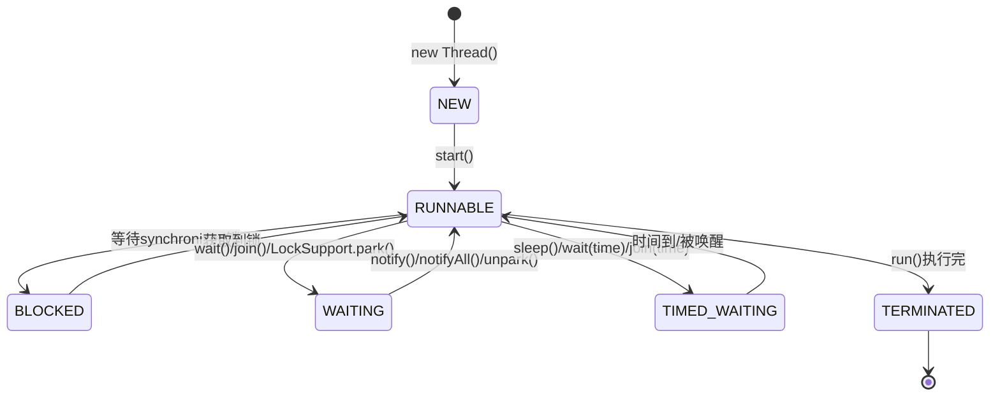

| 状态 | 说明 |
|------|------|
| NEW | 新建，还未调用 start() |
| RUNNABLE | 可运行，包含就绪（Ready）和运行中（Running） |
| BLOCKED | 阻塞，等待获取锁 |
| WAITING | 无限期等待，需被唤醒 |
| TIMED_WAITING | 限时等待，时间到自动唤醒 |
| TERMINATED | 终止，执行完毕或异常退出 |


> 🔍 **知识点深度解析**
>
> **作用**：六种线程状态：NEW（新建。
>
> **原理**：BLOCKED（等待锁）、WAITING（无限等待。
>
> **用法要点**：① 六种线程状态：NEW（新建 ② 未start）、RUNNABLE（就绪+运行） ③ BLOCKED（等待锁）、WAITING（无限等待 ④ wait/join/LockSupport.park） ⑤ TIMED_WAITING（定时等待 ⑥ sleep/wait(timeout)） ⑦ TERMINATED（结束）

### 27.2 状态转换详解

<div style="background:linear-gradient(135deg,#a8edea,#fed6e3);border-radius:16px;padding:20px;margin:16px 0;font-family:-apple-system,'Segoe UI','PingFang SC','Microsoft YaHei',sans-serif;color:#1a1a2e;overflow:hidden;box-shadow:0 6px 20px rgba(0,0,0,.08),0 2px 6px rgba(0,0,0,.04)">
<style>@keyframes stateFlow{0%,100%{transform:scale(1);box-shadow:0 0 0 rgba(0,0,0,0)}25%{transform:scale(1.08);box-shadow:0 0 12px rgba(255,100,100,.4)}50%{transform:scale(1);box-shadow:0 0 0 rgba(0,0,0,0)}75%{transform:scale(1.08);box-shadow:0 0 12px rgba(100,100,255,.4)}}.ts-state{display:inline-block;background:rgba(255,255,255,.5);border:2px solid #555;border-radius:20px;padding:6px 14px;margin:4px;font-size:12px;font-weight:600;animation:stateFlow 4s ease-in-out infinite}.ts-state:nth-child(2){animation-delay:.5s}.ts-state:nth-child(3){animation-delay:1s}.ts-state:nth-child(4){animation-delay:1.5s}.ts-state:nth-child(5){animation-delay:2s}.ts-state:nth-child(6){animation-delay:2.5s}.ts-arrow{display:inline-block;font-size:14px;color:#555;margin:0 2px}.ts-new{border-color:#6c757d}.ts-run{border-color:#28a745;background:rgba(40,167,69,.2)}.ts-block{border-color:#dc3545;background:rgba(220,53,69,.15)}.ts-wait{border-color:#ffc107;background:rgba(255,193,7,.15)}.ts-twait{border-color:#fd7e14;background:rgba(253,126,20,.15)}.ts-term{border-color:#6c757d;background:rgba(108,117,125,.15)}</style>
<div style="text-align:center;font-size:15px;font-weight:700;margin-bottom:14px;padding-bottom:10px;border-bottom:1.5px solid rgba(255,255,255,.22);letter-spacing:1px;text-shadow:0 1px 3px rgba(0,0,0,.12)">Java 线程六种状态与转换</div>
<div style="text-align:center;white-space:nowrap;overflow-x:auto">
<span class="ts-state ts-new">NEW 新建</span><span class="ts-arrow">→start()</span><span class="ts-state ts-run">RUNNABLE 可运行</span>
</div>
<div style="text-align:center;margin-top:6px">
<span class="ts-state ts-block">BLOCKED 阻塞</span><span class="ts-arrow">←等锁</span><span class="ts-state ts-run" style="animation-delay:1s">RUNNABLE</span><span class="ts-arrow">wait()→</span><span class="ts-state ts-wait">WAITING 等待</span>
</div>
<div style="text-align:center;margin-top:6px">
<span class="ts-state ts-twait">TIMED_WAITING 限时等待</span><span class="ts-arrow">←sleep(time)/wait(time)</span><span class="ts-state ts-run" style="animation-delay:2s">RUNNABLE</span><span class="ts-arrow">→执行完</span><span class="ts-state ts-term">TERMINATED 终止</span>
</div>
<div style="text-align:center;font-size:11px;opacity:.7;margin-top:8px">sleep() 不释放锁 → TIMED_WAITING；wait() 释放锁 → WAITING；notify() 唤醒 → 竞争锁 → BLOCKED → RUNNABLE</div>
</div>

**NEW → RUNNABLE**：调用 `start()` 方法

**RUNNABLE → BLOCKED**：
- 进入 synchronized 块/方法时未获取到锁

**BLOCKED → RUNNABLE**：
- 获取到锁

**RUNNABLE → WAITING**：
- `Object.wait()`
- `Thread.join()`
- `LockSupport.park()`

**WAITING → RUNNABLE**：
- `Object.notify()` / `notifyAll()`
- `LockSupport.unpark(thread)`

**RUNNABLE → TIMED_WAITING**：
- `Thread.sleep(long)`
- `Object.wait(long)`
- `Thread.join(long)`
- `LockSupport.parkNanos()` / `parkUntil()`

**TIMED_WAITING → RUNNABLE**：
- 等待时间到
- 被唤醒（notify/unpark）

**RUNNABLE → TERMINATED**：
- `run()` 方法正常执行完毕
- 抛出未捕获的异常


> 🔍 **知识点深度解析**
>
> **作用**：状态转换：NEW→start()→RUNNABLE；。
>
> **原理**：RUNNABLE→synchronized未获锁→BLOCKED→获锁→RUNNABLE；。
>
> **用法要点**：① 状态转换：NEW→start()→RUNNABLE ② RUNNABLE→synchronized未获锁→BLOCKED→获锁→RUNNABLE ③ RUNNABLE→wait/join→WAITING→notify/interrupt→RUNNABLE ④ RUNNABLE→sleep→TIMED_WAITING→时间到→RUNNABLE ⑤ RUNNABLE→run结束→TERMINATED

### 27.3 sleep vs wait

| 区别 | sleep | wait |
|------|-------|------|
| 所属类 | Thread | Object |
| 释放锁 | 不释放 | 释放 |
| 使用位置 | 任意 | synchronized 块中 |
| 唤醒方式 | 时间到自动唤醒 | notify/notifyAll 或时间到 |
| 用途 | 暂停执行 | 线程间通信 |


> 🔍 **知识点深度解析**
>
> **作用**：sleep vs wait：sleep是Thread方法，不释放锁，时间到自动唤醒；。
>
> **原理**：wait是Object方法，释放锁，需notify/notifyAll唤醒，必须在synchronized中调用。
>
> **用法要点**：① sleep vs wait：sleep是Thread方法，不释放锁，时间到自动唤醒 ② wait是Object方法，释放锁，需notify/notifyAll唤醒，必须在synchronized中调用 ③ 都可被interrupt中断

### 27.4 yield vs sleep

| 区别 | yield | sleep |
|------|-------|-------|
| 状态 | RUNNABLE（就绪） | TIMED_WAITING |
| 是否可指定时间 | 否 | 是 |
| 是否释放锁 | 否 | 否 |
| 用途 | 让出 CPU 给同优先级线程 | 暂停指定时间 |

---

> 💡 **深度讲解**：Java 线程有六种状态（Thread.State 枚举）：NEW（新建，未调用 start）、RUNNABLE（可运行，包含就绪和运行中两个子状态，Java 不区分）、BLOCKED（阻塞，等待获取 synchronized 锁）、WAITING（无限等待，调用 wait/join/LockSupport.park 且无超时）、TIMED_WAITING（限时等待，sleep/wait(timeout)/join(timeout)）、TERMINATED（终止，run 执行完毕或异常退出）。状态转换是面试高频考点：NEW→RUNNABLE 调用 start()；RUNNABLE→BLOCKED 等待 synchronized 锁；RUNNABLE→WAITING 调用 wait/join/park；WAITING→RUNNABLE 被 notify/notifyAll/unpark 或中断；TIMED_WAITING 到时间自动唤醒。sleep 和 wait 的核心区别：sleep 是 Thread 的静态方法，不释放锁，不需要在同步块中；wait 是 Object 的方法，释放锁，必须在 synchronized 同步块中调用，否则抛 IllegalMonitorStateException。yield 让出 CPU 但不释放锁，线程仍处于 RUNNABLE 状态，可能立刻又被调度。
>
> **📝 精简总结**：六种状态 NEW/RUNNABLE/BLOCKED/WAITING/TIMED_WAITING/TERMINATED；sleep 不释放锁属 Thread，wait 释放锁属 Object 且必须在同步块；yield 让出 CPU 不释放锁。

---

## 28. 线程安全与同步


> 🔍 **知识点深度解析**
>
> **作用**：yield vs sleep：yield让出CPU给同优先级线程，不改变状态（仍RUNNABLE），不可控；。
>
> **原理**：sleep进入TIMED_WAITING，指定时间，释放CPU不释放锁。
>
> **用法要点**：① yield vs sleep：yield让出CPU给同优先级线程，不改变状态（仍RUNNABLE），不可控 ② sleep进入TIMED_WAITING，指定时间，释放CPU不释放锁 ③ yield只是hint，JVM可忽略

### 28.1 线程安全问题

**竞态条件（Race Condition）**：多个线程同时访问共享资源，且至少有一个是写操作，导致结果不确定。

```java
// 线程不安全示例
public class Counter {
    private int count = 0;

    public void increment() {
        count++;  // 非原子操作：读取-修改-写入
    }
}
```


> 🔍 **知识点深度解析**
>
> **作用**：线程安全问题：多线程共享资源，竞态条件导致数据不一致。
>
> **原理**：原子性（操作不可分割）、可见性（一个线程修改对其他线程可见）、有序性（指令重排序）。
>
> **用法要点**：① 线程安全问题：多线程共享资源，竞态条件导致数据不一致 ② 原子性（操作不可分割）、可见性（一个线程修改对其他线程可见）、有序性（指令重排序） ③ 用同步机制保证

### 28.2 synchronized

#### 三种用法

```java
// 1. 修饰实例方法（锁当前对象 this）
public synchronized void method() {
    // ...
}

// 2. 修饰静态方法（锁当前类的 Class 对象）
public static synchronized void staticMethod() {
    // ...
}

// 3. 修饰代码块（锁指定对象）
public void method() {
    synchronized (this) {
        // ...
    }
}
```

#### 锁升级过程（Java 6+）

<div style="background:linear-gradient(135deg,#ff9a9e,#fecfef);border-radius:16px;padding:20px;margin:16px 0;font-family:-apple-system,'Segoe UI','PingFang SC','Microsoft YaHei',sans-serif;color:#1a1a2e;overflow:hidden;box-shadow:0 6px 20px rgba(0,0,0,.08),0 2px 6px rgba(0,0,0,.04)">
<style>@keyframes upgrade{0%{opacity:.3;transform:translateX(-4px)}15%{opacity:1;transform:translateX(0)}85%{opacity:1}100%{opacity:.3}}.lock-stage{background:rgba(255,255,255,.4);border-radius:8px;box-shadow:0 2px 8px rgba(0,0,0,.08);padding:8px 12px;margin:5px 0;font-size:12px;font-weight:500;animation:upgrade 5s ease-in-out infinite;border-left:4px solid}.lock-stage:nth-child(2){animation-delay:.8s}.lock-stage:nth-child(3){animation-delay:1.6s}.lock-stage:nth-child(4){animation-delay:2.4s}.lock-0{border-color:#6c757d}.lock-1{border-color:#28a745}.lock-2{border-color:#ffc107}.lock-3{border-color:#dc3545}.lock-tag{display:inline-block;font-weight:700;padding:1px 6px;border-radius:3px;color:#fff;font-size:11px;margin-right:6px}</style>
<div style="text-align:center;font-size:15px;font-weight:700;margin-bottom:14px;padding-bottom:10px;border-bottom:1.5px solid rgba(255,255,255,.22);letter-spacing:1px;text-shadow:0 1px 3px rgba(0,0,0,.12)">synchronized 锁升级过程（JDK 6+ 基于 Mark Word）</div>
<div class="lock-stage lock-0"><span class="lock-tag" style="background:#6c757d">无锁</span>对象初始状态，Mark Word 存储对象 hashCode，标志位 01</div>
<div class="lock-stage lock-1"><span class="lock-tag" style="background:#28a745">偏向锁</span>第一个线程获取锁，Mark Word 记录线程ID，同一线程重入无竞争，标志位 01+偏向位1</div>
<div class="lock-stage lock-2"><span class="lock-tag" style="background:#ffc107">轻量级锁</span>多线程交替执行（非同时），CAS 竞争 Mark Word，自旋等待不阻塞，标志位 00</div>
<div class="lock-stage lock-3"><span class="lock-tag" style="background:#dc3545">重量级锁</span>多线程同时竞争，自旋超过阈值（默认10次）升级为 Monitor，线程阻塞挂起，标志位 10</div>
<div style="text-align:center;font-size:11px;opacity:.7;margin-top:8px">锁升级方向：无锁 → 偏向锁 → 轻量级锁 → 重量级锁（单向，不可降级）</div>
</div>

```
无锁 → 偏向锁 → 轻量级锁 → 重量级锁
```

| 锁状态 | 说明 | 适用场景 |
|--------|------|---------|
| 偏向锁 | 记录第一个获取锁的线程，该线程再次获取无需 CAS | 只有一个线程访问 |
| 轻量级锁 | CAS 自旋获取锁，不阻塞 | 多线程交替访问，竞争不激烈 |
| 重量级锁 | 操作系统互斥量，线程阻塞 | 竞争激烈，自旋耗时 > 阻塞耗时 |

**锁消除**：JIT 检测到不可能存在共享数据竞争时，消除锁。

**锁粗化**：将连续的多个锁操作合并为一个大锁，减少锁的获取释放次数。


> 🔍 **知识点深度解析**
>
> **作用**：synchronized：对象锁（monitor），可重入，悲观锁。
>
> **原理**：修饰方法（锁this或类对象）或代码块（锁指定对象）。
>
> **用法要点**：① synchronized：对象锁（monitor），可重入，悲观锁 ② 修饰方法（锁this或类对象）或代码块（锁指定对象） ③ 进入前获取锁，退出释放 ④ JDK 1.6后优化（偏向锁/轻量级锁/重量级锁）

### 28.3 Lock 接口

```java
Lock lock = new ReentrantLock();

lock.lock();          // 获取锁（阻塞）
try {
    // 业务逻辑
} finally {
    lock.unlock();    // 必须在 finally 中释放
}

// 其他方法
lock.tryLock();                    // 尝试获取锁，立即返回
lock.tryLock(5, TimeUnit.SECONDS); // 尝试获取锁，超时返回
lock.lockInterruptibly();          // 可中断地获取锁
```


> 🔍 **知识点深度解析**
>
> **作用**：Lock接口：ReentrantLock实现，可中断（lockInterruptibly）、可公平（new ReentrantLock(true)）、多条件（Condition）、可超时（tryLock）。
>
> **原理**：必须手动unlock（finally中）。
>
> **用法要点**：① Lock接口：ReentrantLock实现，可中断（lockInterruptibly）、可公平（new ReentrantLock(true)）、多条件（Condition）、可超时（tryLock） ② 必须手动unlock（finally中） ③ 比synchronized灵活

### 28.4 synchronized vs Lock

| 区别 | synchronized | Lock |
|------|-------------|------|
| 实现 | JVM 层面 | JDK 层面（API） |
| 释放 | 自动释放 | 必须手动 unlock() |
| 可中断 | 不可中断 | 可中断（lockInterruptibly） |
| 公平锁 | 非公平 | 可选择公平/非公平 |
| 条件变量 | 单一（wait/notify） | 多个 Condition |
| 尝试获取 | 不支持 | tryLock |
| 性能 | 竞争激烈时较差 | 更灵活 |


> 🔍 **知识点深度解析**
>
> **作用**：synchronized vs Lock：synchronized自动释放锁，JVM优化，简单；。
>
> **原理**：简单同步用synchronized，复杂场景用Lock。
>
> **用法要点**：① synchronized vs Lock：synchronized自动释放锁，JVM优化，简单 ② Lock手动释放，功能多（公平/可中断/多条件/超时），灵活 ③ 性能Java 8后差不多 ④ 简单同步用synchronized，复杂场景用Lock

### 28.5 ReentrantLock（可重入锁）

<div style="background:linear-gradient(135deg,#ff9a9e,#fecfef);border-radius:16px;padding:20px;margin:16px 0;font-family:-apple-system,'Segoe UI','PingFang SC','Microsoft YaHei',sans-serif;color:#1a1a2e;overflow:hidden;box-shadow:0 6px 20px rgba(0,0,0,.08),0 2px 6px rgba(0,0,0,.04)">
<style>@keyframes fairLock{0%,100%{transform:scale(1);opacity:.85}50%{transform:scale(1.03);opacity:1}}.lock-type{display:inline-block;width:46%;vertical-align:top;margin:0 1%;background:rgba(255,255,255,.35);border-radius:8px;box-shadow:0 2px 8px rgba(0,0,0,.08);padding:10px;font-size:11px;text-align:center;animation:fairLock 3s ease-in-out infinite}.lock-type:nth-child(2){animation-delay:.5s}.lock-title{font-weight:700;font-size:12px;margin-bottom:4px;padding:3px;border-radius:4px;color:#fff}.lock-queue{background:rgba(255,255,255,.3);border-radius:4px;box-shadow:0 2px 8px rgba(0,0,0,.08);padding:3px 6px;margin:3px 0;font-size:10px;font-family:monospace}</style>
<div style="text-align:center;font-size:15px;font-weight:700;margin-bottom:14px;padding-bottom:10px;border-bottom:1.5px solid rgba(255,255,255,.22);letter-spacing:1px;text-shadow:0 1px 3px rgba(0,0,0,.12)">公平锁 vs 非公平锁（ReentrantLock）</div>
<div style="text-align:center">
<div class="lock-type"><div class="lock-title" style="background:#28a745">公平锁（true）</div><div class="lock-queue">队列：[T1][T2][T3]</div><div style="font-size:10px;margin-top:4px">按 FIFO 排队，先来先得，无饥饿，吞吐量低</div></div>
<div class="lock-type"><div class="lock-title" style="background:#e63946">非公平锁（默认）</div><div class="lock-queue">T新来 插队成功！</div><div style="font-size:10px;margin-top:4px">新来线程可插队竞争，吞吐高，可能饥饿</div></div>
</div>
<div style="text-align:center;font-size:10px;opacity:.7;margin-top:6px">ReentrantLock 优势：可中断 lockInterruptibly()、可超时 tryLock(time)、可公平、多 Condition 精准唤醒</div>
</div>

```java
ReentrantLock lock = new ReentrantLock();  // 默认非公平
ReentrantLock fairLock = new ReentrantLock(true);  // 公平锁

lock.lock();
try {
    lock.lock();  // 可重入，同一线程可多次获取
    try {
        // ...
    } finally {
        lock.unlock();
    }
} finally {
    lock.unlock();
}

// 获取锁信息
lock.getHoldCount();      // 当前线程持有锁的次数
lock.isLocked();          // 是否被锁定
lock.isFair();            // 是否公平锁
lock.hasQueuedThreads();  // 是否有线程在等待
```


> 🔍 **知识点深度解析**
>
> **作用**：ReentrantLock可重入锁：同一线程可多次获取（state计数），释放对应次数。
>
> **原理**：Condition替代wait/notify，可多条件队列。
>
> **用法要点**：① ReentrantLock可重入锁：同一线程可多次获取（state计数），释放对应次数 ② 非公平（默认，吞吐量高）/公平（按等待顺序，吞吐量低） ③ Condition替代wait/notify，可多条件队列

### 28.6 公平锁 vs 非公平锁

| 区别 | 公平锁 | 非公平锁 |
|------|--------|---------|
| 获取顺序 | 按等待顺序（FIFO） | 可插队 |
| 性能 | 较低（有唤醒开销） | 较高 |
| 饥饿 | 不会 | 可能 |
| 默认 | - | synchronized 和 ReentrantLock 默认 |


> 🔍 **知识点深度解析**
>
> **作用**：公平锁vs非公平锁：公平锁按FIFO获取，无饥饿但吞吐量低（上下文切换多）；。
>
> **原理**：非公平锁可插队，吞吐量高但可能饥饿。
>
> **用法要点**：① 公平锁vs非公平锁：公平锁按FIFO获取，无饥饿但吞吐量低（上下文切换多） ② 非公平锁可插队，吞吐量高但可能饥饿 ③ ReentrantLock默认非公平，synchronized是非公平

### 28.7 线程间通信

#### wait/notify/notifyAll

```java
// 生产者消费者模式
public class Buffer {
    private final List<Integer> list = new ArrayList<>();
    private final int MAX = 10;

    public synchronized void produce(int value) throws InterruptedException {
        while (list.size() == MAX) {
            wait();  // 满了，等待
        }
        list.add(value);
        notifyAll();  // 通知消费者
    }

    public synchronized int consume() throws InterruptedException {
        while (list.isEmpty()) {
            wait();  // 空了，等待
        }
        int value = list.remove(0);
        notifyAll();  // 通知生产者
        return value;
    }
}
```

**注意**：
- wait/notify 必须在 synchronized 块中调用
- 永远在循环中检查条件（while 而非 if），防止虚假唤醒
- 优先使用 notifyAll() 而非 notify()

#### Condition

```java
ReentrantLock lock = new ReentrantLock();
Condition notFull = lock.newCondition();
Condition notEmpty = lock.newCondition();

public void produce(int value) throws InterruptedException {
    lock.lock();
    try {
        while (list.size() == MAX) {
            notFull.await();  // 等待不满
        }
        list.add(value);
        notEmpty.signal();    // 通知非空
    } finally {
        lock.unlock();
    }
}
```

#### LockSupport

```java
// 阻塞当前线程
LockSupport.park();

// 唤醒指定线程
LockSupport.unpark(thread);

// 带超时
LockSupport.parkNanos(1000_000_000);  // 1秒
LockSupport.parkUntil(System.currentTimeMillis() + 5000);
```

**特点**：
- 不需要在同步块中使用
- 可以先 unpark 再 park（不会阻塞）
- 不可重入

---

> 💡 **深度讲解**：线程安全的本质是多线程对共享可变资源的并发访问导致结果不确定。synchronized 是 Java 最基础的同步机制，基于对象监视器（Monitor）实现，JDK 6 后引入了锁升级机制：无锁→偏向锁（单线程重入时记录线程 ID）→轻量级锁（多线程交替访问时 CAS 竞争）→重量级锁（多线程同时竞争时阻塞）。synchronized 有三种用法：修饰实例方法（锁当前对象 this）、修饰静态方法（锁类对象 Class）、修饰代码块（锁指定对象）。Lock 接口是 JDK 5 引入的显式锁，实现类 ReentrantLock，相比 synchronized 支持可中断获取锁（lockInterruptibly）、超时获取锁（tryLock）、公平锁、多条件变量（Condition）。synchronized 和 Lock 的选择：简单同步用 synchronized，需要高级特性（公平/超时/中断/多条件）用 ReentrantLock。线程间通信有四种方式：wait/notify（Object 方法，必须在 synchronized 中）、Condition（Lock 的条件，await/signal）、LockSupport（park/unpark，无需同步块，可先 unpark 再 park）、BlockingQueue（生产者消费者模式最优雅的实现）。
>
> **📝 精简总结**：synchronized 基于 Monitor，JDK6+ 锁升级（偏向→轻量→重量）；ReentrantLock 支持公平/超时/中断/多 Condition；wait/notify 须在同步块，LockSupport 无需同步块可先 unpark；简单用 synchronized，高级特性用 Lock。

---

## 29. JMM 三大特性与 happens-before


> 🔍 **知识点深度解析**
>
> **作用**：线程间通信：wait/notify/notifyAll（Object方法。
>
> **原理**：多条件队列）、BlockingQueue（生产者消费者）。
>
> **用法要点**：① 线程间通信：wait/notify/notifyAll（Object方法 ② synchronized内） ③ Condition（Lock的await/signal ④ 多条件队列）、BlockingQueue（生产者消费者） ⑤ CountDownLatch/CyclicBarrier/Semaphore工具

### 29.1 Java 内存模型（JMM）

<div style="background:linear-gradient(135deg,#667eea,#764ba2);border-radius:16px;padding:20px;margin:16px 0;font-family:-apple-system,'Segoe UI','PingFang SC','Microsoft YaHei',sans-serif;color:#fff;overflow:hidden;box-shadow:0 8px 28px rgba(0,0,0,.14),0 3px 10px rgba(0,0,0,.08)">
<style>@keyframes dataFlow{0%{transform:translateY(0);opacity:.6}50%{transform:translateY(-4px);opacity:1}100%{transform:translateY(0);opacity:.6}}@keyframes memPulse{0%,100%{box-shadow:0 0 4px rgba(255,255,255,.2)}50%{box-shadow:0 0 16px rgba(255,255,255,.5)}}.jmm-main{background:rgba(255,255,255,.15);border:2px solid rgba(255,255,255,.5);border-radius:8px;padding:10px;text-align:center;font-weight:700;font-size:13px;margin:0 auto 12px;max-width:280px;animation:memPulse 3s ease-in-out infinite}.jmm-thread{display:inline-block;width:44%;vertical-align:top;margin:0 2%;text-align:center}.jmm-wm{background:rgba(255,255,255,.12);border:1px solid rgba(255,255,255,.4);border-radius:6px;padding:8px;font-size:11px;margin-top:6px}.jmm-var{display:inline-block;background:rgba(255,255,255,.2);border-radius:3px;box-shadow:0 2px 8px rgba(0,0,0,.08);padding:2px 6px;margin:2px;font-size:10px;animation:dataFlow 2s ease-in-out infinite}.jmm-arrow{text-align:center;font-size:16px;margin:4px 0;animation:dataFlow 1.5s ease-in-out infinite}</style>
<div style="text-align:center;font-size:15px;font-weight:700;margin-bottom:14px;padding-bottom:10px;border-bottom:1.5px solid rgba(255,255,255,.22);letter-spacing:1px;text-shadow:0 1px 3px rgba(0,0,0,.12)">JMM Java 内存模型（主内存 + 工作内存）</div>
<div class="jmm-main">主内存（Main Memory）<div style="font-size:10px;font-weight:400;margin-top:4px">共享变量：int flag = 0</div></div>
<div class="jmm-arrow">▲ read / write ▼</div>
<div style="text-align:center">
<div class="jmm-thread"><div style="font-weight:600;font-size:12px">线程 A 工作内存</div><div class="jmm-wm">本地副本<div><span class="jmm-var">flag=0</span></div></div></div>
<div class="jmm-thread"><div style="font-weight:600;font-size:12px">线程 B 工作内存</div><div class="jmm-wm">本地副本<div><span class="jmm-var" style="animation-delay:.5s">flag=1</span></div></div></div>
</div>
<div style="text-align:center;font-size:11px;opacity:.85;margin-top:10px">三大特性：原子性（synchronized）、可见性（volatile）、有序性（volatile/happens-before）</div>
</div>

JMM 定义了线程和主内存之间的抽象关系：
- 所有变量存储在主内存
- 每个线程有自己的工作内存
- 线程对变量的操作必须在工作内存中进行
- 线程间通信必须通过主内存

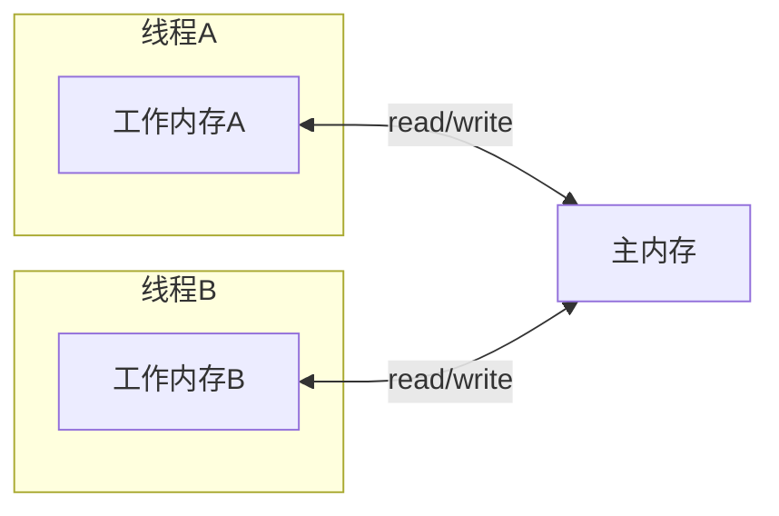


> 🔍 **知识点深度解析**
>
> **作用**：JMM（Java内存模型）定义线程和主内存交互规则，屏蔽硬件差异。
>
> **原理**：每个线程有工作内存（缓存），操作在工作内存进行，同步到主内存。
>
> **用法要点**：① JMM（Java内存模型）定义线程和主内存交互规则，屏蔽硬件差异 ② 每个线程有工作内存（缓存），操作在工作内存进行，同步到主内存 ③ 解决多线程可见性、原子性、有序性问题

### 29.2 三大特性

#### 原子性（Atomicity）

- 一个操作不可中断，要么全部执行，要么不执行
- Java 中对基本类型的读取和赋值是原子的（除 long 和 double，64位）
- `synchronized` 和 `Lock` 保证原子性
- 原子类（AtomicInteger 等）保证原子性

```java
int a = 1;        // 原子
a++;              // 非原子（读-改-写）
long b = 1L;      // 32位系统下非原子（分两次写）
```

#### 可见性（Visibility）

- 一个线程修改了共享变量，其他线程能立即看到
- `volatile` 保证可见性
- `synchronized` 和 `Lock` 保证可见性
- `final` 字段初始化后对其他线程可见

```java
volatile boolean flag = true;

// 线程A
flag = false;

// 线程B
while (flag) {  // 能立即看到 flag 的修改
    // ...
}
```

#### 有序性（Ordering）

- 程序执行的顺序按照代码的先后顺序
- 编译器和 CPU 可能进行指令重排序
- `volatile` 禁止指令重排序
- `synchronized` 和 `Lock` 保证有序性


> 🔍 **知识点深度解析**
>
> **作用**：三大特性：原子性（synchronized/原子类/Lock）、可见性（volatile/synchronized/final，volatile强制刷新主存）、有序性（volatile禁止重排序、happens-before）。
>
> **原理**：JMM保证同步程序的一致性。
>
> **用法要点**：① 三大特性：原子性（synchronized/原子类/Lock）、可见性（volatile/synchronized/final，volatile强制刷新主存）、有序性（volatile禁止重排序、happens-before） ② JMM保证同步程序的一致性

### 29.3 volatile

**volatile 的作用**：
1. 保证可见性：修改后立即刷新到主内存，读取时从主内存读取
2. 禁止指令重排序：通过内存屏障实现

**volatile 的局限**：
- 不能保证原子性（如 i++）
- 适合一写多读的场景

**典型应用**：
- 状态标志位（boolean flag）
- 双重检查锁定（DCL）单例

```java
// DCL 单例
public class Singleton {
    private static volatile Singleton instance;  // volatile 防止指令重排序

    public static Singleton getInstance() {
        if (instance == null) {  // 第一次检查
            synchronized (Singleton.class) {
                if (instance == null) {  // 第二次检查
                    instance = new Singleton();
                }
            }
        }
        return instance;
    }
}
```


> 🔍 **知识点深度解析**
>
> **作用**：volatile：保证可见性（修改立即刷新主存，读取从主存）、禁止指令重排序（内存屏障）。
>
> **原理**：适合状态标记（boolean flag）、双重检查锁的instance变量。
>
> **用法要点**：① volatile：保证可见性（修改立即刷新主存，读取从主存）、禁止指令重排序（内存屏障） ② 不保证原子性（i++不是原子操作） ③ 适合状态标记（boolean flag）、双重检查锁的instance变量

### 29.4 happens-before 原则

如果操作 A happens-before 操作 B，那么 A 的执行结果对 B 可见，且 A 的执行顺序排在 B 之前。

**8 条规则**：

| 规则 | 说明 |
|------|------|
| 程序次序规则 | 单线程内，前面的操作 happens-before 后面的操作 |
| 管程锁定规则 | unlock 操作 happens-before 后续的 lock 操作 |
| volatile 变量规则 | volatile 写 happens-before 后续的 volatile 读 |
| 线程启动规则 | Thread.start() happens-before 线程内的所有操作 |
| 线程终止规则 | 线程内所有操作 happens-before 线程终止检测 |
| 线程中断规则 | interrupt() happens-before 被中断线程检测到中断 |
| 对象终结规则 | 对象构造完成 happens-before finalize() 开始 |
| 传递性 | A happens-before B，B happens-before C，则 A happens-before C |

---

> 💡 **深度讲解**：JMM（Java 内存模型）是一套规范，定义了线程和主内存之间的抽象关系，解决多线程并发的可见性、有序性、原子性问题。每个线程有自己的工作内存（缓存），共享变量存主内存，线程操作变量时先从主内存拷贝到工作内存，操作完再写回主内存，这就导致了可见性问题（一个线程的修改另一个线程看不到）。三大特性：原子性（一个操作不可分割，synchronized 和 Lock 保证）、可见性（一个线程修改后其他线程能立即看到，volatile 和 synchronized 保证）、有序性（指令不被重排序，volatile 和 happens-before 保证）。volatile 是轻量级同步机制，保证可见性和有序性（禁止指令重排序），但不保证原子性，适合状态标志位、双重检查锁定的单例模式。happens-before 是判断可见性的核心规则，如果 A happens-before B，那么 A 的修改对 B 可见。八条规则中最常用的是程序次序、管程锁定、volatile 变量、线程启动/终止和传递性。理解 JMM 是理解并发编程的基础，很多诡异的并发 Bug 都是因为违反了这三大特性。
>
> **📝 精简总结**：JMM 定义线程与主内存关系，解决可见性/有序性/原子性；volatile 保证可见性和有序性不保证原子性；happens-before 八条规则判断可见性；synchronized 同时保证三大特性。

---

## 30. 线程池


> 🔍 **知识点深度解析**
>
> **作用**：happens-before原则：程序顺序（单线程前面操作happens-before后面）。
>
> **原理**：监视器锁（unlock happens-before后续lock）。
>
> **用法要点**：① happens-before原则：程序顺序（单线程前面操作happens-before后面） ② 监视器锁（unlock happens-before后续lock） ③ volatile（写happens-before后续读） ④ 传递性、线程启动/中断/终止规则

### 30.1 线程池的优势

- 降低资源消耗：复用线程，避免频繁创建销毁
- 提高响应速度：任务到达时直接执行
- 提高线程可管理性：统一分配、调优、监控


> 🔍 **知识点深度解析**
>
> **作用**：线程池优势：复用线程（减少创建销毁开销）、控制并发数（避免资源耗尽）、管理线程（统一调度/监控）。
>
> **原理**：生产环境必须用线程池，不要new Thread。
>
> **用法要点**：① 线程池优势：复用线程（减少创建销毁开销）、控制并发数（避免资源耗尽）、管理线程（统一调度/监控） ② 生产环境必须用线程池，不要new Thread ③ ThreadPoolExecutor是核心实现

### 30.2 ThreadPoolExecutor 七大参数

```java
public ThreadPoolExecutor(
    int corePoolSize,          // 核心线程数
    int maximumPoolSize,       // 最大线程数
    long keepAliveTime,        // 非核心线程空闲存活时间
    TimeUnit unit,             // 时间单位
    BlockingQueue<Runnable> workQueue,  // 任务队列
    ThreadFactory threadFactory,        // 线程工厂
    RejectedExecutionHandler handler    // 拒绝策略
)
```


> 🔍 **知识点深度解析**
>
> **作用**：七大参数：corePoolSize核心线程数。
>
> **原理**：maximumPoolSize最大线程数。
>
> **用法要点**：① 七大参数：corePoolSize核心线程数 ② maximumPoolSize最大线程数 ③ keepAliveTime空闲线程存活时间 ④ unit时间单位、workQueue工作队列 ⑤ threadFactory线程工厂、handler拒绝策略

### 30.3 任务执行流程

<div style="background:linear-gradient(135deg,#4facfe,#00f2fe);border-radius:16px;padding:20px;margin:16px 0;font-family:-apple-system,'Segoe UI','PingFang SC','Microsoft YaHei',sans-serif;color:#fff;overflow:hidden;box-shadow:0 8px 28px rgba(0,0,0,.14),0 3px 10px rgba(0,0,0,.08)">
<style>@keyframes tpFlow{0%{opacity:0;transform:scale(.9)}12%{opacity:1;transform:scale(1)}88%{opacity:1}100%{opacity:.4}}.tp-step{background:rgba(255,255,255,.18);border:2px solid rgba(255,255,255,.4);border-radius:8px;padding:8px 12px;margin:5px 0;font-size:12px;font-weight:500;animation:tpFlow 5s ease-in-out infinite}.tp-step:nth-child(2){animation-delay:.7s}.tp-step:nth-child(3){animation-delay:1.4s}.tp-step:nth-child(4){animation-delay:2.1s}.tp-decision{background:rgba(255,200,0,.25);border-color:rgba(255,200,0,.6)}.tp-reject{background:rgba(255,80,80,.25);border-color:rgba(255,80,80,.6)}.tp-param{display:inline-block;background:rgba(255,255,255,.15);border-radius:4px;box-shadow:0 2px 8px rgba(0,0,0,.08);padding:2px 6px;margin:2px;font-size:10px}</style>
<div style="text-align:center;font-size:15px;font-weight:700;margin-bottom:14px;padding-bottom:10px;border-bottom:1.5px solid rgba(255,255,255,.22);letter-spacing:1px;text-shadow:0 1px 3px rgba(0,0,0,.12)">线程池任务执行流程（七大参数）</div>
<div class="tp-step">① 新任务提交 → 核心线程数 < corePoolSize？→ 创建核心线程执行</div>
<div class="tp-step tp-decision">② 核心线程满 → 任务加入 workQueue 阻塞队列</div>
<div class="tp-step tp-decision">③ 队列满 → 当前线程数 < maximumPoolSize？→ 创建非核心线程</div>
<div class="tp-step tp-reject">④ 线程数达最大 → 执行拒绝策略（4种）</div>
<div style="text-align:center;margin-top:8px;font-size:11px">
<span class="tp-param">corePoolSize 核心</span><span class="tp-param">maximumPoolSize 最大</span><span class="tp-param">keepAliveTime 存活</span><span class="tp-param">workQueue 队列</span><span class="tp-param">threadFactory 工厂</span><span class="tp-param">handler 拒绝</span><span class="tp-param">unit 时间单位</span>
</div>
<div style="text-align:center;font-size:11px;opacity:.85;margin-top:6px">拒绝策略：AbortPolicy(默认抛异常) / CallerRunsPolicy(调用者执行) / DiscardPolicy(丢弃) / DiscardOldestPolicy(丢弃最旧)</div>
</div>

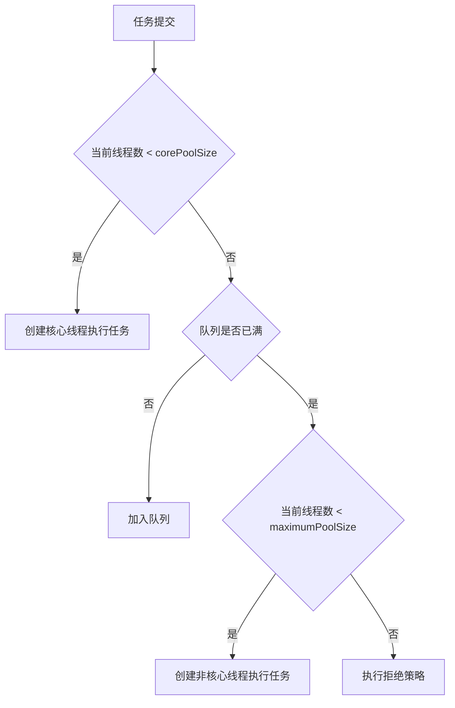


> 🔍 **知识点深度解析**
>
> **作用**：任务执行流程：提交任务→核心线程未满创建核心线程→核心线程满了入队列→队列满了创建非核心线程（直到最大）→达到最大执行拒绝策略。
>
> **原理**：注意：队列满才创建非核心线程，无界队列则永远不创建。
>
> **用法要点**：① 任务执行流程：提交任务→核心线程未满创建核心线程→核心线程满了入队列→队列满了创建非核心线程（直到最大）→达到最大执行拒绝策略 ② 注意：队列满才创建非核心线程，无界队列则永远不创建

### 30.4 四种拒绝策略

| 策略 | 说明 |
|------|------|
| AbortPolicy | 抛出 RejectedExecutionException（默认） |
| CallerRunsPolicy | 由提交任务的线程执行 |
| DiscardPolicy | 直接丢弃任务 |
| DiscardOldestPolicy | 丢弃队列中最旧的任务，重试提交 |


> 🔍 **知识点深度解析**
>
> **作用**：四种拒绝策略：AbortPolicy（默认。
>
> **原理**：CallerRunsPolicy（调用者线程执行。
>
> **用法要点**：① 四种拒绝策略：AbortPolicy（默认 ② 抛RejectedExecutionException） ③ CallerRunsPolicy（调用者线程执行 ④ 降低提交速度）、DiscardPolicy（直接丢弃） ⑤ DiscardOldestPolicy（丢弃队列最旧任务再尝试）

### 30.5 四种常用线程池

```java
// 固定大小线程池
ExecutorService fixed = Executors.newFixedThreadPool(10);
// 核心=最大=10，队列 LinkedBlockingQueue（无界）

// 单线程线程池
ExecutorService single = Executors.newSingleThreadExecutor();
// 核心=最大=1，队列 LinkedBlockingQueue（无界）

// 可缓存线程池
ExecutorService cached = Executors.newCachedThreadPool();
// 核心=0，最大=Integer.MAX，队列 SynchronousQueue
// 适合大量短任务

// 定时任务线程池
ScheduledExecutorService scheduled = Executors.newScheduledThreadPool(5);
scheduled.schedule(() -> {}, 5, TimeUnit.SECONDS);
scheduled.scheduleAtFixedRate(() -> {}, 0, 1, TimeUnit.SECONDS);
scheduled.scheduleWithFixedDelay(() -> {}, 0, 1, TimeUnit.SECONDS);
```


> 🔍 **知识点深度解析**
>
> **作用**：四种常用线程池（Executors。
>
> **原理**：无界队列OOM）、CachedThreadPool（弹性。
>
> **用法要点**：① 四种常用线程池（Executors ② 不推荐生产用）：FixedThreadPool（固定大小 ③ 无界队列OOM）、CachedThreadPool（弹性 ④ 0核心Integer最大、OOM） ⑤ SingleThreadExecutor（单线程 ⑥ 无界队列）、ScheduledThreadPool（定时任务）

### 30.6 线程池参数配置

**CPU 密集型**：
- 核心线程数 = CPU 核心数 + 1
- 队列用有界队列

**IO 密集型**：
- 核心线程数 = CPU 核心数 × 2
- 或 = CPU 核心数 / (1 - 阻塞系数)，阻塞系数通常 0.8~0.9

**混合型**：
- 拆分为 CPU 密集型和 IO 密集型，分别配置


> 🔍 **知识点深度解析**
>
> **作用**：参数配置：CPU密集型（N+1）、IO密集型（2N或更多，用公式：CPU核数*(1+等待时间/计算时间)）。
>
> **原理**：队列用有界队列（ArrayBlockingQueue）。
>
> **用法要点**：① 参数配置：CPU密集型（N+1）、IO密集型（2N或更多，用公式：CPU核数*(1+等待时间/计算时间)） ② 队列用有界队列（ArrayBlockingQueue） ③ 根据业务压测调整

### 30.7 线程池监控

```java
ThreadPoolExecutor executor = (ThreadPoolExecutor) Executors.newFixedThreadPool(10);

executor.getActiveCount();       // 活跃线程数
executor.getPoolSize();          // 当前线程数
executor.getCorePoolSize();      // 核心线程数
executor.getMaximumPoolSize();   // 最大线程数
executor.getCompletedTaskCount(); // 已完成任务数
executor.getTaskCount();         // 总任务数
executor.getQueue().size();      // 队列中任务数
```


> 🔍 **知识点深度解析**
>
> **作用**：线程池监控：getActiveCount()活跃线程、getPoolSize()当前线程数、getCompletedTaskCount()完成任务数、getQueue().size()队列大小。
>
> **原理**：自定义线程池重写beforeExecute/afterExecute记录日志。
>
> **用法要点**：① 线程池监控：getActiveCount()活跃线程、getPoolSize()当前线程数、getCompletedTaskCount()完成任务数、getQueue().size()队列大小 ② 自定义线程池重写beforeExecute/afterExecute记录日志

### 30.8 线程池关闭

```java
executor.shutdown();      // 平滑关闭，不再接受新任务，等待已提交任务完成
executor.shutdownNow();   // 立即关闭，尝试中断正在执行的任务，返回未执行的任务

// 等待终止
executor.awaitTermination(60, TimeUnit.SECONDS);
```


> 🔍 **知识点深度解析**
>
> **作用**：线程池关闭：shutdown()（优雅关闭。
>
> **原理**：中断所有线程、返回未执行任务）。
>
> **用法要点**：① 线程池关闭：shutdown()（优雅关闭 ② 不再接受新任务、等待已提交任务完成） ③ shutdownNow()（立即关闭 ④ 中断所有线程、返回未执行任务） ⑤ awaitTermination()等待关闭

### 30.9 注意事项

- **不要用 Executors 创建线程池**：可能导致 OOM（无界队列或无限线程）
- **推荐用 ThreadPoolExecutor**：明确参数，避免资源耗尽
- **合理设置队列容量**：避免任务堆积
- **自定义线程工厂**：设置有意义的线程名，便于排查
- **处理任务异常**：submit 的任务异常会被吞掉，需要检查 Future

---

> 💡 **深度讲解**：线程池是并发编程中最重要的工具，核心思想是复用线程，避免频繁创建销毁线程的开销。ThreadPoolExecutor 有七大核心参数：corePoolSize（核心线程数，即使空闲也保留）、maximumPoolSize（最大线程数）、keepAliveTime（非核心线程空闲超时）、unit（时间单位）、workQueue（任务队列）、threadFactory（线程工厂）、handler（拒绝策略）。任务执行流程是面试必考题：任务提交→核心线程未满则创建核心线程→核心线程满则入队列→队列满则创建非核心线程→达到最大线程数则执行拒绝策略。四种拒绝策略：AbortPolicy（抛异常，默认）、CallerRunsPolicy（调用者线程执行）、DiscardPolicy（直接丢弃）、DiscardOldestPolicy（丢弃队列最老任务）。四种常用线程池都有坑：FixedThreadPool 和 SingleThreadPool 用无界 LinkedBlockingQueue 可能 OOM；CachedThreadPool 最大线程数 Integer.MAX 可能创建无限线程；ScheduledThreadPool 用无界 DelayedWorkQueue。所以阿里巴巴规范强制要求用 ThreadPoolExecutor 手动创建。参数配置：CPU 密集型核心线程数=CPU核数+1，IO 密集型=CPU核数*2 或 CPU核数/(1-阻塞系数)。
>
> **📝 精简总结**：线程池七大参数，执行流程：核心线程→队列→非核心线程→拒绝策略；四种拒绝策略默认 AbortPolicy；禁止用 Executors 创建（OOM 风险），必须用 ThreadPoolExecutor；CPU 密集型核数+1，IO 密集型核数*2。

---

## 31. 阻塞队列

<div style="background:linear-gradient(135deg,#4facfe,#00f2fe);border-radius:16px;padding:20px;margin:16px 0;font-family:-apple-system,'Segoe UI','PingFang SC','Microsoft YaHei',sans-serif;color:#fff;overflow:hidden;box-shadow:0 8px 28px rgba(0,0,0,.14),0 3px 10px rgba(0,0,0,.08)">
<style>@keyframes bqFlow{0%,100%{transform:translateX(0);opacity:.5}50%{transform:translateX(6px);opacity:1}}.bq-producer{display:inline-block;width:25%;vertical-align:middle;text-align:center;background:rgba(255,255,255,.15);border-radius:8px;box-shadow:0 2px 8px rgba(0,0,0,.08);padding:10px;font-size:11px;font-weight:600}.bq-queue{display:inline-block;width:40%;vertical-align:middle;text-align:center;margin:0 4px}.bq-slot{display:inline-block;width:28px;height:28px;background:rgba(255,255,255,.2);border:2px solid rgba(255,255,255,.5);border-radius:4px;margin:2px;line-height:28px;font-size:10px;font-weight:700;animation:bqFlow 2s ease-in-out infinite}.bq-slot:nth-child(2){animation-delay:.3s}.bq-slot:nth-child(3){animation-delay:.6s}.bq-slot:nth-child(4){animation-delay:.9s}.bq-consumer{display:inline-block;width:25%;vertical-align:middle;text-align:center;background:rgba(255,255,255,.15);border-radius:8px;box-shadow:0 2px 8px rgba(0,0,0,.08);padding:10px;font-size:11px;font-weight:600}.bq-arrow{display:inline-block;font-size:18px;vertical-align:middle;animation:bqFlow 1.5s ease-in-out infinite}</style>
<div style="text-align:center;font-size:15px;font-weight:700;margin-bottom:14px;padding-bottom:10px;border-bottom:1.5px solid rgba(255,255,255,.22);letter-spacing:1px;text-shadow:0 1px 3px rgba(0,0,0,.12)">阻塞队列 — 生产者消费者模型</div>
<div style="text-align:center">
<div class="bq-producer">生产者<br>put()<div style="font-size:10px;font-weight:400;margin-top:4px">队列满→阻塞等待</div></div>
<span class="bq-arrow">→</span>
<div class="bq-queue"><div><span class="bq-slot">D1</span><span class="bq-slot">D2</span><span class="bq-slot">D3</span><span class="bq-slot">D4</span></div><div style="font-size:10px;margin-top:4px">BlockingQueue</div></div>
<span class="bq-arrow">→</span>
<div class="bq-consumer">消费者<br>take()<div style="font-size:10px;font-weight:400;margin-top:4px">队列空→阻塞等待</div></div>
</div>
</div>


> 🔍 **知识点深度解析**
>
> **作用**：注意事项：不要用Executors创建（OOM风险），用ThreadPoolExecutor手动配置；。
>
> **原理**：核心线程也会超时（allowCoreThreadTimeOut）；。
>
> **用法要点**：① 注意事项：不要用Executors创建（OOM风险），用ThreadPoolExecutor手动配置 ② 核心线程也会超时（allowCoreThreadTimeOut） ③ 异常被吞（submit的异常在Future中） ④ 队列大小和最大线程数配合

### 31.1 常用阻塞队列

| 队列 | 底层 | 容量 | 特点 |
|------|------|------|------|
| ArrayBlockingQueue | 数组 | 有界 | 公平/非公平可选 |
| LinkedBlockingQueue | 链表 | 有界/无界 | 默认 Integer.MAX |
| PriorityBlockingQueue | 堆 | 无界 | 按优先级出队 |
| DelayQueue | 堆 | 无界 | 延迟出队 |
| SynchronousQueue | 无存储 | - | 直接传递，必须有消费者 |
| LinkedTransferQueue | 链表 | 无界 | 高性能，支持 transfer |
| LinkedBlockingDeque | 双向链表 | 有界 | 双端操作 |


> 🔍 **知识点深度解析**
>
> **作用**：常用阻塞队列：ArrayBlockingQueue（有界数组。
>
> **原理**：公平/非公平）、LinkedBlockingQueue（链表。
>
> **用法要点**：① 常用阻塞队列：ArrayBlockingQueue（有界数组 ② 公平/非公平）、LinkedBlockingQueue（链表 ③ 默认Integer.MAX_VALUE ④ 注意OOM）、SynchronousQueue（不存储 ⑤ 直接传递、CachedThreadPool用） ⑥ PriorityBlockingQueue（优先队列） ⑦ DelayQueue（延迟队列）

### 31.2 核心方法

| 操作 | 抛出异常 | 返回特殊值 | 阻塞 | 超时 |
|------|---------|-----------|------|------|
| 插入 | add(e) | offer(e) | put(e) | offer(e, time, unit) |
| 移除 | remove() | poll() | take() | poll(time, unit) |
| 检查 | element() | peek() | - | - |


> 🔍 **知识点深度解析**
>
> **作用**：核心方法：添加（add抛异常/offer返回false/put阻塞）、移除（remove抛异常/poll返回null/take阻塞）、检查（element抛异常/peek返回null）。
>
> **原理**：阻塞方法put/take用于生产者消费者模式。
>
> **用法要点**：① 核心方法：添加（add抛异常/offer返回false/put阻塞）、移除（remove抛异常/poll返回null/take阻塞）、检查（element抛异常/peek返回null） ② 阻塞方法put/take用于生产者消费者模式

### 31.3 生产者消费者模式

```java
BlockingQueue<Integer> queue = new ArrayBlockingQueue<>(10);

// 生产者
new Thread(() -> {
    for (int i = 0; i < 100; i++) {
        try {
            queue.put(i);
            System.out.println("生产: " + i);
        } catch (InterruptedException e) {
            Thread.currentThread().interrupt();
        }
    }
}).start();

// 消费者
new Thread(() -> {
    while (true) {
        try {
            int value = queue.take();
            System.out.println("消费: " + value);
        } catch (InterruptedException e) {
            Thread.currentThread().interrupt();
            break;
        }
    }
}).start();
```

---

> 💡 **深度讲解**：阻塞队列是实现生产者消费者模式的最佳工具，当队列满时生产者线程阻塞，队列空时消费者线程阻塞，无需手动 wait/notify。常用七种阻塞队列各有特点：ArrayBlockingQueue 基于数组有界，支持公平/非公平；LinkedBlockingQueue 基于链表，默认无界（Integer.MAX），可指定容量；PriorityBlockingQueue 基于堆无界，按优先级出队；DelayQueue 基于 PriorityQueue 无界，延迟时间到才能出队，适合定时任务；SynchronousQueue 无存储，必须有消费者才能 put，CachedThreadPool 用的就是它；LinkedTransferQueue 支持 transfer 方法（生产者等待消费者取走）；LinkedBlockingDeque 双向队列可双端操作。核心方法分四组：抛出异常（add/remove/element）、返回特殊值（offer/poll/peek）、阻塞（put/take）、超时（offer(timeout)/poll(timeout)）。实际开发中 ArrayBlockingQueue 和 LinkedBlockingQueue 最常用，线程池的队列选型直接影响性能和稳定性。
>
> **📝 精简总结**：阻塞队列实现生产者消费者，队列满/空自动阻塞；ArrayBlockingQueue 有界数组，LinkedBlockingQueue 默认无界链表，SynchronousQueue 无存储直接传递；方法分抛异常/返回值/阻塞/超时四组。

---

## 32. ThreadLocal 原理与内存泄漏


> 🔍 **知识点深度解析**
>
> **作用**：生产者消费者模式：生产者往队列put（满则阻塞），消费者从队列take（空则阻塞）。
>
> **原理**：用BlockingQueue实现，不需要手动wait/notify。
>
> **用法要点**：① 生产者消费者模式：生产者往队列put（满则阻塞），消费者从队列take（空则阻塞） ② 解耦生产者和消费者，削峰填谷 ③ 用BlockingQueue实现，不需要手动wait/notify

### 32.1 基本用法

```java
ThreadLocal<String> threadLocal = new ThreadLocal<>();

// 设置
threadLocal.set("当前线程的值");

// 获取
String value = threadLocal.get();

// 移除
threadLocal.remove();
```

**典型应用**：
- 保存用户上下文（如登录用户信息）
- 数据库连接管理
- SimpleDateFormat 线程安全问题
- 事务管理

```java
// SimpleDateFormat 线程安全方案
private static final ThreadLocal<SimpleDateFormat> sdf = ThreadLocal.withInitial(
    () -> new SimpleDateFormat("yyyy-MM-dd")
);

public String format(Date date) {
    return sdf.get().format(date);
}
```


> 🔍 **知识点深度解析**
>
> **作用**：ThreadLocal线程本地变量，每个线程独立副本，互不干扰。
>
> **原理**：底层ThreadLocalMap（线程私有，Thread.threadLocals），key是ThreadLocal弱引用，value是强引用。
>
> **用法要点**：① ThreadLocal线程本地变量，每个线程独立副本，互不干扰 ② set/get/remove ③ 底层ThreadLocalMap（线程私有，Thread.threadLocals），key是ThreadLocal弱引用，value是强引用

### 32.2 实现原理

<div style="background:linear-gradient(135deg,#a18cd1,#fbc2eb);border-radius:16px;padding:20px;margin:16px 0;font-family:-apple-system,'Segoe UI','PingFang SC','Microsoft YaHei',sans-serif;color:#1a1a2e;overflow:hidden;box-shadow:0 6px 20px rgba(0,0,0,.08),0 2px 6px rgba(0,0,0,.04)">
<style>@keyframes tlPulse{0%,100%{transform:scale(1)}50%{transform:scale(1.03)}}@keyframes leak{0%,100%{opacity:.5}50%{opacity:1}}.tl-thread{display:inline-block;width:46%;vertical-align:top;margin:0 1%;background:rgba(255,255,255,.3);border-radius:8px;box-shadow:0 2px 8px rgba(0,0,0,.08);padding:10px;text-align:center;animation:tlPulse 3s ease-in-out infinite}.tl-map{background:rgba(255,255,255,.4);border-radius:6px;box-shadow:0 2px 8px rgba(0,0,0,.08);padding:6px;margin-top:6px;font-size:11px}.tl-entry{background:rgba(255,255,255,.5);border-radius:4px;box-shadow:0 2px 8px rgba(0,0,0,.08);padding:3px 6px;margin:3px 0;font-size:10px;text-align:left}.tl-weak{color:#dc3545;font-weight:700}.tl-strong{color:#28a745;font-weight:700}.tl-leak{background:rgba(220,53,69,.15);border:1px dashed #dc3545;border-radius:6px;padding:6px;margin-top:8px;font-size:11px;animation:leak 2s ease-in-out infinite}</style>
<div style="text-align:center;font-size:15px;font-weight:700;margin-bottom:14px;padding-bottom:10px;border-bottom:1.5px solid rgba(255,255,255,.22);letter-spacing:1px;text-shadow:0 1px 3px rgba(0,0,0,.12)">ThreadLocal 实现原理与内存泄漏</div>
<div style="text-align:center">
<div class="tl-thread"><div style="font-weight:600;font-size:12px">线程 A</div><div class="tl-map">ThreadLocalMap<div class="tl-entry"><span class="tl-weak">弱引用</span> key → ThreadLocal实例</div><div class="tl-entry"><span class="tl-strong">强引用</span> value → 用户数据</div></div></div>
<div class="tl-thread"><div style="font-weight:600;font-size:12px">线程 B</div><div class="tl-map">ThreadLocalMap<div class="tl-entry"><span class="tl-weak">弱引用</span> key → ThreadLocal实例</div><div class="tl-entry"><span class="tl-strong">强引用</span> value → 用户数据</div></div></div>
</div>
<div class="tl-leak">⚠ 内存泄漏：ThreadLocal 被回收后 key（弱引用）变 null，但 value（强引用）仍被 ThreadLocalMap 持有，线程不结束则 value 无法回收 → 必须调用 remove()</div>
</div>

- 每个 Thread 对象有一个 `threadLocals` 字段（ThreadLocalMap）
- ThreadLocalMap 的 key 是 ThreadLocal 对象（弱引用），value 是线程私有值
- get/set/remove 操作当前线程的 ThreadLocalMap

```mermaid
flowchart LR
    T[Thread对象] -->|threadLocals| M[ThreadLocalMap]
    M --> E1[Entry: key=ThreadLocal(弱引用), value=值1]
    M --> E2[Entry: key=ThreadLocal2(弱引用), value=值2]
```


> 🔍 **知识点深度解析**
>
> **作用**：实现原理：每个Thread有ThreadLocalMap，key是ThreadLocal对象（弱引用），value是值。
>
> **原理**：set时计算hash定位数组位置，get时从当前线程的map中取。
>
> **用法要点**：① 实现原理：每个Thread有ThreadLocalMap，key是ThreadLocal对象（弱引用），value是值 ② set时计算hash定位数组位置，get时从当前线程的map中取 ③ 线程隔离，无并发问题

### 32.3 内存泄漏问题

**原因**：
- ThreadLocalMap 的 key 是弱引用，GC 后 key 变为 null
- value 是强引用，不会被回收
- 如果线程一直存活（如线程池），value 永远无法回收

**解决方案**：
- 使用完后调用 `remove()` 方法
- 在 finally 块中 remove

```java
try {
    threadLocal.set(value);
    // 业务逻辑
} finally {
    threadLocal.remove();  // 必须清理
}
```


> 🔍 **知识点深度解析**
>
> **作用**：内存泄漏：key是弱引用（GC后key为null），value是强引用（线程存活则value不回收）。
>
> **原理**：线程池复用线程，value一直存在导致泄漏。
>
> **用法要点**：① 内存泄漏：key是弱引用（GC后key为null），value是强引用（线程存活则value不回收） ② 线程池复用线程，value一直存在导致泄漏 ③ 解决：使用后必须remove()

### 32.4 InheritableThreadLocal

- 子线程可以继承父线程的 ThreadLocal 值
- 原理：创建子线程时复制父线程的 inheritableThreadLocals

```java
ThreadLocal<String> inheritable = new InheritableThreadLocal<>();
inheritable.set("父线程值");

new Thread(() -> {
    System.out.println(inheritable.get());  // "父线程值"
}).start();
```

---

> 💡 **深度讲解**：ThreadLocal 是线程本地变量，每个线程有独立的副本，互不干扰，典型应用是保存用户上下文、数据库连接、SimpleDateFormat 线程安全化。实现原理：每个 Thread 对象有一个 threadLocals 字段（ThreadLocalMap），ThreadLocalMap 的 key 是 ThreadLocal 对象（弱引用），value 是线程私有值。get/set/remove 操作的是当前线程的 ThreadLocalMap。内存泄漏是面试高频考点：ThreadLocalMap 的 key 是弱引用，GC 后 key 变为 null，但 value 是强引用不会被回收，如果线程一直存活（如线程池），value 永远无法回收。解决方案是使用完后在 finally 中调用 remove()。InheritableThreadLocal 支持子线程继承父线程的值，原理是创建子线程时复制父线程的 inheritableThreadLocals，但在线程池中不适用（因为线程是复用的不是新建的），需要用阿里的 TransmittableThreadLocal 解决。
>
> **📝 精简总结**：ThreadLocal 每个线程独立副本，底层是 Thread.threadLocals(ThreadLocalMap)；key 弱引用 value 强引用，线程池场景不 remove 会内存泄漏，必须 finally 中 remove；InheritableThreadLocal 子线程继承但线程池不适用。

---

## 33. 读写锁与 StampedLock

<div style="background:linear-gradient(135deg,#4facfe,#00f2fe);border-radius:16px;padding:20px;margin:16px 0;font-family:-apple-system,'Segoe UI','PingFang SC','Microsoft YaHei',sans-serif;color:#fff;overflow:hidden;box-shadow:0 8px 28px rgba(0,0,0,.14),0 3px 10px rgba(0,0,0,.08)">
<style>@keyframes rwLock{0%,100%{transform:scale(1);opacity:.85}50%{transform:scale(1.04);opacity:1}}.rw-rule{display:inline-block;width:30%;vertical-align:top;margin:0 1%;background:rgba(255,255,255,.15);border-radius:8px;box-shadow:0 2px 8px rgba(0,0,0,.08);padding:8px;text-align:center;font-size:11px;animation:rwLock 3s ease-in-out infinite}.rw-rule:nth-child(2){animation-delay:.5s}.rw-rule:nth-child(3){animation-delay:1s}.rw-ok{border:2px solid #6bcb77}.rw-no{border:2px solid #ff6b6b}.rw-stamped{background:rgba(255,255,255,.1);border-radius:6px;box-shadow:0 2px 8px rgba(0,0,0,.08);padding:6px;margin-top:8px;font-size:11px;text-align:center}</style>
<div style="text-align:center;font-size:15px;font-weight:700;margin-bottom:14px;padding-bottom:10px;border-bottom:1.5px solid rgba(255,255,255,.22);letter-spacing:1px;text-shadow:0 1px 3px rgba(0,0,0,.12)">读写锁规则 & StampedLock 乐观读</div>
<div style="text-align:center">
<div class="rw-rule rw-ok"><b>读-读</b><div style="font-size:10px;margin-top:4px">不互斥，可并发</div></div>
<div class="rw-rule rw-no"><b>读-写</b><div style="font-size:10px;margin-top:4px">互斥，写阻塞读</div></div>
<div class="rw-rule rw-no"><b>写-写</b><div style="font-size:10px;margin-top:4px">互斥，串行执行</div></div>
</div>
<div class="rw-stamped"><b>StampedLock</b>：读模式 / 写模式 / 乐观读模式（tryOptimisticRead 返回 stamp，validate 校验，读多写少场景性能优于 ReadWriteLock）</div>
</div>


> 🔍 **知识点深度解析**
>
> **作用**：InheritableThreadLocal：子线程可继承父线程的ThreadLocal值（创建子线程时复制）。
>
> **原理**：但线程池复用线程时不重新复制，可能拿到旧值。
>
> **用法要点**：① InheritableThreadLocal：子线程可继承父线程的ThreadLocal值（创建子线程时复制） ② 但线程池复用线程时不重新复制，可能拿到旧值 ③ TransmittableThreadLocal（阿里）解决线程池传递问题

### 33.1 ReentrantReadWriteLock

**读写锁规则**：
- 读-读：不互斥（可并发）
- 读-写：互斥
- 写-写：互斥

```java
ReentrantReadWriteLock rwLock = new ReentrantReadWriteLock();
ReentrantReadWriteLock.ReadLock readLock = rwLock.readLock();
ReentrantReadWriteLock.WriteLock writeLock = rwLock.writeLock();

// 读操作
readLock.lock();
try {
    // 读取数据
} finally {
    readLock.unlock();
}

// 写操作
writeLock.lock();
try {
    // 修改数据
} finally {
    writeLock.unlock();
}
```

**适用场景**：读多写少

**缺点**：
- 可能导致写线程饥饿（读线程一直持有锁）
- 不支持锁升级（读锁不能升级为写锁）
- 支持锁降级（写锁可以降级为读锁）


> 🔍 **知识点深度解析**
>
> **作用**：ReentrantReadWriteLock：读写锁，读锁共享（多个读线程可同时持有），写锁独占（写时阻塞所有读写）。
>
> **原理**：可降级（写锁→读锁），不可升级。
>
> **用法要点**：① ReentrantReadWriteLock：读写锁，读锁共享（多个读线程可同时持有），写锁独占（写时阻塞所有读写） ② 适合读多写少场景 ③ readLock()/writeLock() ④ 可降级（写锁→读锁），不可升级

### 33.2 StampedLock（Java 8+）

**三种模式**：
- 写锁（Write）：独占
- 读锁（Read）：共享
- 乐观读（Optimistic Read）：无锁，通过 stamp 验证

```java
StampedLock lock = new StampedLock();

// 写锁
long stamp = lock.writeLock();
try {
    // 修改数据
} finally {
    lock.unlockWrite(stamp);
}

// 读锁
long stamp = lock.readLock();
try {
    // 读取数据
} finally {
    lock.unlockRead(stamp);
}

// 乐观读
long stamp = lock.tryOptimisticRead();
// 读取数据
if (!lock.validate(stamp)) {
    // 数据被修改，升级为读锁
    stamp = lock.readLock();
    try {
        // 重新读取
    } finally {
        lock.unlockRead(stamp);
    }
}
```

**特点**：
- 性能比 ReentrantReadWriteLock 更好
- 不支持重入
- 支持乐观读
- 支持读写锁转换

---

> 💡 **深度讲解**：读写锁的核心思想是"读读不互斥，读写/写写互斥"，适合读多写少的场景，比独占锁并发度更高。ReentrantReadWriteLock 是读写锁的经典实现，但有几个缺点：可能导致写线程饥饿（读线程一直持有锁，写线程永远等不到）、不支持锁升级（读锁不能升级为写锁，否则会死锁）、支持锁降级（写锁可以降级为读锁）。StampedLock 是 Java 8 引入的改进版，性能更好，支持三种模式：写锁（独占）、读锁（共享）、乐观读（无锁，通过 stamp 验证数据是否被修改）。乐观读是 StampedLock 的亮点，读操作完全无锁，读完后用 validate(stamp) 检查数据是否被修改，如果被修改再升级为读锁重新读取，适合读多写极少的场景。但 StampedLock 不支持重入，使用时要注意。实际开发中读多写少场景优先考虑 StampedLock，其次 ReentrantReadWriteLock，简单场景用 synchronized 或 ReentrantLock。
>
> **📝 精简总结**：读写锁读读不互斥，适合读多写少；ReentrantReadWriteLock 可能写饥饿、不支持锁升级；StampedLock 性能更好支持乐观读（无锁+stamp验证），但不支持重入；乐观读适合读多写极少场景。

---

## 34. CAS 与 ABA 问题


> 🔍 **知识点深度解析**
>
> **作用**：StampedLock（Java 8+）：比ReadWriteLock性能高，支持乐观读（tryOptimisticRead返回戳，验证戳是否有效）、悲观读、写。
>
> **原理**：乐观读无锁，性能高。
>
> **用法要点**：① StampedLock（Java 8+）：比ReadWriteLock性能高，支持乐观读（tryOptimisticRead返回戳，验证戳是否有效）、悲观读、写 ② 不可重入 ③ 乐观读无锁，性能高 ④ 适合读多写少

### 34.1 CAS 原理

<div style="background:linear-gradient(135deg,#ffecd2,#fcb69f);border-radius:16px;padding:20px;margin:16px 0;font-family:-apple-system,'Segoe UI','PingFang SC','Microsoft YaHei',sans-serif;color:#1a1a2e;overflow:hidden;box-shadow:0 6px 20px rgba(0,0,0,.08),0 2px 6px rgba(0,0,0,.04)">
<style>@keyframes casSpin{0%,100%{transform:rotate(0deg)}100%{transform:rotate(360deg)}}@keyframes casFlash{0%,100%{opacity:.6}50%{opacity:1}}.cas-formula{background:rgba(255,255,255,.5);border-radius:8px;box-shadow:0 2px 8px rgba(0,0,0,.08);padding:10px;text-align:center;font-family:monospace;font-size:14px;font-weight:700;margin-bottom:10px}.cas-var{display:inline-block;background:#e63946;color:#fff;border-radius:4px;padding:2px 8px;margin:0 2px}.cas-scenario{display:inline-block;width:47%;vertical-align:top;margin:0 1%;background:rgba(255,255,255,.35);border-radius:8px;box-shadow:0 2px 8px rgba(0,0,0,.08);padding:10px;font-size:11px}.cas-success{border-left:4px solid #28a745}.cas-fail{border-left:4px solid #dc3545}.cas-spin{display:inline-block;width:12px;height:12px;border:2px solid #e63946;border-top-color:transparent;border-radius:50%;animation:casSpin 1s linear infinite;margin-right:4px;vertical-align:middle}.aba-timeline{background:rgba(255,255,255,.3);border-radius:6px;box-shadow:0 2px 8px rgba(0,0,0,.08);padding:8px;margin-top:8px;font-size:11px;animation:casFlash 2s ease-in-out infinite}</style>
<div style="text-align:center;font-size:15px;font-weight:700;margin-bottom:14px;padding-bottom:10px;border-bottom:1.5px solid rgba(255,255,255,.22);letter-spacing:1px;text-shadow:0 1px 3px rgba(0,0,0,.12)">CAS 原理与 ABA 问题</div>
<div class="cas-formula">compareAndSwap(<span class="cas-var">V</span>内存值, <span class="cas-var">A</span>预期值, <span class="cas-var">B</span>新值)</div>
<div style="text-align:center">
<div class="cas-scenario cas-success"><span class="cas-spin"></span><b>成功</b>：V == A → 将 V 更新为 B，返回 true<div style="margin-top:4px;opacity:.7">V=0, A=0, B=1 → V==A → V=1 ✓</div></div>
<div class="cas-scenario cas-fail"><span class="cas-spin" style="animation-direction:reverse"></span><b>失败</b>：V != A → 不更新，返回 false（自旋重试）<div style="margin-top:4px;opacity:.7">V=2, A=0, B=1 → V!=A → 不变 ✗</div></div>
</div>
<div class="aba-timeline">⚠ ABA 问题：V 从 A→B→A，CAS 误以为没变。解决：AtomicStampedReference 加版本号，每次修改版本+1，CAS 同时比较值和版本</div>
</div>

CAS（Compare And Swap）：比较并交换，是一种无锁原子操作。

**操作过程**：
1. 读取内存值 V
2. 比较 V 是否等于预期值 A
3. 如果相等，将 V 更新为新值 B，返回 true
4. 如果不相等，不更新，返回 false

```java
// AtomicInteger 内部使用 CAS
public final int incrementAndGet() {
    return unsafe.getAndAddInt(this, valueOffset, 1) + 1;
}
```


> 🔍 **知识点深度解析**
>
> **作用**：CAS（Compare-And-Swap）乐观锁：比较内存值与预期值，相等则更新为新值，原子操作（CPU指令cmpxchg）。
>
> **原理**：不需要加锁，性能高。
>
> **用法要点**：① CAS（Compare-And-Swap）乐观锁：比较内存值与预期值，相等则更新为新值，原子操作（CPU指令cmpxchg） ② 不需要加锁，性能高 ③ 原子类（AtomicInteger）基于CAS实现

### 34.2 CAS 的问题

**1. ABA 问题**

值从 A 变成 B，又变回 A，CAS 会认为没有变化。

```
线程1: 读取值 A
线程2: 将 A 改为 B
线程2: 将 B 改回 A
线程1: CAS 比较，值还是 A，认为没有变化，更新成功
```

**解决方案**：使用版本号，AtomicStampedReference 或 AtomicMarkableReference。

```java
AtomicStampedReference<String> ref = new AtomicStampedReference<>("A", 0);

int stamp = ref.getStamp();
ref.compareAndSet("A", "B", stamp, stamp + 1);
```

**2. 自旋开销**

CAS 失败会自旋重试，长时间失败会消耗 CPU。

**解决方案**：设置自旋次数，或使用 LongAdder 分段计数。

**3. 只能保证一个变量的原子操作**

**解决方案**：AtomicReference 封装多个变量，或使用 synchronized。


> 🔍 **知识点深度解析**
>
> **作用**：CAS问题：ABA问题（值A→B→A。
>
> **原理**：用自旋次数限制或退避）、只能保证单个变量原子（多个变量用AtomicReference或锁）。。
>
> **用法要点**：① CAS问题：ABA问题（值A→B→A ② CAS认为没变、用AtomicStampedReference加版本号） ③ 自旋开销（循环CAS消耗CPU ④ 用自旋次数限制或退避）、只能保证单个变量原子（多个变量用AtomicReference或锁）

### 34.3 Unsafe 类

- CAS 操作的底层实现
- 直接操作内存
- 不推荐直接使用（JDK 内部 API）

---

> 💡 **深度讲解**：CAS（Compare And Swap）是无锁编程的基础，是一种 CPU 级别的原子指令，操作包含三个值：内存值 V、预期值 A、新值 B，只有当 V==A 时才将 V 更新为 B，否则不更新。CAS 的优点是无锁、性能高，缺点是 ABA 问题、自旋开销大、只能保证一个变量的原子操作。ABA 问题是值从 A 变成 B 又变回 A，CAS 会认为没有变化，解决方案是加版本号（AtomicStampedReference）或标记位（AtomicMarkableReference）。自旋开销是 CAS 失败会一直重试，长时间失败消耗 CPU，解决方案是 LongAdder 分段计数（把一个变量拆成多个 Cell，各线程竞争不同的 Cell，最后 sum 汇总，高并发下性能远优于 AtomicLong）。只能保证一个变量的解决方案是用 AtomicReference 封装多个变量或用 synchronized。Unsafe 类是 CAS 的底层实现，还可以直接操作内存、分配堆外内存，但它是 JDK 内部 API，不推荐直接使用，Java 9+ 用 VarHandle 替代。
>
> **📝 精简总结**：CAS 是 CPU 原子指令，V==A 才更新为 B，无锁高性能；ABA 问题用版本号 AtomicStampedReference 解决；自旋开销用 LongAdder 分段计数；多变量用 AtomicReference 或 synchronized；Unsafe 是内部 API 不推荐用。

---

## 35. 并发容器与工具类

<div style="background:linear-gradient(135deg,#4facfe,#00f2fe);border-radius:16px;padding:20px;margin:16px 0;font-family:-apple-system,'Segoe UI','PingFang SC','Microsoft YaHei',sans-serif;color:#fff;overflow:hidden;box-shadow:0 8px 28px rgba(0,0,0,.14),0 3px 10px rgba(0,0,0,.08)">
<style>@keyframes utilFlow{0%,100%{transform:scale(1);opacity:.85}50%{transform:scale(1.03);opacity:1}}.util-item{display:inline-block;width:18%;vertical-align:top;margin:0 1%;background:rgba(255,255,255,.15);border-radius:8px;box-shadow:0 2px 8px rgba(0,0,0,.08);padding:8px 4px;font-size:10px;text-align:center;animation:utilFlow 3s ease-in-out infinite}.util-item:nth-child(2){animation-delay:.3s}.util-item:nth-child(3){animation-delay:.6s}.util-item:nth-child(4){animation-delay:.9s}.util-item:nth-child(5){animation-delay:1.2s}.util-name{font-weight:700;font-size:11px;margin-bottom:2px}.util-desc{font-size:9px;opacity:.85}</style>
<div style="text-align:center;font-size:15px;font-weight:700;margin-bottom:14px;padding-bottom:10px;border-bottom:1.5px solid rgba(255,255,255,.22);letter-spacing:1px;text-shadow:0 1px 3px rgba(0,0,0,.12)">JUC 并发工具类（java.util.concurrent）</div>
<div style="text-align:center">
<div class="util-item"><div class="util-name">CountDownLatch</div><div class="util-desc">倒计时门闩<br>一次性，等待N个线程完成</div></div>
<div class="util-item"><div class="util-name">CyclicBarrier</div><div class="util-desc">循环栅栏<br>可重置，N个线程互相等待</div></div>
<div class="util-item"><div class="util-name">Semaphore</div><div class="util-desc">信号量<br>限流，控制并发数</div></div>
<div class="util-item"><div class="util-name">Exchanger</div><div class="util-desc">交换器<br>两个线程交换数据</div></div>
<div class="util-item"><div class="util-name">Phaser</div><div class="util-desc">阶段器<br>可动态增减，分阶段同步</div></div>
</div>
</div>


> 🔍 **知识点深度解析**
>
> **作用**：Unsafe类：提供CAS、内存操作、线程挂起恢复等底层方法。
>
> **原理**：JDK内部使用，不建议应用代码直接用（不安全，JDK 9后被限制）。
>
> **用法要点**：① Unsafe类：提供CAS、内存操作、线程挂起恢复等底层方法 ② JDK内部使用，不建议应用代码直接用（不安全，JDK 9后被限制） ③ VarHandle（Java 9+）替代Unsafe的部分功能

### 35.1 并发容器

（已在 [10.6 并发集合](#106-并发集合) 中列出，此处补充详细说明）

#### ConcurrentHashMap

- 线程安全的 HashMap
- Java 8+：CAS + synchronized（锁桶头节点）
- 不允许 null 键和 null 值
- 弱一致性的迭代器（不会抛 ConcurrentModificationException）

#### CopyOnWriteArrayList

- 写时复制：修改时复制整个数组
- 读操作无锁，写操作加锁
- 适合读多写少的场景
- 数据一致性是最终一致性

```java
CopyOnWriteArrayList<String> list = new CopyOnWriteArrayList<>();
list.add("a");  // 加锁，复制数组
list.get(0);    // 无锁，直接读
```

#### ConcurrentLinkedQueue

- 非阻塞队列，基于 CAS
- 无界队列
- 适合高并发场景


> 🔍 **知识点深度解析**
>
> **作用**：并发容器：ConcurrentHashMap（高并发Map）。
>
> **原理**：读多写少）、ConcurrentLinkedQueue（无锁队列）。
>
> **用法要点**：① 并发容器：ConcurrentHashMap（高并发Map） ② CopyOnWriteArrayList（写时复制List ③ 读多写少）、ConcurrentLinkedQueue（无锁队列） ④ ConcurrentSkipListMap（并发排序Map） ⑤ BlockingQueue（阻塞队列）

### 35.2 并发工具类

#### CountDownLatch（倒计时门闩）

- 一个或多个线程等待其他线程完成
- 不能重置

```java
CountDownLatch latch = new CountDownLatch(3);

for (int i = 0; i < 3; i++) {
    new Thread(() -> {
        // 任务
        latch.countDown();  // 计数减1
    }).start();
}

latch.await();  // 等待计数为0
System.out.println("所有任务完成");
```

#### CyclicBarrier（循环栅栏）

- 多个线程互相等待，到达屏障后一起执行
- 可以重置复用

```java
CyclicBarrier barrier = new CyclicBarrier(3, () -> {
    System.out.println("所有线程到达屏障");
});

for (int i = 0; i < 3; i++) {
    new Thread(() -> {
        // 任务1
        barrier.await();  // 等待其他线程
        // 任务2（所有线程到达后执行）
    }).start();
}
```

#### Semaphore（信号量）

- 控制同时访问资源的线程数
- 可用于限流

```java
Semaphore semaphore = new Semaphore(5);  // 最多5个并发

new Thread(() -> {
    semaphore.acquire();  // 获取许可
    try {
        // 访问资源
    } finally {
        semaphore.release();  // 释放许可
    }
}).start();
```

#### Exchanger（交换器）

- 两个线程在同步点交换数据

```java
Exchanger<String> exchanger = new Exchanger<>();

new Thread(() -> {
    String result = exchanger.exchange("线程A的数据");
    System.out.println("线程A收到: " + result);
}).start();

new Thread(() -> {
    String result = exchanger.exchange("线程B的数据");
    System.out.println("线程B收到: " + result);
}).start();
```

#### Phaser（阶段器）

- 可重用的同步屏障，类似 CyclicBarrier 但更灵活
- 支持动态注册/注销参与者
- 支持多个阶段

```java
Phaser phaser = new Phaser(3);

for (int i = 0; i < 3; i++) {
    new Thread(() -> {
        phaser.arriveAndAwaitAdvance();  // 到达并等待
        // 阶段1
        phaser.arriveAndAwaitAdvance();
        // 阶段2
    }).start();
}
```


> 🔍 **知识点深度解析**
>
> **作用**：并发工具类：CountDownLatch（倒计时。
>
> **原理**：等所有线程完成）、CyclicBarrier（栅栏。
>
> **用法要点**：① 并发工具类：CountDownLatch（倒计时 ② 等所有线程完成）、CyclicBarrier（栅栏 ③ 可复用、等齐后一起执行）、Semaphore（信号量 ④ 控制并发数）、Exchanger（交换数据）、Phaser（阶段器）

### 35.3 CountDownLatch vs CyclicBarrier

| 区别 | CountDownLatch | CyclicBarrier |
|------|---------------|---------------|
| 作用 | 等待事件完成 | 等待线程到达 |
| 计数 | 事件完成后减1 | 线程到达后减1 |
| 复用 | 不可复用 | 可复用（reset） |
| 回调 | 无 | 可设置屏障动作 |
| 中断 | 等待可中断 | 等待可中断 |

---

> 💡 **深度讲解**：并发容器和工具类是 JUC 包的核心，解决了手动加锁的繁琐和易错。并发容器中 ConcurrentHashMap 是线程安全的 HashMap，Java 8+ 用 CAS+synchronized（锁桶头节点）替代了 Java 7 的分段锁，并发度更高；CopyOnWriteArrayList 写时复制，读无锁写加锁，适合读多写少且数据量不大的场景（如配置列表、监听器列表），缺点是写操作复制数组开销大且是最终一致性；ConcurrentLinkedQueue 是非阻塞队列，基于 CAS，适合高并发。并发工具类五大金刚：CountDownLatch（倒计时门闩，一个线程等多个线程完成，不可复用）、CyclicBarrier（循环栅栏，多个线程互相等待到达屏障后一起执行，可复用）、Semaphore（信号量，控制并发数，可用于限流）、Exchanger（交换器，两个线程在同步点交换数据）、Phaser（阶段器，可重用的同步屏障，支持动态注册和多阶段，比 CyclicBarrier 更灵活）。CountDownLatch 和 CyclicBarrier 的区别是面试高频：前者等事件、不可复用、无回调；后者等线程、可复用、有屏障动作回调。
>
> **📝 精简总结**：ConcurrentHashMap CAS+锁桶头，CopyOnWriteArrayList 写时复制适合读多写少；CountDownLatch 等事件不可复用，CyclicBarrier 等线程可复用有回调；Semaphore 限流，Exchanger 交换数据，Phaser 灵活多阶段。

---

## 36. 原子类

<div style="background:linear-gradient(135deg,#ffecd2,#fcb69f);border-radius:16px;padding:20px;margin:16px 0;font-family:-apple-system,'Segoe UI','PingFang SC','Microsoft YaHei',sans-serif;color:#1a1a2e;overflow:hidden;box-shadow:0 6px 20px rgba(0,0,0,.08),0 2px 6px rgba(0,0,0,.04)">
<style>@keyframes atomicSpin{0%,100%{transform:rotate(0deg)}100%{transform:rotate(360deg)}}.atomic-cat{display:inline-block;width:23%;vertical-align:top;margin:0 1%;background:rgba(255,255,255,.35);border-radius:8px;box-shadow:0 2px 8px rgba(0,0,0,.08);padding:8px;font-size:10px;text-align:center}.atomic-title{font-weight:700;font-size:11px;margin-bottom:4px;color:#e63946}.atomic-item{background:rgba(255,255,255,.3);border-radius:3px;box-shadow:0 2px 8px rgba(0,0,0,.08);padding:2px 4px;margin:2px 0;font-size:9px}.atomic-spin{display:inline-block;width:10px;height:10px;border:2px solid #e63946;border-top-color:transparent;border-radius:50%;animation:atomicSpin 1s linear infinite;margin-right:4px;vertical-align:middle}</style>
<div style="text-align:center;font-size:15px;font-weight:700;margin-bottom:14px;padding-bottom:10px;border-bottom:1.5px solid rgba(255,255,255,.22);letter-spacing:1px;text-shadow:0 1px 3px rgba(0,0,0,.12)">原子类分类（基于 CAS 自旋）</div>
<div style="text-align:center">
<div class="atomic-cat"><div class="atomic-title">基本类型</div><div class="atomic-item">AtomicInteger</div><div class="atomic-item">AtomicLong</div><div class="atomic-item">AtomicBoolean</div></div>
<div class="atomic-cat"><div class="atomic-title">引用类型</div><div class="atomic-item">AtomicReference</div><div class="atomic-item">AtomicStampedRef</div><div class="atomic-item">AtomicMarkableRef</div></div>
<div class="atomic-cat"><div class="atomic-title">数组类型</div><div class="atomic-item">AtomicIntegerArray</div><div class="atomic-item">AtomicLongArray</div><div class="atomic-item">AtomicReferenceArray</div></div>
<div class="atomic-cat"><div class="atomic-title">字段更新器</div><div class="atomic-item">AtomicIntegerFieldUpdater</div><div class="atomic-item">LongAdder（高并发优于AtomicLong）</div></div>
</div>
<div style="text-align:center;font-size:10px;opacity:.7;margin-top:6px"><span class="atomic-spin"></span>原理：Unsafe.compareAndSwap + do-while 自旋，失败重试直到成功</div>
</div>


> 🔍 **知识点深度解析**
>
> **作用**：CountDownLatch vs CyclicBarrier：CountDownLatch是计数器（countDown减，await等归零），不可复用，一个/多个线程等其他线程；。
>
> **原理**：CyclicBarrier是栅栏（await等齐，一起执行），可复用（reset），线程互相等。
>
> **用法要点**：① CountDownLatch vs CyclicBarrier：CountDownLatch是计数器（countDown减，await等归零），不可复用，一个/多个线程等其他线程 ② CyclicBarrier是栅栏（await等齐，一起执行），可复用（reset），线程互相等

### 36.1 基本类型原子类

```java
AtomicInteger atomicInt = new AtomicInteger(0);
AtomicLong atomicLong = new AtomicLong(0);
AtomicBoolean atomicBool = new AtomicBoolean(false);

atomicInt.incrementAndGet();      // +1，返回新值
atomicInt.getAndIncrement();      // +1，返回旧值
atomicInt.decrementAndGet();      // -1
atomicInt.addAndGet(5);           // +5
atomicInt.getAndAdd(5);
atomicInt.compareAndSet(0, 10);   // CAS
atomicInt.get();                  // 获取值
atomicInt.set(100);               // 设置值
atomicInt.lazySet(100);           // 延迟设置（不保证立即可见）
```


> 🔍 **知识点深度解析**
>
> **作用**：基本类型原子类：AtomicInteger/AtomicLong/AtomicBoolean，基于CAS。
>
> **原理**：get/set/getAndSet/compareAndSet/getAndIncrement/incrementAndGet。
>
> **用法要点**：① 基本类型原子类：AtomicInteger/AtomicLong/AtomicBoolean，基于CAS ② get/set/getAndSet/compareAndSet/getAndIncrement/incrementAndGet ③ 高并发下比synchronized性能好 ④ LongAdder（Java 8+）更高并发

### 36.2 引用类型原子类

```java
AtomicReference<User> ref = new AtomicReference<>();
ref.set(new User("张三"));
ref.compareAndSet(oldUser, newUser);

AtomicStampedReference<String> stampedRef = new AtomicStampedReference<>("A", 0);
stampedRef.compareAndSet("A", "B", 0, 1);  // 带版本号，解决 ABA

AtomicMarkableReference<String> markableRef = new AtomicMarkableReference<>("A", false);
markableRef.compareAndSet("A", "B", false, true);  // 带标记
```


> 🔍 **知识点深度解析**
>
> **作用**：引用类型原子类：AtomicReference（引用原子更新）、AtomicStampedReference（带版本号，解决ABA）、AtomicMarkableReference（带boolean标记）。
>
> **原理**：compareAndSet原子更新引用。
>
> **用法要点**：① 引用类型原子类：AtomicReference（引用原子更新）、AtomicStampedReference（带版本号，解决ABA）、AtomicMarkableReference（带boolean标记） ② compareAndSet原子更新引用

### 36.3 数组类型原子类

```java
AtomicIntegerArray array = new AtomicIntegerArray(10);
array.set(0, 100);
array.getAndIncrement(0);
array.compareAndSet(0, 100, 200);

AtomicLongArray longArray = new AtomicLongArray(10);
AtomicReferenceArray<User> refArray = new AtomicReferenceArray<>(10);
```


> 🔍 **知识点深度解析**
>
> **作用**：数组类型原子类：AtomicIntegerArray/AtomicLongArray/AtomicReferenceArray，原子更新数组元素。
>
> **原理**：get(i)/set(i)/getAndSet(i)/compareAndSet(i, expect, update)。
>
> **用法要点**：① 数组类型原子类：AtomicIntegerArray/AtomicLongArray/AtomicReferenceArray，原子更新数组元素 ② get(i)/set(i)/getAndSet(i)/compareAndSet(i, expect, update) ③ 数组元素原子操作

### 36.4 字段更新器

```java
// 原子更新对象的字段（字段必须 volatile 修饰）
AtomicIntegerFieldUpdater<User> updater = AtomicIntegerFieldUpdater.newUpdater(User.class, "age");
updater.incrementAndGet(user);

AtomicReferenceFieldUpdater<User, String> refUpdater =
    AtomicReferenceFieldUpdater.newUpdater(User.class, String.class, "name");
```


> 🔍 **知识点深度解析**
>
> **作用**：字段更新器：AtomicIntegerFieldUpdater/AtomicLongFieldUpdater/AtomicReferenceFieldUpdater，基于反射原子更新对象的volatile字段。
>
> **原理**：字段必须volatile且可访问。
>
> **用法要点**：① 字段更新器：AtomicIntegerFieldUpdater/AtomicLongFieldUpdater/AtomicReferenceFieldUpdater，基于反射原子更新对象的volatile字段 ② 字段必须volatile且可访问 ③ 减少AtomicInteger包装对象开销

### 36.5 累加器（Java 8+）

```java
// 高并发下比 AtomicLong 性能好
LongAdder adder = new LongAdder();
adder.increment();
adder.add(10);
long sum = adder.sum();

LongAccumulator accumulator = new LongAccumulator(Long::sum, 0);
accumulator.accumulate(10);

DoubleAdder doubleAdder = new DoubleAdder();
DoubleAccumulator doubleAccumulator = new DoubleAccumulator(Double::sum, 0.0);
```

**原理**：分段计数，最后汇总，减少 CAS 竞争。

---

> 💡 **深度讲解**：原子类是基于 CAS 实现的无锁原子操作工具，分为五大类：基本类型（AtomicInteger/AtomicLong/AtomicBoolean）、引用类型（AtomicReference/AtomicStampedReference/AtomicMarkableReference）、数组类型（AtomicIntegerArray/AtomicLongArray/AtomicReferenceArray）、字段更新器（AtomicIntegerFieldUpdater/AtomicReferenceFieldUpdater，字段必须 volatile）、累加器（LongAdder/LongAccumulator/DoubleAdder/DoubleAccumulator，Java 8+）。基本原子类的核心方法是 incrementAndGet/getAndIncrement/compareAndSet，都是 CAS 实现。AtomicStampedReference 带版本号解决 ABA 问题。字段更新器可以原子更新对象的 volatile 字段，不需要把字段类型改成 AtomicInteger，节省内存。累加器是高并发下的性能优化，原理是分段计数（Cell 数组），各线程竞争不同的 Cell，最后 sum 汇总，高并发下性能远优于 AtomicLong，但 sum 结果不是精确的（因为汇总时可能有并发修改），适合统计计数等不要求精确的场景。
>
> **📝 精简总结**：原子类基于 CAS 无锁，分基本/引用/数组/字段更新器/累加器五类；AtomicStampedReference 带版本号解决 ABA；LongAdder 分段计数高并发性能优于 AtomicLong，但 sum 不精确；字段更新器要求字段 volatile。

---

## 37. ForkJoinPool 与工作窃取

<div style="background:linear-gradient(135deg,#a18cd1,#fbc2eb);border-radius:16px;padding:20px;margin:16px 0;font-family:-apple-system,'Segoe UI','PingFang SC','Microsoft YaHei',sans-serif;color:#1a1a2e;overflow:hidden;box-shadow:0 6px 20px rgba(0,0,0,.08),0 2px 6px rgba(0,0,0,.04)">
<style>@keyframes steal{0%,100%{transform:translateX(0);opacity:.5}50%{transform:translateX(8px);opacity:1}}.fj-thread{display:inline-block;width:44%;vertical-align:top;margin:0 2%;background:rgba(255,255,255,.35);border-radius:8px;box-shadow:0 2px 8px rgba(0,0,0,.08);padding:10px;font-size:11px;text-align:center}.fj-deque{background:rgba(255,255,255,.4);border-radius:4px;box-shadow:0 2px 8px rgba(0,0,0,.08);padding:4px;margin:4px 0;font-family:monospace;font-size:10px}.fj-task{display:inline-block;background:#6c5ce7;color:#fff;border-radius:3px;padding:2px 6px;margin:1px;font-size:9px}.fj-steal{color:#e63946;font-weight:700;animation:steal 1.5s ease-in-out infinite}</style>
<div style="text-align:center;font-size:15px;font-weight:700;margin-bottom:14px;padding-bottom:10px;border-bottom:1.5px solid rgba(255,255,255,.22);letter-spacing:1px;text-shadow:0 1px 3px rgba(0,0,0,.12)">ForkJoinPool 工作窃取（Work Stealing）</div>
<div style="text-align:center">
<div class="fj-thread"><b>线程 A（双端队列）</b><div class="fj-deque">头部← [T1][T2][T3] →尾部</div><div style="font-size:10px">从尾部取任务执行（LIFO）</div></div>
<div class="fj-thread"><b>线程 B（空闲）</b><div class="fj-deque">头部← [空] →尾部</div><div class="fj-steal">← 从线程A头部窃取任务（FIFO）</div></div>
</div>
<div style="text-align:center;font-size:10px;opacity:.7;margin-top:6px">分治：大任务 fork 拆分为子任务 → 并行执行 → join 合并结果；适合 CPU 密集型可分解任务</div>
</div>


> 🔍 **知识点深度解析**
>
> **作用**：累加器（Java 8+）：LongAdder/DoubleAdder，高并发下比AtomicLong性能高（分段累加，最后sum）。
>
> **原理**：适合统计计数（不要求实时精确）。
>
> **用法要点**：① 累加器（Java 8+）：LongAdder/DoubleAdder，高并发下比AtomicLong性能高（分段累加，最后sum） ② 适合统计计数（不要求实时精确） ③ LongAccumulator支持自定义累加函数

### 37.1 Fork/Join 框架

**核心思想**：分治算法，将大任务拆分为小任务，并行执行，最后合并结果。

**核心类**：
- ForkJoinPool：线程池
- ForkJoinTask：任务
  - RecursiveTask：有返回值
  - RecursiveAction：无返回值


> 🔍 **知识点深度解析**
>
> **作用**：Fork/Join框架（Java 7+）：分而治之，大任务拆分成小任务（fork），结果合并（join）。
>
> **原理**：ForkJoinPool实现，工作窃取算法。
>
> **用法要点**：① Fork/Join框架（Java 7+）：分而治之，大任务拆分成小任务（fork），结果合并（join） ② ForkJoinPool实现，工作窃取算法 ③ 适合CPU密集型可分解任务（排序/矩阵计算） ④ RecursiveTask（有返回）/RecursiveAction（无返回）

### 37.2 工作窃取算法

- 每个线程有自己的双端队列（Deque）
- 线程从自己队列的头部取任务
- 空闲线程从其他线程队列的尾部"窃取"任务
- 减少线程竞争，提高 CPU 利用率

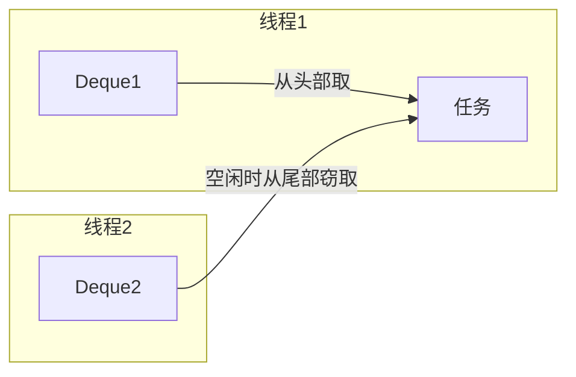


> 🔍 **知识点深度解析**
>
> **作用**：工作窃取算法：每个线程有双端队列，自己的任务从头部取，空闲线程从其他线程队列尾部偷任务。
>
> **原理**：减少线程竞争，提高CPU利用率。
>
> **用法要点**：① 工作窃取算法：每个线程有双端队列，自己的任务从头部取，空闲线程从其他线程队列尾部偷任务 ② 减少线程竞争，提高CPU利用率 ③ ForkJoinPool默认线程数=CPU核数

### 37.3 使用示例

```java
// 有返回值的任务
class SumTask extends RecursiveTask<Long> {
    private final int[] array;
    private final int start;
    private final int end;
    private static final int THRESHOLD = 1000;

    public SumTask(int[] array, int start, int end) {
        this.array = array;
        this.start = start;
        this.end = end;
    }

    @Override
    protected Long compute() {
        if (end - start <= THRESHOLD) {
            // 小任务直接计算
            long sum = 0;
            for (int i = start; i < end; i++) {
                sum += array[i];
            }
            return sum;
        } else {
            // 大任务拆分
            int mid = (start + end) / 2;
            SumTask left = new SumTask(array, start, mid);
            SumTask right = new SumTask(array, mid, end);

            left.fork();   // 异步执行左任务
            right.fork();  // 异步执行右任务

            return left.join() + right.join();  // 等待并合并结果
        }
    }
}

// 使用
ForkJoinPool pool = new ForkJoinPool();
long result = pool.invoke(new SumTask(array, 0, array.length));
```

```java
// 无返回值的任务
class PrintTask extends RecursiveAction {
    private final int[] array;
    private final int start;
    private final int end;

    @Override
    protected void compute() {
        if (end - start <= 100) {
            for (int i = start; i < end; i++) {
                System.out.println(array[i]);
            }
        } else {
            int mid = (start + end) / 2;
            invokeAll(new PrintTask(array, start, mid),
                      new PrintTask(array, mid, end));
        }
    }
}
```


> 🔍 **知识点深度解析**
>
> **作用**：使用示例：继承RecursiveTask<Long>，compute()方法判断任务大小（小于阈值直接计算，否则fork两个子任务，join合并结果）。
>
> **原理**：ForkJoinPool.invoke(task)执行。
>
> **用法要点**：① 使用示例：继承RecursiveTask<Long>，compute()方法判断任务大小（小于阈值直接计算，否则fork两个子任务，join合并结果） ② ForkJoinPool.invoke(task)执行 ③ 阈值根据任务特性调整

### 37.4 注意事项

- 适合 CPU 密集型任务
- 任务不能有阻塞 IO
- 合理设置任务阈值
- 不要在 ForkJoinTask 中使用 synchronized
- 避免任务粒度太细（线程切换开销）

---

> 💡 **深度讲解**：Fork/Join 框架是 Java 7 引入的并行计算框架，核心思想是分治算法，将大任务拆分为小任务并行执行，最后合并结果。核心类是 ForkJoinPool（线程池）和 ForkJoinTask（任务，有返回值用 RecursiveTask，无返回值用 RecursiveAction）。工作窃取算法是 ForkJoinPool 的亮点：每个线程有自己的双端队列（Deque），线程从自己队列的头部取任务，空闲线程从其他线程队列的尾部"窃取"任务，这样减少了线程竞争，提高了 CPU 利用率。ForkJoinPool 默认线程数等于 CPU 核心数，适合 CPU 密集型任务，不适合有阻塞 IO 的任务（会占用线程导致其他任务无法执行）。使用时要合理设置任务阈值，阈值太大并行度不够，阈值太小线程切换开销大。Java 8 的 parallelStream 底层就是 ForkJoinPool，所以 parallelStream 也不适合 IO 密集型任务。注意不要在 ForkJoinTask 中使用 synchronized，会严重影响性能。
>
> **📝 精简总结**：Fork/Join 分治算法，大任务拆小任务并行执行；工作窃取算法空闲线程从其他队列尾部偷任务，减少竞争；适合 CPU 密集型，不适合阻塞 IO；RecursiveTask 有返回值，RecursiveAction 无返回值；parallelStream 底层就是 ForkJoinPool。

---

## 38. 并发陷阱总结

<div style="background:linear-gradient(135deg,#ff9a9e,#fecfef);border-radius:16px;padding:20px;margin:16px 0;font-family:-apple-system,'Segoe UI','PingFang SC','Microsoft YaHei',sans-serif;color:#1a1a2e;overflow:hidden;box-shadow:0 6px 20px rgba(0,0,0,.08),0 2px 6px rgba(0,0,0,.04)">
<style>@keyframes deadlock{0%,100%{transform:rotate(0deg)}25%{transform:rotate(2deg)}75%{transform:rotate(-2deg)}}@keyframes waitRing{0%,100%{opacity:.4}50%{opacity:1}}.dl-thread{display:inline-block;width:44%;vertical-align:top;margin:0 2%;background:rgba(255,255,255,.35);border-radius:8px;box-shadow:0 2px 8px rgba(0,0,0,.08);padding:10px;text-align:center;font-size:11px;animation:deadlock 3s ease-in-out infinite}.dl-lock{background:#e63946;color:#fff;border-radius:4px;padding:3px 8px;margin:4px auto;font-weight:700;font-size:11px;max-width:100px;animation:waitRing 1.5s ease-in-out infinite}.dl-cond{display:inline-block;background:rgba(255,255,255,.3);border-radius:4px;box-shadow:0 2px 8px rgba(0,0,0,.08);padding:3px 8px;margin:2px;font-size:10px;font-weight:600}</style>
<div style="text-align:center;font-size:15px;font-weight:700;margin-bottom:14px;padding-bottom:10px;border-bottom:1.5px solid rgba(255,255,255,.22);letter-spacing:1px;text-shadow:0 1px 3px rgba(0,0,0,.12)">死锁四条件与线程等待环</div>
<div style="text-align:center">
<div class="dl-thread"><b>线程 A</b><div class="dl-lock">持有锁 1</div><div style="margin:4px 0">等待锁 2 ↓</div></div>
<div class="dl-thread"><b>线程 B</b><div class="dl-lock">持有锁 2</div><div style="margin:4px 0">等待锁 1 ↑</div></div>
</div>
<div style="text-align:center;margin-top:8px;font-size:11px">
<span class="dl-cond">①互斥</span><span class="dl-cond">②持有并等待</span><span class="dl-cond">③不可剥夺</span><span class="dl-cond">④循环等待</span>
</div>
<div style="text-align:center;font-size:10px;opacity:.7;margin-top:6px">破坏任一条件即可避免死锁：按固定顺序加锁、tryLock 超时、避免嵌套锁</div>
</div>


> 🔍 **知识点深度解析**
>
> **作用**：注意事项：适合CPU密集型，不适合IO密集（线程阻塞浪费）；。
>
> **原理**：fork后尽快join（避免任务堆积）；。
>
> **用法要点**：① 注意事项：适合CPU密集型，不适合IO密集（线程阻塞浪费） ② 任务不要用synchronized（影响窃取） ③ fork后尽快join（避免任务堆积） ④ 阈值设置影响性能（太小开销大，太大并行度低）

### 38.1 常见并发问题

| 问题 | 说明 | 解决方案 |
|------|------|---------|
| 竞态条件 | 多线程同时修改共享数据 | 加锁、原子类 |
| 死锁 | 线程互相等待对方释放锁 | 避免嵌套锁、定时锁、按顺序加锁 |
| 活锁 | 线程不断重试但无法进展 | 加入随机延迟 |
| 饥饿 | 线程长期得不到资源 | 公平锁、增加资源 |
| 伪共享 | 多个线程修改同一缓存行的不同变量 | 缓存行填充、@Contended |
| 内存泄漏 | ThreadLocal 未清理 | finally 中 remove |


> 🔍 **知识点深度解析**
>
> **作用**：常见并发问题：竞态条件（数据不一致）。
>
> **原理**：死锁（互相等待锁）、活锁（不断重试但无法进展）。
>
> **用法要点**：① 常见并发问题：竞态条件（数据不一致） ② 死锁（互相等待锁）、活锁（不断重试但无法进展） ③ 饥饿（线程长期得不到资源） ④ 线程安全发布（对象未完全构造就被其他线程访问）

### 38.2 死锁的四个必要条件

1. **互斥**：资源一次只能被一个线程持有
2. **持有并等待**：持有资源的同时等待其他资源
3. **不可剥夺**：资源不能被强制剥夺
4. **循环等待**：线程间形成循环等待链

**破坏任一条件即可避免死锁**：
- 按固定顺序获取锁（破坏循环等待）
- 尝试获取锁时设置超时（破坏持有并等待）
- 使用 tryLock（破坏不可剥夺）


> 🔍 **知识点深度解析**
>
> **作用**：死锁四个必要条件：互斥（资源独占）、持有并等待（持有一个资源等另一个）、不可剥夺（资源不能被抢占）、循环等待（线程间形成循环等待链）。
>
> **原理**：破坏任一条件即可避免死锁。
>
> **用法要点**：① 死锁四个必要条件：互斥（资源独占）、持有并等待（持有一个资源等另一个）、不可剥夺（资源不能被抢占）、循环等待（线程间形成循环等待链） ② 破坏任一条件即可避免死锁

### 38.3 死锁示例与避免

```java
// 死锁示例
public class DeadLock {
    private static final Object lockA = new Object();
    private static final Object lockB = new Object();

    public static void main(String[] args) {
        new Thread(() -> {
            synchronized (lockA) {
                Thread.sleep(100);
                synchronized (lockB) {  // 等待 lockB
                    // ...
                }
            }
        }).start();

        new Thread(() -> {
            synchronized (lockB) {
                Thread.sleep(100);
                synchronized (lockA) {  // 等待 lockA
                    // ...
                }
            }
        }).start();
    }
}

// 避免：按固定顺序获取锁
// 两个线程都先获取 lockA，再获取 lockB
```


> 🔍 **知识点深度解析**
>
> **作用**：死锁避免：固定锁顺序（所有线程按相同顺序获取锁）、超时放弃（tryLock超时）、减少锁粒度、用并发容器替代手动锁。
>
> **原理**：检测：jstack线程栈看BLOCKED状态，Arthas的thread命令。
>
> **用法要点**：① 死锁避免：固定锁顺序（所有线程按相同顺序获取锁）、超时放弃（tryLock超时）、减少锁粒度、用并发容器替代手动锁 ② 检测：jstack线程栈看BLOCKED状态，Arthas的thread命令

### 38.4 并发编程最佳实践

1. **优先使用并发容器**，而非自己加锁
2. **优先使用原子类**，而非 synchronized
3. **优先使用线程池**，而非手动创建线程
4. **缩小锁的范围**，只在必要时加锁
5. **避免在锁中执行耗时操作**（如 IO）
6. **使用 volatile 修饰状态标志位**
7. **ThreadLocal 使用后必须 remove**
8. **任务异常要处理**，不要被吞掉
9. **合理设置线程池参数**，避免 OOM
10. **优先使用不可变对象**（天生线程安全）

---

> 💡 **深度讲解**：并发编程陷阱多，常见问题包括竞态条件、死锁、活锁、饥饿、伪共享、内存泄漏。死锁是最经典的问题，四个必要条件：互斥、持有并等待、不可剥夺、循环等待，破坏任一条件即可避免。最实用的避免方法是按固定顺序获取锁（破坏循环等待）、使用 tryLock 超时（破坏持有并等待和不可剥夺）。活锁是线程不断重试但无法进展（如两个线程都释放锁后又立即获取），解决方案是加入随机延迟。饥饿是线程长期得不到资源（如非公平锁下弱优先级线程一直抢不到），用公平锁解决。伪共享是多个线程修改同一缓存行（64字节）的不同变量，导致缓存频繁失效，解决方案是缓存行填充或 @Contended 注解。并发最佳实践总结：优先用并发容器而非自己加锁、优先用原子类而非 synchronized、优先用线程池而非手动创建线程、缩小锁范围、避免锁中 IO、ThreadLocal 必须 remove、任务异常必须处理、优先用不可变对象。
>
> **📝 精简总结**：死锁四条件（互斥/持有并等待/不可剥夺/循环等待），按固定顺序加锁或 tryLock 超时可避免；活锁加随机延迟，饥饿用公平锁，伪共享用缓存行填充；并发最佳实践：并发容器>原子类>锁，缩小锁范围，ThreadLocal 必 remove。

---

# 第四篇：JVM 与性能调优

> **本篇导言**：本篇涵盖 JVM 内存结构、垃圾回收机制、类加载机制以及性能调优与诊断工具，是 Java 中高级开发者和面试的核心内容。包括运行时数据区（堆、栈、方法区、程序计数器、本地方法栈）、栈帧结构、对象创建与内存布局、可达性分析与四种引用、GC 算法与分代收集、主流垃圾收集器（CMS/G1/ZGC）、类加载五阶段与双亲委派模型、JVM 参数配置、命令行诊断工具（jps/jstat/jinfo/jmap/jstack）、可视化工具（JConsole/VisualVM/MAT/Arthas）以及 JMH 性能基准测试。建议结合实际问题理解，重点掌握 GC 调优和内存泄漏排查。

---

## 39. JVM 内存结构


> 🔍 **知识点深度解析**
>
> **作用**：并发编程最佳实践：优先用并发容器和工具类，减少手动同步；。
>
> **原理**：缩小锁范围（只锁必要代码）；。
>
> **用法要点**：① 并发编程最佳实践：优先用并发容器和工具类，减少手动同步 ② 缩小锁范围（只锁必要代码） ③ 避免锁嵌套（固定顺序） ④ 用不可变对象（线程安全） ⑤ 正确关闭线程池 ⑥ 代码review关注并发

### 39.1 运行时数据区

<div style="background:linear-gradient(135deg,#84fab0,#8fd3f4);border-radius:16px;padding:20px;margin:16px 0;font-family:-apple-system,'Segoe UI','PingFang SC','Microsoft YaHei',sans-serif;color:#1a1a2e;overflow:hidden;box-shadow:0 6px 20px rgba(0,0,0,.08),0 2px 6px rgba(0,0,0,.04)">
<style>@keyframes jvmPulse{0%,100%{transform:scale(1);opacity:.85}50%{transform:scale(1.02);opacity:1}}.jvm-shared{background:rgba(255,255,255,.4);border:2px solid #2d6a4f;border-radius:8px;padding:10px;margin-bottom:8px;animation:jvmPulse 3s ease-in-out infinite}.jvm-private{display:inline-block;width:30%;vertical-align:top;margin:0 1%;background:rgba(255,255,255,.35);border:2px solid #457b9d;border-radius:8px;padding:8px;font-size:11px;animation:jvmPulse 3s ease-in-out infinite}.jvm-private:nth-child(2){animation-delay:.5s}.jvm-private:nth-child(3){animation-delay:1s}.jvm-area{background:rgba(255,255,255,.3);border-radius:4px;box-shadow:0 2px 8px rgba(0,0,0,.08);padding:4px 8px;margin:3px 0;font-size:11px}.jvm-tag{display:inline-block;font-weight:700;font-size:10px;padding:1px 5px;border-radius:3px;color:#fff;margin-right:4px}</style>
<div style="text-align:center;font-size:15px;font-weight:700;margin-bottom:14px;padding-bottom:10px;border-bottom:1.5px solid rgba(255,255,255,.22);letter-spacing:1px;text-shadow:0 1px 3px rgba(0,0,0,.12)">JVM 运行时数据区</div>
<div class="jvm-shared"><span class="jvm-tag" style="background:#2d6a4f">线程共享</span><div class="jvm-area"><b>堆（Heap）</b> — 对象实例、数组，GC 主要区域，分新生代/老年代</div><div class="jvm-area"><b>方法区/元空间</b> — 类信息、常量、静态变量、JIT 编译代码（Java 8+ 元空间在本地内存）</div></div>
<div style="text-align:center">
<div class="jvm-private"><span class="jvm-tag" style="background:#457b9d">线程私有</span><div class="jvm-area"><b>虚拟机栈</b><br>栈帧：局部变量表、操作数栈、动态链接、返回地址</div></div>
<div class="jvm-private"><span class="jvm-tag" style="background:#457b9d">线程私有</span><div class="jvm-area"><b>程序计数器</b><br>当前线程执行的字节码行号指示器，唯一无 OOM 的区域</div></div>
<div class="jvm-private"><span class="jvm-tag" style="background:#457b9d">线程私有</span><div class="jvm-area"><b>本地方法栈</b><br>为 Native 方法服务，HotSpot 与虚拟机栈合二为一</div></div>
</div>
</div>

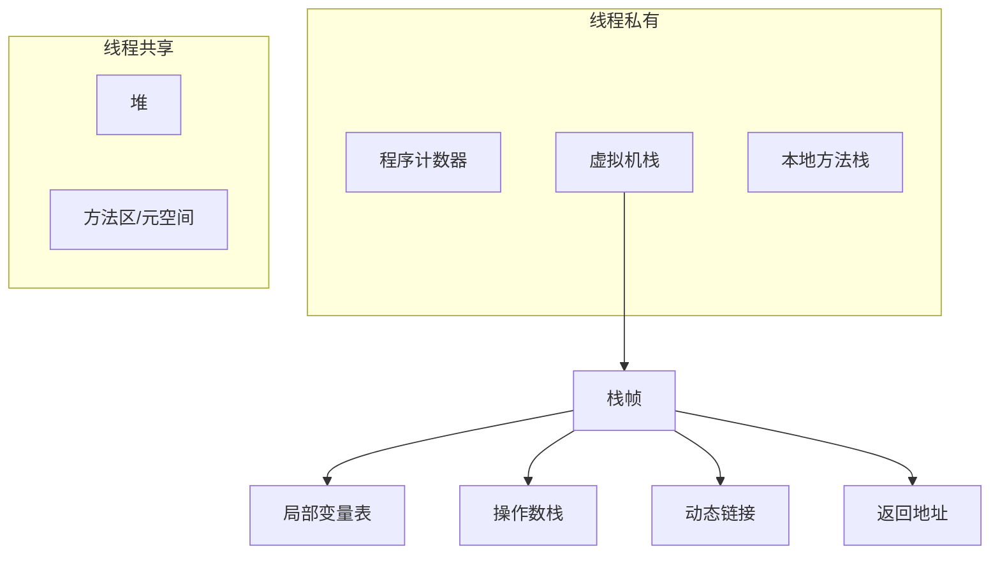

| 区域 | 线程 | 作用 | 异常 |
|------|------|------|------|
| 程序计数器 | 私有 | 当前线程执行的字节码行号指示器 | 无 |
| 虚拟机栈 | 私有 | 存储栈帧（局部变量表、操作数栈等） | StackOverflowError / OutOfMemoryError |
| 本地方法栈 | 私有 | 为 Native 方法服务 | StackOverflowError / OutOfMemoryError |
| 堆 | 共享 | 存储对象实例，GC 主要区域 | OutOfMemoryError |
| 方法区 | 共享 | 存储类信息、常量、静态变量、JIT 代码 | OutOfMemoryError |


> 🔍 **知识点深度解析**
>
> **作用**：运行时数据区：堆（对象实例。
>
> **原理**：GC主要区域、线程共享）、方法区/元空间（类信息/常量/静态变量。
>
> **用法要点**：① 运行时数据区：堆（对象实例 ② GC主要区域、线程共享）、方法区/元空间（类信息/常量/静态变量 ③ Java 8后元空间在本地内存） ④ 虚拟机栈（栈帧、线程私有） ⑤ 本地方法栈、程序计数器（线程私有、唯一无OOM）

### 39.2 虚拟机栈与栈帧

每个方法调用创建一个栈帧，栈帧包含：

| 组成 | 说明 |
|------|------|
| 局部变量表 | 存储方法参数和局部变量，槽位（slot）为单位 |
| 操作数栈 | 字节码指令的操作数入栈/出栈 |
| 动态链接 | 运行时常量池的方法引用解析 |
| 返回地址 | 方法返回后恢复调用者状态 |

```java
public int add(int a, int b) {
    int c = a + b;
    return c;
}
// 局部变量表：[this, a, b, c]
// 操作数栈：a 入栈 → b 入栈 → 相加 → c 入栈 → 返回
```


> 🔍 **知识点深度解析**
>
> **作用**：虚拟机栈与栈帧：每个方法调用创建栈帧，含局部变量表（基本类型和引用，slot存储）、操作数栈（计算临时数据）、动态链接（符号引用转直接引用）、方法返回地址。
>
> **原理**：方法执行完栈帧出栈。
>
> **用法要点**：① 虚拟机栈与栈帧：每个方法调用创建栈帧，含局部变量表（基本类型和引用，slot存储）、操作数栈（计算临时数据）、动态链接（符号引用转直接引用）、方法返回地址 ② 方法执行完栈帧出栈

### 39.3 堆内存

**堆的分代（Java 8 及之前）**：

```
堆（Heap）
├── 新生代（Young Generation）
│   ├── Eden 区
│   ├── Survivor 0（From）
│   └── Survivor 1（To）
└── 老年代（Old Generation）
```

**默认比例**：
- 新生代 : 老年代 = 1 : 2
- Eden : Survivor = 8 : 1 : 1

**Java 8+ 元空间**：
- 方法区的实现从永久代（PermGen）改为元空间（Metaspace）
- 元空间使用本地内存，不受堆大小限制
- 避免了永久代 OOM 问题


> 🔍 **知识点深度解析**
>
> **作用**：堆内存：所有线程共享，存放对象实例。
>
> **原理**：OOM（OutOfMemoryError）当堆满且无法回收。
>
> **用法要点**：① 堆内存：所有线程共享，存放对象实例 ② 分代（新生代Eden+S0+S1，老年代） ③ -Xms初始大小，-Xmx最大大小（生产设相同避免扩容） ④ OOM（OutOfMemoryError）当堆满且无法回收

### 39.4 对象创建过程

<div style="background:linear-gradient(135deg,#84fab0,#8fd3f4);border-radius:16px;padding:20px;margin:16px 0;font-family:-apple-system,'Segoe UI','PingFang SC','Microsoft YaHei',sans-serif;color:#1a1a2e;overflow:hidden;box-shadow:0 6px 20px rgba(0,0,0,.08),0 2px 6px rgba(0,0,0,.04)">
<style>@keyframes objStep{0%{opacity:0;transform:translateX(-6px)}12%{opacity:1;transform:translateX(0)}88%{opacity:1}100%{opacity:.35}}.obj-step{background:rgba(255,255,255,.35);border-left:4px solid #e63946;border-radius:8px;padding:6px 10px;margin:4px 0;font-size:11px;font-weight:600;box-shadow:0 1px 4px rgba(0,0,0,.06);animation:objStep 5s ease-in-out infinite}.obj-step:nth-child(2){animation-delay:.6s}.obj-step:nth-child(3){animation-delay:1.2s}.obj-step:nth-child(4){animation-delay:1.8s}.obj-step:nth-child(5){animation-delay:2.4s}.obj-num{display:inline-block;background:#2d6a4f;color:#fff;border-radius:50%;width:18px;height:18px;text-align:center;line-height:18px;font-size:10px;font-weight:700;margin-right:6px}</style>
<div style="text-align:center;font-size:15px;font-weight:700;margin-bottom:14px;padding-bottom:10px;border-bottom:1.5px solid rgba(255,255,255,.22);letter-spacing:1px;text-shadow:0 1px 3px rgba(0,0,0,.12)">JVM 对象创建 5 步流程</div>
<div class="obj-step"><span class="obj-num">1</span>类加载检查 — 遇到 new 指令，检查类是否已加载、验证、准备、解析、初始化</div>
<div class="obj-step"><span class="obj-num">2</span>分配内存 — 堆中分配对象大小的内存（指针碰撞/空闲列表），并发安全用 CAS+重试 或 TLAB</div>
<div class="obj-step"><span class="obj-num">3</span>初始化零值 — 所有字段设为默认值（0/null/false），保证对象不初始化也可使用</div>
<div class="obj-step"><span class="obj-num">4</span>设置对象头 — Mark Word（哈希码/GC分代年龄/锁标志）+ 类型指针（指向类元数据）</div>
<div class="obj-step"><span class="obj-num">5</span>执行 init — 调用构造方法 &lt;init&gt;，按代码初始化字段和执行构造逻辑</div>
</div>

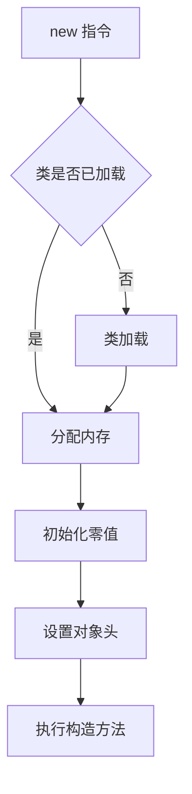

1. **类加载检查**：检查类是否已加载、解析、初始化
2. **分配内存**：
   - 指针碰撞（Bump the Pointer）：内存规整时使用
   - 空闲列表（Free List）：内存不规整时使用
   - 线程安全：TLAB（Thread Local Allocation Buffer）或 CAS
3. **初始化零值**：所有字段设为默认值（0、null、false）
4. **设置对象头**：Mark Word、类型指针、数组长度
5. **执行构造方法**：`<init>` 方法


> 🔍 **知识点深度解析**
>
> **作用**：对象创建：类加载检查→分配内存（指针碰撞/空闲列表，TLAB减少竞争）→初始化零值→设置对象头（MarkWord/类型指针）→执行<init>构造器。
>
> **原理**：JVM在new指令时触发对象创建，通过指针碰撞或空闲列表在堆中分配内存，TLAB（Thread Local Allocation Buffer）减少多线程分配竞争，对象头存储MarkWord（哈希/GC分代/锁信息）和类型指针，最后执行构造器初始化。
>
> **用法要点**：① 对象创建：类加载检查→分配内存（指针碰撞/空闲列表，TLAB减少竞争）→初始化零值→设置对象头（MarkWord/类型指针）→执行<init>构造器

### 39.5 对象内存布局

对象在内存中分为三部分：

| 部分 | 说明 |
|------|------|
| 对象头（Header） | Mark Word（哈希码、GC分代年龄、锁状态）+ 类型指针（Klass Pointer） |
| 实例数据（Instance Data） | 对象的字段值 |
| 对齐填充（Padding） | 保证对象大小是 8 字节的整数倍 |

**Mark Word（64位）**：

| 锁状态 | 25bit | 31bit | 1bit | 4bit | 1bit | 2bit |
|--------|-------|-------|------|------|------|------|
| 无锁 | unused | hashCode | unused | 分代年龄 | 0 | 01 |
| 偏向锁 | 线程ID | Epoch | unused | 分代年龄 | 1 | 01 |
| 轻量级锁 | 指向栈中锁记录的指针 | | | | | 00 |
| 重量级锁 | 指向重量级锁的指针 | | | | | 10 |
| GC标记 | empty | | | | | 11 |


> 🔍 **知识点深度解析**
>
> **作用**：对象内存布局：对象头（MarkWord：哈希/GC分代/锁状态；。
>
> **原理**：64位JVM开启指针压缩。
>
> **用法要点**：① 对象内存布局：对象头（MarkWord：哈希/GC分代/锁状态 ② 类型指针：指向类元数据 ③ 数组长度）、实例数据（字段值，对齐重排）、对齐填充（8字节对齐） ④ 64位JVM开启指针压缩

### 39.6 对象访问方式

**句柄访问**：
- 堆中维护句柄池，reference 指向句柄
- 句柄包含对象实例数据指针和类型数据指针
- 优点：对象移动时只需修改句柄中的指针

**直接指针访问（HotSpot 默认）**：
- reference 直接指向对象
- 对象头中包含类型指针
- 优点：速度快，少一次指针定位

---

> 💡 **深度讲解**：JVM 运行时数据区分为线程共享区（堆、方法区/元空间）和线程私有区（虚拟机栈、本地方法栈、程序计数器）。堆是对象存储的主要区域，也是 GC 的主战场，分为新生代（Eden+S0+S1，默认比例8:1:1）和老年代。虚拟机栈每个方法调用创建一个栈帧，包含局部变量表、操作数栈、动态链接、返回地址，栈深度过深会抛 StackOverflowError，栈空间不足会 OOM。程序计数器是唯一不会 OOM 的区域，记录当前线程执行的字节码行号。对象创建过程：类加载检查→分配内存（指针碰撞或空闲列表，线程安全用 TLAB 或 CAS）→初始化零值→设置对象头（Mark Word+类型指针）→执行构造方法。对象内存布局三部分：对象头（Mark Word 存哈希码/GC年龄/锁状态，类型指针指向 Klass）、实例数据、对齐填充（8字节对齐）。Mark Word 是理解 synchronized 锁升级的关键，不同锁状态下 Mark Word 存储内容不同。对象访问方式 HotSpot 默认直接指针（快），句柄访问（对象移动时只需改句柄指针）。
>
> **📝 精简总结**：JVM 数据区：堆/方法区线程共享，栈/PC/本地方法栈线程私有；堆分新生代(Eden8:S1:S1)和老年代；对象创建5步：加载检查→分配内存→零值初始化→设置对象头→构造方法；对象头 Mark Word 是锁升级关键；HotSpot 默认直接指针访问。

---

## 40. 垃圾回收机制


> 🔍 **知识点深度解析**
>
> **作用**：对象访问：句柄访问（堆中句柄池。
>
> **原理**：reference指向句柄。
>
> **用法要点**：① 对象访问：句柄访问（堆中句柄池 ② reference指向句柄 ③ 对象移动不改变reference） ④ 直接指针（HotSpot用 ⑤ reference直接指向对象 ⑥ 速度快、少一次指针定位）

### 40.1 判断对象是否可回收

<div style="background:linear-gradient(135deg,#84fab0,#8fd3f4);border-radius:16px;padding:20px;margin:16px 0;font-family:-apple-system,'Segoe UI','PingFang SC','Microsoft YaHei',sans-serif;color:#1a1a2e;overflow:hidden;box-shadow:0 6px 20px rgba(0,0,0,.08),0 2px 6px rgba(0,0,0,.04)">
<style>@keyframes gcMark{0%,100%{opacity:.4}50%{opacity:1}}.gc-root{background:#2d6a4f;color:#fff;border-radius:6px;padding:5px 10px;font-weight:700;font-size:11px;display:inline-block;margin:2px;animation:gcMark 2s ease-in-out infinite}.gc-obj{background:rgba(255,255,255,.4);border-radius:4px;box-shadow:0 2px 8px rgba(0,0,0,.08);padding:3px 8px;font-size:10px;display:inline-block;margin:2px}.gc-alive{border:2px solid #2d6a4f}.gc-dead{border:2px dashed #dc3545;opacity:.5;text-decoration:line-through}.gc-arrow{color:#2d6a4f;font-weight:700;margin:0 2px}</style>
<div style="text-align:center;font-size:15px;font-weight:700;margin-bottom:14px;padding-bottom:10px;border-bottom:1.5px solid rgba(255,255,255,.22);letter-spacing:1px;text-shadow:0 1px 3px rgba(0,0,0,.12)">可达性分析（GC Roots 根搜索算法）</div>
<div style="text-align:center">
<div><span class="gc-root">GC Roots</span></div>
<div style="font-size:10px;margin:4px 0">（虚拟机栈引用、方法区静态变量/常量、本地方法栈引用）</div>
<div class="gc-arrow">↓ 引用链可达 ↓</div>
<div><span class="gc-obj gc-alive">对象A（存活）</span><span class="gc-arrow">→</span><span class="gc-obj gc-alive">对象B（存活）</span></div>
<div style="margin:4px 0"><span class="gc-obj gc-dead">对象C（不可达→回收）</span><span class="gc-obj gc-dead">对象D（循环引用但不可达→回收）</span></div>
</div>
<div style="text-align:center;font-size:10px;opacity:.7;margin-top:6px">从 GC Roots 向下搜索，走过的路径为引用链；不可达的对象可回收，解决了引用计数法的循环引用问题</div>
</div>

#### 引用计数法

- 每个对象有一个引用计数器，被引用时 +1，引用失效时 -1
- 计数器为 0 时可回收
- **缺点**：无法解决循环引用问题

#### 可达性分析算法（HotSpot 使用）

- 从 GC Roots 开始搜索，可达的对象存活，不可达的可回收
- GC Roots 包括：
  - 虚拟机栈中引用的对象
  - 本地方法栈中引用的对象
  - 方法区中静态变量引用的对象
  - 方法区中常量引用的对象
  - 被 synchronized 锁持有的对象

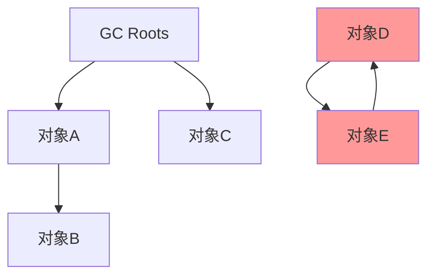

对象 D 和 E 互相引用，但不可达 GC Roots，可被回收。


> 🔍 **知识点深度解析**
>
> **作用**：判断对象可回收：引用计数法（循环引用问题，不用）、可达性分析（GC Roots出发，不可达对象可回收）。
>
> **原理**：GC Roots：虚拟机栈引用、方法区静态/常量引用、本地方法栈JNI引用。
>
> **用法要点**：① 判断对象可回收：引用计数法（循环引用问题，不用）、可达性分析（GC Roots出发，不可达对象可回收） ② GC Roots：虚拟机栈引用、方法区静态/常量引用、本地方法栈JNI引用 ③ 两次标记才回收

### 40.2 四种引用

<div style="background:linear-gradient(135deg,#ff9a9e,#fecfef);border-radius:16px;padding:20px;margin:16px 0;font-family:-apple-system,'Segoe UI','PingFang SC','Microsoft YaHei',sans-serif;color:#1a1a2e;overflow:hidden;box-shadow:0 6px 20px rgba(0,0,0,.08),0 2px 6px rgba(0,0,0,.04)">
<style>@keyframes refLevel{0%,100%{transform:scale(1);opacity:.85}50%{transform:scale(1.03);opacity:1}}.ref-item{background:rgba(255,255,255,.35);border-radius:6px;box-shadow:0 2px 8px rgba(0,0,0,.08);padding:5px 10px;margin:4px 0;font-size:11px;animation:refLevel 3s ease-in-out infinite;border-left:4px solid}.ref-item:nth-child(2){animation-delay:.5s}.ref-item:nth-child(3){animation-delay:1s}.ref-item:nth-child(4){animation-delay:1.5s}.ref-strong{border-color:#dc3545}.ref-soft{border-color:#f59e0b}.ref-weak{border-color:#28a745}.ref-phantom{border-color:#6c5ce7}.ref-tag{display:inline-block;font-weight:700;font-size:10px;padding:1px 5px;border-radius:3px;color:#fff;margin-right:4px}</style>
<div style="text-align:center;font-size:15px;font-weight:700;margin-bottom:14px;padding-bottom:10px;border-bottom:1.5px solid rgba(255,255,255,.22);letter-spacing:1px;text-shadow:0 1px 3px rgba(0,0,0,.12)">Java 四种引用类型（回收强度递减）</div>
<div class="ref-item ref-strong"><span class="ref-tag" style="background:#dc3545">强引用</span>Object o = new Object() — 从不回收，OOM 也不回收</div>
<div class="ref-item ref-soft"><span class="ref-tag" style="background:#f59e0b">软引用</span>SoftReference — 内存不足（OOM 前）回收，适合内存敏感缓存</div>
<div class="ref-item ref-weak"><span class="ref-tag" style="background:#28a745">弱引用</span>WeakReference — 下次 GC 时回收，ThreadLocal key 用此</div>
<div class="ref-item ref-phantom"><span class="ref-tag" style="background:#6c5ce7">虚引用</span>PhantomReference — 任何时候都可能回收，必须配合 ReferenceQueue，用于堆外内存回收</div>
</div>

| 引用类型 | 说明 | 回收时机 | 用途 |
|---------|------|---------|------|
| 强引用（Strong） | 普通引用 | 不回收 | 普通对象 |
| 软引用（SoftReference） | 内存不足时回收 | OOM 前 | 缓存 |
| 弱引用（WeakReference） | 下次 GC 时回收 | GC 时 | 缓存、ThreadLocal key |
| 虚引用（PhantomReference） | 任何时候都可能回收 | 随时 | 管理堆外内存 |

```java
// 软引用
SoftReference<byte[]> softRef = new SoftReference<>(new byte[1024]);

// 弱引用
WeakReference<User> weakRef = new WeakReference<>(new User());

// 虚引用（必须配合 ReferenceQueue）
ReferenceQueue<Object> queue = new ReferenceQueue<>();
PhantomReference<Object> phantomRef = new PhantomReference<>(new Object(), queue);
```


> 🔍 **知识点深度解析**
>
> **作用**：四种引用：强引用（默认、OOM也不回收）。
>
> **原理**：OOM前回收、缓存用）、弱引用（WeakReference。
>
> **用法要点**：① 四种引用：强引用（默认、OOM也不回收） ② 软引用（SoftReference ③ OOM前回收、缓存用）、弱引用（WeakReference ④ 下次GC必回收、ThreadLocal key用） ⑤ 虚引用（PhantomReference ⑥ 跟踪回收、堆外内存管理）

### 40.3 GC 算法

<div style="background:linear-gradient(135deg,#84fab0,#8fd3f4);border-radius:16px;padding:20px;margin:16px 0;font-family:-apple-system,'Segoe UI','PingFang SC','Microsoft YaHei',sans-serif;color:#1a1a2e;overflow:hidden;box-shadow:0 6px 20px rgba(0,0,0,.08),0 2px 6px rgba(0,0,0,.04)">
<style>@keyframes gcAlgo{0%,100%{transform:scale(1);opacity:.85}50%{transform:scale(1.03);opacity:1}}.algo-item{display:inline-block;width:23%;vertical-align:top;margin:0 1%;background:rgba(255,255,255,.35);border-radius:8px;box-shadow:0 2px 8px rgba(0,0,0,.08);padding:8px;font-size:10px;text-align:center;animation:gcAlgo 3s ease-in-out infinite}.algo-item:nth-child(2){animation-delay:.5s}.algo-item:nth-child(3){animation-delay:1s}.algo-item:nth-child(4){animation-delay:1.5s}.algo-name{font-weight:700;font-size:11px;color:#2d6a4f;margin-bottom:2px}.algo-pro{font-size:9px;color:#28a745}.algo-con{font-size:9px;color:#dc3545}</style>
<div style="text-align:center;font-size:15px;font-weight:700;margin-bottom:14px;padding-bottom:10px;border-bottom:1.5px solid rgba(255,255,255,.22);letter-spacing:1px;text-shadow:0 1px 3px rgba(0,0,0,.12)">四种垃圾回收算法对比</div>
<div style="text-align:center">
<div class="algo-item"><div class="algo-name">标记-清除</div><div style="font-size:9px;margin:4px 0">标记可达→清除未标记</div><div class="algo-pro">简单</div><div class="algo-con">内存碎片</div></div>
<div class="algo-item"><div class="algo-name">复制算法</div><div style="font-size:9px;margin:4px 0">存活对象复制到另一半</div><div class="algo-pro">无碎片，快</div><div class="algo-con">浪费空间</div></div>
<div class="algo-item"><div class="algo-name">标记-整理</div><div style="font-size:9px;margin:4px 0">标记后存活对象向一端移动</div><div class="algo-pro">无碎片</div><div class="algo-con">需要移动对象</div></div>
<div class="algo-item"><div class="algo-name">分代收集</div><div style="font-size:9px;margin:4px 0">新生代复制，老年代整理</div><div class="algo-pro">各代最优</div><div class="algo-con">主流方案</div></div>
</div>
</div>

#### 标记-清除（Mark-Sweep）

- 标记：从 GC Roots 标记所有可达对象
- 清除：回收未标记的对象
- **缺点**：产生内存碎片

#### 标记-复制（Mark-Copy）

- 将内存分为两块，每次只用一块
- 存活对象复制到另一块，清空当前块
- **优点**：无内存碎片，实现简单
- **缺点**：内存利用率低（只用一半）
- **应用**：新生代（Eden + Survivor）

#### 标记-整理（Mark-Compact）

- 标记存活对象
- 将存活对象向一端移动，清理边界外内存
- **优点**：无内存碎片
- **缺点**：需要移动对象，开销大
- **应用**：老年代


> 🔍 **知识点深度解析**
>
> **作用**：GC算法：标记-清除（碎片）。
>
> **原理**：标记-复制（无碎片、空间浪费。
>
> **用法要点**：① GC算法：标记-清除（碎片） ② 标记-复制（无碎片、空间浪费 ③ 新生代用）、标记-整理（无碎片 ④ 移动对象慢、老年代用）、分代收集（新生代复制、老年代标记整理/清除）

### 40.4 分代收集

<div style="background:linear-gradient(135deg,#ff9a9e,#fecfef,#a18cd1);border-radius:12px;padding:20px;margin:16px 0;font-family:-apple-system,'Segoe UI','PingFang SC',sans-serif;color:#1a1a2e;overflow:hidden">
<style>@keyframes gcFlow{0%{transform:translateX(0);opacity:.7}50%{transform:translateX(6px);opacity:1}100%{transform:translateX(0);opacity:.7}}@keyframes gcSweep{0%,100%{background-position:0% 50%}50%{background-position:100% 50%}}.gc-heap{background:rgba(255,255,255,.35);border-radius:8px;box-shadow:0 2px 8px rgba(0,0,0,.08);padding:10px;margin-bottom:8px}.gc-gen{display:inline-block;height:40px;border-radius:4px;vertical-align:middle;text-align:center;line-height:40px;font-size:10px;font-weight:700;color:#fff;margin:2px;animation:gcFlow 3s ease-in-out infinite}.gc-eden{width:40%;background:linear-gradient(90deg,#ff6b6b,#ee5a5a)}.gc-s0{width:8%;background:linear-gradient(90deg,#feca57,#ff9f43)}.gc-s1{width:8%;background:linear-gradient(90deg,#48dbfb,#0abde3)}.gc-old{width:38%;background:linear-gradient(90deg,#5f27cd,#341f97)}.gc-step{background:rgba(255,255,255,.3);border-radius:6px;box-shadow:0 2px 8px rgba(0,0,0,.08);padding:5px 10px;margin:4px 0;font-size:11px;animation:gcFlow 4s ease-in-out infinite}.gc-step:nth-child(2){animation-delay:.7s}.gc-step:nth-child(3){animation-delay:1.4s}.gc-step:nth-child(4){animation-delay:2.1s}</style>
<div style="text-align:center;font-size:15px;font-weight:700;margin-bottom:14px;padding-bottom:10px;border-bottom:1.5px solid rgba(255,255,255,.22);letter-spacing:1px;text-shadow:0 1px 3px rgba(0,0,0,.12)">JVM 分代垃圾回收机制</div>
<div class="gc-heap"><div style="font-size:11px;font-weight:600;margin-bottom:4px">堆内存结构（新生代 : 老年代 = 1 : 2）</div><div><span class="gc-gen gc-eden">Eden 8/10</span><span class="gc-gen gc-s0">S0</span><span class="gc-gen gc-s1">S1</span><span class="gc-gen gc-old">老年代 Old</span></div><div style="font-size:10px;opacity:.7;margin-top:4px">Eden:Survivor = 8:1:1，对象优先在 Eden 分配</div></div>
<div class="gc-step">① Minor GC：Eden 满 → 可达性分析 → 存活对象复制到 Survivor（S0/S1 复制算法）</div>
<div class="gc-step">② 对象年龄每经历一次 Minor GC +1，达到阈值（默认15）晋升老年代</div>
<div class="gc-step">③ 大对象直接进入老年代（-XX:PretenureSizeThreshold）</div>
<div class="gc-step">④ Major/Full GC：老年代满 → 标记-清除/标记-整理，STW 时间较长</div>
</div>

**对象晋升规则**：
- 新对象优先在 Eden 分配
- Eden 满时触发 Minor GC，存活对象复制到 Survivor
- 经历 15 次 Minor GC 仍存活，晋升到老年代
- 大对象直接进入老年代（超过阈值）
- Survivor 空间不足时，存活对象直接进入老年代

**GC 类型**：

| 类型 | 区域 | 触发条件 | 停顿 |
|------|------|---------|------|
| Minor GC | 新生代 | Eden 满 | 短 |
| Major GC | 老年代 | 老年代空间不足 | 较长 |
| Full GC | 整个堆 | 老年代满、元空间满、System.gc() | 长 |


> 🔍 **知识点深度解析**
>
> **作用**：分代收集：新生代（Eden+S0+S1，8:1:1，Minor GC，复制算法）、老年代（Major/Full GC，标记整理/清除）。
>
> **原理**：对象优先Eden分配，大对象直接老年代，长期存活（默认15次）晋升老年代。
>
> **用法要点**：① 分代收集：新生代（Eden+S0+S1，8:1:1，Minor GC，复制算法）、老年代（Major/Full GC，标记整理/清除） ② 对象优先Eden分配，大对象直接老年代，长期存活（默认15次）晋升老年代 ③ 空间分配担保

### 40.5 垃圾收集器

<div style="background:linear-gradient(135deg,#667eea,#764ba2);border-radius:16px;padding:20px;margin:16px 0;font-family:-apple-system,'Segoe UI','PingFang SC','Microsoft YaHei',sans-serif;color:#fff;overflow:hidden;box-shadow:0 8px 28px rgba(0,0,0,.14),0 3px 10px rgba(0,0,0,.08)">
<style>@keyframes gcCollector{0%,100%{transform:scale(1);opacity:.85}50%{transform:scale(1.03);opacity:1}}.gc-coll{display:inline-block;width:23%;vertical-align:top;margin:0 1%;background:rgba(255,255,255,.15);border-radius:8px;box-shadow:0 2px 8px rgba(0,0,0,.08);padding:8px;font-size:10px;text-align:center;animation:gcCollector 3s ease-in-out infinite}.gc-coll:nth-child(2){animation-delay:.5s}.gc-coll:nth-child(3){animation-delay:1s}.gc-coll:nth-child(4){animation-delay:1.5s}.gc-coll-name{font-weight:700;font-size:11px;margin-bottom:2px}.gc-coll-desc{font-size:9px;opacity:.85}</style>
<div style="text-align:center;font-size:15px;font-weight:700;margin-bottom:14px;padding-bottom:10px;border-bottom:1.5px solid rgba(255,255,255,.22);letter-spacing:1px;text-shadow:0 1px 3px rgba(0,0,0,.12)">主流垃圾收集器对比</div>
<div style="text-align:center">
<div class="gc-coll"><div class="gc-coll-name">Serial / Serial Old</div><div class="gc-coll-desc">单线程 STW<br>客户端/小内存</div></div>
<div class="gc-coll"><div class="gc-coll-name">Parallel Scavenge</div><div class="gc-coll-desc">多线程吞吐量优先<br>JDK 8 默认</div></div>
<div class="gc-coll"><div class="gc-coll-name">CMS</div><div class="gc-coll-desc">并发标记清除低延迟<br>有内存碎片</div></div>
<div class="gc-coll"><div class="gc-coll-name">G1</div><div class="gc-coll-desc">Region 分区可预测停顿<br>JDK 9+ 默认</div></div>
</div>
<div style="text-align:center;margin-top:6px">
<div class="gc-coll" style="width:48%"><div class="gc-coll-name">ZGC（JDK 11+实验/JDK 15正式）</div><div class="gc-coll-desc">着色指针 + 读屏障，TB 级堆，停顿 &lt;1ms，全并发</div></div>
<div class="gc-coll" style="width:48%"><div class="gc-coll-name">Shenandoah</div><div class="gc-coll-desc">Brooks 指针，全并发，停顿与堆大小无关</div></div>
</div>
</div>

#### 串行收集器

- **Serial**：新生代，标记-复制，单线程
- **Serial Old**：老年代，标记-整理，单线程
- 适用：客户端、内存小的场景

#### 并行收集器（吞吐量优先）

- **Parallel Scavenge**：新生代，标记-复制，多线程
- **Parallel Old**：老年代，标记-整理，多线程
- 目标：达到可控制的吞吐量
- 适用：后台计算、批量处理

```bash
-XX:+UseParallelGC  # 启用 Parallel Scavenge + Parallel Old
-XX:MaxGCPauseMillis=200  # 最大停顿时间
-XX:GCTimeRatio=99  # 吞吐量 = 1/(1+99) = 99%
```

#### CMS 收集器（低延迟）

- Concurrent Mark Sweep，老年代，标记-清除
- 过程：
  1. 初始标记（STW，短）
  2. 并发标记（与用户线程并发）
  3. 重新标记（STW，修正并发标记结果）
  4. 并发清除（与用户线程并发）
- **缺点**：内存碎片、CPU 资源消耗、浮动垃圾

```bash
-XX:+UseConcMarkSweepGC
```

#### G1 收集器（Java 9+ 默认）

- Garbage First，面向服务端
- 将堆分为多个大小相等的 Region
- 可预测停顿时间
- 过程：
  1. 初始标记（STW）
  2. 并发标记
  3. 最终标记（STW）
  4. 筛选回收（STW，按回收价值排序）
- 适用：大堆、低延迟要求

```bash
-XX:+UseG1GC
-XX:MaxGCPauseMillis=200
```

#### ZGC（Java 11+ 实验，Java 15+ 正式）

- 极低延迟（目标 < 10ms）
- 基于着色指针和读屏障
- 支持 TB 级堆
- 几乎全程并发

```bash
-XX:+UseZGC
```

#### 收集器对比

| 收集器 | 新生代 | 老年代 | 特点 | 适用 |
|--------|--------|--------|------|------|
| Serial | 复制 | 标记-整理 | 单线程 | 客户端 |
| Parallel | 复制 | 标记-整理 | 吞吐量优先 | 批量处理 |
| CMS | - | 标记-清除 | 低延迟 | 互联网应用 |
| G1 | 复制 | 标记-整理 | 可预测停顿 | 大堆服务端 |
| ZGC | - | - | 极低延迟 | 超大堆 |


> 🔍 **知识点深度解析**
>
> **作用**：垃圾收集器：Serial（单线程。
>
> **原理**：客户端）、ParNew（多线程。
>
> **用法要点**：① 垃圾收集器：Serial（单线程 ② 客户端）、ParNew（多线程 ③ 配合CMS）、Parallel Scavenge（吞吐量优先） ④ CMS（低停顿、标记清除、有碎片） ⑤ G1（区域化分代、可预测停顿 ⑥ Java 9默认）、ZGC（极低停顿、TB级堆）

### 40.6 GC 日志分析

```bash
# 开启 GC 日志
-XX:+PrintGCDetails
-XX:+PrintGCDateStamps
-Xloggc:gc.log

# Java 9+ 统一日志
-Xlog:gc*:file=gc.log:time,uptime,level,tags
```

**GC 日志示例**：
```
2024-01-01T12:00:00.000+0800: [GC (Allocation Failure) 
[PSYoungGen: 8192K->1024K(9216K)] 8192K->2048K(19456K), 0.005 secs]
[Times: user=0.01 sys=0.00, real=0.01 secs]
```

**分析工具**：
- GCEasy（在线）
- GCViewer
- HPjmeter

---

> 💡 **深度讲解**：垃圾回收是 JVM 最核心的机制之一。判断对象是否可回收有两种算法：引用计数法（简单但无法解决循环引用，Python 用）和可达性分析（从 GC Roots 开始搜索，不可达的对象可回收，Java 用）。GC Roots 包括虚拟机栈引用的对象、方法区静态变量/常量引用的对象、被 synchronized 锁持有的对象。四种引用强度递减：强引用（不回收）、软引用（OOM 前回收，适合缓存）、弱引用（下次 GC 回收，ThreadLocal key 用）、虚引用（随时回收，管理堆外内存）。三种 GC 算法：标记-清除（产生碎片）、标记-复制（无碎片但内存利用率低，新生代用）、标记-整理（无碎片但需移动对象，老年代用）。分代收集是基于"绝大多数对象朝生夕死"的假设，新对象在 Eden，Minor GC 后存活的复制到 Survivor，经历15次 Minor GC 晋升老年代。垃圾收集器：Serial（单线程，客户端）、Parallel（吞吐量优先，批量处理）、CMS（低延迟，标记-清除，有碎片问题）、G1（Java9+默认，Region 分区，可预测停顿）、ZGC（极低延迟<10ms，TB 级堆）。选型：JDK8 默认 Parallel，JDK9+ 默认 G1，低延迟要求用 ZGC。
>
> **📝 精简总结**：可达性分析从 GC Roots 搜索，不可达可回收；四种引用强/软/弱/虚；三种算法标记-清除/复制/整理；分代收集新生代复制老年代整理；收集器 Serial/Parallel/CMS/G1/ZGC，JDK9+ 默认 G1，低延迟用 ZGC。

---

## 41. 类加载机制


> 🔍 **知识点深度解析**
>
> **作用**：GC日志分析：-XX:+PrintGCDetails开启。
>
> **原理**：关注：GC类型（Minor/Major/Full）、停顿时间（STW）、回收前后大小、回收效率。
>
> **用法要点**：① GC日志分析：-XX:+PrintGCDetails开启 ② 关注：GC类型（Minor/Major/Full）、停顿时间（STW）、回收前后大小、回收效率 ③ 工具：GCViewer、GCEasy、Arthas ④ 频繁Full GC说明内存泄漏或参数不合理

### 41.1 类加载五阶段

<div style="background:linear-gradient(135deg,#667eea,#764ba2);border-radius:16px;padding:20px;margin:16px 0;font-family:-apple-system,'Segoe UI','PingFang SC','Microsoft YaHei',sans-serif;color:#fff;overflow:hidden;box-shadow:0 8px 28px rgba(0,0,0,.14),0 3px 10px rgba(0,0,0,.08)">
<style>@keyframes classLoad{0%{opacity:0;transform:translateX(-6px)}12%{opacity:1;transform:translateX(0)}88%{opacity:1}100%{opacity:.35}}.cl-step{background:rgba(255,255,255,.15);border-left:4px solid rgba(255,255,255,.5);border-radius:6px;padding:5px 10px;margin:4px 0;font-size:11px;font-weight:500;animation:classLoad 5s ease-in-out infinite}.cl-step:nth-child(2){animation-delay:.6s}.cl-step:nth-child(3){animation-delay:1.2s}.cl-step:nth-child(4){animation-delay:1.8s}.cl-step:nth-child(5){animation-delay:2.4s}</style>
<div style="text-align:center;font-size:15px;font-weight:700;margin-bottom:14px;padding-bottom:10px;border-bottom:1.5px solid rgba(255,255,255,.22);letter-spacing:1px;text-shadow:0 1px 3px rgba(0,0,0,.12)">类加载五阶段（ClassLoader）</div>
<div class="cl-step">① 加载 Loading — 通过全限定名获取 .class 字节流，转换为方法区运行时数据结构，生成 Class 对象</div>
<div class="cl-step">② 验证 Verification — 校验字节码合法性（文件格式/元数据/字节码/符号引用），安全沙箱</div>
<div class="cl-step">③ 准备 Preparation — 静态变量分配内存并设默认值（0/null/false），final static 直接赋值</div>
<div class="cl-step">④ 解析 Resolution — 常量池符号引用替换为直接引用（内存地址），类/字段/方法/接口</div>
<div class="cl-step">⑤ 初始化 Initialization — 执行 &lt;clinit&gt; 静态变量赋值+静态代码块，父类先于子类，线程安全</div>
</div>


| 阶段 | 说明 |
|------|------|
| 加载 | 通过全限定名获取字节码，转换为方法区数据结构，生成 Class 对象 |
| 验证 | 验证字节码的正确性（文件格式、元数据、字节码、符号引用） |
| 准备 | 为静态变量分配内存并设默认值（非 final） |
| 解析 | 将符号引用替换为直接引用 |
| 初始化 | 执行静态代码块和静态变量赋值（`<clinit>` 方法） |

**初始化触发时机（主动引用）**：
1. new 对象
2. 访问静态变量或静态方法
3. 反射调用
4. 初始化子类时先初始化父类
5. 主类（包含 main 方法的类）

**被动引用（不触发初始化）**：
- 子类引用父类静态变量
- 数组定义
- 常量引用（编译期已优化）


> 🔍 **知识点深度解析**
>
> **作用**：类加载五阶段：加载（获取字节码。
>
> **原理**：转方法区数据结构、堆中Class对象）→验证（文件格式/语义/字节码/符号引用）→准备（静态变量分配内存赋默认值）→解析（符号引用转直接引用）→初始化（<clinit>执行静态变量赋值和静态代码块）。。
>
> **用法要点**：① 类加载五阶段：加载（获取字节码 ② 转方法区数据结构、堆中Class对象）→验证（文件格式/语义/字节码/符号引用）→准备（静态变量分配内存赋默认值）→解析（符号引用转直接引用）→初始化（<clinit>执行静态变量赋值和静态代码块）

### 41.2 双亲委派模型

<div style="background:linear-gradient(135deg,#667eea,#764ba2);border-radius:16px;padding:20px;margin:16px 0;font-family:-apple-system,'Segoe UI','PingFang SC','Microsoft YaHei',sans-serif;color:#fff;overflow:hidden;box-shadow:0 8px 28px rgba(0,0,0,.14),0 3px 10px rgba(0,0,0,.08)">
<style>@keyframes delegateUp{0%{transform:translateY(4px);opacity:.5}50%{transform:translateY(-2px);opacity:1}100%{transform:translateY(4px);opacity:.5}}@keyframes loadDown{0%{transform:translateY(-4px);opacity:.5}50%{transform:translateY(2px);opacity:1}100%{transform:translateY(-4px);opacity:.5}}.cl-layer{background:rgba(255,255,255,.15);border:2px solid rgba(255,255,255,.4);border-radius:8px;padding:8px 14px;margin:5px auto;text-align:center;font-weight:600;font-size:12px;max-width:280px}.cl-bootstrap{max-width:200px;background:rgba(255,255,255,.25)}.cl-ext{max-width:240px;background:rgba(255,255,255,.2)}.cl-app{max-width:280px}.cl-custom{max-width:320px;background:rgba(255,255,255,.1)}.cl-arrow-up{text-align:center;font-size:14px;animation:delegateUp 2s ease-in-out infinite;margin:2px 0}.cl-arrow-down{text-align:center;font-size:14px;animation:loadDown 2s ease-in-out infinite;margin:2px 0}</style>
<div style="text-align:center;font-size:15px;font-weight:700;margin-bottom:14px;padding-bottom:10px;border-bottom:1.5px solid rgba(255,255,255,.22);letter-spacing:1px;text-shadow:0 1px 3px rgba(0,0,0,.12)">类加载双亲委派模型</div>
<div class="cl-layer cl-bootstrap">启动类加载器 Bootstrap ClassLoader<div style="font-size:10px;font-weight:400;opacity:.8">加载 JAVA_HOME/jre/lib（rt.jar），C++ 实现</div></div>
<div class="cl-arrow-up">▲ 向上委派（先问父加载器）</div>
<div class="cl-layer cl-ext">扩展类加载器 Extension ClassLoader<div style="font-size:10px;font-weight:400;opacity:.8">加载 jre/lib/ext</div></div>
<div class="cl-arrow-up">▲ 向上委派</div>
<div class="cl-layer cl-app">应用程序类加载器 AppClassLoader<div style="font-size:10px;font-weight:400;opacity:.8">加载 classpath，用户自定义类的默认加载器</div></div>
<div class="cl-arrow-down">▼ 父加载器找不到，向下加载</div>
<div class="cl-layer cl-custom">自定义类加载器 Custom ClassLoader<div style="font-size:10px;font-weight:400;opacity:.8">继承 ClassLoader，重写 findClass()</div></div>
<div style="text-align:center;font-size:11px;opacity:.85;margin-top:8px">优势：避免类重复加载、保护核心 API 不被篡改（如自定义 java.lang.String 不会被加载）</div>
</div>

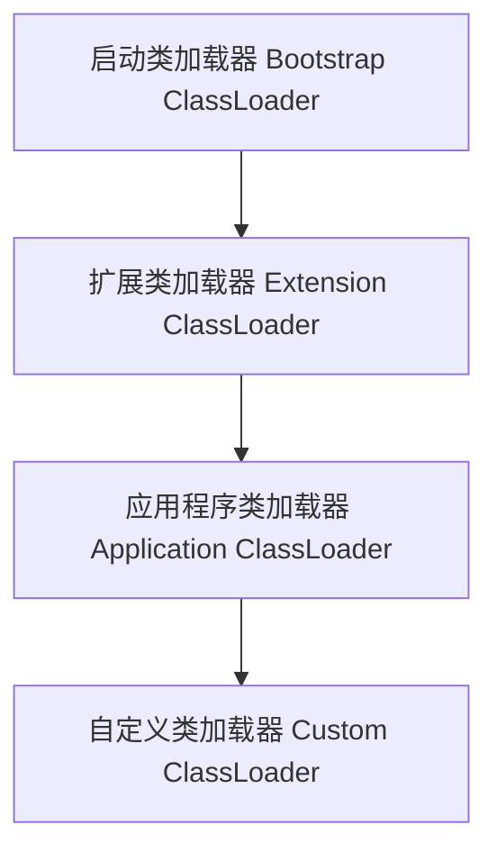

**工作流程**：
1. 类加载请求先委派给父类加载器
2. 父类无法加载时，子类才自己加载
3. 从下到上委派，从上到下加载

**优点**：
- 避免类的重复加载
- 保证核心类的安全性（如 java.lang.Object 只能由启动类加载器加载）

**三层类加载器**：

| 加载器 | 负责路径 | 实现 |
|--------|---------|------|
| 启动类加载器 | JAVA_HOME/jre/lib | C++ 实现 |
| 扩展类加载器 | JAVA_HOME/jre/lib/ext | Java 实现 |
| 应用程序类加载器 | classpath | Java 实现 |


> 🔍 **知识点深度解析**
>
> **作用**：双亲委派模型：类加载器收到请求先委托父加载器，父加载器无法加载才自己加载。
>
> **原理**：启动类加载器→扩展类加载器→应用类加载器→自定义。
>
> **用法要点**：① 双亲委派模型：类加载器收到请求先委托父加载器，父加载器无法加载才自己加载 ② 启动类加载器→扩展类加载器→应用类加载器→自定义 ③ 避免重复加载和核心类篡改（自己写的String不会被加载）

### 41.3 打破双亲委派

<div style="background:linear-gradient(135deg,#ff9a9e,#fecfef);border-radius:16px;padding:20px;margin:16px 0;font-family:-apple-system,'Segoe UI','PingFang SC','Microsoft YaHei',sans-serif;color:#1a1a2e;overflow:hidden;box-shadow:0 6px 20px rgba(0,0,0,.08),0 2px 6px rgba(0,0,0,.04)">
<style>@keyframes breakFlow{0%,100%{transform:scale(1);opacity:.85}50%{transform:scale(1.03);opacity:1}}.break-item{background:rgba(255,255,255,.35);border-left:4px solid #e63946;border-radius:8px;padding:5px 10px;margin:4px 0;font-size:11px;font-weight:600;box-shadow:0 1px 4px rgba(0,0,0,.06);animation:breakFlow 4s ease-in-out infinite}.break-item:nth-child(2){animation-delay:.6s}.break-item:nth-child(3){animation-delay:1.2s}.break-item:nth-child(4){animation-delay:1.8s}</style>
<div style="text-align:center;font-size:15px;font-weight:700;margin-bottom:14px;padding-bottom:10px;border-bottom:1.5px solid rgba(255,255,255,.22);letter-spacing:1px;text-shadow:0 1px 3px rgba(0,0,0,.12)">打破双亲委派的典型场景</div>
<div class="break-item">① SPI 机制（JDBC/SLF4J）— 启动类加载器加载的 DriverManager 需调用应用类加载器的驱动，用线程上下文类加载器（Thread.getContextClassLoader()）反向加载</div>
<div class="break-item">② Tomcat 热部署 — 每个 Web 应用独立 WebappClassLoader，先自己加载再委派，实现应用隔离和热部署</div>
<div class="break-item">③ OSGi 模块化 — 每个 Bundle 独立类加载器，形成网状结构，Bundle 间可精确控制类可见性，支持动态安装/卸载</div>
<div class="break-item">④ 自定义 ClassLoader — 重写 loadClass() 不调用 super.loadClass()，完全自定义加载逻辑（如加密 class 解密加载）</div>
</div>

**场景**：
1. **SPI 机制**：JDBC 驱动由应用类加载器加载，启动类加载器加载的 DriverManager 需要调用应用类加载器加载的驱动
   - 解决方案：线程上下文类加载器（Thread Context ClassLoader）
2. **热部署/热加载**：Tomcat 的 WebappClassLoader，每个 Web 应用有自己的类加载器
3. **OSGi**：模块化，每个 Bundle 有自己的类加载器，形成网状结构


> 🔍 **知识点深度解析**
>
> **作用**：打破双亲委派：SPI机制（线程上下文类加载器。
>
> **原理**：OSGi（模块化、每个模块自己的加载器）。
>
> **用法要点**：① 打破双亲委派：SPI机制（线程上下文类加载器 ② ServiceLoader用） ③ OSGi（模块化、每个模块自己的加载器） ④ Tomcat（WebappClassLoader ⑤ 每个Web应用独立加载器、先自己加载再委托） ⑥ 自定义loadClass

### 41.4 自定义类加载器

```java
public class MyClassLoader extends ClassLoader {
    private String classPath;

    public MyClassLoader(String classPath) {
        this.classPath = classPath;
    }

    @Override
    protected Class<?> findClass(String name) throws ClassNotFoundException {
        try {
            byte[] bytes = loadClassData(name);
            return defineClass(name, bytes, 0, bytes.length);
        } catch (IOException e) {
            throw new ClassNotFoundException(name, e);
        }
    }

    private byte[] loadClassData(String name) throws IOException {
        String path = classPath + "/" + name.replace('.', '/') + ".class";
        return Files.readAllBytes(Paths.get(path));
    }
}
```


> 🔍 **知识点深度解析**
>
> **作用**：自定义类加载器：继承ClassLoader，重写findClass()（不破坏双亲委派）或loadClass()（破坏）。
>
> **原理**：用途：热部署、加密字节码解密、从非标准位置加载（数据库/网络）。
>
> **用法要点**：① 自定义类加载器：继承ClassLoader，重写findClass()（不破坏双亲委派）或loadClass()（破坏） ② 用途：热部署、加密字节码解密、从非标准位置加载（数据库/网络） ③ defineClass将字节码转Class对象

### 41.5 方法区与元空间

| 特性 | 永久代（Java 7-） | 元空间（Java 8+） |
|------|-------------------|-------------------|
| 位置 | 堆内存中 | 本地内存 |
| 大小限制 | 受堆大小限制 | 不受堆限制，受物理内存限制 |
| OOM | 容易出现 | 较少出现 |
| 字符串常量池 | 永久代（Java 7 移到堆） | 堆中 |
| 参数 | -XX:PermSize / MaxPermSize | -XX:MetaspaceSize / MaxMetaspaceSize |

---

> 💡 **深度讲解**：类加载机制是 JVM 的基础，类从被加载到卸载经历五个阶段：加载（通过全限定名获取字节码，生成 Class 对象）、验证（验证字节码正确性）、准备（为静态变量分配内存设默认值，注意是默认值不是赋初始值）、解析（符号引用替换为直接引用）、初始化（执行静态代码块和静态变量赋值，即 <clinit> 方法）。初始化触发时机（主动引用）：new 对象、访问静态变量/方法、反射、初始化子类先初始化父类、主类。被动引用不触发初始化：子类引用父类静态变量、数组定义、常量引用（编译期已优化）。双亲委派模型是类加载的核心：类加载请求先委派给父类，父类无法加载时子类才自己加载，从下到上委派、从上到下加载，优点是避免重复加载和保证核心类安全（如 java.lang.Object 只能由启动类加载器加载）。三层类加载器：启动类加载器（C++实现，加载 jre/lib）、扩展类加载器（加载 jre/lib/ext）、应用程序类加载器（加载 classpath）。打破双亲委派的场景：SPI 机制（线程上下文类加载器）、热部署（Tomcat WebappClassLoader）、OSGi（网状结构）。Java 8 用元空间替代永久代，元空间使用本地内存，避免了永久代 OOM。
>
> **📝 精简总结**：类加载五阶段：加载→验证→准备→解析→初始化；准备阶段设默认值，初始化阶段赋初始值；双亲委派：先委派父类，父类加载不了才自己加载，保证核心类安全；三层加载器：启动/扩展/应用；SPI 和热部署打破双亲委派；Java8+ 元空间替代永久代。

---

## 42. JVM 调优与诊断工具


> 🔍 **知识点深度解析**
>
> **作用**：方法区（Java 7前永久代，Java 8后元空间Metaspace在本地内存）存储：类信息、运行时常量池、静态变量、JIT编译代码。
>
> **原理**：元空间不受堆大小限制，受本地内存限制，-XX:MaxMetaspaceSize控制。
>
> **用法要点**：① 方法区（Java 7前永久代，Java 8后元空间Metaspace在本地内存）存储：类信息、运行时常量池、静态变量、JIT编译代码 ② 元空间不受堆大小限制，受本地内存限制，-XX:MaxMetaspaceSize控制

### 42.1 常用 JVM 参数

#### 内存设置

```bash
-Xms512m              # 初始堆大小
-Xmx1024m             # 最大堆大小
-Xmn256m              # 新生代大小
-Xss1m                # 每个线程栈大小
-XX:PermSize=128m     # 永久代初始大小（Java 7-）
-XX:MaxPermSize=256m  # 永久代最大大小（Java 7-）
-XX:MetaspaceSize=128m     # 元空间初始大小（Java 8+）
-XX:MaxMetaspaceSize=256m  # 元空间最大大小（Java 8+）
-XX:SurvivorRatio=8   # Eden:Survivor = 8:1:1
-XX:NewRatio=2        # 新生代:老年代 = 1:2
-XX:MaxTenuringThreshold=15  # 晋升老年代年龄阈值
```

#### GC 设置

```bash
-XX:+UseSerialGC          # 串行 GC
-XX:+UseParallelGC        # 并行 GC（吞吐量优先）
-XX:+UseConcMarkSweepGC   # CMS GC
-XX:+UseG1GC              # G1 GC
-XX:+UseZGC               # ZGC
-XX:MaxGCPauseMillis=200  # 最大停顿时间
```

#### 诊断参数

```bash
-XX:+PrintGCDetails           # 打印 GC 详情
-XX:+PrintGCDateStamps        # 打印 GC 时间戳
-Xloggc:gc.log                # GC 日志输出文件
-XX:+HeapDumpOnOutOfMemoryError  # OOM 时生成堆转储
-XX:HeapDumpPath=heapdump.hprof  # 堆转储文件路径
-XX:+PrintCommandLineFlags    # 打印 JVM 参数
```


> 🔍 **知识点深度解析**
>
> **作用**：常用JVM参数：-Xms初始堆/-Xmx最大堆（生产设相同）。
>
> **原理**：-XX:+UseG1GC选择GC。
>
> **用法要点**：① 常用JVM参数：-Xms初始堆/-Xmx最大堆（生产设相同） ② -Xmn新生代、-XX:SurvivorRatio ③ -XX:MaxTenuringThreshold ④ -XX:+UseG1GC选择GC ⑤ -XX:MaxGCPauseMillis目标停顿 ⑥ -XX:MetaspaceSize

### 42.2 命令行工具

<div style="background:linear-gradient(135deg,#84fab0,#8fd3f4);border-radius:16px;padding:20px;margin:16px 0;font-family:-apple-system,'Segoe UI','PingFang SC','Microsoft YaHei',sans-serif;color:#1a1a2e;overflow:hidden;box-shadow:0 6px 20px rgba(0,0,0,.08),0 2px 6px rgba(0,0,0,.04)">
<style>@keyframes toolPulse{0%,100%{transform:scale(1);opacity:.85}50%{transform:scale(1.03);opacity:1}}.jvm-tool{display:inline-block;width:30%;vertical-align:top;margin:0 1%;background:rgba(255,255,255,.35);border-radius:8px;box-shadow:0 2px 8px rgba(0,0,0,.08);padding:8px;font-size:10px;text-align:center;animation:toolPulse 3s ease-in-out infinite}.jvm-tool:nth-child(2){animation-delay:.5s}.jvm-tool:nth-child(3){animation-delay:1s}.jvm-tool-name{font-weight:700;font-size:12px;color:#2d6a4f;margin-bottom:2px}.jvm-tool-desc{font-size:9px;opacity:.8}</style>
<div style="text-align:center;font-size:15px;font-weight:700;margin-bottom:14px;padding-bottom:10px;border-bottom:1.5px solid rgba(255,255,255,.22);letter-spacing:1px;text-shadow:0 1px 3px rgba(0,0,0,.12)">JVM 诊断命令行工具</div>
<div style="text-align:center">
<div class="jvm-tool"><div class="jvm-tool-name">jps</div><div class="jvm-tool-desc">列出 Java 进程</div></div>
<div class="jvm-tool"><div class="jvm-tool-name">jstat</div><div class="jvm-tool-desc">GC/类加载统计</div></div>
<div class="jvm-tool"><div class="jvm-tool-name">jinfo</div><div class="jvm-tool-desc">查看/修改 JVM 参数</div></div>
<div class="jvm-tool"><div class="jvm-tool-name">jmap</div><div class="jvm-tool-desc">堆内存 dump/分析</div></div>
<div class="jvm-tool"><div class="jvm-tool-name">jstack</div><div class="jvm-tool-desc">线程栈/死锁分析</div></div>
<div class="jvm-tool"><div class="jvm-tool-name">jcmd</div><div class="jvm-tool-desc">综合命令（推荐）</div></div>
</div>
<div style="text-align:center;font-size:10px;opacity:.7;margin-top:6px">可视化：JConsole、VisualVM、JMC；在线诊断：Arthas（阿里开源，功能强大）</div>
</div>

#### jps（JVM Process Status）

```bash
jps                    # 列出 Java 进程
jps -l                 # 显示主类全限定名
jps -v                 # 显示 JVM 参数
jps -m                 # 显示 main 方法参数
```

#### jstat（JVM Statistics Monitoring）

```bash
jstat -gc <pid> 1000 10    # 每1秒输出一次 GC 统计，共10次
jstat -gcutil <pid>        # GC 统计（百分比）
jstat -class <pid>         # 类加载统计
jstat -compiler <pid>      # JIT 编译统计
```

**输出列说明**：
- S0/S1：Survivor 区使用率
- E：Eden 区使用率
- O：老年代使用率
- M：元空间使用率
- YGC：Minor GC 次数
- YGCT：Minor GC 总耗时
- FGC：Full GC 次数
- FGCT：Full GC 总耗时
- GCT：GC 总耗时

#### jinfo（Configuration Info）

```bash
jinfo <pid>                    # 查看 JVM 参数和系统属性
jinfo -flag <name> <pid>       # 查看指定参数
jinfo -flag +<name> <pid>      # 开启参数
jinfo -flag -<name> <pid>      # 关闭参数
jinfo -flag <name>=<value> <pid>  # 设置参数
```

#### jmap（Memory Map）

```bash
jmap -heap <pid>               # 查看堆内存使用情况
jmap -histo <pid>              # 查看对象统计（类、实例数、大小）
jmap -histo:live <pid>         # 只统计存活对象（触发 Full GC）
jmap -dump:format=b,file=heap.hprof <pid>  # 生成堆转储文件
jmap -dump:live,format=b,file=heap.hprof <pid>
```

#### jstack（Stack Trace）

```bash
jstack <pid>                   # 打印线程栈
jstack -l <pid>                # 打印线程栈和锁信息
jstack -F <pid>                # 强制打印（进程无响应时）
```

**用途**：
- 排查死锁
- 分析线程状态
- 定位 CPU 占用高的线程

#### jhat（Heap Analysis Tool，已过时）

```bash
jhat heap.hprof    # 分析堆转储文件，启动 HTTP 服务
```

推荐使用 VisualVM 或 MAT 替代。


> 🔍 **知识点深度解析**
>
> **作用**：命令行工具：jps（进程列表）、jstat（GC统计，-gcutil）、jinfo（参数查看/修改）、jmap（堆转储dump）、jstack（线程栈，死锁分析）、jcmd（多功能）。
>
> **原理**：线上排查必备。
>
> **用法要点**：① 命令行工具：jps（进程列表）、jstat（GC统计，-gcutil）、jinfo（参数查看/修改）、jmap（堆转储dump）、jstack（线程栈，死锁分析）、jcmd（多功能） ② 线上排查必备

### 42.3 可视化工具

#### JConsole

- JDK 自带的监控工具
- 监控内存、线程、类加载、CPU
- 支持 MBean 操作

#### VisualVM

- 功能强大的可视化工具
- 集成了 jstat、jstack、jmap、jhat 功能
- 支持插件（如 GC、BTrace）
- 支持内存分析、CPU 采样、线程分析

#### MAT（Memory Analyzer Tool）

- Eclipse 出品的堆内存分析工具
- 自动检测内存泄漏
- 支持直方图、支配树、OQL 查询
- 适合分析大堆转储文件

#### Arthas（阿里开源）

- 线上诊断工具，无需重启
- 功能：
  - `dashboard`：实时监控面板
  - `thread`：线程分析
  - `heapdump`：堆转储
  - `jad`：反编译类
  - `watch`：方法执行监控
  - `trace`：方法调用链路
  - `monitor`：方法执行监控
  - `tt`：方法执行数据记录回放

```bash
# 启动 Arthas
java -jar arthas-boot.jar

# 常用命令
dashboard
thread -n 3          # 查看 CPU 占用最高的3个线程
thread -b             # 查看死锁线程
jad com.example.UserService  # 反编译
watch com.example.UserService getUser '{params,returnObj}' -x 2
```


> 🔍 **知识点深度解析**
>
> **作用**：可视化工具：JConsole（基础监控）。
>
> **原理**：VisualVM（综合、堆转储/CPU采样/线程）。
>
> **用法要点**：① 可视化工具：JConsole（基础监控） ② VisualVM（综合、堆转储/CPU采样/线程） ③ JMC（Java Mission Control ④ 低开销）、MAT（Memory Analyzer ⑤ 内存泄漏分析）、Arthas（阿里、在线诊断）

### 42.4 性能调优思路

**1. 明确目标**
- 吞吐量、响应时间、并发量
- 可接受的停顿时间

**2. 监控与分析**
- CPU、内存、GC、线程
- 定位瓶颈

**3. 针对性优化**
- CPU 高：优化算法、减少计算、并行处理
- 内存高：排查内存泄漏、优化对象创建、调整堆大小
- GC 频繁：调整堆大小、选择合适的收集器
- 锁竞争：减少锁粒度、使用无锁结构、读写锁

**4. 验证效果**
- 压测对比
- 持续监控


> 🔍 **知识点深度解析**
>
> **作用**：性能调优思路：明确目标（吞吐量/停顿时间）→监控定位（GC日志/线程栈/堆转储）→分析瓶颈（内存泄漏/锁竞争/CPU高）→优化（代码/参数/架构）→验证对比。
>
> **原理**：避免过早优化，用数据驱动。
>
> **用法要点**：① 性能调优思路：明确目标（吞吐量/停顿时间）→监控定位（GC日志/线程栈/堆转储）→分析瓶颈（内存泄漏/锁竞争/CPU高）→优化（代码/参数/架构）→验证对比 ② 避免过早优化，用数据驱动

### 42.5 JMH 性能基准测试

JMH（Java Microbenchmark Harness）是 OpenJDK 提供的微基准测试工具。

```java
@State(Scope.Benchmark)
@BenchmarkMode(Mode.AverageTime)
@OutputTimeUnit(TimeUnit.MILLISECONDS)
@Warmup(iterations = 3, time = 1)
@Measurement(iterations = 5, time = 1)
@Fork(1)
public class StringConcatBenchmark {

    @Benchmark
    public String stringAdd() {
        String s = "";
        for (int i = 0; i < 1000; i++) {
            s += i;
        }
        return s;
    }

    @Benchmark
    public String stringBuilder() {
        StringBuilder sb = new StringBuilder();
        for (int i = 0; i < 1000; i++) {
            sb.append(i);
        }
        return sb.toString();
    }
}
```

**常用注解**：
- `@Benchmark`：标记基准测试方法
- `@State`：状态对象的作用域
- `@BenchmarkMode`：测试模式（Throughput/AverageTime/SampleTime/SingleShotTime）
- `@Warmup`：预热配置
- `@Measurement`：测量配置
- `@Fork`：进程数
- `@OutputTimeUnit`：输出时间单位

---

> 💡 **深度讲解**：JVM 调优是中高级开发者的必备技能，核心目标是减少 GC 停顿、提高吞吐量、避免 OOM。常用 JVM 参数分三类：内存设置（-Xms 初始堆、-Xmx 最大堆，建议设为相同值避免堆扩容抖动；-Xmn 新生代；-Xss 线程栈；-XX:MetaspaceSize 元空间）、GC 设置（-XX:+UseG1GC 选择收集器、-XX:MaxGCPauseMillis 最大停顿时间）、诊断参数（-XX:+PrintGCDetails 打印 GC 日志、-XX:+HeapDumpOnOutOfMemoryError OOM 时生成堆转储）。命令行诊断工具五大件：jps（列出 Java 进程）、jstat（GC 统计，每1秒输出一次看 GC 频率和耗时）、jinfo（查看/修改 JVM 参数）、jmap（堆内存分析，生成堆转储文件）、jstack（线程栈，排查死锁和 CPU 占用高的线程）。可视化工具：JConsole（JDK 自带）、VisualVM（功能强大集成多工具）、MAT（堆内存分析，自动检测内存泄漏）、Arthas（阿里开源线上诊断神器，无需重启，支持 dashboard/thread/jad/watch/trace 等命令）。性能调优思路：明确目标→监控分析定位瓶颈→针对性优化→压测验证。JMH 是微基准测试工具，用于精确测量代码性能，必须配置预热（避免 JIT 编译影响）、测量次数、Fork 进程数。
>
> **📝 精简总结**：JVM 参数分内存/GC/诊断三类，-Xms=-Xmx 避免堆扩容；五大命令行工具 jps/jstat/jinfo/jmap/jstack；Arthas 是线上诊断神器无需重启；调优思路：定目标→监控定位→优化→验证；JMH 微基准测试必须配置预热。

---

# 第五篇：数据库与持久化

> **本篇导言**：本篇涵盖 Java 数据库访问与持久化技术，是后端开发的核心内容。包括 JDBC 基础、数据库连接池（HikariCP/Druid）、MyBatis 框架、JPA/Spring Data JPA、事务管理与隔离级别、数据库索引与 SQL 优化、分页与乐观锁。本篇重点掌握 MyBatis 动态 SQL、事务传播行为、索引优化原则和深分页解决方案，这些都是实际项目和面试中的高频考点。

---

## 43. JDBC

<div style="background:linear-gradient(135deg,#4facfe,#00f2fe);border-radius:16px;padding:20px;margin:16px 0;font-family:-apple-system,'Segoe UI','PingFang SC','Microsoft YaHei',sans-serif;color:#fff;overflow:hidden;box-shadow:0 8px 28px rgba(0,0,0,.14),0 3px 10px rgba(0,0,0,.08)">
<style>@keyframes jdbcStep{0%{opacity:0;transform:translateX(-6px)}12%{opacity:1;transform:translateX(0)}88%{opacity:1}100%{opacity:.35}}.jdbc-step{background:rgba(255,255,255,.15);border-left:4px solid rgba(255,255,255,.5);border-radius:6px;padding:5px 10px;margin:4px 0;font-size:11px;font-weight:500;animation:jdbcStep 5s ease-in-out infinite}.jdbc-step:nth-child(2){animation-delay:.6s}.jdbc-step:nth-child(3){animation-delay:1.2s}.jdbc-step:nth-child(4){animation-delay:1.8s}.jdbc-step:nth-child(5){animation-delay:2.4s}.jdbc-step:nth-child(6){animation-delay:3s}</style>
<div style="text-align:center;font-size:15px;font-weight:700;margin-bottom:14px;padding-bottom:10px;border-bottom:1.5px solid rgba(255,255,255,.22);letter-spacing:1px;text-shadow:0 1px 3px rgba(0,0,0,.12)">JDBC 六步操作流程</div>
<div class="jdbc-step">① 加载驱动 — Class.forName("com.mysql.cj.jdbc.Driver")（JDBC 4.0+ SPI 自动加载）</div>
<div class="jdbc-step">② 获取连接 — DriverManager.getConnection(url, user, password)</div>
<div class="jdbc-step">③ 创建 Statement — connection.createStatement() / prepareStatement()（预编译防注入）</div>
<div class="jdbc-step">④ 执行 SQL — executeQuery() 返回 ResultSet / executeUpdate() 返回影响行数</div>
<div class="jdbc-step">⑤ 处理结果 — ResultSet 遍历，getInt()/getString() 按列名或索引获取</div>
<div class="jdbc-step">⑥ 关闭资源 — 反向关闭 ResultSet → Statement → Connection（try-with-resources 自动关闭）</div>
</div>


> 🔍 **知识点深度解析**
>
> **作用**：JMH性能基准测试：@Benchmark标记方法，@State状态，@OutputTimeUnit时间单位，Mode.Throughput/AverageTime。
>
> **原理**：避免死代码消除、预热、多轮迭代。
>
> **用法要点**：① JMH性能基准测试：@Benchmark标记方法，@State状态，@OutputTimeUnit时间单位，Mode.Throughput/AverageTime ② 避免死代码消除、预热、多轮迭代 ③ 准确测量代码性能

### 43.1 JDBC 核心 API

| 接口/类 | 说明 |
|---------|------|
| DriverManager | 驱动管理器，获取连接 |
| Connection | 数据库连接 |
| Statement | 静态 SQL 语句 |
| PreparedStatement | 预编译 SQL 语句（推荐） |
| CallableStatement | 存储过程调用 |
| ResultSet | 结果集 |


> 🔍 **知识点深度解析**
>
> **作用**：JDBC核心API：DriverManager（获取连接）、Connection（连接，事务管理）、Statement/PreparedStatement（执行SQL）、ResultSet（结果集）、SQLException（异常）。
>
> **原理**：统一数据库访问，不同数据库驱动实现。
>
> **用法要点**：① JDBC核心API：DriverManager（获取连接）、Connection（连接，事务管理）、Statement/PreparedStatement（执行SQL）、ResultSet（结果集）、SQLException（异常） ② 统一数据库访问，不同数据库驱动实现

### 43.2 基本使用步骤

```java
// 1. 加载驱动（JDBC 4.0+ 可自动加载，无需显式调用）
Class.forName("com.mysql.cj.jdbc.Driver");

// 2. 获取连接
String url = "jdbc:mysql://localhost:3306/test?useSSL=false&serverTimezone=UTC";
String username = "root";
String password = "123456";
Connection conn = DriverManager.getConnection(url, username, password);

// 3. 创建 PreparedStatement（预编译，防止 SQL 注入）
String sql = "SELECT * FROM user WHERE id = ?";
PreparedStatement pstmt = conn.prepareStatement(sql);
pstmt.setLong(1, 1L);

// 4. 执行查询
ResultSet rs = pstmt.executeQuery();

// 5. 处理结果
while (rs.next()) {
    Long id = rs.getLong("id");
    String name = rs.getString("name");
    System.out.println(id + ": " + name);
}

// 6. 关闭资源（倒序关闭，推荐 try-with-resources）
rs.close();
pstmt.close();
conn.close();
```


> 🔍 **知识点深度解析**
>
> **作用**：基本使用步骤：Class.forName加载驱动（Java 6+自动加载）→DriverManager.getConnection获取连接→创建Statement/PreparedStatement→executeQuery/executeUpdate→处理ResultSet→关闭资源（try-with-resources）。
>
> **原理**：JDBC通过DriverManager加载数据库驱动，驱动建立TCP连接后创建Statement对象发送SQL到数据库执行，ResultSet用游标逐行读取结果集，Connection/Statement/ResultSet需按序关闭避免连接泄漏，PreparedStatement预编译SQL可防注入并复用执行计划。
>
> **用法要点**：① 基本使用步骤：Class.forName加载驱动（Java 6+自动加载）→DriverManager.getConnection获取连接→创建Statement/PreparedStatement→executeQuery/executeUpdate→处理ResultSet→关闭资源（try-with-resources）

### 43.3 try-with-resources（推荐）

```java
try (Connection conn = DriverManager.getConnection(url, username, password);
     PreparedStatement pstmt = conn.prepareStatement(sql)) {
    pstmt.setLong(1, 1L);
    try (ResultSet rs = pstmt.executeQuery()) {
        while (rs.next()) {
            // 处理结果
        }
    }
} catch (SQLException e) {
    e.printStackTrace();
}
```


> 🔍 **知识点深度解析**
>
> **作用**：try-with-resources（推荐）：实现AutoCloseable的资源（Connection/Statement/ResultSet）在try()中声明，自动关闭（即使异常）。
>
> **原理**：关闭顺序自动（后创建先关闭）。
>
> **用法要点**：① try-with-resources（推荐）：实现AutoCloseable的资源（Connection/Statement/ResultSet）在try()中声明，自动关闭（即使异常） ② 比手动finally关闭简洁安全 ③ 关闭顺序自动（后创建先关闭）

### 43.4 Statement vs PreparedStatement

| 区别 | Statement | PreparedStatement |
|------|-----------|-------------------|
| SQL 编译 | 每次执行都编译 | 预编译，可复用 |
| 参数设置 | 字符串拼接 | ? 占位符 |
| SQL 注入 | 存在风险 | 防止注入 |
| 性能 | 较低 | 较高（复用执行计划） |
| 适用 | 静态 SQL | 动态参数 SQL |


> 🔍 **知识点深度解析**
>
> **作用**：Statement（静态SQL，SQL注入风险，每次编译）vs PreparedStatement（预编译，参数化?，防SQL注入，性能好，推荐）。
>
> **原理**：PreparedStatement预编译语句缓存，批量执行addBatch/executeBatch。
>
> **用法要点**：① Statement（静态SQL，SQL注入风险，每次编译）vs PreparedStatement（预编译，参数化?，防SQL注入，性能好，推荐） ② PreparedStatement预编译语句缓存，批量执行addBatch/executeBatch

### 43.5 事务管理

```java
try (Connection conn = DriverManager.getConnection(url, username, password)) {
    conn.setAutoCommit(false);  // 关闭自动提交

    try {
        // 操作1
        // 操作2
        conn.commit();  // 提交
    } catch (SQLException e) {
        conn.rollback();  // 回滚
        throw e;
    }
}
```


> 🔍 **知识点深度解析**
>
> **作用**：事务管理：Connection.setAutoCommit(false)开启，commit()提交，rollback()回滚。
>
> **原理**：隔离级别：读未提交/读已提交（默认）/可重复读（MySQL默认）/串行化。
>
> **用法要点**：① 事务管理：Connection.setAutoCommit(false)开启，commit()提交，rollback()回滚 ② 隔离级别：读未提交/读已提交（默认）/可重复读（MySQL默认）/串行化 ③ 脏读/不可重复读/幻读

### 43.6 批量操作

```java
try (PreparedStatement pstmt = conn.prepareStatement("INSERT INTO user(name) VALUES(?)")) {
    for (User user : users) {
        pstmt.setString(1, user.getName());
        pstmt.addBatch();  // 添加到批处理
    }
    pstmt.executeBatch();  // 执行批处理
}
```


> 🔍 **知识点深度解析**
>
> **作用**：批量操作：PreparedStatement.addBatch()添加批量，executeBatch()执行。
>
> **原理**：比逐条执行性能高（减少网络往返）。
>
> **用法要点**：① 批量操作：PreparedStatement.addBatch()添加批量，executeBatch()执行 ② 比逐条执行性能高（减少网络往返） ③ 注意批量大小（太大内存溢出，太小性能差，一般500-1000） ④ rewriteBatchedStatements=true优化

### 43.7 分页查询

```java
// MySQL 分页
String sql = "SELECT * FROM user LIMIT ?, ?";
PreparedStatement pstmt = conn.prepareStatement(sql);
pstmt.setInt(1, offset);  // 起始位置
pstmt.setInt(2, pageSize);  // 每页数量
```

---

> 💡 **深度讲解**：JDBC 是 Java 访问数据库的标准 API，核心接口有 DriverManager（获取连接）、Connection（连接）、Statement/PreparedStatement/CallableStatement（执行 SQL）、ResultSet（结果集）。PreparedStatement 是必须掌握的，相比 Statement 有三大优势：预编译可复用执行计划（性能好）、? 占位符防止 SQL 注入（安全）、代码可读性好。JDBC 4.0+ 不需要显式 Class.forName 加载驱动，通过 SPI 自动发现。资源关闭必须用 try-with-resources（Java 7+），自动按倒序关闭 Connection、Statement、ResultSet，避免资源泄漏。事务管理通过 Connection.setAutoCommit(false) 关闭自动提交，成功 commit 失败 rollback。批量操作用 addBatch+executeBatch，比逐条执行性能好很多。实际开发中不会直接写 JDBC，都是用 MyBatis 或 JPA 等框架封装，但理解 JDBC 底层原理是排查框架问题的基础。
>
> **📝 精简总结**：JDBC 核心接口 DriverManager/Connection/PreparedStatement/ResultSet；PreparedStatement 预编译防注入性能好，必须用；try-with-resources 自动关闭资源；事务 setAutoCommit(false)+commit/rollback；批量操作 addBatch+executeBatch。

---

## 44. 数据库连接池

<div style="background:linear-gradient(135deg,#84fab0,#8fd3f4);border-radius:16px;padding:20px;margin:16px 0;font-family:-apple-system,'Segoe UI','PingFang SC','Microsoft YaHei',sans-serif;color:#1a1a2e;overflow:hidden;box-shadow:0 6px 20px rgba(0,0,0,.08),0 2px 6px rgba(0,0,0,.04)">
<style>@keyframes poolFlow{0%,100%{transform:translateY(0);opacity:.6}50%{transform:translateY(-3px);opacity:1}}.pool-app{background:rgba(255,255,255,.4);border-radius:8px;box-shadow:0 2px 8px rgba(0,0,0,.08);padding:8px;text-align:center;font-size:11px;font-weight:600;margin-bottom:6px}.pool-conn{display:inline-block;width:36px;height:24px;background:rgba(255,255,255,.5);border:2px solid #2d6a4f;border-radius:4px;margin:2px;line-height:24px;text-align:center;font-size:9px;font-weight:700;animation:poolFlow 2s ease-in-out infinite}.pool-conn:nth-child(2){animation-delay:.3s}.pool-conn:nth-child(3){animation-delay:.6s}.pool-conn:nth-child(4){animation-delay:.9s}.pool-db{background:rgba(45,106,79,.2);border:2px dashed #2d6a4f;border-radius:8px;padding:8px;text-align:center;font-size:11px;margin-top:6px}.pool-arrow{text-align:center;font-size:14px;animation:poolFlow 1.5s ease-in-out infinite;margin:3px 0}</style>
<div style="text-align:center;font-size:15px;font-weight:700;margin-bottom:14px;padding-bottom:10px;border-bottom:1.5px solid rgba(255,255,255,.22);letter-spacing:1px;text-shadow:0 1px 3px rgba(0,0,0,.12)">数据库连接池原理（复用连接）</div>
<div class="pool-app">应用程序（DataSource.getConnection()）</div>
<div class="pool-arrow">▲ 归还连接 / ▼ 获取连接</div>
<div style="text-align:center;background:rgba(255,255,255,.3);border-radius:8px;box-shadow:0 2px 8px rgba(0,0,0,.08);padding:8px"><div style="font-size:11px;font-weight:600;margin-bottom:4px">连接池（HikariCP / Druid）</div><span class="pool-conn">C1</span><span class="pool-conn">C2</span><span class="pool-conn">C3</span><span class="pool-conn">C4</span><div style="font-size:10px;margin-top:4px">核心参数：minimumIdle / maximumPoolSize / connectionTimeout / maxLifetime</div></div>
<div class="pool-arrow">▼ 建立物理连接</div>
<div class="pool-db">MySQL 数据库</div>
</div>


> 🔍 **知识点深度解析**
>
> **作用**：分页查询：MySQL用LIMIT offset, size（深分页offset大性能差）。
>
> **原理**：优化：延迟关联（先查ID再关联）、游标分页（where id > lastId limit size，推荐）、覆盖索引。
>
> **用法要点**：① 分页查询：MySQL用LIMIT offset, size（深分页offset大性能差） ② 优化：延迟关联（先查ID再关联）、游标分页（where id > lastId limit size，推荐）、覆盖索引 ③ Oracle用ROWNUM

### 44.1 连接池原理

- 预先创建一批数据库连接，放入池中
- 应用从池中获取连接，使用后归还
- 避免频繁创建销毁连接的开销
- 控制最大连接数，防止数据库被压垮


> 🔍 **知识点深度解析**
>
> **作用**：连接池原理：预创建数据库连接复用，避免频繁创建销毁。
>
> **原理**：维护空闲连接池，获取时从池取，用完归还。
>
> **用法要点**：① 连接池原理：预创建数据库连接复用，避免频繁创建销毁 ② 维护空闲连接池，获取时从池取，用完归还 ③ 参数：最大连接数、最小空闲、连接超时、空闲超时、最大生命周期 ④ 监控连接泄漏

### 44.2 常用连接池

| 连接池 | 特点 | 性能 |
|--------|------|------|
| HikariCP | 轻量、高性能、Spring Boot 默认 | 极高 |
| Druid | 阿里开源，功能强大，监控完善 | 高 |
| C3P0 | 老牌，配置复杂 | 一般 |
| DBCP | Apache 出品 | 一般 |


> 🔍 **知识点深度解析**
>
> **作用**：常用连接池：HikariCP（Spring Boot默认，性能最高，轻量）、Druid（阿里，监控强，SQL防火墙）、Tomcat JDBC Pool、C3P0（过时）。
>
> **原理**：推荐HikariCP（性能好）或Druid（监控需求）。
>
> **用法要点**：① 常用连接池：HikariCP（Spring Boot默认，性能最高，轻量）、Druid（阿里，监控强，SQL防火墙）、Tomcat JDBC Pool、C3P0（过时） ② 推荐HikariCP（性能好）或Druid（监控需求）

### 44.3 HikariCP 配置

```yaml
spring:
  datasource:
    type: com.zaxxer.hikari.HikariDataSource
    driver-class-name: com.mysql.cj.jdbc.Driver
    url: jdbc:mysql://localhost:3306/test
    username: root
    password: 123456
    hikari:
      minimum-idle: 5           # 最小空闲连接
      maximum-pool-size: 20     # 最大连接数
      connection-timeout: 30000 # 获取连接超时（毫秒）
      idle-timeout: 600000      # 空闲连接超时（毫秒）
      max-lifetime: 1800000     # 连接最大生命周期
      connection-test-query: SELECT 1
```


> 🔍 **知识点深度解析**
>
> **作用**：HikariCP配置：maximum-pool-size最大连接（CPU核数*2+有效磁盘数）、minimum-idle最小空闲、connection-timeout连接超时（30s）、idle-timeout空闲超时（10min）、max-lifetime最大生命周期（30min）。
>
> **原理**：Spring Boot默认。
>
> **用法要点**：① HikariCP配置：maximum-pool-size最大连接（CPU核数*2+有效磁盘数）、minimum-idle最小空闲、connection-timeout连接超时（30s）、idle-timeout空闲超时（10min）、max-lifetime最大生命周期（30min） ② Spring Boot默认

### 44.4 Druid 配置

```yaml
spring:
  datasource:
    type: com.alibaba.druid.pool.DruidDataSource
    driver-class-name: com.mysql.cj.jdbc.Driver
    url: jdbc:mysql://localhost:3306/test
    username: root
    password: 123456
    druid:
      initial-size: 5
      min-idle: 5
      max-active: 20
      max-wait: 60000
      time-between-eviction-runs-millis: 60000
      min-evictable-idle-time-millis: 300000
      validation-query: SELECT 1
      test-while-idle: true
      test-on-borrow: false
      test-on-return: false
      pool-prepared-statements: true
      max-pool-prepared-statement-per-connection-size: 20
      filters: stat,wall,slf4j  # 监控、防火墙、日志
      stat-view-servlet:
        enabled: true
        url-pattern: /druid/*
        login-username: admin
        login-password: admin
```

---

> 💡 **深度讲解**：数据库连接池是后端开发的必备组件，原理是预先创建一批数据库连接放入池中，应用从池中获取连接使用后归还，避免频繁创建销毁连接的开销（TCP 三次握手、数据库认证等），同时控制最大连接数防止数据库被压垮。常用连接池：HikariCP（Spring Boot 默认，轻量高性能，代码量少优化极致）、Druid（阿里开源，功能强大，内置监控页面、SQL 防火墙、慢查询记录，国内用得多）、C3P0 和 DBCP（老牌，性能一般，已不推荐）。HikariCP 核心参数：minimum-idle 最小空闲、maximum-pool-size 最大连接数（建议 CPU 核数*2 + 磁盘数）、connection-timeout 获取连接超时、idle-timeout 空闲连接超时、max-lifetime 连接最大生命周期（必须小于数据库的 wait_timeout）。Druid 核心参数类似，额外有 filters（stat 监控、wall 防火墙、slf4j 日志）和内置监控页面 /druid/*。连接池配置不当是线上常见问题：最大连接数太小导致请求等待，太大导致数据库压力大，max-lifetime 大于数据库超时导致拿到无效连接。
>
> **📝 精简总结**：连接池复用连接避免频繁创建销毁，控制最大连接数；HikariCP Spring Boot 默认轻量高性能，Druid 功能强大有监控；核心参数：最小空闲/最大连接/超时/最大生命周期；max-lifetime 必须小于数据库 wait_timeout。

---

## 45. MyBatis

<div style="background:linear-gradient(135deg,#4facfe,#00f2fe);border-radius:16px;padding:20px;margin:16px 0;font-family:-apple-system,'Segoe UI','PingFang SC','Microsoft YaHei',sans-serif;color:#fff;overflow:hidden;box-shadow:0 8px 28px rgba(0,0,0,.14),0 3px 10px rgba(0,0,0,.08)">
<style>@keyframes mybatisFlow{0%{opacity:0;transform:translateX(-6px)}12%{opacity:1;transform:translateX(0)}88%{opacity:1}100%{opacity:.35}}.mb-step{background:rgba(255,255,255,.15);border-left:4px solid rgba(255,255,255,.5);border-radius:6px;padding:6px 10px;margin:4px 0;font-size:11px;font-weight:500;animation:mybatisFlow 5s ease-in-out infinite}.mb-step:nth-child(2){animation-delay:.6s}.mb-step:nth-child(3){animation-delay:1.2s}.mb-step:nth-child(4){animation-delay:1.8s}.mb-step:nth-child(5){animation-delay:2.4s}.mb-step:nth-child(6){animation-delay:3s}</style>
<div style="text-align:center;font-size:15px;font-weight:700;margin-bottom:14px;padding-bottom:10px;border-bottom:1.5px solid rgba(255,255,255,.22);letter-spacing:1px;text-shadow:0 1px 3px rgba(0,0,0,.12)">MyBatis 执行流程</div>
<div class="mb-step">① 读取 mybatis-config.xml + Mapper.xml → 构建 Configuration</div>
<div class="mb-step">② SqlSessionFactoryBuilder → 创建 SqlSessionFactory</div>
<div class="mb-step">③ openSession() → 创建 SqlSession（Executor 执行器）</div>
<div class="mb-step">④ getMapper() → JDK 动态代理生成 Mapper 代理对象</div>
<div class="mb-step">⑤ 代理对象调用方法 → StatementHandler 处理 SQL（参数绑定）</div>
<div class="mb-step">⑥ ResultSetHandler 映射结果集 → 返回 Java 对象</div>
</div>


> 🔍 **知识点深度解析**
>
> **作用**：Druid配置：initial-size初始连接、max-active最大活跃、min-idle最小空闲、max-wait获取等待、validation-query验证SQL、test-while-idle空闲检测。
>
> **原理**：内置监控页面（/druid），SQL统计、慢SQL记录、防火墙。
>
> **用法要点**：① Druid配置：initial-size初始连接、max-active最大活跃、min-idle最小空闲、max-wait获取等待、validation-query验证SQL、test-while-idle空闲检测 ② 内置监控页面（/druid），SQL统计、慢SQL记录、防火墙

### 45.1 MyBatis 概述

- 半自动 ORM 框架，SQL 与 Java 代码分离
- 支持自定义 SQL、存储过程、高级映射
- 核心：SqlSessionFactory、SqlSession、Mapper


> 🔍 **知识点深度解析**
>
> **作用**：MyBatis持久层框架，XML或注解写SQL，灵活。
>
> **原理**：半自动ORM（SQL自己写，结果自动映射）。
>
> **用法要点**：① MyBatis持久层框架，XML或注解写SQL，灵活 ② SqlSessionFactory→SqlSession→Mapper ③ 半自动ORM（SQL自己写，结果自动映射） ④ 比JPA灵活，比JDBC方便 ⑤ 互联网公司常用

### 45.2 注解方式

```java
@Mapper
public interface UserMapper {

    @Select("SELECT * FROM user WHERE id = #{id}")
    User findById(@Param("id") Long id);

    @Insert("INSERT INTO user(name, age) VALUES(#{name}, #{age})")
    @Options(useGeneratedKeys = true, keyProperty = "id")
    int insert(User user);

    @Update("UPDATE user SET name = #{name} WHERE id = #{id}")
    int update(User user);

    @Delete("DELETE FROM user WHERE id = #{id}")
    int deleteById(@Param("id") Long id);

    @Select("SELECT * FROM user")
    List<User> findAll();
}
```


> 🔍 **知识点深度解析**
>
> **作用**：注解方式：@Select/@Insert/@Update/@Delete写SQL，@Results映射，@Param参数名。
>
> **原理**：Mapper接口方法直接调用。
>
> **用法要点**：① 注解方式：@Select/@Insert/@Update/@Delete写SQL，@Results映射，@Param参数名 ② 简单SQL用注解方便 ③ 动态SQL用<script>标签（不如XML直观） ④ Mapper接口方法直接调用

### 45.3 XML 方式（动态 SQL）

```xml
<!-- UserMapper.xml -->
<mapper namespace="com.example.mapper.UserMapper">

    <!-- 结果映射 -->
    <resultMap id="UserMap" type="com.example.entity.User">
        <id property="id" column="id"/>
        <result property="name" column="name"/>
        <result property="age" column="age"/>
        <result property="createTime" column="create_time"/>
    </resultMap>

    <!-- 查询 -->
    <select id="findById" resultMap="UserMap">
        SELECT * FROM user WHERE id = #{id}
    </select>

    <!-- 动态条件查询 -->
    <select id="findByCondition" resultMap="UserMap">
        SELECT * FROM user
        <where>
            <if test="name != null and name != ''">
                AND name LIKE CONCAT('%', #{name}, '%')
            </if>
            <if test="age != null">
                AND age = #{age}
            </if>
        </where>
        ORDER BY id DESC
    </select>

    <!-- 插入 -->
    <insert id="insert" useGeneratedKeys="true" keyProperty="id">
        INSERT INTO user(name, age)
        VALUES(#{name}, #{age})
    </insert>

    <!-- 动态更新 -->
    <update id="update">
        UPDATE user
        <set>
            <if test="name != null">name = #{name},</if>
            <if test="age != null">age = #{age},</if>
        </set>
        WHERE id = #{id}
    </update>

    <!-- 批量插入 -->
    <insert id="batchInsert">
        INSERT INTO user(name, age) VALUES
        <foreach collection="list" item="item" separator=",">
            (#{item.name}, #{item.age})
        </foreach>
    </insert>

    <!-- foreach IN 查询 -->
    <select id="findByIds" resultMap="UserMap">
        SELECT * FROM user WHERE id IN
        <foreach collection="ids" item="id" open="(" separator="," close=")">
            #{id}
        </foreach>
    </select>

    <!-- choose/when/otherwise -->
    <select id="findByCondition" resultMap="UserMap">
        SELECT * FROM user
        <where>
            <choose>
                <when test="id != null">AND id = #{id}</when>
                <when test="name != null">AND name = #{name}</when>
                <otherwise>AND 1 = 1</otherwise>
            </choose>
        </where>
    </select>

    <!-- 分页查询 -->
    <select id="findByPage" resultMap="UserMap">
        SELECT * FROM user
        ORDER BY id DESC
        LIMIT #{offset}, #{pageSize}
    </select>

</mapper>
```


> 🔍 **知识点深度解析**
>
> **作用**：XML方式（动态SQL）：<select>/<insert>/<update>/<delete>，动态标签<if>/<where>/<foreach>/<choose>/<set>/<trim>。
>
> **原理**：resultMap复杂结果映射。
>
> **用法要点**：① XML方式（动态SQL）：<select>/<insert>/<update>/<delete>，动态标签<if>/<where>/<foreach>/<choose>/<set>/<trim> ② resultMap复杂结果映射 ③ SQL片段<sql>/<include>复用 ④ 复杂查询推荐XML

### 45.4 #{} vs ${}

| 区别 | #{} | ${} |
|------|-----|-----|
| 编译方式 | 预编译，? 占位符 | 字符串拼接 |
| SQL 注入 | 防止 | 存在风险 |
| 适用场景 | 参数值 | 表名、列名、ORDER BY 等 |

```xml
<!-- #{} 安全 -->
SELECT * FROM user WHERE id = #{id}

<!-- ${} 用于动态表名/列名 -->
SELECT * FROM ${tableName} ORDER BY ${orderBy}
```


> 🔍 **知识点深度解析**
>
> **作用**：#{}预编译（PreparedStatement，防SQL注入，推荐），${}字符串拼接（SQL注入风险，用于表名/列名/排序字段动态）。
>
> **原理**：能用#{}就不用${}。
>
> **用法要点**：① #{}预编译（PreparedStatement，防SQL注入，推荐），${}字符串拼接（SQL注入风险，用于表名/列名/排序字段动态） ② 能用#{}就不用${} ③ ${}必须白名单校验

### 45.5 一级缓存与二级缓存

**一级缓存（SqlSession 级别）**：
- 默认开启，同一个 SqlSession 内有效
- 执行 update/delete/insert 或 commit 时清空
- 不同 SqlSession 之间不共享

**二级缓存（Mapper 级别）**：
- 需要手动开启，跨 SqlSession 共享
- 实体类需实现 Serializable
- 适用于读多写少的场景

```xml
<!-- 开启二级缓存 -->
<cache eviction="LRU" flushInterval="60000" size="512" readOnly="true"/>
```


> 🔍 **知识点深度解析**
>
> **作用**：一级缓存（SqlSession级别。
>
> **原理**：默认开启、同一SqlSession相同查询缓存。
>
> **用法要点**：① 一级缓存（SqlSession级别 ② 默认开启、同一SqlSession相同查询缓存 ③ commit/close清空） ④ 二级缓存（Mapper级别 ⑤ 需配置cacheEnabled和<cache> ⑥ 跨SqlSession共享 ⑦ 分布式环境有问题、不推荐）

### 45.6 关联查询

```xml
<!-- 一对一 -->
<resultMap id="OrderMap" type="Order">
    <id property="id" column="id"/>
    <result property="orderNo" column="order_no"/>
    <association property="user" javaType="User">
        <id property="id" column="user_id"/>
        <result property="name" column="user_name"/>
    </association>
</resultMap>

<!-- 一对多 -->
<resultMap id="UserMap" type="User">
    <id property="id" column="id"/>
    <result property="name" column="name"/>
    <collection property="orders" ofType="Order">
        <id property="id" column="order_id"/>
        <result property="orderNo" column="order_no"/>
    </collection>
</resultMap>
```


> 🔍 **知识点深度解析**
>
> **作用**：关联查询：一对一<association>（select嵌套或resultMap联合查询）、一对多<collection>（ofType指定类型）。
>
> **原理**：N+1问题：用联合查询（一条SQL）或开启延迟加载。
>
> **用法要点**：① 关联查询：一对一<association>（select嵌套或resultMap联合查询）、一对多<collection>（ofType指定类型） ② N+1问题：用联合查询（一条SQL）或开启延迟加载 ③ fetchType=lazy懒加载

### 45.7 PageHelper 分页插件

```java
// 开启分页（紧跟在后面的第一个查询会被分页）
PageHelper.startPage(pageNum, pageSize);
List<User> users = userMapper.findAll();
PageInfo<User> pageInfo = new PageInfo<>(users);

long total = pageInfo.getTotal();
int pages = pageInfo.getPages();
```

---

> 💡 **深度讲解**：MyBatis 是半自动 ORM 框架，SQL 和 Java 代码分离，支持自定义 SQL 和高级映射，是国内后端开发的主流。核心概念：SqlSessionFactory（会话工厂，全局一个）、SqlSession（会话，线程不安全，每次请求创建）、Mapper（接口+XML，动态代理生成实现）。#{} 和 ${} 的区别是面试必考题：#{} 是预编译占位符，安全防 SQL 注入；${} 是字符串直接拼接，有注入风险，只用于动态表名/列名/排序字段。动态 SQL 标签：if（条件判断）、where（自动去掉多余 and/or）、set（更新时去掉多余逗号）、choose/when/otherwise（类似 switch）、foreach（批量操作）、trim（自定义前缀后缀）。一级缓存是 SqlSession 级别，默认开启，同一个 SqlSession 内相同查询复用缓存，但不同 SqlSession 或有更新操作会失效；二级缓存是 Mapper 级别，需手动配置 @CacheNamespace，跨 SqlSession 共享，适合读多写少。关联查询：association 一对一（如用户关联角色），collection 一对多（如用户关联订单列表）。N+1 问题是关联查询的经典坑，用 JOIN FETCH 或嵌套查询+延迟加载解决。PageHelper 是最常用的分页插件，原理是 MyBatis 拦截器，自动在 SQL 后加 LIMIT。
>
> **📝 精简总结**：MyBatis 半自动 ORM，SQL 与代码分离；#{} 预编译安全，${} 字符串拼接用于动态表名列名；动态 SQL if/where/set/foreach；一级缓存 SqlSession 级默认开启，二级缓存 Mapper 级需配置；association 一对一，collection 一对多；PageHelper 分页插件。

---

## 46. JPA / Spring Data JPA

<div style="background:linear-gradient(135deg,#84fab0,#8fd3f4);border-radius:16px;padding:20px;margin:16px 0;font-family:-apple-system,'Segoe UI','PingFang SC','Microsoft YaHei',sans-serif;color:#1a1a2e;overflow:hidden;box-shadow:0 6px 20px rgba(0,0,0,.08),0 2px 6px rgba(0,0,0,.04)">
<style>@keyframes jpaFlow{0%,100%{transform:scale(1);opacity:.85}50%{transform:scale(1.03);opacity:1}}.jpa-layer{background:rgba(255,255,255,.35);border-radius:8px;box-shadow:0 2px 8px rgba(0,0,0,.08);padding:8px;margin:5px 0;text-align:center;font-size:11px;animation:jpaFlow 3s ease-in-out infinite}.jpa-layer:nth-child(2){animation-delay:.5s}.jpa-layer:nth-child(3){animation-delay:1s}.jpa-layer:nth-child(4){animation-delay:1.5s}.jpa-arrow{text-align:center;font-size:12px;animation:jpaFlow 1.5s ease-in-out infinite;margin:2px 0}</style>
<div style="text-align:center;font-size:15px;font-weight:700;margin-bottom:14px;padding-bottom:10px;border-bottom:1.5px solid rgba(255,255,255,.22);letter-spacing:1px;text-shadow:0 1px 3px rgba(0,0,0,.12)">Spring Data JPA 分层架构</div>
<div class="jpa-layer"><b>Repository 接口</b>（继承 JpaRepository）— 方法名查询 / @Query</div>
<div class="jpa-arrow">▼ 动态代理生成实现 ▼</div>
<div class="jpa-layer"><b>Spring Data JPA</b> — 简化封装，提供基础 CRUD / 分页 / 排序</div>
<div class="jpa-arrow">▼ 调用 ▼</div>
<div class="jpa-layer"><b>JPA 规范实现（Hibernate）</b> — EntityManager，ORM 映射，一级/二级缓存</div>
<div class="jpa-arrow">▼ 生成 SQL ▼</div>
<div class="jpa-layer"><b>JDBC</b> → 数据库</div>
<div style="text-align:center;font-size:10px;opacity:.7;margin-top:6px">注意 N+1 问题：用 @EntityGraph 或 JOIN FETCH 解决；复杂查询建议用 MyBatis</div>
</div>


> 🔍 **知识点深度解析**
>
> **作用**：PageHelper分页插件：MyBatis拦截器，PageHelper.startPage(pageNum, pageSize)自动拼接LIMIT。
>
> **原理**：返回PageInfo（含总数/总页数/当前页）。
>
> **用法要点**：① PageHelper分页插件：MyBatis拦截器，PageHelper.startPage(pageNum, pageSize)自动拼接LIMIT ② 返回PageInfo（含总数/总页数/当前页） ③ 注意：startPage后紧跟第一个查询才分页

### 46.1 JPA 概述

- JPA（Java Persistence API）是 Java 持久化规范
- Spring Data JPA 是对 JPA 的封装，简化数据访问层
- 核心：Entity、Repository、EntityManager


> 🔍 **知识点深度解析**
>
> **作用**：JPA（Java Persistence API）ORM标准，Hibernate是实现。
>
> **原理**：全自动化ORM（SQL自动生成），@Entity/@Table/@Id/@Column注解。
>
> **用法要点**：① JPA（Java Persistence API）ORM标准，Hibernate是实现 ② 全自动化ORM（SQL自动生成），@Entity/@Table/@Id/@Column注解 ③ 适合简单CRUD，复杂查询用JPQL或Criteria API ④ Spring Data JPA简化开发

### 46.2 实体类定义

```java
@Entity
@Table(name = "user")
public class User {

    @Id
    @GeneratedValue(strategy = GenerationType.IDENTITY)
    private Long id;

    @Column(name = "name", nullable = false, length = 50)
    private String name;

    @Column(name = "age")
    private Integer age;

    @Column(name = "create_time")
    private LocalDateTime createTime;

    @Version  // 乐观锁
    private Integer version;

    // getter/setter
}
```


> 🔍 **知识点深度解析**
>
> **作用**：实体类定义：@Entity标记。
>
> **原理**：@Table指定表名、@Id主键。
>
> **用法要点**：① 实体类定义：@Entity标记 ② @Table指定表名、@Id主键 ③ @GeneratedValue主键策略（IDENTITY/SEQUENCE/TABLE/AUTO） ④ @Column列属性、@Transient非持久化 ⑤ @Temporal日期类型

### 46.3 Repository 接口

```java
public interface UserRepository extends JpaRepository<User, Long>, JpaSpecificationExecutor<User> {

    // 方法名查询（自动生成 SQL）
    User findByName(String name);
    List<User> findByAgeGreaterThan(Integer age);
    List<User> findByNameContaining(String keyword);
    List<User> findByAgeBetween(Integer min, Integer max);
    boolean existsByName(String name);
    long countByAge(Integer age);

    // 排序和分页
    List<User> findByAge(Integer age, Sort sort);
    Page<User> findByAge(Integer age, Pageable pageable);

    // @Query 自定义 JPQL
    @Query("SELECT u FROM User u WHERE u.name = :name AND u.age > :age")
    List<User> findUsers(@Param("name") String name, @Param("age") Integer age);

    // 原生 SQL
    @Query(value = "SELECT * FROM user WHERE name LIKE %:keyword%", nativeQuery = true)
    List<User> searchByKeyword(@Param("keyword") String keyword);

    // 修改操作
    @Modifying
    @Transactional
    @Query("UPDATE User u SET u.name = :name WHERE u.id = :id")
    int updateName(@Param("id") Long id, @Param("name") String name);
}
```


> 🔍 **知识点深度解析**
>
> **作用**：Repository接口：继承JpaRepository<T,ID>，自动获得CRUD方法（save/findById/findAll/delete）。
>
> **原理**：方法名查询（findByXxxAndYyy）、@Query自定义JPQL/SQL。
>
> **用法要点**：① Repository接口：继承JpaRepository<T,ID>，自动获得CRUD方法（save/findById/findAll/delete） ② 方法名查询（findByXxxAndYyy）、@Query自定义JPQL/SQL ③ 分页查询Pageable参数

### 46.4 方法名查询关键字

| 关键字 | 示例 | 说明 |
|--------|------|------|
| And | findByNameAndAge | 条件与 |
| Or | findByNameOrAge | 条件或 |
| Is, Equals | findByNameIs | 等于 |
| Between | findByAgeBetween | 范围 |
| LessThan | findByAgeLessThan | 小于 |
| GreaterThan | findByAgeGreaterThan | 大于 |
| IsNull | findByNameIsNull | 为空 |
| IsNotNull | findByNameIsNotNull | 非空 |
| Like | findByNameLike | 模糊 |
| Containing | findByNameContaining | 包含 |
| OrderBy | findByAgeOrderByNameDesc | 排序 |
| In | findByIdIn | IN 查询 |
| NotIn | findByIdNotIn | 不在 IN |


> 🔍 **知识点深度解析**
>
> **作用**：方法名查询关键字：And/Or/Between/LessThan/GreaterThan/IsNotNull/Like/Not/In/OrderBy。
>
> **原理**：解析方法名生成SQL。
>
> **用法要点**：① 方法名查询关键字：And/Or/Between/LessThan/GreaterThan/IsNotNull/Like/Not/In/OrderBy ② findByAgeGreaterThanAndNameLike ③ 解析方法名生成SQL ④ 简单查询方便，复杂用@Query

### 46.5 N+1 问题与懒加载

**N+1 问题**：查询主表 1 次，每条记录查询关联表 1 次，共 N+1 次。

**解决方案**：
1. 立即加载（@ManyToOne(fetch = FetchType.EAGER)）
2. 实体图（@EntityGraph）
3. JOIN FETCH 查询
4. 批量加载（@BatchSize）

```java
// JOIN FETCH
@Query("SELECT u FROM User u LEFT JOIN FETCH u.orders WHERE u.id = :id")
User findUserWithOrders(@Param("id") Long id);

// 实体图
@EntityGraph(attributePaths = {"orders"})
User findWithOrdersById(Long id);
```


> 🔍 **知识点深度解析**
>
> **作用**：N+1问题：查询主实体后，访问关联属性时每条触发一次查询。
>
> **原理**：解决：@EntityGraph（指定加载属性）、@Fetch(FetchMode.JOIN)、JPQL JOIN FETCH。
>
> **用法要点**：① N+1问题：查询主实体后，访问关联属性时每条触发一次查询 ② 解决：@EntityGraph（指定加载属性）、@Fetch(FetchMode.JOIN)、JPQL JOIN FETCH ③ 懒加载（FetchType.LAZY）避免不必要加载，但需在Session内访问

### 46.6 关联关系

```java
// 一对多
@OneToMany(mappedBy = "user", cascade = CascadeType.ALL, fetch = FetchType.LAZY)
private List<Order> orders;

// 多对一
@ManyToOne(fetch = FetchType.LAZY)
@JoinColumn(name = "user_id")
private User user;

// 多对多
@ManyToMany
@JoinTable(
    name = "user_role",
    joinColumns = @JoinColumn(name = "user_id"),
    inverseJoinColumns = @JoinColumn(name = "role_id")
)
private List<Role> roles;

// 一对一
@OneToOne(cascade = CascadeType.ALL)
@JoinColumn(name = "profile_id")
private UserProfile profile;
```

---

> 💡 **深度讲解**：JPA 是 Java 持久化规范（一套接口），Hibernate 是其最常用的实现，Spring Data JPA 在 Hibernate 基础上进一步封装，通过方法名约定自动生成 SQL，极大简化数据访问层。核心概念：Entity（实体类，@Entity+@Id）、Repository（接口，继承 JpaRepository 自动获得 CRUD 方法）、EntityManager（底层操作，JPA 核心）。方法名查询是 Spring Data JPA 的亮点，如 findByAgeGreaterThanAndNameContaining 自动生成对应 SQL，支持 And/Or/Between/LessThan/GreaterThan/Containing/OrderBy 等关键字。@Query 注解自定义 JPQL 或原生 SQL，修改操作必须加 @Modifying 和 @Transactional。关联关系四大注解：@ManyToOne（多对一，最常用，外键在多的一方）、@OneToMany（一对多，需 mappedBy 指向对方字段）、@OneToOne（一对一）、@ManyToMany（多对多，需中间表）。N+1 问题是 JPA 最常见的性能坑，解决方案：JOIN FETCH（一次查询加载关联）、@EntityGraph（声明式加载）、@BatchSize（批量加载）。懒加载（FetchType.LAZY）必须在事务内访问，否则抛 LazyInitializationException。
>
> **📝 精简总结**：JPA 是规范，Hibernate 是实现，Spring Data JPA 封装简化；方法名查询自动生成 SQL；@Query 自定义 JPQL/原生 SQL，修改需 @Modifying+@Transactional；@ManyToOne 最常用，@OneToMany 需 mappedBy；N+1 用 JOIN FETCH/EntityGraph 解决；懒加载必须在事务内。

---

## 47. 事务与隔离级别


> 🔍 **知识点深度解析**
>
> **作用**：关联关系：@OneToOne（一对一，mappedBy）、@OneToMany（一对多，mappedBy，默认LAZY）、@ManyToOne（多对一，默认EAGER）、@ManyToMany（多对多，中间表）。
>
> **原理**：级联操作CascadeType.ALL/PERSIST/MERGE/REMOVE。
>
> **用法要点**：① 关联关系：@OneToOne（一对一，mappedBy）、@OneToMany（一对多，mappedBy，默认LAZY）、@ManyToOne（多对一，默认EAGER）、@ManyToMany（多对多，中间表） ② 级联操作CascadeType.ALL/PERSIST/MERGE/REMOVE

### 47.1 事务 ACID 特性

| 特性 | 说明 |
|------|------|
| 原子性（Atomicity） | 事务中的操作要么全部成功，要么全部失败 |
| 一致性（Consistency） | 事务执行前后数据保持一致状态 |
| 隔离性（Isolation） | 并发事务之间互不干扰 |
| 持久性（Durability） | 事务提交后数据永久保存 |


> 🔍 **知识点深度解析**
>
> **作用**：ACID特性：原子性（Atomicity，事务不可分割）、一致性（Consistency，事务前后数据一致）、隔离性（Isolation，并发事务互不干扰）、持久性（Durability，提交后永久保存）。
>
> **原理**：InnoDB支持事务。
>
> **用法要点**：① ACID特性：原子性（Atomicity，事务不可分割）、一致性（Consistency，事务前后数据一致）、隔离性（Isolation，并发事务互不干扰）、持久性（Durability，提交后永久保存） ② InnoDB支持事务

### 47.2 四种隔离级别

<div style="background:linear-gradient(135deg,#ffecd2,#fcb69f);border-radius:16px;padding:20px;margin:16px 0;font-family:-apple-system,'Segoe UI','PingFang SC','Microsoft YaHei',sans-serif;color:#1a1a2e;overflow:hidden;box-shadow:0 6px 20px rgba(0,0,0,.08),0 2px 6px rgba(0,0,0,.04)">
<style>@keyframes isoLevel{0%,100%{transform:scale(1)}50%{transform:scale(1.03)}}.iso-item{background:rgba(255,255,255,.35);border-radius:6px;box-shadow:0 2px 8px rgba(0,0,0,.08);padding:5px 10px;margin:3px 0;font-size:11px;animation:isoLevel 3s ease-in-out infinite;border-left:4px solid}.iso-item:nth-child(2){animation-delay:.4s}.iso-item:nth-child(3){animation-delay:.8s}.iso-item:nth-child(4){animation-delay:1.2s}.iso-1{border-color:#dc3545}.iso-2{border-color:#f59e0b}.iso-3{border-color:#28a745}.iso-4{border-color:#6c5ce7}.iso-prob{display:inline-block;background:rgba(220,53,69,.15);border-radius:3px;padding:1px 5px;font-size:10px;margin:0 2px}</style>
<div style="text-align:center;font-size:15px;font-weight:700;margin-bottom:14px;padding-bottom:10px;border-bottom:1.5px solid rgba(255,255,255,.22);letter-spacing:1px;text-shadow:0 1px 3px rgba(0,0,0,.12)">事务隔离级别与读问题</div>
<div class="iso-item iso-1"><b>读未提交 READ_UNCOMMITTED</b>：可读到未提交数据 <span class="iso-prob">脏读</span><span class="iso-prob">不可重复读</span><span class="iso-prob">幻读</span></div>
<div class="iso-item iso-2"><b>读已提交 READ_COMMITTED</b>：只能读已提交（Oracle/PG 默认） <span class="iso-prob">不可重复读</span><span class="iso-prob">幻读</span></div>
<div class="iso-item iso-3"><b>可重复读 REPEATABLE_READ</b>：同一事务多次读一致（MySQL 默认，MVCC） <span class="iso-prob">幻读（Next-Key Lock解决）</span></div>
<div class="iso-item iso-4"><b>串行化 SERIALIZABLE</b>：事务串行执行，最安全最慢，无并发问题</div>
</div>

| 隔离级别 | 脏读 | 不可重复读 | 幻读 | 性能 |
|---------|------|-----------|------|------|
| READ_UNCOMMITTED | 可能 | 可能 | 可能 | 最高 |
| READ_COMMITTED | 不可能 | 可能 | 可能 | 较高 |
| REPEATABLE_READ | 不可能 | 不可能 | 可能（MySQL 已解决） | 一般 |
| SERIALIZABLE | 不可能 | 不可能 | 不可能 | 最低 |

**MySQL 默认隔离级别**：REPEATABLE_READ（通过 MVCC + Next-Key Lock 解决幻读）

**三种读问题**：
- **脏读**：读到其他事务未提交的数据
- **不可重复读**：同一事务内两次读取同一数据，结果不同（其他事务修改并提交）
- **幻读**：同一事务内两次范围查询，结果集不同（其他事务插入/删除并提交）


> 🔍 **知识点深度解析**
>
> **作用**：四种隔离级别：读未提交（脏读）、读已提交（不可重复读，Oracle默认）、可重复读（幻读，MySQL默认，MVCC解决）、串行化（性能最低）。
>
> **原理**：级别越高隔离越好性能越低。
>
> **用法要点**：① 四种隔离级别：读未提交（脏读）、读已提交（不可重复读，Oracle默认）、可重复读（幻读，MySQL默认，MVCC解决）、串行化（性能最低） ② 级别越高隔离越好性能越低

### 47.3 Spring 事务传播行为

<div style="background:linear-gradient(135deg,#fa709a,#fee140);border-radius:16px;padding:20px;margin:16px 0;font-family:-apple-system,'Segoe UI','PingFang SC','Microsoft YaHei',sans-serif;color:#1a1a2e;overflow:hidden;box-shadow:0 6px 20px rgba(0,0,0,.08),0 2px 6px rgba(0,0,0,.04)">
<style>@keyframes propFlow{0%,100%{transform:scale(1);opacity:.85}50%{transform:scale(1.03);opacity:1}}.prop-item{background:rgba(255,255,255,.35);border-radius:6px;box-shadow:0 2px 8px rgba(0,0,0,.08);padding:5px 10px;margin:3px 0;font-size:11px;animation:propFlow 3s ease-in-out infinite;border-left:3px solid}.prop-item:nth-child(2){animation-delay:.3s}.prop-item:nth-child(3){animation-delay:.6s}.prop-high{border-color:#e63946;font-weight:600}.prop-new{border-color:#6c5ce7;font-weight:600}</style>
<div style="text-align:center;font-size:15px;font-weight:700;margin-bottom:14px;padding-bottom:10px;border-bottom:1.5px solid rgba(255,255,255,.22);letter-spacing:1px;text-shadow:0 1px 3px rgba(0,0,0,.12)">Spring 事务 7 种传播行为</div>
<div class="prop-item prop-high"><b>REQUIRED</b>（默认）：有事务加入，无则新建 — 同一个事务，一损俱损</div>
<div class="prop-item prop-new"><b>REQUIRES_NEW</b>：挂起当前，新建独立事务 — 互不影响</div>
<div class="prop-item"><b>SUPPORTS</b>：有则加入，无则非事务</div>
<div class="prop-item"><b>NOT_SUPPORTED</b>：挂起当前，以非事务执行</div>
<div class="prop-item"><b>MANDATORY</b>：必须在事务中，否则抛异常</div>
<div class="prop-item"><b>NEVER</b>：必须非事务，有事务则抛异常</div>
<div class="prop-item"><b>NESTED</b>：嵌套事务（保存点 savepoint），外层回滚影响内层，内层回滚不影响外层</div>
</div>

| 传播行为 | 说明 |
|---------|------|
| REQUIRED | 当前有事务则加入，没有则新建（默认） |
| REQUIRES_NEW | 挂起当前事务，新建事务 |
| SUPPORTS | 有事务则加入，没有则非事务执行 |
| NOT_SUPPORTED | 挂起当前事务，非事务执行 |
| MANDATORY | 必须在事务中执行，否则抛异常 |
| NEVER | 必须非事务执行，有事务则抛异常 |
| NESTED | 有事务则嵌套（保存点），没有则新建 |


> 🔍 **知识点深度解析**
>
> **作用**：Spring事务传播行为：REQUIRED（默认，有则加入，无则新建）、REQUIRES_NEW（新建，挂起当前）、NESTED（嵌套，savepoint）、SUPPORTS/NOT_SUPPORTED/MANDATORY/NEVER。
>
> **原理**：根据业务场景选择。
>
> **用法要点**：① Spring事务传播行为：REQUIRED（默认，有则加入，无则新建）、REQUIRES_NEW（新建，挂起当前）、NESTED（嵌套，savepoint）、SUPPORTS/NOT_SUPPORTED/MANDATORY/NEVER ② 根据业务场景选择

### 47.4 @Transactional 注解

```java
@Service
public class UserService {

    @Autowired
    private UserRepository userRepository;

    @Transactional(
        rollbackFor = Exception.class,  // 所有异常都回滚
        timeout = 30,                    // 超时30秒
        readOnly = false,                // 非只读
        isolation = Isolation.REPEATABLE_READ,  // 隔离级别
        propagation = Propagation.REQUIRED      // 传播行为
    )
    public void transfer(Long fromId, Long toId, BigDecimal amount) {
        User from = userRepository.findById(fromId).orElseThrow();
        User to = userRepository.findById(toId).orElseThrow();

        from.setBalance(from.getBalance().subtract(amount));
        to.setBalance(to.getBalance().add(amount));

        userRepository.save(from);
        userRepository.save(to);
    }
}
```


> 🔍 **知识点深度解析**
>
> **作用**：@Transactional注解：声明式事务，Spring AOP实现。
>
> **原理**：属性：propagation传播、isolation隔离、timeout超时、readOnly只读、rollbackFor回滚异常（默认RuntimeException和Error）。
>
> **用法要点**：① @Transactional注解：声明式事务，Spring AOP实现 ② 属性：propagation传播、isolation隔离、timeout超时、readOnly只读、rollbackFor回滚异常（默认RuntimeException和Error）

### 47.5 @Transactional 失效场景

<div style="background:linear-gradient(135deg,#ff9a9e,#fecfef);border-radius:16px;padding:20px;margin:16px 0;font-family:-apple-system,'Segoe UI','PingFang SC','Microsoft YaHei',sans-serif;color:#1a1a2e;overflow:hidden;box-shadow:0 6px 20px rgba(0,0,0,.08),0 2px 6px rgba(0,0,0,.04)">
<style>@keyframes txFail{0%,100%{transform:scale(1);opacity:.85}50%{transform:scale(1.03);opacity:1}}.tx-item{background:rgba(255,255,255,.35);border-left:4px solid #e63946;border-radius:8px;padding:5px 10px;margin:4px 0;font-size:11px;font-weight:600;box-shadow:0 1px 4px rgba(0,0,0,.06);animation:txFail 4s ease-in-out infinite}.tx-item:nth-child(2){animation-delay:.5s}.tx-item:nth-child(3){animation-delay:1s}.tx-item:nth-child(4){animation-delay:1.5s}.tx-item:nth-child(5){animation-delay:2s}.tx-item:nth-child(6){animation-delay:2.5s}</style>
<div style="text-align:center;font-size:15px;font-weight:700;margin-bottom:14px;padding-bottom:10px;border-bottom:1.5px solid rgba(255,255,255,.22);letter-spacing:1px;text-shadow:0 1px 3px rgba(0,0,0,.12)">@Transactional 六大失效场景（基于 AOP 代理）</div>
<div class="tx-item">① 方法非 public — CGLIB/JDK 代理只能拦截 public 方法</div>
<div class="tx-item">② 同类内部调用 this.method() — 不走代理对象，直接调用原方法</div>
<div class="tx-item">③ 异常被 catch 吞掉 — 没有抛出异常，事务管理器感知不到</div>
<div class="tx-item">④ rollbackFor 不匹配 — 默认只回滚 RuntimeException 和 Error，受检异常不回滚</div>
<div class="tx-item">⑤ 数据库引擎不支持事务 — 如 MyISAM（用 InnoDB）</div>
<div class="tx-item">⑥ 类未被 Spring 管理 — 没有 @Component/@Service，不是 Bean 就没有代理</div>
</div>

1. **方法非 public**：Spring AOP 基于代理，只能拦截 public 方法
2. **同类内部调用**：this.method() 不走代理，事务不生效
3. **异常被 catch**：异常被捕获后没有抛出，事务不回滚
4. **rollbackFor 设置错误**：默认只回滚 RuntimeException 和 Error
5. **数据库引擎不支持事务**：如 MyISAM
6. **多线程调用**：事务是线程绑定的，新线程不共享事务
7. **被 final 修饰的类/方法**：无法生成代理

---

> 💡 **深度讲解**：事务是数据库的核心概念，ACID 四特性：原子性（要么全成功要么全失败，undo log 保证）、一致性（事务前后数据一致，是最终目标）、隔离性（并发事务互不干扰，锁和 MVCC 保证）、持久性（提交后永久保存，redo log 保证）。四种隔离级别从低到高：读未提交（有脏读）、读已提交（解决脏读，有不可重复读，Oracle/PostgreSQL 默认）、可重复读（解决不可重复读，有幻读，MySQL InnoDB 默认，通过 MVCC+Next-Key Lock 实际解决了幻读）、串行化（解决所有问题，性能差）。Spring 事务七种传播行为：REQUIRED（默认，有事务加入，没有新建）、REQUIRES_NEW（总是新建事务，挂起当前）、SUPPORTS（有事务加入，没有非事务）、NOT_SUPPORTED（非事务执行，挂起当前）、MANDATORY（必须有事务，否则抛异常）、NEVER（必须非事务，有事务抛异常）、NESTED（嵌套事务，savepoint）。@Transactional 失效场景是面试高频：非 public 方法、同类内部调用（this 不走代理）、异常被 catch 吞掉、rollbackFor 没设（默认只回滚 RuntimeException）、数据库引擎不支持（MyISAM）、多线程、final 类/方法。最常见的坑是同类内部调用和异常被吞。
>
> **📝 精简总结**：ACID 四特性，undo log 保证原子性，redo log 保证持久性；MySQL 默认可重复读通过 MVCC 解决幻读；@Transactional 默认 REQUIRED 传播、只回滚 RuntimeException；失效常见原因：同类调用不走代理、非 public、异常被吞、rollbackFor 未设。

---

## 48. 数据库索引与 SQL 优化

<div style="background:linear-gradient(135deg,#a18cd1,#fbc2eb);border-radius:16px;padding:20px;margin:16px 0;font-family:-apple-system,'Segoe UI','PingFang SC','Microsoft YaHei',sans-serif;color:#1a1a2e;overflow:hidden;box-shadow:0 6px 20px rgba(0,0,0,.08),0 2px 6px rgba(0,0,0,.04)">
<style>@keyframes btreeSearch{0%,100%{background:rgba(255,255,255,.3)}50%{background:rgba(108,92,231,.4)}}.btree-node{display:inline-block;background:rgba(255,255,255,.4);border:2px solid #6c5ce7;border-radius:6px;padding:4px 10px;margin:3px;font-size:11px;font-weight:600;animation:btreeSearch 2s ease-in-out infinite}.btree-node:nth-child(2){animation-delay:.3s}.btree-node:nth-child(3){animation-delay:.6s}.btree-level{text-align:center;margin:4px 0}.btree-arrow{text-align:center;font-size:12px;color:#6c5ce7;font-weight:700;margin:2px 0}</style>
<div style="text-align:center;font-size:15px;font-weight:700;margin-bottom:14px;padding-bottom:10px;border-bottom:1.5px solid rgba(255,255,255,.22);letter-spacing:1px;text-shadow:0 1px 3px rgba(0,0,0,.12)">B+ 树索引结构与查找路径</div>
<div class="btree-level"><span class="btree-node">[ 30 | 60 ]</span><div style="font-size:10px;opacity:.7">根节点（索引页）</div></div>
<div class="btree-arrow">▼ 比较 key，选择子节点 ▼</div>
<div class="btree-level"><span class="btree-node" style="animation-delay:.3s">[ 10 | 20 ]</span><span class="btree-node" style="animation-delay:.6s">[ 35 | 45 ]</span><span class="btree-node" style="animation-delay:.9s">[ 70 | 80 ]</span><div style="font-size:10px;opacity:.7">中间节点</div></div>
<div class="btree-arrow">▼ 叶子节点（数据页，双向链表）▼</div>
<div class="btree-level"><span class="btree-node" style="background:rgba(108,92,231,.2)">10→data</span><span class="btree-node" style="background:rgba(108,92,231,.2)">20→data</span><span class="btree-node" style="background:rgba(108,92,231,.2)">35→data</span><span class="btree-node" style="background:rgba(108,92,231,.2)">45→data</span></div>
<div style="text-align:center;font-size:10px;opacity:.7;margin-top:6px">B+树：非叶子节点只存索引不存数据，叶子节点存数据并通过双向链表连接，范围查询高效</div>
</div>


> 🔍 **知识点深度解析**
>
> **作用**：@Transactional失效场景：非public方法。
>
> **原理**：同类方法调用（AOP不生效）。
>
> **用法要点**：① @Transactional失效场景：非public方法 ② 同类方法调用（AOP不生效） ③ 异常被catch未抛出、rollbackFor未指定（检查异常不回滚） ④ 数据库引擎不支持事务（MyISAM）、类未被Spring管理

### 48.1 索引类型

| 类型 | 说明 |
|------|------|
| 主键索引 | PRIMARY KEY，唯一且非空 |
| 唯一索引 | UNIQUE，值唯一 |
| 普通索引 | INDEX，最基本索引 |
| 联合索引 | 多列组合索引 |
| 全文索引 | FULLTEXT，文本搜索 |
| 覆盖索引 | 查询列都在索引中，无需回表 |


> 🔍 **知识点深度解析**
>
> **作用**：索引类型：B+树索引（InnoDB默认，聚簇索引+二级索引）、哈希索引（Memory引擎，等值查询快）、全文索引（FULLTEXT，文本搜索）、空间索引（GIS）。
>
> **原理**：聚簇索引叶子节点存数据，二级索引存主键。
>
> **用法要点**：① 索引类型：B+树索引（InnoDB默认，聚簇索引+二级索引）、哈希索引（Memory引擎，等值查询快）、全文索引（FULLTEXT，文本搜索）、空间索引（GIS） ② 聚簇索引叶子节点存数据，二级索引存主键

### 48.2 最左前缀原则

联合索引 `(a, b, c)`：
- 可以使用索引：`a`、`a,b`、`a,b,c`、`a,c`（a 可用）
- 不能使用索引：`b`、`c`、`b,c`

```sql
-- 联合索引 (name, age, status)
WHERE name = '张三'                      -- 用索引
WHERE name = '张三' AND age = 20         -- 用索引
WHERE name = '张三' AND age = 20 AND status = 1  -- 用索引
WHERE age = 20                           -- 不用索引（缺少最左列）
WHERE name = '张三' AND status = 1       -- 只用 name 部分
```


> 🔍 **知识点深度解析**
>
> **作用**：最左前缀原则：联合索引(a,b,c)，查询条件从最左列开始连续匹配才走索引。
>
> **原理**：where a=1 and b=2走索引，where b=2不走（跳过a）。
>
> **用法要点**：① 最左前缀原则：联合索引(a,b,c)，查询条件从最左列开始连续匹配才走索引 ② where a=1 and b=2走索引，where b=2不走（跳过a） ③ 范围查询后列不生效（a>1 and b=2，b不走索引）

### 48.3 索引失效场景

1. **索引列参与运算**：`WHERE age + 1 = 20`
2. **索引列使用函数**：`WHERE YEAR(create_time) = 2024`
3. **隐式类型转换**：字符串列用数字查询
4. **LIKE 以 % 开头**：`WHERE name LIKE '%张'`
5. **OR 连接非索引列**：`WHERE name = '张三' OR age = 20`（age 无索引）
6. **NOT IN / != / <>**：可能导致全表扫描
7. **IS NOT NULL**：可能导致索引失效
8. **联合索引不满足最左前缀**
9. **优化器选择全表扫描**（数据量小时）


> 🔍 **知识点深度解析**
>
> **作用**：索引失效场景：函数/运算操作索引列、隐式类型转换、like以%开头、OR连接非索引列、!=/not in（部分情况）、数据量小优化器选全表扫描。
>
> **原理**：用EXPLAIN分析是否走索引。
>
> **用法要点**：① 索引失效场景：函数/运算操作索引列、隐式类型转换、like以%开头、OR连接非索引列、!=/not in（部分情况）、数据量小优化器选全表扫描 ② 用EXPLAIN分析是否走索引

### 48.4 EXPLAIN 分析

```sql
EXPLAIN SELECT * FROM user WHERE name = '张三';
```

**关键字段**：

| 字段 | 说明 |
|------|------|
| type | 访问类型（system > const > eq_ref > ref > range > index > ALL） |
| key | 实际使用的索引 |
| key_len | 索引使用的字节数 |
| rows | 预估扫描行数 |
| Extra | 额外信息（Using index、Using where、Using filesort、Using temporary） |

**type 性能排序**：
- `system`：表只有一行
- `const`：主键或唯一索引等值查询
- `eq_ref`：联合查询主键/唯一索引
- `ref`：非唯一索引等值查询
- `range`：索引范围查询
- `index`：全索引扫描
- `ALL`：全表扫描（最差）

**Extra 重要值**：
- `Using index`：覆盖索引，性能好
- `Using where`：需要回表过滤
- `Using filesort`：需要额外排序，优化目标
- `Using temporary`：使用临时表，优化目标


> 🔍 **知识点深度解析**
>
> **作用**：EXPLAIN分析：type（访问类型。
>
> **原理**：越左越好）、key（实际使用索引）。
>
> **用法要点**：① EXPLAIN分析：type（访问类型 ② system>const>eq_ref>ref>range>index>ALL ③ 越左越好）、key（实际使用索引） ④ rows（扫描行数）、Extra（Using index覆盖索引/Using filesort文件排序/Using temporary临时表）

### 48.5 SQL 优化建议

1. **避免 SELECT \***：只查询需要的列
2. **小表驱动大表**：IN 用小表，EXISTS 用大表
3. **分页优化**：延迟关联、游标分页
4. **避免深分页**：LIMIT 1000000, 10 性能差
5. **合理使用索引**：高选择性列建索引
6. **避免索引失效**：注意上述失效场景
7. **批量操作**：批量插入、批量更新
8. **JOIN 优化**：关联字段建索引，避免超过 3 张表 JOIN
9. **ORDER BY 优化**：排序字段建索引
10. **GROUP BY 优化**：分组字段建索引


> 🔍 **知识点深度解析**
>
> **作用**：SQL优化建议：避免SELECT *（用覆盖索引）。
>
> **原理**：避免在索引列用函数、用UNION替代OR。
>
> **用法要点**：① SQL优化建议：避免SELECT *（用覆盖索引） ② 小表驱动大表（JOIN顺序） ③ LIMIT分页优化（延迟关联/游标） ④ 避免在索引列用函数、用UNION替代OR ⑤ 合理使用联合索引、避免深分页

### 48.6 慢查询优化步骤

1. 开启慢查询日志，定位慢 SQL
2. EXPLAIN 分析执行计划
3. 检查索引是否合理
4. 优化 SQL 语句
5. 验证优化效果

---

> 💡 **深度讲解**：数据库索引是查询优化的核心，MySQL InnoDB 默认使用 B+ 树索引，B+ 树的特点是所有数据都在叶子节点、叶子节点用双向链表连接，适合范围查询。索引类型：主键索引（聚簇索引，数据和索引在一起）、唯一索引、普通索引、联合索引（最左前缀原则）、覆盖索引（查询字段都在索引中，无需回表）、全文索引。最左前缀原则是联合索引的核心：索引(a,b,c)只有查询条件从 a 开始才能用到，a 是必须的。索引失效场景是面试高频：索引列用函数/运算、隐式类型转换（如字符串字段用数字查）、LIKE 以 % 开头、OR 连接非索引列、NOT IN/!=/<>、联合索引不满足最左前缀、查询数据量过大优化器选择全表扫描。EXPLAIN 是分析 SQL 的必备工具，重点看 type（访问类型，性能从好到差：system>const>eq_ref>ref>range>index>ALL）、key（实际使用的索引）、rows（扫描行数）、Extra（Using filesort 需要排序优化、Using temporary 需要临时表优化、Using index 覆盖索引）。SQL 优化原则：避免 SELECT *、小表驱动大表、JOIN 不超过3张表、深分页用延迟关联或游标分页、合理建索引但不是越多越好（索引影响写入性能）。
>
> **📝 精简总结**：InnoDB B+ 树索引，聚簇索引数据和索引在一起；最左前缀原则联合索引必须从最左列开始；索引列不能用函数/运算/隐式转换/Like %开头；EXPLAIN 的 type 和 Extra 是关键；避免 SELECT*，JOIN 不超3表，深分页用延迟关联。

---

## 49. 分页与乐观锁

<div style="background:linear-gradient(135deg,#ffecd2,#fcb69f);border-radius:16px;padding:20px;margin:16px 0;font-family:-apple-system,'Segoe UI','PingFang SC','Microsoft YaHei',sans-serif;color:#1a1a2e;overflow:hidden;box-shadow:0 6px 20px rgba(0,0,0,.08),0 2px 6px rgba(0,0,0,.04)">
<style>@keyframes pageFlow{0%,100%{transform:scale(1);opacity:.85}50%{transform:scale(1.03);opacity:1}}.page-side{display:inline-block;width:46%;vertical-align:top;margin:0 1%;background:rgba(255,255,255,.35);border-radius:8px;box-shadow:0 2px 8px rgba(0,0,0,.08);padding:10px;font-size:11px;text-align:center;animation:pageFlow 3s ease-in-out infinite}.page-side:nth-child(2){animation-delay:.5s}.page-title{font-weight:700;font-size:12px;margin-bottom:4px;padding:3px;border-radius:4px;color:#fff}.page-sql{background:rgba(255,255,255,.3);border-radius:4px;box-shadow:0 2px 8px rgba(0,0,0,.08);padding:3px 6px;margin:3px 0;font-size:10px;font-family:monospace}</style>
<div style="text-align:center;font-size:15px;font-weight:700;margin-bottom:14px;padding-bottom:10px;border-bottom:1.5px solid rgba(255,255,255,.22);letter-spacing:1px;text-shadow:0 1px 3px rgba(0,0,0,.12)">深分页优化 & 乐观锁 vs 悲观锁</div>
<div style="text-align:center">
<div class="page-side"><div class="page-title" style="background:#e67e22">深分页优化</div><div class="page-sql">LIMIT 1000000,10（慢）</div><div class="page-sql">WHERE id&gt;1000000 LIMIT 10（快，游标分页）</div><div style="font-size:9px;margin-top:4px">利用主键索引，避免全表扫描</div></div>
<div class="page-side"><div class="page-title" style="background:#6c5ce7">乐观锁 vs 悲观锁</div><div class="page-sql">乐观锁：version字段，CAS更新</div><div class="page-sql">悲观锁：SELECT ... FOR UPDATE</div><div style="font-size:9px;margin-top:4px">读多写少用乐观锁，写多读少用悲观锁</div></div>
</div>
</div>


> 🔍 **知识点深度解析**
>
> **作用**：慢查询优化步骤：开启慢查询日志（slow_query_log）→定位慢SQL→EXPLAIN分析执行计划→查看type/key/rows/Extra→优化索引或SQL→验证效果。
>
> **原理**：long_query_time设置阈值（默认10s，建议1s）。
>
> **用法要点**：① 慢查询优化步骤：开启慢查询日志（slow_query_log）→定位慢SQL→EXPLAIN分析执行计划→查看type/key/rows/Extra→优化索引或SQL→验证效果 ② long_query_time设置阈值（默认10s，建议1s）

### 49.1 LIMIT 深分页问题

```sql
-- 深分页性能差（需要扫描前 1000000 条）
SELECT * FROM user ORDER BY id LIMIT 1000000, 10;
```

**原因**：MySQL 需要先扫描 1000010 条记录，再丢弃前 1000000 条。


> 🔍 **知识点深度解析**
>
> **作用**：LIMIT深分页问题：LIMIT 1000000,10需扫描1000010行再返回10行，性能差。
>
> **原理**：优化：延迟关联（先查ID再JOIN）、游标分页（where id > lastId limit 10）、覆盖索引、业务限制最大页数。
>
> **用法要点**：① LIMIT深分页问题：LIMIT 1000000,10需扫描1000010行再返回10行，性能差 ② 优化：延迟关联（先查ID再JOIN）、游标分页（where id > lastId limit 10）、覆盖索引、业务限制最大页数

### 49.2 延迟关联优化

```sql
-- 先查 ID，再关联查询
SELECT u.* FROM user u
INNER JOIN (
    SELECT id FROM user ORDER BY id LIMIT 1000000, 10
) t ON u.id = t.id
ORDER BY u.id;
```


> 🔍 **知识点深度解析**
>
> **作用**：延迟关联优化：先子查询查满足条件的主键ID（覆盖索引，快），再用ID关联原表取数据（避免回表大量数据）。
>
> **原理**：SELECT * FROM t JOIN (SELECT id FROM t WHERE ... LIMIT 1000000,10) tmp ON t.id=tmp.id。
>
> **用法要点**：① 延迟关联优化：先子查询查满足条件的主键ID（覆盖索引，快），再用ID关联原表取数据（避免回表大量数据） ② SELECT * FROM t JOIN (SELECT id FROM t WHERE ... LIMIT 1000000,10) tmp ON t.id=tmp.id

### 49.3 游标分页（推荐）

```sql
-- 基于上一页最后一条记录的 ID
SELECT * FROM user WHERE id > 1000000 ORDER BY id LIMIT 10;
```

**优点**：
- 性能稳定，不受页码影响
- 适合大数据量、无限滚动场景

**缺点**：
- 不支持跳页
- 需要前端传递上一页最后一条的游标


> 🔍 **知识点深度解析**
>
> **作用**：游标分页（推荐）：用上次查询最后一条的ID作为游标，WHERE id > lastId LIMIT size。
>
> **原理**：利用主键索引，性能稳定，不受深度影响。
>
> **用法要点**：① 游标分页（推荐）：用上次查询最后一条的ID作为游标，WHERE id > lastId LIMIT size ② 利用主键索引，性能稳定，不受深度影响 ③ 适合无限滚动列表 ④ 不支持跳页

### 49.4 乐观锁

**原理**：假设不会发生并发冲突，只在提交时检查是否有冲突。

**实现方式**：版本号或时间戳

```java
// 方式1：版本号
UPDATE user SET balance = balance - 100, version = version + 1
WHERE id = 1 AND version = 5;

// 方式2：时间戳
UPDATE user SET balance = balance - 100, update_time = NOW()
WHERE id = 1 AND update_time = '2024-01-01 12:00:00';
```

**JPA 乐观锁**：
```java
@Entity
public class User {
    @Id
    private Long id;

    private BigDecimal balance;

    @Version  // 自动乐观锁
    private Integer version;
}
```

**MyBatis 乐观锁**：
```xml
<update id="updateWithOptimisticLock">
    UPDATE user SET balance = #{balance}, version = version + 1
    WHERE id = #{id} AND version = #{version}
</update>
```


> 🔍 **知识点深度解析**
>
> **作用**：乐观锁：数据加version字段，更新时WHERE version=旧version AND id=xxx，成功version+1，失败（影响行数0）重试。
>
> **原理**：CAS思想。
>
> **用法要点**：① 乐观锁：数据加version字段，更新时WHERE version=旧version AND id=xxx，成功version+1，失败（影响行数0）重试 ② CAS思想 ③ 适合并发冲突少的场景 ④ @Version注解（JPA）

### 49.5 乐观锁 vs 悲观锁

| 区别 | 乐观锁 | 悲观锁 |
|------|--------|--------|
| 实现 | 版本号/CAS | SELECT ... FOR UPDATE |
| 适用 | 读多写少，冲突少 | 写多，冲突多 |
| 性能 | 高（无锁） | 较低（阻塞等待） |
| 冲突处理 | 重试 | 排队等待 |
| 典型 | CAS、版本号 | synchronized、行锁 |

---

> 💡 **深度讲解**：分页和并发控制是数据库实战的核心。LIMIT 深分页是经典性能问题：LIMIT 1000000, 10 需要扫描前1000010条再丢弃前1000000条，越翻越慢。三种优化方案：延迟关联（先查满足条件的 ID 再 JOIN 回原表，减少回表次数）、游标分页（WHERE id > lastId LIMIT 10，利用主键索引，性能稳定但不支持跳页，适合 App 瀑布流）、覆盖索引（查询字段都在索引中避免回表）。乐观锁和悲观锁是并发控制的两种思路：乐观锁假设冲突少，提交时检查版本号（UPDATE ... WHERE version=oldVersion），冲突则重试，适合读多写少；悲观锁假设冲突多，先加锁再操作（SELECT ... FOR UPDATE），适合写多冲突多。JPA 用 @Version 注解自动实现乐观锁，MyBatis 需要手动写 version 条件。注意乐观锁冲突频繁时重试会消耗 CPU，此时不如用悲观锁。分布式场景下数据库行锁不够用，需要用 Redis 分布式锁或 ZooKeeper。
>
> **📝 精简总结**：LIMIT 深分页越翻越慢，用延迟关联或游标分页优化；游标分页 WHERE id>lastId 性能稳定但不支持跳页；乐观锁版本号/CAS 适合读多写少冲突重试，悲观锁 FOR UPDATE 适合写多；JPA @Version 自动乐观锁，MyBatis 手动写。

---

# 第六篇：设计模式与工程化

> **本篇导言**：本篇涵盖常用设计模式与工程化实践，是提升代码质量和开发效率的关键。包括 23 种经典设计模式（创建型、结构型、行为型）的核心思想与代码示例、Maven 与 Gradle 构建工具、JUnit 5 单元测试与 Mockito 模拟框架、SLF4J 日志门面与 Logback 配置。建议重点掌握单例、工厂、策略、模板方法、观察者、装饰器等高频模式，以及 Maven 依赖管理和单元测试实践。

---

## 50. 常用设计模式

<div style="background:linear-gradient(135deg,#fa709a,#fee140);border-radius:16px;padding:20px;margin:16px 0;font-family:-apple-system,'Segoe UI','PingFang SC','Microsoft YaHei',sans-serif;color:#1a1a2e;overflow:hidden;box-shadow:0 6px 20px rgba(0,0,0,.08),0 2px 6px rgba(0,0,0,.04)">
<style>@keyframes dpBranch{0%,100%{transform:scale(1);opacity:.85}50%{transform:scale(1.03);opacity:1}}.dp-cat{display:inline-block;width:31%;vertical-align:top;margin:0 1%;background:rgba(255,255,255,.35);border-radius:8px;box-shadow:0 2px 8px rgba(0,0,0,.08);padding:8px;font-size:10px;animation:dpBranch 3s ease-in-out infinite}.dp-cat:nth-child(2){animation-delay:.5s}.dp-cat:nth-child(3){animation-delay:1s}.dp-title{font-weight:700;font-size:12px;text-align:center;margin-bottom:4px;padding:3px;border-radius:4px;color:#fff}.dp-item{background:rgba(255,255,255,.3);border-radius:3px;box-shadow:0 2px 8px rgba(0,0,0,.08);padding:2px 6px;margin:2px 0;text-align:center}</style>
<div style="text-align:center;font-size:15px;font-weight:700;margin-bottom:14px;padding-bottom:10px;border-bottom:1.5px solid rgba(255,255,255,.22);letter-spacing:1px;text-shadow:0 1px 3px rgba(0,0,0,.12)">23 种设计模式分类（GoF）</div>
<div style="text-align:center">
<div class="dp-cat"><div class="dp-title" style="background:#e63946">创建型 5种</div><div class="dp-item">单例 Singleton</div><div class="dp-item">工厂方法 Factory</div><div class="dp-item">抽象工厂 AbstractFactory</div><div class="dp-item">建造者 Builder</div><div class="dp-item">原型 Prototype</div></div>
<div class="dp-cat"><div class="dp-title" style="background:#6c5ce7">结构型 7种</div><div class="dp-item">适配器 Adapter</div><div class="dp-item">装饰器 Decorator</div><div class="dp-item">代理 Proxy</div><div class="dp-item">外观 Facade</div><div class="dp-item">桥接 Bridge</div><div class="dp-item">组合 Composite</div><div class="dp-item">享元 Flyweight</div></div>
<div class="dp-cat"><div class="dp-title" style="background:#00b894">行为型 11种</div><div class="dp-item">策略 Strategy</div><div class="dp-item">模板方法 Template</div><div class="dp-item">观察者 Observer</div><div class="dp-item">责任链 Chain</div><div class="dp-item">命令 Command</div><div class="dp-item">状态 State</div><div class="dp-item">迭代器 Iterator</div><div class="dp-item">访问者 Visitor</div><div class="dp-item">中介者 Mediator</div><div class="dp-item">备忘录 Memento</div><div class="dp-item">解释器 Interpreter</div></div>
</div>
</div>


> 🔍 **知识点深度解析**
>
> **作用**：乐观锁vs悲观锁：乐观锁（version/CAS，冲突少用，不阻塞，失败重试）、悲观锁（SELECT ... FOR UPDATE，冲突多用，阻塞等待，可能死锁）。
>
> **原理**：高并发读多写少用乐观锁，写多读多用悲观锁或队列。
>
> **用法要点**：① 乐观锁vs悲观锁：乐观锁（version/CAS，冲突少用，不阻塞，失败重试）、悲观锁（SELECT ... FOR UPDATE，冲突多用，阻塞等待，可能死锁） ② 高并发读多写少用乐观锁，写多读多用悲观锁或队列

### 50.1 设计模式分类

| 类型 | 模式 | 数量 |
|------|------|------|
| 创建型 | 单例、工厂方法、抽象工厂、建造者、原型 | 5 |
| 结构型 | 适配器、桥接、组合、装饰器、外观、享元、代理 | 7 |
| 行为型 | 责任链、命令、解释器、迭代器、中介者、备忘录、观察者、状态、策略、模板方法、访问者 | 11 |


> 🔍 **知识点深度解析**
>
> **作用**：设计模式分类（GoF 23种）：创建型（5种：单例/工厂方法/抽象工厂/建造者/原型）。
>
> **原理**：结构型（7种：适配器/装饰器/代理/外观/桥接/组合/享元）。
>
> **用法要点**：① 设计模式分类（GoF 23种）：创建型（5种：单例/工厂方法/抽象工厂/建造者/原型） ② 结构型（7种：适配器/装饰器/代理/外观/桥接/组合/享元） ③ 行为型（11种：策略/模板方法/观察者/迭代器/责任链等）

### 50.2 创建型模式

#### 单例模式（Singleton）

**饿汉式**：
```java
public class Singleton {
    private static final Singleton INSTANCE = new Singleton();
    private Singleton() {}
    public static Singleton getInstance() { return INSTANCE; }
}
```

**懒汉式（双重检查锁定 DCL）**：
```java
public class Singleton {
    private static volatile Singleton instance;
    private Singleton() {}
    public static Singleton getInstance() {
        if (instance == null) {
            synchronized (Singleton.class) {
                if (instance == null) {
                    instance = new Singleton();
                }
            }
        }
        return instance;
    }
}
```

**静态内部类**：
```java
public class Singleton {
    private Singleton() {}
    private static class Holder {
        private static final Singleton INSTANCE = new Singleton();
    }
    public static Singleton getInstance() { return Holder.INSTANCE; }
}
```

**枚举（推荐）**：
```java
public enum Singleton {
    INSTANCE;
    public void doSomething() { }
}
```

#### 工厂方法模式（Factory Method）

```java
public interface Product { }
public class ProductA implements Product { }
public class ProductB implements Product { }

public interface Factory {
    Product createProduct();
}
public class FactoryA implements Factory {
    @Override public Product createProduct() { return new ProductA(); }
}
public class FactoryB implements Factory {
    @Override public Product createProduct() { return new ProductB(); }
}
```

#### 抽象工厂模式（Abstract Factory）

```java
public interface AbstractFactory {
    ProductA createProductA();
    ProductB createProductB();
}
```

#### 建造者模式（Builder）

```java
public class User {
    private final String name;
    private final int age;
    private final String email;

    private User(Builder builder) {
        this.name = builder.name;
        this.age = builder.age;
        this.email = builder.email;
    }

    public static Builder builder() { return new Builder(); }

    public static class Builder {
        private String name;
        private int age;
        private String email;

        public Builder name(String name) { this.name = name; return this; }
        public Builder age(int age) { this.age = age; return this; }
        public Builder email(String email) { this.email = email; return this; }
        public User build() { return new User(this); }
    }
}

// 使用
User user = User.builder().name("张三").age(25).email("zhang@example.com").build();
```

#### 原型模式（Prototype）

```java
public class Prototype implements Cloneable {
    private String name;

    @Override
    public Object clone() throws CloneNotSupportedException {
        return super.clone();
    }
}
```


> 🔍 **知识点深度解析**
>
> **作用**：创建型模式：单例（唯一实例，枚举最佳）、工厂方法（工厂接口，子类决定实例化）、抽象工厂（产品族）、建造者（复杂对象分步构建，Builder）、原型（clone复制）。
>
> **原理**：封装对象创建逻辑。
>
> **用法要点**：① 创建型模式：单例（唯一实例，枚举最佳）、工厂方法（工厂接口，子类决定实例化）、抽象工厂（产品族）、建造者（复杂对象分步构建，Builder）、原型（clone复制） ② 封装对象创建逻辑

### 50.3 结构型模式

#### 适配器模式（Adapter）

```java
// 目标接口
public interface Target {
    void request();
}

// 被适配者
public class Adaptee {
    public void specificRequest() { }
}

// 适配器
public class Adapter implements Target {
    private Adaptee adaptee;
    public Adapter(Adaptee adaptee) { this.adaptee = adaptee; }
    @Override public void request() { adaptee.specificRequest(); }
}
```

#### 装饰器模式（Decorator）

```java
public interface Coffee {
    double cost();
    String description();
}

public class SimpleCoffee implements Coffee {
    @Override public double cost() { return 10; }
    @Override public String description() { return "简单咖啡"; }
}

public abstract class CoffeeDecorator implements Coffee {
    protected Coffee coffee;
    public CoffeeDecorator(Coffee coffee) { this.coffee = coffee; }
}

public class MilkDecorator extends CoffeeDecorator {
    public MilkDecorator(Coffee coffee) { super(coffee); }
    @Override public double cost() { return coffee.cost() + 5; }
    @Override public String description() { return coffee.description() + "+牛奶"; }
}
```

#### 代理模式（Proxy）

**静态代理**：
```java
public interface Subject {
    void request();
}
public class RealSubject implements Subject {
    @Override public void request() { }
}
public class Proxy implements Subject {
    private RealSubject realSubject;
    @Override public void request() {
        // 前置处理
        realSubject.request();
        // 后置处理
    }
}
```

**动态代理**：见 [15.4 动态代理](#154-动态代理)

#### 外观模式（Facade）

```java
public class Facade {
    private SubSystemA a = new SubSystemA();
    private SubSystemB b = new SubSystemB();

    public void operation() {
        a.operationA();
        b.operationB();
    }
}
```

#### 组合模式（Composite）

```java
public abstract class Component {
    public abstract void operation();
    public void add(Component c) { }
    public void remove(Component c) { }
}

public class Leaf extends Component {
    @Override public void operation() { }
}

public class Composite extends Component {
    private List<Component> children = new ArrayList<>();
    @Override public void add(Component c) { children.add(c); }
    @Override public void operation() {
        for (Component c : children) c.operation();
    }
}
```

#### 享元模式（Flyweight）

```java
public class FlyweightFactory {
    private Map<String, Flyweight> pool = new HashMap<>();

    public Flyweight getFlyweight(String key) {
        if (!pool.containsKey(key)) {
            pool.put(key, new ConcreteFlyweight(key));
        }
        return pool.get(key);
    }
}
```

#### 桥接模式（Bridge）

```java
public abstract class Abstraction {
    protected Implementor implementor;
    public Abstraction(Implementor implementor) { this.implementor = implementor; }
    public abstract void operation();
}
```


> 🔍 **知识点深度解析**
>
> **作用**：结构型模式：适配器（接口转换）。
>
> **原理**：代理（控制访问、Spring AOP）。
>
> **用法要点**：① 结构型模式：适配器（接口转换） ② 装饰器（动态加功能、IO流） ③ 代理（控制访问、Spring AOP） ④ 外观（简化子系统接口）、桥接（抽象与实现分离） ⑤ 组合（树形结构）、享元（共享细粒度对象）

### 50.4 行为型模式

#### 策略模式（Strategy）

```java
public interface Strategy {
    int execute(int a, int b);
}
public class AddStrategy implements Strategy {
    @Override public int execute(int a, int b) { return a + b; }
}
public class SubtractStrategy implements Strategy {
    @Override public int execute(int a, int b) { return a - b; }
}

public class Context {
    private Strategy strategy;
    public Context(Strategy strategy) { this.strategy = strategy; }
    public int executeStrategy(int a, int b) { return strategy.execute(a, b); }
}
```

#### 模板方法模式（Template Method）

```java
public abstract class AbstractClass {
    // 模板方法（final 防止重写）
    public final void templateMethod() {
        step1();
        step2();
        step3();
    }
    protected abstract void step1();
    protected abstract void step2();
    protected void step3() { }  // 钩子方法，可选实现
}
```

#### 观察者模式（Observer）

```java
public interface Observer {
    void update(String message);
}
public interface Subject {
    void attach(Observer observer);
    void detach(Observer observer);
    void notifyObservers(String message);
}

public class ConcreteSubject implements Subject {
    private List<Observer> observers = new ArrayList<>();
    @Override public void attach(Observer observer) { observers.add(observer); }
    @Override public void detach(Observer observer) { observers.remove(observer); }
    @Override public void notifyObservers(String message) {
        for (Observer o : observers) o.update(message);
    }
}
```

#### 责任链模式（Chain of Responsibility）

```java
public abstract class Handler {
    protected Handler next;
    public void setNext(Handler next) { this.next = next; }
    public abstract void handleRequest(int request);
}

public class ConcreteHandlerA extends Handler {
    @Override public void handleRequest(int request) {
        if (request < 10) {
            // 处理
        } else if (next != null) {
            next.handleRequest(request);
        }
    }
}
```

#### 命令模式（Command）

```java
public interface Command {
    void execute();
}
public class ConcreteCommand implements Command {
    private Receiver receiver;
    public ConcreteCommand(Receiver receiver) { this.receiver = receiver; }
    @Override public void execute() { receiver.action(); }
}
public class Invoker {
    private Command command;
    public void setCommand(Command command) { this.command = command; }
    public void executeCommand() { command.execute(); }
}
```

#### 状态模式（State）

```java
public interface State {
    void handle(Context context);
}
public class StateA implements State {
    @Override public void handle(Context context) {
        context.setState(new StateB());
    }
}
public class Context {
    private State state;
    public void setState(State state) { this.state = state; }
    public void request() { state.handle(this); }
}
```

#### 迭代器模式（Iterator）

```java
public interface Iterator<T> {
    boolean hasNext();
    T next();
}
```

#### 中介者模式（Mediator）

```java
public abstract class Mediator {
    public abstract void register(Colleague colleague);
    public abstract void relay(Colleague sender, String message);
}
```

#### 备忘录模式（Memento）

```java
public class Memento {
    private final String state;
    public Memento(String state) { this.state = state; }
    public String getState() { return state; }
}
public class Originator {
    private String state;
    public Memento save() { return new Memento(state); }
    public void restore(Memento memento) { this.state = memento.getState(); }
}
```

#### 访问者模式（Visitor）

```java
public interface Visitor {
    void visit(ElementA element);
    void visit(ElementB element);
}
public interface Element {
    void accept(Visitor visitor);
}
```

#### 解释器模式（Interpreter）

```java
public interface Expression {
    int interpret(Context context);
}
```


> 🔍 **知识点深度解析**
>
> **作用**：行为型模式：策略（算法族互换）。
>
> **原理**：模板方法（骨架+子类实现）。
>
> **用法要点**：① 行为型模式：策略（算法族互换） ② 模板方法（骨架+子类实现） ③ 观察者（发布订阅）、迭代器（遍历集合） ④ 责任链（请求沿链传递、Filter） ⑤ 命令（请求封装对象）、状态（状态改变行为） ⑥ 中介者/备忘录/解释器/访问者

### 50.5 设计模式选型速查

| 场景 | 推荐模式 |
|------|---------|
| 确保唯一实例 | 单例 |
| 对象创建复杂 | 建造者 |
| 运行时决定创建类型 | 工厂方法 |
| 一族相关产品 | 抽象工厂 |
| 复制对象 | 原型 |
| 接口不兼容 | 适配器 |
| 动态增加功能 | 装饰器 |
| 控制访问 | 代理 |
| 简化子系统接口 | 外观 |
| 树形结构 | 组合 |
| 大量相似对象 | 享元 |
| 多维度变化 | 桥接 |
| 算法可互换 | 策略 |
| 固定流程，步骤可变 | 模板方法 |
| 一对多通知 | 观察者 |
| 请求链式处理 | 责任链 |
| 请求排队/撤销 | 命令 |
| 状态决定行为 | 状态 |
| 遍历集合 | 迭代器 |
| 解耦多对多 | 中介者 |
| 保存恢复状态 | 备忘录 |
| 增加操作不改结构 | 访问者 |

---

> 💡 **深度讲解**：23 种设计模式是面向对象设计的经典总结，分为三大类：创建型5种（单例、工厂方法、抽象工厂、建造者、原型）、结构型7种（适配器、桥接、组合、装饰器、外观、享元、代理）、行为型11种（责任链、命令、解释器、迭代器、中介者、备忘录、观察者、状态、策略、模板方法、访问者）。面试和实际开发中高频的有：单例模式（推荐枚举实现或静态内部类，DCL 需 volatile 防止指令重排序）、工厂模式（解耦创建和使用，Spring BeanFactory）、建造者模式（链式调用构建复杂对象，Lombok @Builder）、策略模式（替代 if-else，算法可互换，Spring 的 ResourceLoader）、模板方法（固定流程步骤可变，HttpServlet 的 doGet/doPost）、观察者（一对多通知，Spring Event）、装饰器（动态增加功能，Java IO 流）、代理（控制访问，Spring AOP）、责任链（请求链式处理，Servlet Filter、Spring Interceptor）。设计模式不是银弹，不要为了用模式而用模式，简单问题简单实现，复杂问题才需要模式。SOLID 原则是设计模式的基础：单一职责、开闭原则、里氏替换、接口隔离、依赖倒置。
>
> **📝 精简总结**：23种模式分创建型5/结构型7/行为型11；高频：单例（枚举/DCL+volatile）、工厂、建造者（链式）、策略（替代if-else）、模板方法（固定流程）、观察者（一对多）、装饰器（动态加功能）、代理（控制访问）、责任链（链式处理）；SOLID 五原则是基础。

---

## 51. Maven 与 Gradle 构建

<div style="background:linear-gradient(135deg,#fa709a,#fee140);border-radius:16px;padding:20px;margin:16px 0;font-family:-apple-system,'Segoe UI','PingFang SC','Microsoft YaHei',sans-serif;color:#1a1a2e;overflow:hidden;box-shadow:0 6px 20px rgba(0,0,0,.08),0 2px 6px rgba(0,0,0,.04)">
<style>@keyframes mvnFlow{0%,100%{transform:scale(1);opacity:.85}50%{transform:scale(1.03);opacity:1}}.maven-phase{display:inline-block;background:rgba(255,255,255,.35);border:2px solid #e63946;border-radius:6px;padding:4px 8px;margin:2px;font-size:10px;font-weight:600;animation:mvnFlow 3s ease-in-out infinite}.maven-phase:nth-child(2){animation-delay:.3s}.maven-phase:nth-child(3){animation-delay:.6s}.maven-phase:nth-child(4){animation-delay:.9s}.maven-phase:nth-child(5){animation-delay:1.2s}.maven-phase:nth-child(6){animation-delay:1.5s}.maven-arrow{display:inline-block;font-size:12px;vertical-align:middle;animation:mvnFlow 1.5s ease-in-out infinite}.dep-scope{display:inline-block;background:rgba(255,255,255,.3);border-radius:4px;box-shadow:0 2px 8px rgba(0,0,0,.08);padding:2px 6px;margin:2px;font-size:10px}</style>
<div style="text-align:center;font-size:15px;font-weight:700;margin-bottom:14px;padding-bottom:10px;border-bottom:1.5px solid rgba(255,255,255,.22);letter-spacing:1px;text-shadow:0 1px 3px rgba(0,0,0,.12)">Maven 三套生命周期 & 依赖管理</div>
<div style="text-align:center;white-space:nowrap;overflow-x:auto">
<span class="maven-phase">compile</span><span class="maven-arrow">→</span><span class="maven-phase">test</span><span class="maven-arrow">→</span><span class="maven-phase">package</span><span class="maven-arrow">→</span><span class="maven-phase">install</span><span class="maven-arrow">→</span><span class="maven-phase">deploy</span>
</div>
<div style="text-align:center;margin-top:8px;font-size:11px">
<b>依赖范围：</b><span class="dep-scope">compile(默认)</span><span class="dep-scope">test</span><span class="dep-scope">provided</span><span class="dep-scope">runtime</span><span class="dep-scope">system</span><span class="dep-scope">import</span>
</div>
<div style="text-align:center;font-size:10px;opacity:.7;margin-top:6px">依赖冲突：最短路径优先 + 先声明优先；dependencyManagement 统一版本号不引入依赖</div>
</div>


> 🔍 **知识点深度解析**
>
> **作用**：选型速查：唯一实例用单例、复杂对象用建造者。
>
> **原理**：动态加功能用装饰器、控制访问用代理。
>
> **用法要点**：① 选型速查：唯一实例用单例、复杂对象用建造者 ② 动态加功能用装饰器、控制访问用代理 ③ 算法互换用策略、一对多用观察者 ④ 分步算法用模板方法、请求处理用责任链、接口不匹配用适配器

### 51.1 Maven 核心概念

#### 坐标（GAV）

```xml
<groupId>com.example</groupId>
<artifactId>my-project</artifactId>
<version>1.0.0</version>
<packaging>jar</packaging>
```

#### 依赖范围（Scope）

| Scope | 编译 | 测试 | 运行 | 打包 | 说明 |
|-------|------|------|------|------|------|
| compile | ✓ | ✓ | ✓ | ✓ | 默认 |
| provided | ✓ | ✓ | ✗ | ✗ | 容器提供（如 servlet-api） |
| runtime | ✗ | ✓ | ✓ | ✓ | 运行时需要（如 JDBC 驱动） |
| test | ✗ | ✓ | ✗ | ✗ | 测试用（如 JUnit） |
| system | ✓ | ✓ | ✗ | ✗ | 本地 jar，不推荐 |
| import | - | - | - | - | 只用于 dependencyManagement |

#### 依赖传递与冲突

- 最短路径优先
- 先声明优先
- 排除依赖：`<exclusions>`

```xml
<dependency>
    <groupId>com.example</groupId>
    <artifactId>lib-a</artifactId>
    <version>1.0</version>
    <exclusions>
        <exclusion>
            <groupId>com.example</groupId>
            <artifactId>lib-b</artifactId>
        </exclusion>
    </exclusions>
</dependency>
```

#### 依赖管理（dependencyManagement）

```xml
<dependencyManagement>
    <dependencies>
        <dependency>
            <groupId>org.springframework.boot</groupId>
            <artifactId>spring-boot-dependencies</artifactId>
            <version>3.2.0</version>
            <type>pom</type>
            <scope>import</scope>
        </dependency>
    </dependencies>
</dependencyManagement>
```

#### 仓库

```xml
<repositories>
    <repository>
        <id>aliyun</id>
        <url>https://maven.aliyun.com/repository/public</url>
    </repository>
</repositories>
```

#### 生命周期

| 生命周期 | 阶段 |
|---------|------|
| clean | pre-clean → clean → post-clean |
| default | validate → compile → test → package → integration-test → verify → install → deploy |
| site | pre-site → site → post-site → site-deploy |

#### 常用命令

```bash
mvn clean compile       # 清理编译
mvn clean test          # 清理测试
mvn clean package       # 清理打包
mvn clean install       # 清理安装到本地仓库
mvn clean deploy        # 清理部署到远程仓库
mvn dependency:tree     # 查看依赖树
mvn dependency:analyze  # 分析依赖
mvn -DskipTests package # 跳过测试
mvn -T 4C clean package # 并行构建
```


> 🔍 **知识点深度解析**
>
> **作用**：Maven核心概念：pom.xml（groupId/artifactId/version坐标）、依赖管理（dependencies，传递依赖）、仓库（本地/中央/私服）、生命周期（clean→compile→test→package→install→deploy）、插件（plugin）。
>
> **原理**：约定优于配置。
>
> **用法要点**：① Maven核心概念：pom.xml（groupId/artifactId/version坐标）、依赖管理（dependencies，传递依赖）、仓库（本地/中央/私服）、生命周期（clean→compile→test→package→install→deploy）、插件（plugin） ② 约定优于配置

### 51.2 Gradle 核心概念

#### build.gradle

```groovy
plugins {
    id 'java'
    id 'org.springframework.boot' version '3.2.0'
    id 'io.spring.dependency-management' version '1.1.4'
}

group = 'com.example'
version = '1.0.0'

java {
    sourceCompatibility = '17'
}

repositories {
    mavenCentral()
    maven { url 'https://maven.aliyun.com/repository/public' }
}

dependencies {
    implementation 'org.springframework.boot:spring-boot-starter-web'
    testImplementation 'org.springframework.boot:spring-boot-starter-test'
    compileOnly 'org.projectlombok:lombok'
    annotationProcessor 'org.projectlombok:lombok'
}

tasks.named('test') {
    useJUnitPlatform()
}
```

#### 依赖配置

| 配置 | 说明 |
|------|------|
| implementation | 编译+运行，不传递给编译类路径 |
| api | 编译+运行，传递（类似 Maven compile） |
| compileOnly | 仅编译（类似 Maven provided） |
| runtimeOnly | 仅运行（类似 Maven runtime） |
| testImplementation | 测试编译+运行 |
| testRuntimeOnly | 仅测试运行 |

#### 常用命令

```bash
gradle clean build          # 清理构建
gradle clean bootJar        # Spring Boot 打包
gradle test                 # 运行测试
gradle dependencies         # 查看依赖
gradle tasks                # 查看任务
gradle build -x test        # 跳过测试
```


> 🔍 **知识点深度解析**
>
> **作用**：Gradle核心概念：build.gradle（Groovy/Kotlin DSL）、project和task、依赖配置（implementation/api/compileOnly）、构建脚本灵活、增量构建/构建缓存/守护进程（快）。
>
> **原理**：Android默认用Gradle。
>
> **用法要点**：① Gradle核心概念：build.gradle（Groovy/Kotlin DSL）、project和task、依赖配置（implementation/api/compileOnly）、构建脚本灵活、增量构建/构建缓存/守护进程（快） ② Android默认用Gradle

### 51.3 Maven vs Gradle

| 区别 | Maven | Gradle |
|------|-------|--------|
| 配置文件 | XML | Groovy/Kotlin DSL |
| 构建速度 | 较慢 | 较快（增量构建、构建缓存） |
| 灵活性 | 固定生命周期 | 高度灵活 |
| 学习曲线 | 平缓 | 较陡 |
| 生态 | 成熟 | 快速增长 |
| 适用 | 传统项目 | Android、现代项目 |

---

> 💡 **深度讲解**：Maven 和 Gradle 是 Java 项目最主流的构建工具。Maven 用 XML 配置（pom.xml），核心是坐标 GAV（groupId/artifactId/version）唯一标识一个依赖。依赖范围6种：compile（默认，编译运行测试都在）、provided（编译测试在，运行时容器提供如 servlet-api）、runtime（运行测试在，编译不需要如 JDBC 驱动）、test（仅测试如 JUnit）、system（本地 jar，不推荐）、import（导入 dependencyManagement，仅 type=pom）。依赖冲突解决规则：最短路径优先、先声明优先，用 exclusions 排除不需要的传递依赖。dependencyManagement 统一管理版本号，子项目继承但不实际引入依赖。三套生命周期：clean（清理）、default（构建，包含 compile/test/package/install/deploy 等阶段）、site（生成站点文档）。Gradle 用 Groovy 或 Kotlin DSL，构建速度更快（增量构建、构建缓存、守护进程），更灵活，是 Android 的默认构建工具。Gradle 依赖配置：implementation（不传递，编译快）、api（传递）、compileOnly（仅编译）、runtimeOnly（仅运行）。选择：传统 Java 后端项目用 Maven，Android 或需要高度自定义构建的用 Gradle。
>
> **📝 精简总结**：Maven GAV 坐标，依赖范围 compile/provided/runtime/test；dependencyManagement 统一版本；依赖冲突最短路径优先；三套生命周期 clean/default/site；Gradle 构建更快更灵活，implementation 不传递 api 传递；传统项目用 Maven，Android 用 Gradle。

---

## 52. 单元测试

<div style="background:linear-gradient(135deg,#4facfe,#00f2fe);border-radius:16px;padding:20px;margin:16px 0;font-family:-apple-system,'Segoe UI','PingFang SC','Microsoft YaHei',sans-serif;color:#fff;overflow:hidden;box-shadow:0 8px 28px rgba(0,0,0,.14),0 3px 10px rgba(0,0,0,.08)">
<style>@keyframes aaaFlow{0%,100%{transform:scale(1);opacity:.85}50%{transform:scale(1.03);opacity:1}}.aaa-step{display:inline-block;width:30%;vertical-align:top;margin:0 1%;background:rgba(255,255,255,.15);border-radius:8px;box-shadow:0 2px 8px rgba(0,0,0,.08);padding:10px;font-size:11px;text-align:center;animation:aaaFlow 3s ease-in-out infinite}.aaa-step:nth-child(2){animation-delay:.5s}.aaa-step:nth-child(3){animation-delay:1s}.aaa-letter{font-size:24px;font-weight:900;margin-bottom:4px}.aaa-mock{background:rgba(255,255,255,.1);border-radius:6px;box-shadow:0 2px 8px rgba(0,0,0,.08);padding:6px;margin-top:8px;font-size:11px;text-align:center}</style>
<div style="text-align:center;font-size:15px;font-weight:700;margin-bottom:14px;padding-bottom:10px;border-bottom:1.5px solid rgba(255,255,255,.22);letter-spacing:1px;text-shadow:0 1px 3px rgba(0,0,0,.12)">单元测试 AAA 模式 & Mockito</div>
<div style="text-align:center">
<div class="aaa-step"><div class="aaa-letter">A</div><b>Arrange</b><div style="font-size:10px;margin-top:4px">准备测试数据和环境</div></div>
<div class="aaa-step"><div class="aaa-letter">A</div><b>Act</b><div style="font-size:10px;margin-top:4px">执行被测方法</div></div>
<div class="aaa-step"><div class="aaa-letter">A</div><b>Assert</b><div style="font-size:10px;margin-top:4px">断言结果符合预期</div></div>
</div>
<div class="aaa-mock"><b>Mockito</b>：@Mock 模拟依赖 / @InjectMocks 注入被测类 / @Spy 部分模拟 / when().thenReturn() 打桩 / verify() 验证调用</div>
</div>


> 🔍 **知识点深度解析**
>
> **作用**：Maven vs Gradle：Maven约定严格、XML冗长、生态成熟、学习简单；。
>
> **原理**：Gradle灵活、构建快、脚本强大、学习曲线陡。
>
> **用法要点**：① Maven vs Gradle：Maven约定严格、XML冗长、生态成熟、学习简单 ② Gradle灵活、构建快、脚本强大、学习曲线陡 ③ 简单项目用Maven，复杂/多模块/Android用Gradle ④ Spring Initializr可选两者

### 52.1 JUnit 5

#### 核心注解

| 注解 | 说明 |
|------|------|
| @Test | 标记测试方法 |
| @BeforeEach | 每个测试方法前执行 |
| @AfterEach | 每个测试方法后执行 |
| @BeforeAll | 所有测试方法前执行一次（静态方法） |
| @AfterAll | 所有测试方法后执行一次（静态方法） |
| @Disabled | 禁用测试 |
| @DisplayName | 测试显示名称 |
| @ParameterizedTest | 参数化测试 |
| @RepeatedTest | 重复测试 |
| @Nested | 嵌套测试类 |
| @Tag | 测试标签 |

#### 断言

```java
import static org.junit.jupiter.api.Assertions.*;

@Test
void testAssertions() {
    assertEquals(4, 2 + 2);
    assertNotEquals(5, 2 + 2);
    assertTrue(1 > 0);
    assertFalse(1 < 0);
    assertNull(null);
    assertNotNull("hello");
    assertSame(obj1, obj2);
    assertNotSame(obj1, obj3);
    assertArrayEquals(expected, actual);
    assertThrows(IllegalArgumentException.class, () -> {
        throw new IllegalArgumentException("错误");
    });
    assertDoesNotThrow(() -> { });
    assertTimeout(Duration.ofSeconds(1), () -> { });

    // 组合断言（全部执行）
    assertAll("person",
        () -> assertEquals("张三", person.getName()),
        () -> assertEquals(25, person.getAge())
    );
}
```

#### 参数化测试

```java
@ParameterizedTest
@ValueSource(strings = {"a", "b", "c"})
void testWithValueSource(String input) {
    assertNotNull(input);
}

@ParameterizedTest
@CsvSource({"1, 一", "2, 二", "3, 三"})
void testWithCsvSource(int num, String chinese) {
    assertEquals(chinese, convert(num));
}

@ParameterizedTest
@MethodSource("provideNumbers")
void testWithMethodSource(int number) {
    assertTrue(number > 0);
}

static Stream<Integer> provideNumbers() {
    return Stream.of(1, 2, 3);
}
```

#### 测试示例

```java
@DisplayName("计算器测试")
class CalculatorTest {

    private Calculator calculator;

    @BeforeEach
    void setUp() {
        calculator = new Calculator();
    }

    @Test
    @DisplayName("加法测试")
    void testAdd() {
        assertEquals(5, calculator.add(2, 3));
    }

    @Test
    @DisplayName("除法异常测试")
    void testDivideByZero() {
        assertThrows(ArithmeticException.class, () -> calculator.divide(1, 0));
    }
}
```


> 🔍 **知识点深度解析**
>
> **作用**：JUnit 5（Jupiter）：@Test测试方法、@BeforeEach/@AfterEach每个测试前后、@BeforeAll/@AfterAll所有测试前后（static）、@DisplayName显示名、@ParameterizedTest参数化、@Disabled禁用。
>
> **原理**：断言Assertions。
>
> **用法要点**：① JUnit 5（Jupiter）：@Test测试方法、@BeforeEach/@AfterEach每个测试前后、@BeforeAll/@AfterAll所有测试前后（static）、@DisplayName显示名、@ParameterizedTest参数化、@Disabled禁用 ② 断言Assertions

### 52.2 Mockito

#### 核心注解

| 注解 | 说明 |
|------|------|
| @Mock | 创建 Mock 对象 |
| @InjectMocks | 创建对象并注入 Mock |
| @Spy | 创建 Spy 对象（调用真实方法） |
| @Captor | 参数捕获器 |

#### 基本用法

```java
@ExtendWith(MockitoExtension.class)
class UserServiceTest {

    @Mock
    private UserRepository userRepository;

    @InjectMocks
    private UserService userService;

    @Test
    void testFindById() {
        // 打桩（Stub）
        User user = new User(1L, "张三");
        when(userRepository.findById(1L)).thenReturn(Optional.of(user));

        // 执行
        User result = userService.findById(1L);

        // 验证
        assertEquals("张三", result.getName());
        verify(userRepository, times(1)).findById(1L);
    }

    @Test
    void testFindByIdNotFound() {
        when(userRepository.findById(99L)).thenReturn(Optional.empty());

        assertThrows(UserNotFoundException.class, () -> userService.findById(99L));
    }
}
```

#### 常用打桩方法

```java
when(mock.method()).thenReturn(value);
when(mock.method()).thenThrow(Exception.class);
when(mock.method()).thenAnswer(invocation -> {
    Object arg = invocation.getArgument(0);
    return arg;
});
when(mock.method()).thenReturn(value1, value2, value3);  // 多次返回不同值

// void 方法打桩
doNothing().when(mock).voidMethod();
doThrow(Exception.class).when(mock).voidMethod();
doReturn(value).when(mock).method();  // 用于 Spy 对象
```

#### 验证方法

```java
verify(mock).method();                    // 验证调用1次
verify(mock, times(2)).method();          // 验证调用2次
verify(mock, never()).method();           // 验证从未调用
verify(mock, atLeast(1)).method();        // 至少调用1次
verify(mock, atMost(3)).method();         // 最多调用3次
verifyNoMoreInteractions(mock);           // 没有其他交互
verifyZeroInteractions(mock);             // 没有任何交互

// 参数匹配
verify(mock).method(argThat(arg -> arg > 0));
verify(mock).method(anyInt());
verify(mock).method(eq("value"));
```

#### 参数捕获器

```java
@Captor
private ArgumentCaptor<User> userCaptor;

@Test
void testCaptor() {
    userService.save(new User("张三"));

    verify(userRepository).save(userCaptor.capture());
    User captured = userCaptor.getValue();
    assertEquals("张三", captured.getName());
}
```


> 🔍 **知识点深度解析**
>
> **作用**：Mockito模拟框架：@Mock创建mock、@InjectMocks注入、when().thenReturn()打桩、verify()验证调用、@Spy间谍（部分模拟）、ArgumentCaptor参数捕获。
>
> **原理**：隔离被测类，不依赖外部服务。
>
> **用法要点**：① Mockito模拟框架：@Mock创建mock、@InjectMocks注入、when().thenReturn()打桩、verify()验证调用、@Spy间谍（部分模拟）、ArgumentCaptor参数捕获 ② 隔离被测类，不依赖外部服务

### 52.3 测试最佳实践

1. **测试命名**：方法名_场景_预期结果
2. **AAA 模式**：Arrange（准备）→ Act（执行）→ Assert（断言）
3. **一个测试一个断言**（或相关断言组合）
4. **测试隔离**：测试之间互不影响
5. **避免测试逻辑**：测试代码不要有复杂逻辑
6. **Mock 外部依赖**：数据库、网络、第三方服务
7. **测试覆盖率**：核心业务逻辑覆盖率 > 80%
8. **持续集成**：每次提交自动运行测试

---

> 💡 **深度讲解**：单元测试是保证代码质量的重要手段，JUnit 5 是当前主流测试框架，分为 Jupiter（编程模型）、Platform（运行平台）、Vintage（兼容 JUnit 4）三部分。核心注解：@Test（测试方法）、@BeforeEach/@AfterEach（每个测试前后执行）、@BeforeAll/@AfterAll（所有测试前后执行一次，必须静态方法）、@Disabled（禁用测试）、@DisplayName（显示名称）、@Nested（嵌套测试类）、@ParameterizedTest（参数化测试）。断言用 Assertions 类，assertEquals/assertTrue/assertNull/assertThrows（断言异常）/assertAll（组合断言，全部执行不短路）。参数化测试是 JUnit 5 的亮点，@ValueSource（单值）、@CsvSource（多值逗号分隔）、@MethodSource（方法提供数据）。Mockito 是最常用的 Mock 框架，核心注解：@Mock（创建 mock 对象）、@InjectMocks（注入 mock 到被测对象）、@Spy（间谍，调用真实方法可部分 mock）、@Captor（参数捕获器）。打桩用 when(...).thenReturn(...)，验证用 verify(...).method()，@Spy 要用 doReturn(...).when(...) 避免调用真实方法。单元测试应快速、独立、可重复，Mock 所有外部依赖（数据库/网络/第三方），核心业务覆盖率应>80%。
>
> **📝 精简总结**：JUnit5 @BeforeEach 每个测试前，@BeforeAll 只执行一次（静态）；assertAll 组合断言不短路；参数化测试 @ValueSource/@CsvSource/@MethodSource；Mockito @Mock 创建 mock，@InjectMocks 注入，@Spy 调用真实方法；when 打桩，verify 验证；测试应快速独立可重复。

---

## 53. 日志体系

<div style="background:linear-gradient(135deg,#a18cd1,#fbc2eb);border-radius:16px;padding:20px;margin:16px 0;font-family:-apple-system,'Segoe UI','PingFang SC','Microsoft YaHei',sans-serif;color:#1a1a2e;overflow:hidden;box-shadow:0 6px 20px rgba(0,0,0,.08),0 2px 6px rgba(0,0,0,.04)">
<style>@keyframes logFlow{0%,100%{transform:translateY(0);opacity:.6}50%{transform:translateY(-3px);opacity:1}}.log-facade{background:rgba(255,255,255,.4);border:2px solid #6c5ce7;border-radius:8px;padding:8px;text-align:center;font-size:12px;font-weight:700;margin-bottom:6px;animation:logFlow 2s ease-in-out infinite}.log-impl{display:inline-block;width:30%;background:rgba(255,255,255,.35);border-radius:6px;box-shadow:0 2px 8px rgba(0,0,0,.08);padding:6px;text-align:center;font-size:10px;margin:0 1%;animation:logFlow 3s ease-in-out infinite}.log-impl:nth-child(2){animation-delay:.5s}.log-impl:nth-child(3){animation-delay:1s}.log-arrow{text-align:center;font-size:14px;animation:logFlow 1.5s ease-in-out infinite;margin:4px 0}</style>
<div style="text-align:center;font-size:15px;font-weight:700;margin-bottom:14px;padding-bottom:10px;border-bottom:1.5px solid rgba(255,255,255,.22);letter-spacing:1px;text-shadow:0 1px 3px rgba(0,0,0,.12)">日志框架门面模式（SLF4J）</div>
<div class="log-facade">SLF4J 门面（Facade）— 应用代码只依赖 SLF4J API</div>
<div class="log-arrow">▼ 绑定（Binding）▼</div>
<div style="text-align:center">
<div class="log-impl"><b>Logback</b><div style="font-size:9px;margin-top:2px">Spring Boot 默认实现</div></div>
<div class="log-impl"><b>Log4j2</b><div style="font-size:9px;margin-top:2px">高性能异步日志</div></div>
<div class="log-impl"><b>JUL</b><div style="font-size:9px;margin-top:2px">JDK 自带 java.util.logging</div></div>
</div>
<div style="text-align:center;font-size:10px;opacity:.7;margin-top:6px">级别：TRACE &lt; DEBUG &lt; INFO &lt; WARN &lt; ERROR；用占位符 {} 而非字符串拼接；异常传 Throwable 对象</div>
</div>


> 🔍 **知识点深度解析**
>
> **作用**：测试最佳实践：单元测试覆盖核心逻辑，AAA模式（Arrange-Act-Assert），测试方法独立无依赖，命名清晰（方法_条件_预期），覆盖率70%+，CI自动运行。
>
> **原理**：集成测试用Testcontainers。
>
> **用法要点**：① 测试最佳实践：单元测试覆盖核心逻辑，AAA模式（Arrange-Act-Assert），测试方法独立无依赖，命名清晰（方法_条件_预期），覆盖率70%+，CI自动运行 ② 集成测试用Testcontainers

### 53.1 日志框架概览

| 类型 | 框架 |
|------|------|
| 门面（Facade） | SLF4J、commons-logging（JCL） |
| 实现（Implementation） | Logback、Log4j2、java.util.logging（JUL） |

**推荐组合**：SLF4J + Logback（Spring Boot 默认）


> 🔍 **知识点深度解析**
>
> **作用**：日志框架概览：JUL（JDK内置，功能弱）、Log4j（经典，已停更）、Logback（Log4j作者重写，Spring Boot默认）、Log4j2（性能最高，异步日志）。
>
> **原理**：门面SLF4J统一API，底层可切换实现。
>
> **用法要点**：① 日志框架概览：JUL（JDK内置，功能弱）、Log4j（经典，已停更）、Logback（Log4j作者重写，Spring Boot默认）、Log4j2（性能最高，异步日志） ② 门面SLF4J统一API，底层可切换实现

### 53.2 SLF4J 基本用法

```java
import org.slf4j.Logger;
import org.slf4j.LoggerFactory;

public class UserService {
    private static final Logger log = LoggerFactory.getLogger(UserService.class);

    public void doSomething() {
        log.trace("追踪日志");
        log.debug("调试日志");
        log.info("信息日志: {}", "参数");
        log.warn("警告日志");
        log.error("错误日志", exception);
    }
}
```

**日志级别**：TRACE < DEBUG < INFO < WARN < ERROR

**占位符**：使用 `{}` 而非字符串拼接，性能更好

```java
// 错误：字符串拼接，即使日志不输出也会拼接
log.debug("用户: " + user.getName() + ", 年龄: " + user.getAge());

// 正确：占位符，日志不输出时不拼接
log.debug("用户: {}, 年龄: {}", user.getName(), user.getAge());
```


> 🔍 **知识点深度解析**
>
> **作用**：SLF4J基本用法：LoggerFactory.getLogger(类名.class)获取Logger，info/debug/error/warn。
>
> **原理**：异常用logger.error("msg", e)打印堆栈。
>
> **用法要点**：① SLF4J基本用法：LoggerFactory.getLogger(类名.class)获取Logger，info/debug/error/warn ② 占位符{}（比字符串拼接性能好，避免无效拼接） ③ 异常用logger.error("msg", e)打印堆栈 ④ 门面模式解耦

### 53.3 Logback 配置

#### logback-spring.xml

```xml
<?xml version="1.0" encoding="UTF-8"?>
<configuration>

    <!-- 变量定义 -->
    <property name="LOG_PATH" value="${LOG_PATH:-./logs}"/>
    <property name="APP_NAME" value="my-app"/>

    <!-- 控制台输出 -->
    <appender name="CONSOLE" class="ch.qos.logback.core.ConsoleAppender">
        <encoder>
            <pattern>%d{yyyy-MM-dd HH:mm:ss.SSS} [%thread] %-5level %logger{50} - %msg%n</pattern>
            <charset>UTF-8</charset>
        </encoder>
    </appender>

    <!-- 文件输出（滚动） -->
    <appender name="FILE" class="ch.qos.logback.core.rolling.RollingFileAppender">
        <file>${LOG_PATH}/${APP_NAME}.log</file>
        <rollingPolicy class="ch.qos.logback.core.rolling.TimeBasedRollingPolicy">
            <fileNamePattern>${LOG_PATH}/${APP_NAME}.%d{yyyy-MM-dd}.%i.log.gz</fileNamePattern>
            <maxFileSize>100MB</maxFileSize>
            <maxHistory>30</maxHistory>
            <totalSizeCap>10GB</totalSizeCap>
        </rollingPolicy>
        <encoder>
            <pattern>%d{yyyy-MM-dd HH:mm:ss.SSS} [%thread] %-5level %logger{50} - %msg%n</pattern>
            <charset>UTF-8</charset>
        </encoder>
    </appender>

    <!-- 错误日志单独输出 -->
    <appender name="ERROR_FILE" class="ch.qos.logback.core.rolling.RollingFileAppender">
        <file>${LOG_PATH}/${APP_NAME}-error.log</file>
        <filter class="ch.qos.logback.classic.filter.LevelFilter">
            <level>ERROR</level>
            <onMatch>ACCEPT</onMatch>
            <onMismatch>DENY</onMismatch>
        </filter>
        <rollingPolicy class="ch.qos.logback.core.rolling.TimeBasedRollingPolicy">
            <fileNamePattern>${LOG_PATH}/${APP_NAME}-error.%d{yyyy-MM-dd}.log.gz</fileNamePattern>
            <maxHistory>30</maxHistory>
        </rollingPolicy>
        <encoder>
            <pattern>%d{yyyy-MM-dd HH:mm:ss.SSS} [%thread] %-5level %logger{50} - %msg%n</pattern>
        </encoder>
    </appender>

    <!-- 异步输出 -->
    <appender name="ASYNC_FILE" class="ch.qos.logback.classic.AsyncAppender">
        <appender-ref ref="FILE"/>
        <queueSize>1024</queueSize>
        <discardingThreshold>0</discardingThreshold>
    </appender>

    <!-- 应用日志级别 -->
    <logger name="com.example" level="DEBUG"/>
    <logger name="org.springframework" level="INFO"/>
    <logger name="org.mybatis" level="DEBUG"/>

    <!-- 根日志级别 -->
    <root level="INFO">
        <appender-ref ref="CONSOLE"/>
        <appender-ref ref="ASYNC_FILE"/>
        <appender-ref ref="ERROR_FILE"/>
    </root>

    <!-- 多环境配置 -->
    <springProfile name="dev">
        <root level="DEBUG"/>
    </springProfile>
    <springProfile name="prod">
        <root level="WARN"/>
    </springProfile>

</configuration>
```


> 🔍 **知识点深度解析**
>
> **作用**：Logback配置（logback.xml/logback-spring.xml）：appender（Console/File/RollingFile）、logger（包级别）、root（根logger）。
>
> **原理**：级别TRACE<DEBUG<INFO<WARN<ERROR。
>
> **用法要点**：① Logback配置（logback.xml/logback-spring.xml）：appender（Console/File/RollingFile）、logger（包级别）、root（根logger） ② 级别TRACE<DEBUG<INFO<WARN<ERROR ③ 滚动策略按大小/时间 ④ Spring Profile区分环境

### 53.4 日志格式说明

| 格式符 | 说明 |
|--------|------|
| %d | 日期时间 |
| %thread | 线程名 |
| %-5level | 日志级别（左对齐5位） |
| %logger{50} | 日志名（类名，最长50字符） |
| %msg | 日志消息 |
| %n | 换行 |
| %M | 方法名 |
| %L | 行号 |
| %X{key} | MDC 变量 |


> 🔍 **知识点深度解析**
>
> **作用**：日志格式说明：%d日期、%thread线程、%-5level级别、%logger{36}类名（36字符截断）、%msg消息、%n换行。
>
> **原理**：含时间/线程/级别/类名。
>
> **用法要点**：① 日志格式说明：%d日期、%thread线程、%-5level级别、%logger{36}类名（36字符截断）、%msg消息、%n换行 ② 推荐格式：%d{yyyy-MM-dd HH:mm:ss.SSS} [%thread] %-5level %logger{36} - %msg%n ③ 含时间/线程/级别/类名

### 53.5 MDC（Mapped Diagnostic Context）

```java
// 设置 MDC
MDC.put("userId", userId);
MDC.put("traceId", traceId);

try {
    // 业务逻辑
    log.info("处理请求");
} finally {
    MDC.clear();  // 必须清理
}
```

在日志格式中使用：`%X{traceId}`


> 🔍 **知识点深度解析**
>
> **作用**：MDC（Mapped Diagnostic Context）：线程级别的上下文信息（MDC.put("userId", id)），日志格式用%X{userId}输出。
>
> **原理**：请求结束MDC.clear()避免线程池复用污染。
>
> **用法要点**：① MDC（Mapped Diagnostic Context）：线程级别的上下文信息（MDC.put("userId", id)），日志格式用%X{userId}输出 ② 用于追踪用户请求链路，配合traceId ③ 请求结束MDC.clear()避免线程池复用污染

### 53.6 日志最佳实践

1. **使用 SLF4J 门面**，不直接使用实现类
2. **使用占位符**，避免字符串拼接
3. **正确选择日志级别**：
   - ERROR：系统错误，需要立即处理
   - WARN：警告，可能有问题
   - INFO：关键业务节点
   - DEBUG：调试信息，生产环境关闭
   - TRACE：详细追踪，极少使用
4. **异常日志要包含堆栈**：`log.error("错误", e)`
5. **生产环境关闭 DEBUG**
6. **敏感信息不要打日志**（密码、身份证、手机号）
7. **日志要可检索**：包含 traceId、userId 等关键信息
8. **异步日志**：高并发场景使用 AsyncAppender

---

> 💡 **深度讲解**：Java 日志体系分为门面（抽象层）和实现（具体层），门面模式的好处是代码只依赖门面不依赖具体实现，可以无缝切换实现。门面有 SLF4J（Simple Logging Facade for Java，最主流）和 commons-logging（Apache，较老）；实现有 Logback（SLF4J 作者写的，Spring Boot 默认，性能好）、Log4j2（Apache，异步日志性能最好）、java.util.logging（JDK 自带，功能弱）。日志级别从低到高：TRACE<DEBUG<INFO<WARN<ERROR，设置某个级别后该级别及以上的日志才会输出。生产环境用 INFO 或 WARN，开发环境用 DEBUG。打日志要用占位符 {} 而不是字符串拼接 +，因为字符串拼接在日志级别不够时也会执行拼接操作浪费性能，占位符是惰性计算。不要用 e.printStackTrace()，它输出到标准错误流，不好收集。异常日志必须传异常对象 log.error("消息", e) 才能打印堆栈。敏感信息（密码、身份证、手机号、token）绝对不能打日志。高并发场景用异步日志 AsyncAppender 或 Log4j2 的 AsyncLogger 提高性能。日志要包含 traceId 便于链路追踪，MDC（Mapped Diagnostic Context）可以实现。
>
> **📝 精简总结**：SLF4J 是门面标准，Logback 是 Spring Boot 默认实现；级别 TRACE/DEBUG/INFO/WARN/ERROR，生产用 INFO 以上；用占位符 {} 不用 + 拼接；异常日志传异常对象打印堆栈；敏感信息不打日志；异步日志提高性能；MDC 放 traceId 链路追踪。

---

# 第七篇：Spring 生态与微服务

> **本篇导言**：本篇涵盖 Spring 生态核心概念与微服务架构，是 Java 后端开发的主流技术栈。包括 IoC/DI 依赖注入、Bean 作用域与生命周期、AOP 面向切面编程、常用注解、事务管理、Spring 缓存（@Cacheable/Redis）、事件机制与多环境配置、Spring Boot 自动配置与启动流程、Actuator 监控、REST 接口与 Bean Validation、微服务 Spring Cloud 概览。本篇重点掌握 IoC 原理、AOP 实现、事务传播、自动配置原理和微服务核心组件。

---

## 54. IoC 与 DI

<div style="background:linear-gradient(135deg,#43e97b,#38f9d7);border-radius:16px;padding:20px;margin:16px 0;font-family:-apple-system,'Segoe UI','PingFang SC','Microsoft YaHei',sans-serif;color:#1a1a2e;overflow:hidden;box-shadow:0 6px 20px rgba(0,0,0,.08),0 2px 6px rgba(0,0,0,.04)">
<style>@keyframes iocStep{0%{opacity:0;transform:translateY(-4px)}12%{opacity:1;transform:translateY(0)}88%{opacity:1}100%{opacity:.35}}.ioc-step{background:rgba(255,255,255,.35);border-left:4px solid #e63946;border-radius:8px;padding:5px 10px;margin:4px 0;font-size:11px;font-weight:600;box-shadow:0 1px 4px rgba(0,0,0,.06);animation:iocStep 5s ease-in-out infinite}.ioc-step:nth-child(2){animation-delay:.6s}.ioc-step:nth-child(3){animation-delay:1.2s}.ioc-step:nth-child(4){animation-delay:1.8s}.ioc-step:nth-child(5){animation-delay:2.4s}</style>
<div style="text-align:center;font-size:15px;font-weight:700;margin-bottom:14px;padding-bottom:10px;border-bottom:1.5px solid rgba(255,255,255,.22);letter-spacing:1px;text-shadow:0 1px 3px rgba(0,0,0,.12)">Spring IoC 容器初始化流程</div>
<div class="ioc-step">① 读取配置（XML/注解/JavaConfig）→ 解析为 BeanDefinition（Bean 定义元数据）</div>
<div class="ioc-step">② BeanDefinitionRegistry 注册所有 BeanDefinition 到容器</div>
<div class="ioc-step">③ 执行 BeanFactoryPostProcessor（如 PropertySourcesPlaceholderConfigurer 处理 ${}）</div>
<div class="ioc-step">④ 注册 BeanPostProcessor（AOP 代理、@Autowired 注入等后置处理器）</div>
<div class="ioc-step">⑤ 实例化所有非懒加载单例 Bean（按依赖顺序，循环依赖用三级缓存）</div>
</div>


> 🔍 **知识点深度解析**
>
> **作用**：日志最佳实践：生产用INFO，调试用DEBUG，异常记录堆栈+上下文，敏感信息脱敏，关键操作记录（登录/支付），异步日志提升性能，日志聚合（ELK/Loki）。
>
> **原理**：不要在循环中打大量日志。
>
> **用法要点**：① 日志最佳实践：生产用INFO，调试用DEBUG，异常记录堆栈+上下文，敏感信息脱敏，关键操作记录（登录/支付），异步日志提升性能，日志聚合（ELK/Loki） ② 不要在循环中打大量日志

### 54.1 IoC（控制反转）

**概念**：对象的创建和依赖关系的管理由容器负责，而非由代码主动创建。

**传统方式**：
```java
public class UserService {
    private UserDao userDao = new UserDaoImpl();  // 主动创建依赖
}
```

**IoC 方式**：
```java
public class UserService {
    private final UserDao userDao;
    // 由容器注入依赖
    public UserService(UserDao userDao) {
        this.userDao = userDao;
    }
}
```

**IoC 容器**：
- BeanFactory：基础容器
- ApplicationContext：高级容器（推荐）
  - ClassPathXmlApplicationContext
  - AnnotationConfigApplicationContext
  - SpringApplication（Spring Boot）


> 🔍 **知识点深度解析**
>
> **作用**：IoC（控制反转）：对象创建和依赖管理交给Spring容器，而非手动new。
>
> **原理**：容器ApplicationContext管理Bean，通过XML/注解/JavaConfig配置Bean定义。
>
> **用法要点**：① IoC（控制反转）：对象创建和依赖管理交给Spring容器，而非手动new ② 降低耦合，便于测试和扩展 ③ 容器ApplicationContext管理Bean，通过XML/注解/JavaConfig配置Bean定义

### 54.2 DI（依赖注入）

#### 构造器注入（推荐）

```java
@Service
public class UserService {
    private final UserRepository userRepository;
    private final OrderService orderService;

    // 构造器注入（Spring 4.3+ 单构造器可省略 @Autowired）
    public UserService(UserRepository userRepository, OrderService orderService) {
        this.userRepository = userRepository;
        this.orderService = orderService;
    }
}
```

**优点**：
- 依赖不可变（final）
- 保证依赖不为 null
- 便于单元测试
- 循环依赖可检测

#### Setter 注入

```java
@Service
public class UserService {
    private UserRepository userRepository;

    @Autowired
    public void setUserRepository(UserRepository userRepository) {
        this.userRepository = userRepository;
    }
}
```

#### 字段注入（不推荐）

```java
@Service
public class UserService {
    @Autowired
    private UserRepository userRepository;  // 字段注入
}
```

**缺点**：
- 依赖可变
- 单元测试需要反射或 Spring 容器
- 循环依赖隐藏


> 🔍 **知识点深度解析**
>
> **作用**：DI（依赖注入）：IoC的实现方式。
>
> **原理**：构造器注入（推荐，不可变，依赖明确）、字段注入（@Autowired，简洁但测试不便）、setter注入（可选依赖）。
>
> **用法要点**：① DI（依赖注入）：IoC的实现方式 ② 构造器注入（推荐，不可变，依赖明确）、字段注入（@Autowired，简洁但测试不便）、setter注入（可选依赖） ③ 循环依赖问题

### 54.3 @Autowired 与 @Resource

| 区别 | @Autowired | @Resource |
|------|-----------|-----------|
| 来源 | Spring | JSR-250（Java 标准） |
| 注入方式 | 默认按类型（byType） | 默认按名称（byName） |
| 必需 | required 属性 | 无 |
| 支持 | 构造器、Setter、字段 | Setter、字段 |

```java
// @Autowired 按类型注入，多个实现时用 @Qualifier 指定
@Autowired
@Qualifier("userDaoImpl")
private UserDao userDao;

// @Resource 按名称注入
@Resource(name = "userDaoImpl")
private UserDao userDao;
```


> 🔍 **知识点深度解析**
>
> **作用**：@Autowired（Spring，按类型注入，required=false可选，@Qualifier指定名称）vs @Resource（JSR-250，按名称再按类型）。
>
> **原理**：推荐构造器注入（不需要@Autowired，Spring 4.3+单构造器自动注入）。
>
> **用法要点**：① @Autowired（Spring，按类型注入，required=false可选，@Qualifier指定名称）vs @Resource（JSR-250，按名称再按类型） ② 推荐构造器注入（不需要@Autowired，Spring 4.3+单构造器自动注入）

### 54.4 循环依赖

**场景**：A 依赖 B，B 依赖 A。

**Spring 解决方式**：三级缓存（单例 Bean）

<div style="background:linear-gradient(135deg,#43e97b,#38f9d7);border-radius:16px;padding:20px;margin:16px 0;font-family:-apple-system,'Segoe UI','PingFang SC','Microsoft YaHei',sans-serif;color:#1a1a2e;overflow:hidden;box-shadow:0 6px 20px rgba(0,0,0,.08),0 2px 6px rgba(0,0,0,.04)">
<style>@keyframes cachePulse{0%,100%{transform:scale(1);opacity:.85}50%{transform:scale(1.03);opacity:1}}.cache-level{background:rgba(255,255,255,.35);border-radius:8px;box-shadow:0 2px 8px rgba(0,0,0,.08);padding:8px 12px;margin:5px 0;font-size:11px;animation:cachePulse 3s ease-in-out infinite;border-left:4px solid}.cache-l1{border-color:#2d6a4f}.cache-l2{border-color:#40916c}.cache-l3{border-color:#52b788}.cache-tag{display:inline-block;font-weight:700;font-size:10px;padding:1px 6px;border-radius:3px;color:#fff;margin-right:4px}</style>
<div style="text-align:center;font-size:15px;font-weight:700;margin-bottom:14px;padding-bottom:10px;border-bottom:1.5px solid rgba(255,255,255,.22);letter-spacing:1px;text-shadow:0 1px 3px rgba(0,0,0,.12)">Spring 循环依赖三级缓存解决机制</div>
<div class="cache-level cache-l1"><span class="cache-tag" style="background:#2d6a4f">一级缓存</span>singletonObjects — 完全初始化的单例 Bean（可直接使用）</div>
<div class="cache-level cache-l2"><span class="cache-tag" style="background:#40916c">二级缓存</span>earlySingletonObjects — 早期引用（已实例化未初始化，暴露给其他 Bean 注入）</div>
<div class="cache-level cache-l3"><span class="cache-tag" style="background:#52b788">三级缓存</span>singletonFactories — 单例工厂（ObjectFactory，生成早期引用，AOP 代理在此生成）</div>
<div style="text-align:center;font-size:10px;opacity:.7;margin-top:6px">流程：实例化A→放三级缓存→注入B→创建B→B注入A时从三级缓存拿早期引用→B完成→A完成注入</div>
</div>


**三级缓存**：
- singletonObjects：完全初始化的单例
- earlySingletonObjects：早期引用（已实例化，未初始化）
- singletonFactories：单例工厂（生成早期引用）

**注意**：
- 构造器注入的循环依赖无法解决（会抛异常）
- 原型（prototype）Bean 的循环依赖无法解决
- 推荐使用构造器注入，从设计上避免循环依赖

---

> 💡 **深度讲解**：IoC（控制反转）是 Spring 的核心思想，对象的创建和依赖管理不再由开发者手动 new，而是交给 Spring 容器统一管理。DI（依赖注入）是 IoC 的具体实现方式，有三种注入：构造器注入（Spring 推荐，依赖不可变、依赖明确、可测试性好、能检测循环依赖）、setter 注入（可选依赖，可重新注入）、字段注入（@Autowired，最简单但不推荐，不可变、难测试、依赖不明确）。@Autowired 按类型注入，有多个同类型 bean 时用 @Qualifier 指定名称；@Resource 是 JSR-250 注解，先按名称再按类型。循环依赖是 Spring 经典面试题：A 依赖 B，B 依赖 A。Spring 通过三级缓存解决单例 setter 注入的循环依赖：singletonObjects（完全初始化的 bean）、earlySingletonObjects（已实例化未初始化的早期引用）、singletonFactories（生成早期引用的工厂）。原理是先实例化 A（调用构造器），把 A 的工厂放入三级缓存，然后给 A 注入 B，发现 B 没创建就去创建 B，B 注入 A 时从三级缓存拿到 A 的早期引用，B 初始化完成后 A 也能完成。但构造器注入的循环依赖无法解决（因为构造器调用时对象还没实例化，无法放三级缓存），prototype 作用域也无法解决。
>
> **📝 精简总结**：IoC 是思想，DI 是实现；构造器注入推荐（不可变可测试），字段注入不推荐；@Autowired 按类型，@Resource 按名称；三级缓存解决单例 setter 循环依赖，构造器循环依赖无法解决；从设计上避免循环依赖。

---

## 55. Bean 作用域与生命周期


> 🔍 **知识点深度解析**
>
> **作用**：循环依赖：A依赖B，B依赖A。
>
> **原理**：Spring通过三级缓存解决单例Bean的循环依赖（实例化后放入缓存，属性填充时从缓存取）。
>
> **用法要点**：① 循环依赖：A依赖B，B依赖A ② Spring通过三级缓存解决单例Bean的循环依赖（实例化后放入缓存，属性填充时从缓存取） ③ 构造器注入循环依赖无法解决（抛异常） ④ prototype作用域循环依赖也无法解决

### 55.1 Bean 作用域

<div style="background:linear-gradient(135deg,#43e97b,#38f9d7);border-radius:16px;padding:20px;margin:16px 0;font-family:-apple-system,'Segoe UI','PingFang SC','Microsoft YaHei',sans-serif;color:#1a1a2e;overflow:hidden;box-shadow:0 6px 20px rgba(0,0,0,.08),0 2px 6px rgba(0,0,0,.04)">
<style>@keyframes scopeFlow{0%,100%{transform:scale(1);opacity:.85}50%{transform:scale(1.03);opacity:1}}.scope-item{display:inline-block;width:30%;vertical-align:top;margin:0 1%;background:rgba(255,255,255,.35);border-radius:8px;box-shadow:0 2px 8px rgba(0,0,0,.08);padding:8px;font-size:10px;text-align:center;animation:scopeFlow 3s ease-in-out infinite}.scope-item:nth-child(2){animation-delay:.5s}.scope-item:nth-child(3){animation-delay:1s}.scope-name{font-weight:700;font-size:11px;color:#2d6a4f;margin-bottom:2px}.scope-desc{font-size:9px;opacity:.8}</style>
<div style="text-align:center;font-size:15px;font-weight:700;margin-bottom:14px;padding-bottom:10px;border-bottom:1.5px solid rgba(255,255,255,.22);letter-spacing:1px;text-shadow:0 1px 3px rgba(0,0,0,.12)">Spring Bean 六种作用域</div>
<div style="text-align:center">
<div class="scope-item"><div class="scope-name">singleton</div><div class="scope-desc">单例（默认）<br>全局唯一实例</div></div>
<div class="scope-item"><div class="scope-name">prototype</div><div class="scope-desc">原型<br>每次获取新建</div></div>
<div class="scope-item"><div class="scope-name">request</div><div class="scope-desc">Web<br>每个HTTP请求</div></div>
<div class="scope-item"><div class="scope-name">session</div><div class="scope-desc">Web<br>每个会话</div></div>
<div class="scope-item"><div class="scope-name">application</div><div class="scope-desc">Web<br>ServletContext</div></div>
<div class="scope-item"><div class="scope-name">websocket</div><div class="scope-desc">WebSocket<br>每个连接</div></div>
</div>
</div>

| 作用域 | 说明 |
|--------|------|
| singleton | 单例（默认），容器中只有一个实例 |
| prototype | 原型，每次获取创建新实例 |
| request | Web 环境，每个 HTTP 请求一个实例 |
| session | Web 环境，每个 Session 一个实例 |
| application | Web 环境，整个 ServletContext 一个实例 |
| websocket | WebSocket 环境 |

```java
@Bean
@Scope("prototype")
public MyBean myBean() {
    return new MyBean();
}
```


> 🔍 **知识点深度解析**
>
> **作用**：Bean作用域：singleton（默认，全局唯一）、prototype（每次获取新建）、request（HTTP请求一个）、session（会话一个）、application（ServletContext一个）、websocket。
>
> **原理**：singleton注意线程安全（无状态Bean）。
>
> **用法要点**：① Bean作用域：singleton（默认，全局唯一）、prototype（每次获取新建）、request（HTTP请求一个）、session（会话一个）、application（ServletContext一个）、websocket ② singleton注意线程安全（无状态Bean）

### 55.2 Bean 生命周期

<div style="background:linear-gradient(135deg,#43e97b,#38f9d7);border-radius:16px;padding:20px;margin:16px 0;font-family:-apple-system,'Segoe UI','PingFang SC','Microsoft YaHei',sans-serif;color:#1a1a2e;overflow:hidden;box-shadow:0 6px 20px rgba(0,0,0,.08),0 2px 6px rgba(0,0,0,.04)">
<style>@keyframes beanStep{0%{opacity:0;transform:translateX(-6px)}10%{opacity:1;transform:translateX(0)}90%{opacity:1}100%{opacity:.35}}.bean-step{background:rgba(255,255,255,.35);border-left:4px solid #e63946;border-radius:8px;padding:6px 10px;margin:4px 0;font-size:12px;font-weight:600;box-shadow:0 1px 4px rgba(0,0,0,.06);animation:beanStep 6s ease-in-out infinite}.bean-step:nth-child(2){animation-delay:.6s}.bean-step:nth-child(3){animation-delay:1.2s}.bean-step:nth-child(4){animation-delay:1.8s}.bean-step:nth-child(5){animation-delay:2.4s}.bean-step:nth-child(6){animation-delay:3s}.bean-step:nth-child(7){animation-delay:3.6s}.bean-step:nth-child(8){animation-delay:4.2s}.bean-num{display:inline-block;background:#2d6a4f;color:#fff;border-radius:50%;width:18px;height:18px;text-align:center;line-height:18px;font-size:10px;font-weight:700;margin-right:6px}</style>
<div style="text-align:center;font-size:15px;font-weight:700;margin-bottom:14px;padding-bottom:10px;border-bottom:1.5px solid rgba(255,255,255,.22);letter-spacing:1px;text-shadow:0 1px 3px rgba(0,0,0,.12)">Spring Bean 完整生命周期（8 阶段）</div>
<div class="bean-step"><span class="bean-num">1</span>实例化 — 调用构造方法创建对象</div>
<div class="bean-step"><span class="bean-num">2</span>属性注入 — @Autowired 依赖注入、@Value 赋值</div>
<div class="bean-step"><span class="bean-num">3</span>Aware 回调 — BeanNameAware / BeanFactoryAware / ApplicationContextAware</div>
<div class="bean-step"><span class="bean-num">4</span>BeanPostProcessor 前置处理 — postProcessBeforeInitialization</div>
<div class="bean-step"><span class="bean-num">5</span>初始化 — @PostConstruct → InitializingBean.afterPropertiesSet → init-method</div>
<div class="bean-step"><span class="bean-num">6</span>BeanPostProcessor 后置处理 — postProcessAfterInitialization（AOP 代理在此生成）</div>
<div class="bean-step"><span class="bean-num">7</span>使用 — 业务方法调用</div>
<div class="bean-step"><span class="bean-num">8</span>销毁 — @PreDestroy → DisposableBean.destroy → destroy-method</div>
</div>

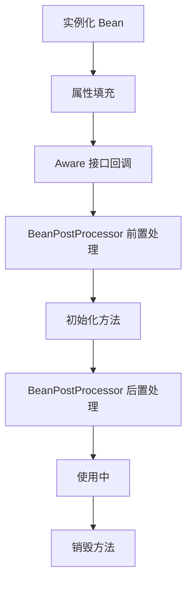

**完整生命周期**：
1. 实例化（构造方法）
2. 属性填充（依赖注入）
3. Aware 接口回调：
   - BeanNameAware
   - BeanClassLoaderAware
   - BeanFactoryAware
   - EnvironmentAware
   - ApplicationContextAware
4. BeanPostProcessor.postProcessBeforeInitialization
5. 初始化：
   - @PostConstruct
   - InitializingBean.afterPropertiesSet
   - init-method
6. BeanPostProcessor.postProcessAfterInitialization
7. 使用中
8. 销毁：
   - @PreDestroy
   - DisposableBean.destroy
   - destroy-method

```java
@Component
public class MyBean implements BeanNameAware, InitializingBean, DisposableBean {

    @Override
    public void setBeanName(String name) {
        System.out.println("BeanNameAware: " + name);
    }

    @PostConstruct
    public void postConstruct() {
        System.out.println("@PostConstruct");
    }

    @Override
    public void afterPropertiesSet() {
        System.out.println("InitializingBean");
    }

    @PreDestroy
    public void preDestroy() {
        System.out.println("@PreDestroy");
    }

    @Override
    public void destroy() {
        System.out.println("DisposableBean");
    }
}
```

---

> 💡 **深度讲解**：Bean 作用域有六种：singleton（默认，全局唯一实例，注意线程安全问题，无状态 bean 安全，有状态 bean 需注意）、prototype（每次获取创建新实例，Spring 不管理其完整生命周期，销毁方法不调用）、request（Web 环境，每个 HTTP 请求一个实例）、session（每个会话一个实例）、application（ServletContext 级别）、websocket。Bean 生命周期是面试高频，完整流程：实例化（调用构造器）→属性注入（@Autowired 依赖注入）→Aware 接口回调（BeanNameAware/BeanFactoryAware/ApplicationContextAware）→BeanPostProcessor 前置处理（postProcessBeforeInitialization）→初始化（@PostConstruct→InitializingBean.afterPropertiesSet→init-method）→BeanPostProcessor 后置处理（postProcessAfterInitialization，AOP 代理在此生成）→使用→销毁（@PreDestroy→DisposableBean.destroy→destroy-method）。BeanPostProcessor 是 Spring 最重要的扩展点，很多功能基于它实现：AOP（AbstractAutoProxyCreator）、@Autowired 注入（AutowiredAnnotationBeanPostProcessor）、@Value 注入等。理解生命周期是理解 Spring 扩展机制的基础。
>
> **📝 精简总结**：作用域 singleton 默认/prototype/request/session；生命周期：实例化→属性注入→Aware→BPP前置→初始化（@PostConstruct/InitializingBean/init-method）→BPP后置→使用→销毁（@PreDestroy/DisposableBean/destroy-method）；BeanPostProcessor 是 AOP 和依赖注入的基础扩展点。

---

## 56. AOP 面向切面编程


> 🔍 **知识点深度解析**
>
> **作用**：Bean生命周期：实例化→属性填充→Aware接口回调（BeanNameAware/ApplicationContextAware）→BeanPostProcessor前置处理→初始化（@PostConstruct/InitializingBean/init-method）→BeanPostProcessor后置处理→使用→销毁（@PreDestroy/DisposableBean/destroy-method）。
>
> **原理**：Spring IoC容器通过BeanDefinition描述Bean元数据，实例化后用反射注入依赖属性，Aware回调注入容器引用，BeanPostProcessor在初始化前后做增强（AOP代理对象在此阶段创建），完整生命周期由容器统一管理，销毁时回调销毁方法释放资源。
>
> **用法要点**：① Bean生命周期：实例化→属性填充→Aware接口回调（BeanNameAware/ApplicationContextAware）→BeanPostProcessor前置处理→初始化（@PostConstruct/InitializingBean/init-method）→BeanPostProcessor后置处理→使用→销毁（@PreDestroy/DisposableBean/destroy-method）

### 56.1 AOP 核心概念

| 概念 | 说明 |
|------|------|
| 切面（Aspect） | 横切关注点的模块化（如日志、事务） |
| 连接点（JoinPoint） | 程序执行的某个点（方法执行、异常抛出） |
| 切点（Pointcut） | 匹配连接点的表达式 |
| 通知（Advice） | 在连接点执行的动作 |
| 织入（Weaving） | 将切面应用到目标对象的过程 |
| 目标对象（Target） | 被代理的对象 |
| 代理（Proxy） | AOP 框架创建的对象 |


> 🔍 **知识点深度解析**
>
> **作用**：AOP核心概念：切面（Aspect。
>
> **原理**：横切逻辑类）、切点（Pointcut。
>
> **用法要点**：① AOP核心概念：切面（Aspect ② 横切逻辑类）、切点（Pointcut ③ 匹配哪些方法）、通知（Advice ④ 何时执行什么逻辑）、连接点（JoinPoint ⑤ 被拦截的方法）、织入（Weaving ⑥ 编译期/类加载期/运行期）

### 56.2 五种通知类型

| 通知 | 注解 | 执行时机 |
|------|------|---------|
| 前置通知 | @Before | 方法执行前 |
| 后置通知 | @After | 方法执行后（无论异常） |
| 返回通知 | @AfterReturning | 方法正常返回后 |
| 异常通知 | @AfterThrowing | 方法抛出异常后 |
| 环绕通知 | @Around | 方法执行前后（最强大） |


> 🔍 **知识点深度解析**
>
> **作用**：五种通知类型：@Before（方法前）。
>
> **原理**：@Around（环绕、最强大、可控制是否执行原方法）。。
>
> **用法要点**：① 五种通知类型：@Before（方法前） ② @After（方法后、无论异常） ③ @AfterReturning（正常返回后） ④ @AfterThrowing（异常后） ⑤ @Around（环绕、最强大、可控制是否执行原方法）

### 56.3 切面示例

```java
@Aspect
@Component
public class LogAspect {

    // 切点定义
    @Pointcut("execution(* com.example.service..*.*(..))")
    public void servicePointcut() { }

    // 前置通知
    @Before("servicePointcut()")
    public void before(JoinPoint joinPoint) {
        String methodName = joinPoint.getSignature().getName();
        Object[] args = joinPoint.getArgs();
        System.out.println("方法执行前: " + methodName + ", 参数: " + Arrays.toString(args));
    }

    // 返回通知
    @AfterReturning(pointcut = "servicePointcut()", returning = "result")
    public void afterReturning(JoinPoint joinPoint, Object result) {
        System.out.println("方法返回: " + result);
    }

    // 异常通知
    @AfterThrowing(pointcut = "servicePointcut()", throwing = "ex")
    public void afterThrowing(JoinPoint joinPoint, Exception ex) {
        System.out.println("方法异常: " + ex.getMessage());
    }

    // 环绕通知
    @Around("servicePointcut()")
    public Object around(ProceedingJoinPoint joinPoint) throws Throwable {
        long start = System.currentTimeMillis();
        Object result = joinPoint.proceed();  // 执行目标方法
        long end = System.currentTimeMillis();
        System.out.println("方法耗时: " + (end - start) + "ms");
        return result;
    }
}
```


> 🔍 **知识点深度解析**
>
> **作用**：切面示例：@Aspect + @Component声明切面，@Pointcut定义切点（execution表达式），@Around环绕通知（ProceedingJoinPoint.proceed()执行原方法）。
>
> **原理**：用于日志、事务、权限、性能监控。
>
> **用法要点**：① 切面示例：@Aspect + @Component声明切面，@Pointcut定义切点（execution表达式），@Around环绕通知（ProceedingJoinPoint.proceed()执行原方法） ② 用于日志、事务、权限、性能监控

### 56.4 切点表达式

```java
// execution：方法执行
execution(public * com.example.service.*.*(..))

// within：指定类/包
within(com.example.service.*)
within(com.example.service..*)

// this：代理对象类型
this(com.example.service.UserService)

// target：目标对象类型
target(com.example.service.UserService)

// args：方法参数
args(java.lang.String, ..)

// @annotation：方法上有指定注解
@annotation(org.springframework.transaction.annotation.Transactional)

// @within：类上有指定注解
@within(org.springframework.stereotype.Service)

// 组合
@Pointcut("execution(* com.example..*.*(..)) && @annotation(com.example.Log)")
```


> 🔍 **知识点深度解析**
>
> **作用**：切点表达式：execution(返回类型 包.类.方法(参数))，*通配符，..任意参数/包。
>
> **原理**：@annotation(注解)匹配有注解的方法。
>
> **用法要点**：① 切点表达式：execution(返回类型 包.类.方法(参数))，*通配符，..任意参数/包 ② @annotation(注解)匹配有注解的方法 ③ @within(注解)匹配类有注解 ④ bean(bean名)匹配指定Bean

### 56.5 动态代理

<div style="background:linear-gradient(135deg,#fa709a,#fee140);border-radius:16px;padding:20px;margin:16px 0;font-family:-apple-system,'Segoe UI','PingFang SC','Microsoft YaHei',sans-serif;color:#1a1a2e;overflow:hidden;box-shadow:0 6px 20px rgba(0,0,0,.08),0 2px 6px rgba(0,0,0,.04)">
<style>@keyframes aopCall{0%{transform:translateX(0);opacity:.5}50%{transform:translateX(4px);opacity:1}100%{transform:translateX(0);opacity:.5}}@keyframes adviceRun{0%,100%{background:rgba(255,255,255,.3)}50%{background:rgba(255,100,100,.4)}}.aop-node{display:inline-block;background:rgba(255,255,255,.4);border:2px solid #e63946;border-radius:8px;padding:8px 12px;margin:4px;text-align:center;font-weight:600;font-size:12px;vertical-align:middle;animation:aopCall 3s ease-in-out infinite}.aop-arrow{display:inline-block;font-size:18px;vertical-align:middle;animation:aopCall 2s ease-in-out infinite}.aop-advice{background:rgba(255,255,255,.3);border-radius:6px;box-shadow:0 2px 8px rgba(0,0,0,.08);padding:5px 10px;margin:3px 0;font-size:11px;animation:adviceRun 2s ease-in-out infinite}.aop-advice:nth-child(2){animation-delay:.3s}.aop-advice:nth-child(3){animation-delay:.6s}.aop-advice:nth-child(4){animation-delay:.9s}.aop-advice:nth-child(5){animation-delay:1.2s}</style>
<div style="text-align:center;font-size:15px;font-weight:700;margin-bottom:14px;padding-bottom:10px;border-bottom:1.5px solid rgba(255,255,255,.22);letter-spacing:1px;text-shadow:0 1px 3px rgba(0,0,0,.12)">Spring AOP 动态代理原理</div>
<div style="text-align:center;white-space:nowrap;overflow-x:auto">
<span class="aop-node">Caller 调用方</span><span class="aop-arrow">→</span><span class="aop-node" style="border-color:#6c5ce7;background:rgba(108,92,231,.2)">Proxy 代理对象</span><span class="aop-arrow">→</span><span class="aop-node">Target 目标对象</span>
</div>
<div style="margin-top:10px;background:rgba(255,255,255,.2);border-radius:8px;box-shadow:0 2px 8px rgba(0,0,0,.08);padding:8px">
<div style="font-size:12px;font-weight:600;margin-bottom:4px">通知执行顺序（@Around 包裹其他通知）：</div>
<div class="aop-advice">@Around 前置 → @Before → 目标方法执行 → @AfterReturning / @AfterThrowing → @After → @Around 后置</div>
</div>
<div style="text-align:center;font-size:11px;margin-top:8px">
<span style="background:rgba(255,255,255,.3);border-radius:4px;box-shadow:0 2px 8px rgba(0,0,0,.08);padding:2px 8px;margin:0 4px">JDK 动态代理：基于接口（InvocationHandler）</span>
<span style="background:rgba(255,255,255,.3);border-radius:4px;box-shadow:0 2px 8px rgba(0,0,0,.08);padding:2px 8px;margin:0 4px">CGLIB：基于继承（MethodInterceptor），Spring Boot 2.x 默认</span>
</div>
</div>

- **JDK 动态代理**：目标类有接口时使用
- **CGLIB 动态代理**：目标类无接口时使用（通过继承）

Spring AOP 默认策略：有接口用 JDK 动态代理，无接口用 CGLIB。

Spring Boot 2.x 默认使用 CGLIB（`spring.aop.proxy-target-class=true`）。

---

> 💡 **深度讲解**：AOP（面向切面编程）是 Spring 的第二大核心，用于处理横切关注点（日志、事务、权限、监控等），不侵入业务代码。核心概念：切面（Aspect，横切逻辑的封装）、连接点（JoinPoint，可被拦截的方法）、切点（PointCut，匹配哪些连接点）、通知（Advice，切面的具体逻辑）、织入（Weaving，把切面应用到目标对象创建代理的过程）。五种通知：@Before（前置，方法执行前）、@AfterReturning（返回后，正常返回时）、@AfterThrowing（异常后，抛异常时）、@After（最终，不管是否异常都执行，类似 finally）、@Around（环绕，最强大，可控制方法是否执行、修改参数和返回值）。执行顺序：Around 前→Before→方法执行→AfterReturning/AfterThrowing→After→Around 后。切点表达式最常用 execution(* com.example..*.*(..))，表示 com.example 包下所有类的所有方法。动态代理两种实现：JDK 动态代理（基于接口，目标类必须有接口，生成实现接口的代理类）、CGLIB（基于继承，生成目标类的子类，不能代理 final 类/方法）。Spring AOP 默认有接口用 JDK，无接口用 CGLIB，Spring Boot 2.x 默认强制 CGLIB。AOP 是声明式事务 @Transactional 的底层实现。
>
> **📝 精简总结**：AOP 五种通知 Before/AfterReturning/AfterThrowing/After/Around，@Around 最强大；execution 切点表达式；有接口 JDK 代理，无接口 CGLIB 代理，Spring Boot 2.x 默认 CGLIB；AOP 用于横切关注点（日志/事务/权限），是 @Transactional 的底层。

---

## 57. 常用注解

<div style="background:linear-gradient(135deg,#fa709a,#fee140);border-radius:16px;padding:20px;margin:16px 0;font-family:-apple-system,'Segoe UI','PingFang SC','Microsoft YaHei',sans-serif;color:#1a1a2e;overflow:hidden;box-shadow:0 6px 20px rgba(0,0,0,.08),0 2px 6px rgba(0,0,0,.04)">
<style>@keyframes annoFlow{0%,100%{transform:scale(1);opacity:.85}50%{transform:scale(1.03);opacity:1}}.anno-cat{display:inline-block;width:30%;vertical-align:top;margin:0 1%;background:rgba(255,255,255,.35);border-radius:8px;box-shadow:0 2px 8px rgba(0,0,0,.08);padding:8px;font-size:10px;text-align:center;animation:annoFlow 3s ease-in-out infinite}.anno-cat:nth-child(2){animation-delay:.5s}.anno-cat:nth-child(3){animation-delay:1s}.anno-title{font-weight:700;font-size:11px;margin-bottom:4px;padding:3px;border-radius:4px;color:#fff}.anno-item{background:rgba(255,255,255,.3);border-radius:3px;box-shadow:0 2px 8px rgba(0,0,0,.08);padding:2px 4px;margin:2px 0;font-size:9px}</style>
<div style="text-align:center;font-size:15px;font-weight:700;margin-bottom:14px;padding-bottom:10px;border-bottom:1.5px solid rgba(255,255,255,.22);letter-spacing:1px;text-shadow:0 1px 3px rgba(0,0,0,.12)">Spring 常用注解分类</div>
<div style="text-align:center">
<div class="anno-cat"><div class="anno-title" style="background:#e63946">组件注册</div><div class="anno-item">@Component / @Service</div><div class="anno-item">@Repository / @Controller</div><div class="anno-item">@Configuration + @Bean</div></div>
<div class="anno-cat"><div class="anno-title" style="background:#6c5ce7">依赖注入</div><div class="anno-item">@Autowired / @Resource</div><div class="anno-item">@Qualifier / @Value</div><div class="anno-item">@ConfigurationProperties</div></div>
<div class="anno-cat"><div class="anno-title" style="background:#00b894">条件/环境</div><div class="anno-item">@Conditional / @Profile</div><div class="anno-item">@Primary / @Lazy</div><div class="anno-item">@Scope / @DependsOn</div></div>
</div>
</div>


> 🔍 **知识点深度解析**
>
> **作用**：动态代理：Spring AOP基于动态代理。
>
> **原理**：JDK动态代理（目标实现接口，Proxy+InvocationHandler）、CGLIB（继承目标类，无接口也可，Spring Boot 2.x默认CGLIB）。
>
> **用法要点**：① 动态代理：Spring AOP基于动态代理 ② JDK动态代理（目标实现接口，Proxy+InvocationHandler）、CGLIB（继承目标类，无接口也可，Spring Boot 2.x默认CGLIB） ③ 同类方法调用AOP不生效（代理问题）

### 57.1 组件注册

| 注解 | 说明 |
|------|------|
| @Component | 通用组件 |
| @Service | 业务层组件 |
| @Repository | 数据访问层组件 |
| @Controller | 控制层组件 |
| @RestController | REST 控制层（@Controller + @ResponseBody） |
| @Configuration | 配置类 |
| @Bean | 方法级别的 Bean 定义 |
| @ComponentScan | 组件扫描 |


> 🔍 **知识点深度解析**
>
> **作用**：组件注册：@Component（通用组件）。
>
> **原理**：@Service（业务层）。
>
> **用法要点**：① 组件注册：@Component（通用组件） ② @Service（业务层） ③ @Repository（DAO层） ④ @Controller（控制层） ⑤ @Configuration（配置类） ⑥ @Bean（方法返回Bean） ⑦ @ComponentScan（扫描包）

### 57.2 依赖注入

| 注解 | 说明 |
|------|------|
| @Autowired | 按类型注入（Spring） |
| @Resource | 按名称注入（JSR-250） |
| @Inject | 按类型注入（JSR-330） |
| @Qualifier | 指定注入的 Bean 名称 |
| @Value | 注入配置值 |
| @ConfigurationProperties | 批量注入配置 |


> 🔍 **知识点深度解析**
>
> **作用**：依赖注入：@Autowired（按类型）、@Qualifier（按名称）、@Resource（按名称再类型）、@Value（注入配置值/SpEL）、@Inject（JSR-330，同@Autowired）。
>
> **原理**：构造器注入推荐。
>
> **用法要点**：① 依赖注入：@Autowired（按类型）、@Qualifier（按名称）、@Resource（按名称再类型）、@Value（注入配置值/SpEL）、@Inject（JSR-330，同@Autowired） ② 构造器注入推荐

### 57.3 配置相关

```java
@Configuration
@PropertySource("classpath:application.properties")
public class AppConfig {

    @Value("${app.name}")
    private String appName;

    @Bean
    public MyBean myBean() {
        return new MyBean();
    }
}

// @ConfigurationProperties
@Component
@ConfigurationProperties(prefix = "app")
public class AppProperties {
    private String name;
    private int port;
    // getter/setter
}
```


> 🔍 **知识点深度解析**
>
> **作用**：配置相关：@Configuration（配置类）。
>
> **原理**：@PropertySource（加载properties）。
>
> **用法要点**：① 配置相关：@Configuration（配置类） ② @PropertySource（加载properties） ③ @ConfigurationProperties（批量绑定配置） ④ @Profile（环境隔离） ⑤ @Conditional（条件注册） ⑥ @Import（导入配置类）

### 57.4 Web 相关

| 注解 | 说明 |
|------|------|
| @RequestMapping | 请求映射 |
| @GetMapping | GET 请求 |
| @PostMapping | POST 请求 |
| @PutMapping | PUT 请求 |
| @DeleteMapping | DELETE 请求 |
| @PathVariable | 路径参数 |
| @RequestParam | 请求参数 |
| @RequestBody | 请求体 |
| @ResponseBody | 响应体 |
| @RequestHeader | 请求头 |
| @CookieValue | Cookie 值 |
| @CrossOrigin | 跨域 |


> 🔍 **知识点深度解析**
>
> **作用**：Web相关：@RestController（@Controller+@ResponseBody）。
>
> **原理**：@RequestMapping/@GetMapping/@PostMapping。
>
> **用法要点**：① Web相关：@RestController（@Controller+@ResponseBody） ② @RequestMapping/@GetMapping/@PostMapping ③ @RequestParam/@PathVariable/@RequestBody/@RequestHeader ④ @CookieValue、@ResponseStatus

### 57.5 事务与缓存

| 注解 | 说明 |
|------|------|
| @Transactional | 事务管理 |
| @Cacheable | 缓存读取 |
| @CachePut | 缓存更新 |
| @CacheEvict | 缓存清除 |
| @Caching | 组合缓存操作 |
| @EnableCaching | 开启缓存 |


> 🔍 **知识点深度解析**
>
> **作用**：事务与缓存：@Transactional（声明式事务）。
>
> **原理**：@Cacheable（缓存查询）。
>
> **用法要点**：① 事务与缓存：@Transactional（声明式事务） ② @Cacheable（缓存查询） ③ @CachePut（更新缓存） ④ @CacheEvict（清除缓存） ⑤ @Caching（组合缓存操作） ⑥ @EnableCaching（开启缓存）

### 57.6 其他常用

| 注解 | 说明 |
|------|------|
| @Async | 异步方法 |
| @Scheduled | 定时任务 |
| @EnableAsync | 开启异步 |
| @EnableScheduling | 开启定时任务 |
| @Conditional | 条件装配 |
| @Profile | 环境配置 |
| @Lazy | 延迟加载 |
| @Scope | 作用域 |
| @Primary | 优先注入 |
| @Order | 排序 |

---

> 💡 **深度讲解**：Spring 注解是开发中最常用的，分为几大类：组件注册（@Component/@Service/@Repository/@Controller，本质都是 @Component，只是语义区分）、配置类（@Configuration+@Bean，@Bean 用于注册方法返回值为 bean，适合注册第三方类）、依赖注入（@Autowired 按类型、@Resource 按名称、@Qualifier 指定名称、@Value 注入配置值）、配置绑定（@ConfigurationProperties 批量注入配置，比 @Value 更优雅，支持松散绑定和类型安全）、条件装配（@Conditional 系列，Spring Boot 自动配置核心，@ConditionalOnClass/@ConditionalOnMissingBean/@ConditionalOnProperty 等）、多环境（@Profile 按环境注册 bean）、其他（@Import 导入配置类、@PropertySource 导入配置文件、@Lazy 懒加载、@Scope 作用域、@Primary 优先注入、@Order 排序）。@ConfigurationProperties 是 Spring Boot 的亮点，配合 @EnableConfigurationProperties 或 @ConfigurationPropertiesScan 使用，将 yml 配置绑定到 Java 对象，类型安全。@Conditional 系列是理解 Spring Boot 自动配置原理的关键，自动配置类就是通过这些条件注解判断是否需要注册某个 bean。
>
> **📝 精简总结**：@Component 系列注册组件，@Configuration+@Bean 注册方法返回值；@Value 单个注入，@ConfigurationProperties 批量注入类型安全；@Conditional 系列条件装配是 Spring Boot 自动配置核心；@Profile 多环境，@Lazy 懒加载，@Primary 优先注入。

---

## 58. 事务管理


> 🔍 **知识点深度解析**
>
> **作用**：其他常用：@Aspect（切面）。
>
> **原理**：@Async（异步方法）、@EventListener（事件监听）。
>
> **用法要点**：① 其他常用：@Aspect（切面） ② @Scheduled（定时任务） ③ @Async（异步方法）、@EventListener（事件监听） ④ @Order（排序）、@Lazy（懒加载） ⑤ @Scope（作用域）、@Primary（优先注入）

### 58.1 声明式事务

```java
@Service
public class UserService {

    @Transactional(
        rollbackFor = Exception.class,
        propagation = Propagation.REQUIRED,
        isolation = Isolation.REPEATABLE_READ,
        timeout = 30,
        readOnly = false
    )
    public void transfer(Long fromId, Long toId, BigDecimal amount) {
        // 业务逻辑
    }
}
```


> 🔍 **知识点深度解析**
>
> **作用**：声明式事务：@Transactional注解，Spring AOP实现（代理）。
>
> **原理**：方法执行前开启事务，正常提交，异常回滚。
>
> **用法要点**：① 声明式事务：@Transactional注解，Spring AOP实现（代理） ② 方法执行前开启事务，正常提交，异常回滚 ③ 比编程式事务简洁 ④ 注意失效场景（同类调用/非public/异常被catch）

### 58.2 事务传播行为

见 [47.3 Spring 事务传播行为](#473-spring-事务传播行为)


> 🔍 **知识点深度解析**
>
> **作用**：事务传播行为：REQUIRED（默认，有则加入无则新建）、REQUIRES_NEW（新建挂起当前）、NESTED（嵌套savepoint）、SUPPORTS/NOT_SUPPORTED/MANDATORY/NEVER。
>
> **原理**：根据业务场景选择。
>
> **用法要点**：① 事务传播行为：REQUIRED（默认，有则加入无则新建）、REQUIRES_NEW（新建挂起当前）、NESTED（嵌套savepoint）、SUPPORTS/NOT_SUPPORTED/MANDATORY/NEVER ② 根据业务场景选择

### 58.3 事务回滚规则

- 默认回滚：RuntimeException 和 Error
- 默认不回滚：受检异常（Exception）
- `rollbackFor = Exception.class`：所有异常都回滚
- `noRollbackFor`：指定异常不回滚

```java
@Transactional(rollbackFor = Exception.class)
public void method() throws Exception {
    // 受检异常也会回滚
}
```


> 🔍 **知识点深度解析**
>
> **作用**：事务回滚规则：默认RuntimeException和Error回滚，检查异常（Exception）不回滚。
>
> **原理**：rollbackFor=Exception.class指定所有异常回滚。
>
> **用法要点**：① 事务回滚规则：默认RuntimeException和Error回滚，检查异常（Exception）不回滚 ② rollbackFor=Exception.class指定所有异常回滚 ③ noRollbackFor指定不回滚异常 ④ try-catch吞异常导致不回滚

### 58.4 @Transactional 失效场景

见 [47.5 @Transactional 失效场景](#475-transactional-失效场景)


> 🔍 **知识点深度解析**
>
> **作用**：@Transactional失效场景：非public方法。
>
> **原理**：同类方法内部调用（AOP代理不生效）。
>
> **用法要点**：① @Transactional失效场景：非public方法 ② 同类方法内部调用（AOP代理不生效） ③ 异常被catch未抛出、rollbackFor未配置（检查异常不回滚） ④ 数据库引擎不支持事务（MyISAM）、类未被Spring管理

### 58.5 编程式事务

```java
@Autowired
private TransactionTemplate transactionTemplate;

public void method() {
    transactionTemplate.execute(status -> {
        try {
            // 业务逻辑
            return null;
        } catch (Exception e) {
            status.setRollbackOnly();
            throw e;
        }
    });
}
```

---

> 💡 **深度讲解**：Spring 事务管理分为声明式事务（@Transactional，基于 AOP，最常用）和编程式事务（TransactionTemplate 或 PlatformTransactionManager，灵活但代码侵入）。@Transactional 核心参数：rollbackFor（默认只回滚 RuntimeException 和 Error，建议设 Exception.class 覆盖受检异常）、propagation（传播行为，默认 REQUIRED）、isolation（隔离级别，默认用数据库默认）、timeout（超时秒数）、readOnly（只读优化，查询方法设 true 可优化）、noRollbackFor（哪些异常不回滚）。事务原理：AOP 拦截目标方法，方法执行前开启事务，正常执行完 commit，抛异常且符合回滚规则则 rollback。@Transactional 失效场景和知识点47一致，最常见的是同类内部调用（this.method() 不走代理）和异常被 catch 吞掉。事务传播行为中 REQUIRED（有则加入无则新建）和 REQUIRES_NEW（总是新建，挂起当前）最常用，区别是 REQUIRED 在同一个事务中，一个回滚都回滚；REQUIRES_NEW 是独立事务，互不影响。注意 @Transactional 加在接口方法上只有基于接口的代理才生效，CGLIB 代理不生效，建议加在实现类方法上。
>
> **📝 精简总结**：声明式 @Transactional 基于 AOP，编程式 TransactionTemplate 灵活；rollbackFor 建议设 Exception.class；readOnly 只读优化查询；同类内部调用事务失效（不走代理）；默认 REQUIRED 传播，REQUIRES_NEW 独立事务互不影响；异常被吞不回滚。

---

## 59. Spring 缓存 @Cacheable / Redis


> 🔍 **知识点深度解析**
>
> **作用**：编程式事务：TransactionTemplate（execute回调）或PlatformTransactionManager（手动begin/commit/rollback）。
>
> **原理**：适合需要精细控制事务边界的场景。
>
> **用法要点**：① 编程式事务：TransactionTemplate（execute回调）或PlatformTransactionManager（手动begin/commit/rollback） ② 适合需要精细控制事务边界的场景 ③ 比声明式灵活但代码繁琐

### 59.1 缓存注解

```java
@Service
public class UserService {

    // 查询缓存：先查缓存，没有则执行方法并缓存结果
    @Cacheable(value = "users", key = "#id")
    public User findById(Long id) {
        return userRepository.findById(id).orElse(null);
    }

    // 更新缓存：执行方法后更新缓存
    @CachePut(value = "users", key = "#user.id")
    public User update(User user) {
        return userRepository.save(user);
    }

    // 清除缓存：执行方法后清除缓存
    @CacheEvict(value = "users", key = "#id")
    public void delete(Long id) {
        userRepository.deleteById(id);
    }

    // 清除所有缓存
    @CacheEvict(value = "users", allEntries = true)
    public void clearAll() { }

    // 组合缓存操作
    @Caching(
        cacheable = @Cacheable(value = "users", key = "#id"),
        evict = @CacheEvict(value = "userList", allEntries = true)
    )
    public User findAndClear(Long id) {
        return findById(id);
    }
}
```


> 🔍 **知识点深度解析**
>
> **作用**：缓存注解：@Cacheable（查询缓存，有则返回无则执行并缓存）、@CachePut（更新缓存，每次执行方法并更新）、@CacheEvict（清除缓存）、@Caching（组合）、@CacheConfig（类级公共配置）。
>
> **原理**：@EnableCaching开启。
>
> **用法要点**：① 缓存注解：@Cacheable（查询缓存，有则返回无则执行并缓存）、@CachePut（更新缓存，每次执行方法并更新）、@CacheEvict（清除缓存）、@Caching（组合）、@CacheConfig（类级公共配置） ② @EnableCaching开启

### 59.2 缓存三大问题

<div style="background:linear-gradient(135deg,#ff9a9e,#fecfef);border-radius:16px;padding:20px;margin:16px 0;font-family:-apple-system,'Segoe UI','PingFang SC','Microsoft YaHei',sans-serif;color:#1a1a2e;overflow:hidden;box-shadow:0 6px 20px rgba(0,0,0,.08),0 2px 6px rgba(0,0,0,.04)">
<style>@keyframes cacheHit{0%,100%{transform:translateX(0);opacity:.6}50%{transform:translateX(4px);opacity:1}}.cache-prob{display:inline-block;width:31%;vertical-align:top;margin:0 1%;background:rgba(255,255,255,.35);border-radius:8px;box-shadow:0 2px 8px rgba(0,0,0,.08);padding:8px;font-size:10px;animation:cacheHit 3s ease-in-out infinite}.cache-prob:nth-child(2){animation-delay:.5s}.cache-prob:nth-child(3){animation-delay:1s}.cache-title{font-weight:700;font-size:12px;text-align:center;margin-bottom:4px;padding:3px;border-radius:4px;color:#fff}.cache-fix{background:rgba(255,255,255,.3);border-radius:4px;box-shadow:0 2px 8px rgba(0,0,0,.08);padding:3px 6px;margin-top:4px;font-size:10px}</style>
<div style="text-align:center;font-size:15px;font-weight:700;margin-bottom:14px;padding-bottom:10px;border-bottom:1.5px solid rgba(255,255,255,.22);letter-spacing:1px;text-shadow:0 1px 3px rgba(0,0,0,.12)">缓存三大问题对比</div>
<div style="text-align:center">
<div class="cache-prob"><div class="cache-title" style="background:#e63946">缓存穿透</div>查询不存在的数据<br>请求直达数据库<div class="cache-fix">布隆过滤器 / 缓存空值（短过期）</div></div>
<div class="cache-prob"><div class="cache-title" style="background:#f59e0b">缓存击穿</div>热点 key 过期瞬间<br>大量请求打数据库<div class="cache-fix">互斥锁 / 热点 key 永不过期</div></div>
<div class="cache-prob"><div class="cache-title" style="background:#8b5cf6">缓存雪崩</div>大量 key 同时过期 / 缓存宕机<div class="cache-fix">过期时间加随机值 / 多级缓存 / 熔断降级</div></div>
</div>
</div>

#### 缓存穿透

**问题**：查询不存在的数据，请求直接打到数据库。

**解决方案**：
1. 缓存空值
2. 布隆过滤器（Bloom Filter）

```java
// 缓存空值
@Cacheable(value = "users", key = "#id", unless = "#result == null")
// 注意：unless 不缓存 null，需要手动缓存空对象或使用 CacheNull
```

#### 缓存击穿

**问题**：热点 key 过期瞬间，大量请求打到数据库。

**解决方案**：
1. 互斥锁（分布式锁）
2. 热点数据永不过期

```java
public User findByIdWithLock(Long id) {
    String cacheKey = "user:" + id;
    User user = redisTemplate.opsForValue().get(cacheKey);
    if (user != null) return user;

    String lockKey = "lock:user:" + id;
    try {
        Boolean locked = redisTemplate.opsForValue()
            .setIfAbsent(lockKey, "1", 10, TimeUnit.SECONDS);
        if (Boolean.TRUE.equals(locked)) {
            user = userRepository.findById(id).orElse(null);
            redisTemplate.opsForValue().set(cacheKey, user, 1, TimeUnit.HOURS);
            return user;
        } else {
            Thread.sleep(100);
            return findByIdWithLock(id);  // 重试
        }
    } finally {
        redisTemplate.delete(lockKey);
    }
}
```

#### 缓存雪崩

**问题**：大量 key 同时过期，或缓存服务宕机，请求全部打到数据库。

**解决方案**：
1. 过期时间加随机值
2. 多级缓存（本地缓存 + 分布式缓存）
3. 缓存服务高可用（集群）
4. 限流降级

```java
// 随机过期时间
int ttl = 3600 + new Random().nextInt(600);  // 1小时 + 0~10分钟随机
redisTemplate.opsForValue().set(key, value, ttl, TimeUnit.SECONDS);
```


> 🔍 **知识点深度解析**
>
> **作用**：缓存三大问题：缓存穿透（查询不存在数据，布隆过滤器/缓存空值）、缓存击穿（热点key过期，互斥锁/永不过期）、缓存雪崩（大量key同时过期，随机过期时间/多级缓存）。
>
> **原理**：缓存一致性（先更新DB再删缓存）。
>
> **用法要点**：① 缓存三大问题：缓存穿透（查询不存在数据，布隆过滤器/缓存空值）、缓存击穿（热点key过期，互斥锁/永不过期）、缓存雪崩（大量key同时过期，随机过期时间/多级缓存） ② 缓存一致性（先更新DB再删缓存）

### 59.3 Redis 常用操作

```java
@Autowired
private RedisTemplate<String, Object> redisTemplate;

// String
redisTemplate.opsForValue().set("key", "value", 1, TimeUnit.HOURS);
Object value = redisTemplate.opsForValue().get("key");

// Hash
redisTemplate.opsForHash().put("hash", "field", "value");
redisTemplate.opsForHash().get("hash", "field");

// List
redisTemplate.opsForList().leftPush("list", "value");
redisTemplate.opsForList().rightPop("list");

// Set
redisTemplate.opsForSet().add("set", "value1", "value2");
redisTemplate.opsForSet().members("set");

// ZSet
redisTemplate.opsForZSet().add("zset", "value", 100.0);
redisTemplate.opsForZSet().rangeByScore("zset", 0, 100);

// 分布式锁
Boolean locked = redisTemplate.opsForValue()
    .setIfAbsent("lock:key", "value", 30, TimeUnit.SECONDS);
```


> 🔍 **知识点深度解析**
>
> **作用**：Redis常用操作：String（set/get/incr）、Hash（hset/hget，对象存储）、List（lpush/rpop，队列）、Set（sadd/smembers，去重）、ZSet（zadd/zrange，排序）。
>
> **原理**：分布式锁setnx。
>
> **用法要点**：① Redis常用操作：String（set/get/incr）、Hash（hset/hget，对象存储）、List（lpush/rpop，队列）、Set（sadd/smembers，去重）、ZSet（zadd/zrange，排序） ② 过期时间expire ③ 分布式锁setnx

### 59.4 多级缓存

```
请求 → 本地缓存（Caffeine）→ 分布式缓存（Redis）→ 数据库
```

- 本地缓存：速度快，容量小，存在数据不一致
- 分布式缓存：速度较快，容量大，数据一致

---

> 💡 **深度讲解**：Spring Cache 是缓存抽象层，通过注解统一操作不同缓存实现（ConcurrentMap 本地缓存、Redis 分布式缓存、Ehcache 等）。核心注解：@Cacheable（查询缓存，有缓存直接返回，没有执行方法并缓存结果）、@CachePut（更新缓存，总是执行方法并更新缓存，适合写操作）、@CacheEvict（清除缓存，allEntries=true 清除整个缓存）、@Caching（组合多个缓存操作）、@CacheConfig（类级别统一配置缓存名）。缓存三大问题是面试高频：缓存穿透（查询不存在的数据，请求直接打到数据库，解决方案：布隆过滤器预判、缓存空值并设短过期时间）、缓存击穿（热点 key 过期瞬间大量请求打到数据库，解决方案：互斥锁/分布式锁、热点 key 永不过期）、缓存雪崩（大量 key 同时过期或缓存服务宕机，解决方案：过期时间加随机值、多级缓存、服务熔断降级、Redis 高可用集群）。缓存与数据库一致性是经典难题，常用方案：Cache Aside Pattern（先更新数据库再删除缓存，最常用）、延迟双删（更新数据库前后各删一次缓存）、通过 binlog 异步更新缓存（Canal）。注意 @Cacheable 的 key 用 SpEL 表达式，序列化方式建议用 JSON 而非 JDK 序列化。
>
> **📝 精简总结**：@Cacheable 查询缓存，@CachePut 更新缓存，@CacheEvict 清除缓存；缓存穿透用布隆过滤器/空值，击穿用互斥锁/永不过期，雪崩用随机过期/多级缓存；缓存一致性用 Cache Aside（先更库再删缓存）；序列化用 JSON。

---

## 60. 事件机制与多环境配置


> 🔍 **知识点深度解析**
>
> **作用**：多级缓存：本地缓存（Caffeine/Guava Cache，速度快，容量小，多实例不一致）+ Redis（分布式缓存，容量大，共享）。
>
> **原理**：热点数据本地缓存，普通数据Redis。
>
> **用法要点**：① 多级缓存：本地缓存（Caffeine/Guava Cache，速度快，容量小，多实例不一致）+ Redis（分布式缓存，容量大，共享） ② 热点数据本地缓存，普通数据Redis ③ 缓存更新策略（Cache Aside）

### 60.1 Spring 事件机制

<div style="background:linear-gradient(135deg,#43e97b,#38f9d7);border-radius:16px;padding:20px;margin:16px 0;font-family:-apple-system,'Segoe UI','PingFang SC','Microsoft YaHei',sans-serif;color:#1a1a2e;overflow:hidden;box-shadow:0 6px 20px rgba(0,0,0,.08),0 2px 6px rgba(0,0,0,.04)">
<style>@keyframes evtFlow{0%,100%{transform:translateX(0);opacity:.6}50%{transform:translateX(4px);opacity:1}}.evt-node{display:inline-block;background:rgba(255,255,255,.35);border:2px solid #2d6a4f;border-radius:8px;padding:8px 12px;margin:4px;text-align:center;font-size:11px;font-weight:600;vertical-align:middle;animation:evtFlow 3s ease-in-out infinite}.evt-arrow{display:inline-block;font-size:16px;vertical-align:middle;animation:evtFlow 1.5s ease-in-out infinite}.evt-listener{background:rgba(255,255,255,.3);border-radius:4px;box-shadow:0 2px 8px rgba(0,0,0,.08);padding:3px 8px;margin:2px;font-size:10px}</style>
<div style="text-align:center;font-size:15px;font-weight:700;margin-bottom:14px;padding-bottom:10px;border-bottom:1.5px solid rgba(255,255,255,.22);letter-spacing:1px;text-shadow:0 1px 3px rgba(0,0,0,.12)">Spring 事件机制（观察者模式）</div>
<div style="text-align:center;white-space:nowrap;overflow-x:auto">
<span class="evt-node">发布者<br>Publisher</span><span class="evt-arrow">→ publishEvent()</span><span class="evt-node" style="border-color:#6c5ce7">事件<br>ApplicationEvent</span><span class="evt-arrow">→ 多播器</span><span class="evt-node">监听器<br>@EventListener</span>
</div>
<div style="text-align:center;margin-top:8px;font-size:11px">
<span class="evt-listener">默认同步执行</span><span class="evt-listener">@Async 异步执行</span><span class="evt-listener">@Order 控制顺序</span><span class="evt-listener">@TransactionalEventListener 事务后执行</span>
</div>
</div>

#### 自定义事件

```java
// 自定义事件
public class UserRegisterEvent extends ApplicationEvent {
    private final User user;

    public UserRegisterEvent(Object source, User user) {
        super(source);
        this.user = user;
    }

    public User getUser() { return user; }
}

// 发布事件
@Service
public class UserService {
    @Autowired
    private ApplicationEventPublisher publisher;

    public void register(User user) {
        // 保存用户
        userRepository.save(user);
        // 发布事件
        publisher.publishEvent(new UserRegisterEvent(this, user));
    }
}

// 监听事件
@Component
public class UserRegisterListener {

    @EventListener
    public void handleRegister(UserRegisterEvent event) {
        User user = event.getUser();
        // 发送欢迎邮件
        emailService.sendWelcomeEmail(user);
    }

    // 事务提交后监听
    @TransactionalEventListener(phase = TransactionPhase.AFTER_COMMIT)
    public void handleAfterCommit(UserRegisterEvent event) {
        // 事务提交后执行
    }
}
```

#### @TransactionalEventListener 阶段

| 阶段 | 说明 |
|------|------|
| AFTER_COMMIT | 事务提交后（默认） |
| AFTER_ROLLBACK | 事务回滚后 |
| AFTER_COMPLETION | 事务完成后（提交或回滚） |
| BEFORE_COMMIT | 事务提交前 |


> 🔍 **知识点深度解析**
>
> **作用**：Spring事件机制：ApplicationEvent事件、ApplicationEventPublisher发布、@EventListener监听。
>
> **原理**：解耦（发布者不关心监听者）。
>
> **用法要点**：① Spring事件机制：ApplicationEvent事件、ApplicationEventPublisher发布、@EventListener监听 ② 解耦（发布者不关心监听者） ③ 支持异步事件（@Async）、条件事件（condition）、事务事件（@TransactionalEventListener）

### 60.2 多环境配置 Profile

<div style="background:linear-gradient(135deg,#4facfe,#00f2fe);border-radius:16px;padding:20px;margin:16px 0;font-family:-apple-system,'Segoe UI','PingFang SC','Microsoft YaHei',sans-serif;color:#fff;overflow:hidden;box-shadow:0 8px 28px rgba(0,0,0,.14),0 3px 10px rgba(0,0,0,.08)">
<style>@keyframes profileFlow{0%,100%{transform:scale(1);opacity:.85}50%{transform:scale(1.03);opacity:1}}.profile-item{display:inline-block;width:22%;background:rgba(255,255,255,.15);border-radius:8px;box-shadow:0 2px 8px rgba(0,0,0,.08);padding:8px;text-align:center;font-size:11px;font-weight:600;animation:profileFlow 3s ease-in-out infinite}.profile-item:nth-child(2){animation-delay:.5s}.profile-item:nth-child(3){animation-delay:1s}.profile-item:nth-child(4){animation-delay:1.5s}.profile-arrow{display:inline-block;font-size:14px;vertical-align:middle;animation:profileFlow 1.5s ease-in-out infinite}</style>
<div style="text-align:center;font-size:15px;font-weight:700;margin-bottom:14px;padding-bottom:10px;border-bottom:1.5px solid rgba(255,255,255,.22);letter-spacing:1px;text-shadow:0 1px 3px rgba(0,0,0,.12)">Spring Boot 多环境配置（Profile）</div>
<div style="text-align:center;white-space:nowrap;overflow-x:auto">
<span class="profile-item">dev<br>开发</span><span class="profile-arrow">→</span>
<span class="profile-item">test<br>测试</span><span class="profile-arrow">→</span>
<span class="profile-item">staging<br>预发</span><span class="profile-arrow">→</span>
<span class="profile-item">prod<br>生产</span>
</div>
<div style="text-align:center;font-size:10px;opacity:.85;margin-top:6px">application-{profile}.yml；spring.profiles.active 激活；配置优先级：命令行 &gt; 环境变量 &gt; application-prod.yml &gt; application.yml</div>
</div>

#### YAML 多环境

```yaml
# application.yml
spring:
  profiles:
    active: dev  # 当前激活环境

---
# application-dev.yml
spring:
  datasource:
    url: jdbc:mysql://localhost:3306/dev
  redis:
    host: localhost
server:
  port: 8080

---
# application-prod.yml
spring:
  datasource:
    url: jdbc:mysql://prod-server:3306/prod
  redis:
    host: prod-redis
server:
  port: 80
```

#### @Profile 注解

```java
@Configuration
@Profile("dev")
public class DevConfig {
    // 开发环境配置
}

@Configuration
@Profile("prod")
public class ProdConfig {
    // 生产环境配置
}

@Service
@Profile("!prod")  // 非生产环境
public class MockService { }
```

#### 激活方式

```bash
# 命令行参数
java -jar app.jar --spring.profiles.active=prod

# 环境变量
SPRING_PROFILES_ACTIVE=prod java -jar app.jar

# JVM 参数
java -Dspring.profiles.active=prod -jar app.jar
```

---

> 💡 **深度讲解**：Spring 事件机制基于观察者模式，实现模块间解耦通信。核心三要素：ApplicationEvent（事件，继承该类定义自己的事件）、ApplicationListener（监听器，实现该接口或用 @EventListener 注解）、ApplicationEventPublisher（发布器，注入后调用 publishEvent 发布事件）。@EventListener 是注解式监听器，比实现接口更简洁，支持 condition 条件过滤、@Async 异步执行。事件默认是同步执行的，发布事件的线程会等待所有监听器执行完，异步需要在监听器方法上加 @Async 并开启 @EnableAsync，或自定义 ApplicationEventMulticaster 配置线程池。多环境配置是 Spring Boot 的核心功能，通过 application-{profile}.yml 定义不同环境配置（dev/test/prod），用 spring.profiles.active 激活指定环境，激活方式：配置文件、命令行参数 --spring.profiles.active=prod、环境变量 SPRING_PROFILES_ACTIVE、JVM 参数 -Dspring.profiles.active。@Profile 注解按环境注册 bean，如 @Profile("prod") 只在生产环境注册。配置文件加载优先级（从高到低）：命令行参数>JNDI>系统环境变量>application-{profile}.yml>application.yml，高优先级覆盖低优先级。Spring Cloud 中 bootstrap.yml 优先于 application.yml 加载，用于拉取远程配置。
>
> **📝 精简总结**：ApplicationEvent+@EventListener+ApplicationEventPublisher 实现事件驱动；事件默认同步，@Async 异步；多环境用 application-{profile}.yml，spring.profiles.active 激活；@Profile 按环境注册 bean；配置优先级命令行>环境变量>profile配置>默认配置。

---

## 61. Spring Boot 自动配置与启动流程


> 🔍 **知识点深度解析**
>
> **作用**：多环境配置Profile：@Profile("dev")指定Bean在特定环境激活，spring.profiles.active激活环境。
>
> **原理**：配置文件application-dev.yml/application-prod.yml。
>
> **用法要点**：① 多环境配置Profile：@Profile("dev")指定Bean在特定环境激活，spring.profiles.active激活环境 ② 配置文件application-dev.yml/application-prod.yml ③ @Profile也可注解类/方法

### 61.1 @SpringBootApplication

```java
@SpringBootApplication
public class Application {
    public static void main(String[] args) {
        SpringApplication.run(Application.class, args);
    }
}
```

**@SpringBootApplication 包含**：
- `@SpringBootConfiguration`：标记为配置类
- `@EnableAutoConfiguration`：开启自动配置
- `@ComponentScan`：组件扫描


> 🔍 **知识点深度解析**
>
> **作用**：@SpringBootApplication = @SpringBootConfiguration（配置类）+ @EnableAutoConfiguration（自动配置）+ @ComponentScan（组件扫描）。
>
> **原理**：启动类注解，约定优于配置，简化Spring开发。
>
> **用法要点**：① @SpringBootApplication = @SpringBootConfiguration（配置类）+ @EnableAutoConfiguration（自动配置）+ @ComponentScan（组件扫描） ② 启动类注解，约定优于配置，简化Spring开发

### 61.2 自动配置原理

1. `@EnableAutoConfiguration` 导入 `AutoConfigurationImportSelector`
2. 读取 `META-INF/spring/org.springframework.boot.autoconfigure.AutoConfiguration.imports`（Spring Boot 2.7+）
3. 加载所有自动配置类
4. 通过 `@Conditional` 系列注解条件化装配

#### @Conditional 系列

| 注解 | 说明 |
|------|------|
| @ConditionalOnClass | 类路径存在指定类 |
| @ConditionalOnMissingClass | 类路径不存在指定类 |
| @ConditionalOnBean | 容器中存在指定 Bean |
| @ConditionalOnMissingBean | 容器中不存在指定 Bean |
| @ConditionalOnProperty | 配置属性满足条件 |
| @ConditionalOnWebApplication | Web 应用环境 |
| @ConditionalOnNotWebApplication | 非 Web 应用环境 |
| @ConditionalOnExpression | SpEL 表达式为真 |
| @ConditionalOnJava | Java 版本满足 |

```java
@Configuration
@ConditionalOnClass(RedisOperations.class)
@EnableConfigurationProperties(RedisProperties.class)
public class RedisAutoConfiguration {

    @Bean
    @ConditionalOnMissingBean
    public RedisTemplate<Object, Object> redisTemplate(RedisConnectionFactory factory) {
        RedisTemplate<Object, Object> template = new RedisTemplate<>();
        template.setConnectionFactory(factory);
        return template;
    }
}
```


> 🔍 **知识点深度解析**
>
> **作用**：自动配置原理：@EnableAutoConfiguration通过SpringFactoriesLoader加载META-INF/spring/org.springframework.boot.autoconfigure.AutoConfiguration.imports中的自动配置类，@Conditional条件判断是否生效。
>
> **原理**：Spring Boot启动时@EnableAutoConfiguration导入AutoConfigurationImportSelector，通过SpringFactoriesLoader扫描classpath下META-INF中的自动配置类，@ConditionalOnClass/@ConditionalOnMissingBean/@ConditionalOnProperty等注解按类路径、Bean存在性、配置属性等条件筛选生效配置，实现约定大于配置。
>
> **用法要点**：① 自动配置原理：@EnableAutoConfiguration通过SpringFactoriesLoader加载META-INF/spring/org.springframework.boot.autoconfigure.AutoConfiguration.imports中的自动配置类，@Conditional条件判断是否生效

### 61.3 启动流程

<div style="background:linear-gradient(135deg,#667eea,#764ba2);border-radius:16px;padding:20px;margin:16px 0;font-family:-apple-system,'Segoe UI','PingFang SC','Microsoft YaHei',sans-serif;color:#fff;overflow:hidden;box-shadow:0 8px 28px rgba(0,0,0,.14),0 3px 10px rgba(0,0,0,.08)">
<style>@keyframes sbStep{0%{opacity:0;transform:translateY(-6px)}10%{opacity:1;transform:translateY(0)}90%{opacity:1}100%{opacity:.35}}.sb-step{background:rgba(255,255,255,.15);border-left:4px solid rgba(255,255,255,.6);border-radius:6px;padding:7px 12px;margin:5px 0;font-size:12px;font-weight:500;animation:sbStep 6s ease-in-out infinite}.sb-step:nth-child(2){animation-delay:.7s}.sb-step:nth-child(3){animation-delay:1.4s}.sb-step:nth-child(4){animation-delay:2.1s}.sb-step:nth-child(5){animation-delay:2.8s}.sb-step:nth-child(6){animation-delay:3.5s}.sb-num{display:inline-block;background:rgba(255,255,255,.3);border-radius:50%;width:20px;height:20px;text-align:center;line-height:20px;font-size:11px;font-weight:700;margin-right:6px}</style>
<div style="text-align:center;font-size:15px;font-weight:700;margin-bottom:14px;padding-bottom:10px;border-bottom:1.5px solid rgba(255,255,255,.22);letter-spacing:1px;text-shadow:0 1px 3px rgba(0,0,0,.12)">Spring Boot 启动流程（6 阶段）</div>
<div class="sb-step"><span class="sb-num">1</span>创建 SpringApplication — 推断应用类型（Servlet/Reactive）、加载 ApplicationContextInitializer 和 ApplicationListener</div>
<div class="sb-step"><span class="sb-num">2</span>准备 Environment — 加载 application.yml/properties、绑定属性、激活 Profile</div>
<div class="sb-step"><span class="sb-num">3</span>创建 ApplicationContext — 根据类型创建 AnnotationConfigServletWebServerApplicationContext</div>
<div class="sb-step"><span class="sb-num">4</span>刷新容器 refresh() — 执行 BeanFactoryPostProcessor、注册 BeanPostProcessor、实例化所有非懒加载单例 Bean、触发自动配置</div>
<div class="sb-step"><span class="sb-num">5</span>启动 Web 服务器 — Tomcat/Jetty/Undertow 初始化并监听端口</div>
<div class="sb-step"><span class="sb-num">6</span>执行 Runner — CommandLineRunner / ApplicationRunner 回调，应用就绪</div>
<div style="text-align:center;font-size:11px;opacity:.85;margin-top:8px">@SpringBootApplication = @Configuration + @EnableAutoConfiguration + @ComponentScan</div>
</div>

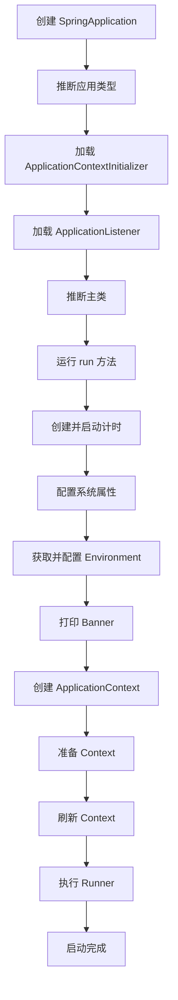

**关键步骤**：
1. 创建 SpringApplication，推断应用类型（Servlet/Reactive/None）
2. 运行 run()，准备环境（Environment）
3. 打印 Banner
4. 创建 ApplicationContext
5. 准备 Context（设置环境、注册 Bean、执行 Initializer）
6. 刷新 Context（BeanFactory 后置处理、注册 BeanPostProcessor、初始化单例）
7. 执行 CommandLineRunner 和 ApplicationRunner
8. 启动完成


> 🔍 **知识点深度解析**
>
> **作用**：启动流程：创建SpringApplication→准备环境（加载配置）→创建ApplicationContext→刷新容器（Bean创建）→执行CommandLineRunner/ApplicationRunner。
>
> **原理**：内嵌Tomcat启动在刷新容器过程中。
>
> **用法要点**：① 启动流程：创建SpringApplication→准备环境（加载配置）→创建ApplicationContext→刷新容器（Bean创建）→执行CommandLineRunner/ApplicationRunner ② 内嵌Tomcat启动在刷新容器过程中

### 61.4 Actuator 监控

<div style="background:linear-gradient(135deg,#84fab0,#8fd3f4);border-radius:16px;padding:20px;margin:16px 0;font-family:-apple-system,'Segoe UI','PingFang SC','Microsoft YaHei',sans-serif;color:#1a1a2e;overflow:hidden;box-shadow:0 6px 20px rgba(0,0,0,.08),0 2px 6px rgba(0,0,0,.04)">
<style>@keyframes actuatorFlow{0%,100%{transform:scale(1);opacity:.85}50%{transform:scale(1.03);opacity:1}}.act-endpoint{display:inline-block;width:22%;background:rgba(255,255,255,.35);border-radius:8px;box-shadow:0 2px 8px rgba(0,0,0,.08);padding:8px;text-align:center;font-size:10px;animation:actuatorFlow 3s ease-in-out infinite}.act-endpoint:nth-child(2){animation-delay:.5s}.act-endpoint:nth-child(3){animation-delay:1s}.act-endpoint:nth-child(4){animation-delay:1.5s}.act-name{font-weight:700;font-size:11px;color:#2d6a4f;margin-bottom:2px}.act-desc{font-size:9px;opacity:.8}</style>
<div style="text-align:center;font-size:15px;font-weight:700;margin-bottom:14px;padding-bottom:10px;border-bottom:1.5px solid rgba(255,255,255,.22);letter-spacing:1px;text-shadow:0 1px 3px rgba(0,0,0,.12)">Spring Boot Actuator 监控端点</div>
<div style="text-align:center">
<div class="act-endpoint"><div class="act-name">/health</div><div class="act-desc">健康检查<br>UP/DOWN</div></div>
<div class="act-endpoint"><div class="act-name">/info</div><div class="act-desc">应用信息<br>版本/描述</div></div>
<div class="act-endpoint"><div class="act-name">/metrics</div><div class="act-desc">性能指标<br>JVM/HTTP</div></div>
<div class="act-endpoint"><div class="act-name">/env</div><div class="act-desc">环境变量<br>配置属性</div></div>
</div>
<div style="text-align:center;font-size:10px;opacity:.7;margin-top:6px">Prometheus 抓取 metrics → Grafana 可视化；生产环境注意暴露端点的安全控制（management.endpoints.web.exposure.include）</div>
</div>

```xml
<dependency>
    <groupId>org.springframework.boot</groupId>
    <artifactId>spring-boot-starter-actuator</artifactId>
</dependency>
```

```yaml
management:
  endpoints:
    web:
      exposure:
        include: health,info,metrics,beans,mappings,env,heapdump
  endpoint:
    health:
      show-details: always
```

**常用端点**：

| 端点 | 说明 |
|------|------|
| /actuator/health | 健康检查 |
| /actuator/info | 应用信息 |
| /actuator/metrics | 指标信息 |
| /actuator/beans | Bean 列表 |
| /actuator/mappings | 请求映射 |
| /actuator/env | 环境变量 |
| /actuator/heapdump | 堆转储 |
| /actuator/loggers | 日志级别 |
| /actuator/threaddump | 线程转储 |


> 🔍 **知识点深度解析**
>
> **作用**：Actuator监控：spring-boot-starter-actuator，暴露端点（/actuator/health健康、/info信息、/metrics指标、/env环境、/beans Bean列表）。
>
> **原理**：management.endpoints.web.exposure.include配置暴露端点。
>
> **用法要点**：① Actuator监控：spring-boot-starter-actuator，暴露端点（/actuator/health健康、/info信息、/metrics指标、/env环境、/beans Bean列表） ② management.endpoints.web.exposure.include配置暴露端点 ③ 生产注意安全

### 61.5 监控体系

```
应用（Micrometer）→ Prometheus（存储）→ Grafana（可视化）
```

```xml
<dependency>
    <groupId>io.micrometer</groupId>
    <artifactId>micrometer-registry-prometheus</artifactId>
</dependency>
```

```yaml
management:
  endpoints:
    web:
      exposure:
        include: prometheus
  metrics:
    tags:
      application: ${spring.application.name}
```

---

> 💡 **深度讲解**：Spring Boot 是 Spring 生态的基石，核心是"约定优于配置"和自动配置。@SpringBootApplication 是三合一注解：@SpringBootConfiguration（标记配置类）+@EnableAutoConfiguration（开启自动配置）+@ComponentScan（组件扫描，默认扫描启动类所在包及子包）。自动配置原理是面试必考题：@EnableAutoConfiguration 通过 @Import 导入 AutoConfigurationImportSelector，它读取 META-INF/spring/org.springframework.boot.autoconfigure.AutoConfiguration.imports（Spring Boot 2.7+，旧版用 spring.factories）中的自动配置类全限定名，每个自动配置类通过 @Conditional 系列注解（@ConditionalOnClass、@ConditionalOnMissingBean、@ConditionalOnProperty 等）判断是否需要生效。启动流程六步：创建 SpringApplication（推断应用类型、加载初始化器和监听器）→准备 Environment（加载配置文件、绑定属性）→创建 ApplicationContext（根据类型创建）→刷新容器（invokeBeanFactoryPostProcessors、注册 BeanPostProcessor、finishBeanFactoryInitialization 实例化所有非懒加载单例 bean）→执行 CommandLineRunner/ApplicationRunner→应用启动完成。Actuator 提供生产级监控端点（health/info/metrics/prometheus/loggers 等），配合 Prometheus+Grafana 构建监控体系。
>
> **📝 精简总结**：@SpringBootApplication=@Configuration+@EnableAutoConfiguration+@ComponentScan；自动配置读取 AutoConfiguration.imports，通过 @Conditional 条件加载；启动流程：创建应用→准备环境→创建容器→刷新容器→执行 Runner→完成；Actuator 监控端点，Prometheus+Grafana 监控体系。

---

## 62. REST 接口、校验与生态成员

<div style="background:linear-gradient(135deg,#fa709a,#fee140);border-radius:16px;padding:20px;margin:16px 0;font-family:-apple-system,'Segoe UI','PingFang SC','Microsoft YaHei',sans-serif;color:#1a1a2e;overflow:hidden;box-shadow:0 6px 20px rgba(0,0,0,.08),0 2px 6px rgba(0,0,0,.04)">
<style>@keyframes restFlow{0%,100%{transform:scale(1);opacity:.85}50%{transform:scale(1.03);opacity:1}}.rest-method{display:inline-block;width:22%;background:rgba(255,255,255,.35);border-radius:6px;box-shadow:0 2px 8px rgba(0,0,0,.08);padding:6px;text-align:center;font-size:11px;font-weight:700;margin:2px;animation:restFlow 3s ease-in-out infinite}.rest-method:nth-child(2){animation-delay:.3s}.rest-method:nth-child(3){animation-delay:.6s}.rest-method:nth-child(4){animation-delay:.9s}.rest-valid{background:rgba(255,255,255,.3);border-radius:6px;box-shadow:0 2px 8px rgba(0,0,0,.08);padding:6px;margin-top:8px;font-size:11px;text-align:center}</style>
<div style="text-align:center;font-size:15px;font-weight:700;margin-bottom:14px;padding-bottom:10px;border-bottom:1.5px solid rgba(255,255,255,.22);letter-spacing:1px;text-shadow:0 1px 3px rgba(0,0,0,.12)">RESTful HTTP 方法对应 CRUD</div>
<div style="text-align:center">
<div class="rest-method" style="background:rgba(40,167,69,.3)">GET<br>查询</div>
<div class="rest-method" style="background:rgba(0,123,255,.3)">POST<br>新增</div>
<div class="rest-method" style="background:rgba(255,193,7,.3)">PUT<br>全量更新</div>
<div class="rest-method" style="background:rgba(220,53,69,.3)">DELETE<br>删除</div>
</div>
<div class="rest-valid"><b>Bean Validation</b>：@NotNull / @NotBlank / @Size / @Email / @Pattern + @Valid 触发校验，全局异常处理返回统一错误</div>
</div>


> 🔍 **知识点深度解析**
>
> **作用**：监控体系：Actuator（应用指标）+ Micrometer（指标门面，对接Prometheus）+ Prometheus（时序数据库，采集存储）+ Grafana（可视化仪表盘）+ Alertmanager（告警）。
>
> **原理**：完整可观测性方案。
>
> **用法要点**：① 监控体系：Actuator（应用指标）+ Micrometer（指标门面，对接Prometheus）+ Prometheus（时序数据库，采集存储）+ Grafana（可视化仪表盘）+ Alertmanager（告警） ② 完整可观测性方案

### 62.1 RESTful 设计

| 操作 | 方法 | 路径 | 说明 |
|------|------|------|------|
| 查询列表 | GET | /users | 获取用户列表 |
| 查询单个 | GET | /users/{id} | 获取用户详情 |
| 新增 | POST | /users | 创建用户 |
| 更新 | PUT | /users/{id} | 更新用户（全量） |
| 部分更新 | PATCH | /users/{id} | 更新用户（部分） |
| 删除 | DELETE | /users/{id} | 删除用户 |

```java
@RestController
@RequestMapping("/api/users")
public class UserController {

    @Autowired
    private UserService userService;

    @GetMapping
    public Result<List<User>> list() {
        return Result.success(userService.findAll());
    }

    @GetMapping("/{id}")
    public Result<User> getById(@PathVariable Long id) {
        return Result.success(userService.findById(id));
    }

    @PostMapping
    public Result<User> create(@Valid @RequestBody UserDTO dto) {
        return Result.success(userService.create(dto));
    }

    @PutMapping("/{id}")
    public Result<User> update(@PathVariable Long id, @Valid @RequestBody UserDTO dto) {
        return Result.success(userService.update(id, dto));
    }

    @DeleteMapping("/{id}")
    public Result<Void> delete(@PathVariable Long id) {
        userService.delete(id);
        return Result.success();
    }
}
```


> 🔍 **知识点深度解析**
>
> **作用**：RESTful设计：资源为中心，URL用名词，HTTP方法表示操作（GET查询/POST创建/PUT全量更新/PATCH部分更新/DELETE删除），状态码表示结果（200/201/204/400/401/403/404/500）。
>
> **原理**：无状态。
>
> **用法要点**：① RESTful设计：资源为中心，URL用名词，HTTP方法表示操作（GET查询/POST创建/PUT全量更新/PATCH部分更新/DELETE删除），状态码表示结果（200/201/204/400/401/403/404/500） ② 无状态

### 62.2 Bean Validation

#### 常用校验注解

| 注解 | 说明 |
|------|------|
| @NotNull | 不能为 null |
| @NotBlank | 不能为 null 且不能为空白字符串 |
| @NotEmpty | 不能为 null 且不能为空（集合/字符串/数组） |
| @Size(min, max) | 大小范围 |
| @Min | 最小值 |
| @Max | 最大值 |
| @DecimalMin | 最小值（小数） |
| @DecimalMax | 最大值（小数） |
| @Email | 邮箱格式 |
| @Pattern | 正则匹配 |
| @Positive | 正数 |
| @Negative | 负数 |
| @Past | 过去的日期 |
| @Future | 未来的日期 |

```java
public class UserDTO {
    @NotBlank(message = "用户名不能为空")
    @Size(min = 3, max = 20, message = "用户名长度3-20")
    private String username;

    @NotBlank(message = "密码不能为空")
    @Pattern(regexp = "^(?=.*[a-z])(?=.*[A-Z])(?=.*\\d).{8,}$",
             message = "密码至少8位，包含大小写字母和数字")
    private String password;

    @Email(message = "邮箱格式不正确")
    private String email;

    @Min(value = 0, message = "年龄不能小于0")
    @Max(value = 150, message = "年龄不能大于150")
    private Integer age;
}
```

#### 全局异常处理

```java
@RestControllerAdvice
public class GlobalExceptionHandler {

    @ExceptionHandler(MethodArgumentNotValidException.class)
    public Result<Void> handleValidation(MethodArgumentNotValidException e) {
        String message = e.getBindingResult().getFieldErrors().stream()
            .map(FieldError::getDefaultMessage)
            .collect(Collectors.joining("; "));
        return Result.fail(400, message);
    }

    @ExceptionHandler(BusinessException.class)
    public Result<Void> handleBusiness(BusinessException e) {
        return Result.fail(e.getCode(), e.getMessage());
    }

    @ExceptionHandler(Exception.class)
    public Result<Void> handleException(Exception e) {
        log.error("系统异常", e);
        return Result.fail(500, "系统异常");
    }
}
```


> 🔍 **知识点深度解析**
>
> **作用**：Bean Validation：@NotNull/@NotBlank/@NotEmpty/@Min/@Max/@Size/@Email/@Pattern等注解校验。
>
> **原理**：@Valid/@Validated触发校验。
>
> **用法要点**：① Bean Validation：@NotNull/@NotBlank/@NotEmpty/@Min/@Max/@Size/@Email/@Pattern等注解校验 ② @Valid/@Validated触发校验 ③ 全局异常处理MethodArgumentNotValidException ④ 自定义校验注解（@Constraint）

### 62.3 Spring 生态成员

| 项目 | 说明 |
|------|------|
| Spring Framework | 核心框架（IoC、AOP、事务） |
| Spring Boot | 快速开发框架（自动配置、起步依赖） |
| Spring Data | 数据访问（JPA、Redis、MongoDB、Elasticsearch） |
| Spring Security | 安全框架（认证、授权） |
| Spring Cloud | 微服务框架 |
| Spring Batch | 批处理框架 |
| Spring Integration | 企业集成模式 |
| Spring AMQP | 消息队列（RabbitMQ） |
| Spring Kafka | Kafka 集成 |
| Spring WebFlux | 响应式 Web |
| Spring Session | Session 管理 |
| Spring LDAP | LDAP 集成 |

---

> 💡 **深度讲解**：RESTful API 是当前 Web 接口的事实标准，用 HTTP 方法对应 CRUD：GET 查询、POST 创建、PUT 全量更新、PATCH 部分更新、DELETE 删除，URL 用名词复数（/users、/orders），状态码语义化（200成功、201创建、400参数错误、401未认证、403无权限、404不存在、500服务器错误）。统一返回结果包装是工程实践标配：{code, message, data}，便于前端统一处理。参数校验用 JSR-380（Bean Validation 2.0）注解：@NotNull（非空）、@NotBlank（非空字符串）、@NotEmpty（非空集合）、@Size（长度）、@Min/@Max（数值范围）、@Email（邮箱）、@Pattern（正则），@Valid 或 @Validated 触发校验，校验失败抛 MethodArgumentNotValidException，用 @RestControllerAdvice+@ExceptionHandler 全局异常处理统一返回错误格式。全局异常处理是必备的，捕获所有异常返回统一格式，避免堆栈暴露给前端。接口文档用 springdoc-openapi（OpenAPI 3.0，替代旧的 Swagger2），自动生成 API 文档和调试页面。REST 接口设计要注意幂等性（GET/PUT/DELETE 天然幂等，POST 不幂等需用唯一 ID 或幂等 token）。
>
> **📝 精简总结**：RESTful 用 HTTP 方法对应 CRUD，URL 名词复数，状态码语义化；统一返回 {code,message,data}；Bean Validation 注解校验参数，@Valid 触发；@RestControllerAdvice 全局异常处理；springdoc-openapi 生成接口文档；POST 不幂等需幂等 token。

---

## 63. 微服务 Spring Cloud 概览

<div style="background:linear-gradient(135deg,#43e97b,#38f9d7);border-radius:16px;padding:20px;margin:16px 0;font-family:-apple-system,'Segoe UI','PingFang SC','Microsoft YaHei',sans-serif;color:#1a1a2e;overflow:hidden;box-shadow:0 6px 20px rgba(0,0,0,.08),0 2px 6px rgba(0,0,0,.04)">
<style>@keyframes msFlow{0%,100%{transform:translateX(0);opacity:.6}50%{transform:translateX(4px);opacity:1}}.ms-layer{background:rgba(255,255,255,.35);border-radius:8px;box-shadow:0 2px 8px rgba(0,0,0,.08);padding:8px;margin:5px 0;text-align:center;font-size:11px;animation:msFlow 3s ease-in-out infinite}.ms-layer:nth-child(2){animation-delay:.5s}.ms-layer:nth-child(3){animation-delay:1s}.ms-comp{display:inline-block;background:rgba(255,255,255,.4);border-radius:4px;box-shadow:0 2px 8px rgba(0,0,0,.08);padding:3px 8px;margin:2px;font-size:10px;font-weight:600}</style>
<div style="text-align:center;font-size:15px;font-weight:700;margin-bottom:14px;padding-bottom:10px;border-bottom:1.5px solid rgba(255,255,255,.22);letter-spacing:1px;text-shadow:0 1px 3px rgba(0,0,0,.12)">微服务架构组件关系</div>
<div class="ms-layer"><b>客户端</b> → <span class="ms-comp">API 网关</span>（Gateway：路由/限流/鉴权）</div>
<div class="ms-layer"><span class="ms-comp">注册中心</span>（Nacos/Eureka：服务发现）<span class="ms-comp">配置中心</span>（Nacos/Config：统一配置）</div>
<div class="ms-layer">服务间调用：<span class="ms-comp">OpenFeign</span>（声明式HTTP）<span class="ms-comp">LoadBalancer</span>（负载均衡）<span class="ms-comp">Sentinel</span>（熔断降级）</div>
<div class="ms-layer"><span class="ms-comp">链路追踪</span>（Sleuth+Zipkin）<span class="ms-comp">消息队列</span>（RocketMQ/Kafka）<span class="ms-comp">分布式事务</span>（Seata）</div>
<div style="text-align:center;font-size:10px;opacity:.7;margin-top:6px">CAP 定理：一致性/可用性/分区容错性三者不可兼得，AP（Eureka）vs CP（ZooKeeper/Nacos）</div>
</div>


> 🔍 **知识点深度解析**
>
> **作用**：Spring生态成员：Spring Framework（核心）。
>
> **原理**：Spring Batch（批处理）。
>
> **用法要点**：① Spring生态成员：Spring Framework（核心） ② Spring Boot（快速开发） ③ Spring Cloud（微服务） ④ Spring Security（安全） ⑤ Spring Data（数据访问） ⑥ Spring Batch（批处理） ⑦ Spring Integration（集成）

### 63.1 微服务架构

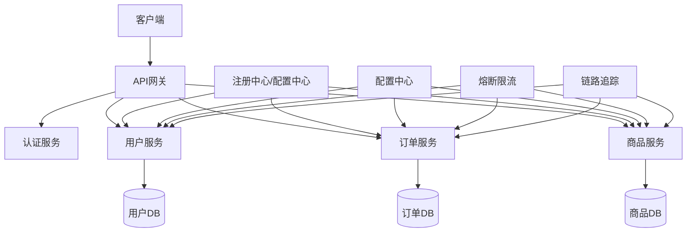


> 🔍 **知识点深度解析**
>
> **作用**：微服务架构：单体应用拆分为多个小服务，独立部署、独立技术栈、独立数据存储。
>
> **原理**：优点：灵活扩展、技术异构、故障隔离。
>
> **用法要点**：① 微服务架构：单体应用拆分为多个小服务，独立部署、独立技术栈、独立数据存储 ② 优点：灵活扩展、技术异构、故障隔离 ③ 缺点：分布式复杂度（网络/一致性/运维） ④ Spring Cloud是微服务全家桶

### 63.2 核心组件

| 能力 | 组件 | 说明 |
|------|------|------|
| 注册中心 | Nacos / Eureka / Consul | 服务注册与发现 |
| 配置中心 | Nacos / Apollo / Spring Cloud Config | 集中配置管理 |
| API 网关 | Spring Cloud Gateway / Zuul | 路由、限流、鉴权 |
| 负载均衡 | Spring Cloud LoadBalancer / Ribbon | 客户端负载均衡 |
| 服务调用 | OpenFeign / RestTemplate | 声明式 HTTP 调用 |
| 熔断降级 | Sentinel / Hystrix / Resilience4j | 熔断、限流、降级 |
| 链路追踪 | Sleuth + Zipkin / SkyWalking | 分布式追踪 |
| 消息队列 | Kafka / RabbitMQ / RocketMQ | 异步通信、解耦 |
| 分布式事务 | Seata | 分布式事务解决方案 |


> 🔍 **知识点深度解析**
>
> **作用**：核心组件：注册中心（Nacos/Eureka）。
>
> **原理**：服务调用（OpenFeign）。
>
> **用法要点**：① 核心组件：注册中心（Nacos/Eureka） ② 配置中心（Nacos/Config） ③ 服务调用（OpenFeign） ④ 网关（Gateway）、熔断降级（Sentinel/Hystrix） ⑤ 链路追踪（Sleuth+Zipkin） ⑥ 消息队列（RabbitMQ/Kafka）

### 63.3 注册中心

```yaml
# Nacos 配置
spring:
  cloud:
    nacos:
      discovery:
        server-addr: localhost:8848
        namespace: dev
      config:
        server-addr: localhost:8848
        file-extension: yaml
```


> 🔍 **知识点深度解析**
>
> **作用**：注册中心：服务启动注册IP/端口，消费方获取服务列表。
>
> **原理**：Nacos（阿里，注册+配置，AP/CP切换）、Eureka（Netflix，AP，已停更）、Consul（CP）、Zookeeper（CP）。
>
> **用法要点**：① 注册中心：服务启动注册IP/端口，消费方获取服务列表 ② Nacos（阿里，注册+配置，AP/CP切换）、Eureka（Netflix，AP，已停更）、Consul（CP）、Zookeeper（CP） ③ 心跳检测健康，剔除不健康服务

### 63.4 OpenFeign

```java
@FeignClient(name = "user-service", path = "/api/users")
public interface UserClient {

    @GetMapping("/{id}")
    Result<User> getUserById(@PathVariable("id") Long id);

    @PostMapping
    Result<User> createUser(@RequestBody UserDTO dto);
}

// 使用
@Autowired
private UserClient userClient;

public void method() {
    Result<User> result = userClient.getUserById(1L);
}
```


> 🔍 **知识点深度解析**
>
> **作用**：OpenFeign：声明式HTTP客户端，@FeignClient注解，接口方法写@RequestMapping。
>
> **原理**：底层动态代理生成请求。
>
> **用法要点**：① OpenFeign：声明式HTTP客户端，@FeignClient注解，接口方法写@RequestMapping ② 集成Ribbon负载均衡、Sentinel熔断 ③ 底层动态代理生成请求 ④ 比RestTemplate简洁 ⑤ 注意超时配置

### 63.5 网关 Gateway

```yaml
spring:
  cloud:
    gateway:
      routes:
        - id: user-service
          uri: lb://user-service
          predicates:
            - Path=/api/users/**
          filters:
            - StripPrefix=1
        - id: order-service
          uri: lb://order-service
          predicates:
            - Path=/api/orders/**
```


> 🔍 **知识点深度解析**
>
> **作用**：网关Gateway：统一入口，路由转发、鉴权、限流、日志、跨域。
>
> **原理**：基于WebFlux（响应式，高性能）。
>
> **用法要点**：① 网关Gateway：统一入口，路由转发、鉴权、限流、日志、跨域 ② 基于WebFlux（响应式，高性能） ③ Predicate（断言匹配请求）+ Filter（过滤器链） ④ 替代Zuul（已停更，阻塞）

### 63.6 熔断降级 Sentinel

```java
@FeignClient(name = "user-service", fallback = UserClientFallback.class)
public interface UserClient {
    @GetMapping("/{id}")
    Result<User> getUserById(@PathVariable("id") Long id);
}

@Component
public class UserClientFallback implements UserClient {
    @Override
    public Result<User> getUserById(Long id) {
        return Result.fail(503, "服务降级");
    }
}
```

---

> 💡 **深度讲解**：Spring Cloud 是微服务架构的一站式解决方案，基于 Spring Boot 构建，核心组件包括：服务注册发现（Nacos/Eureka/Consul，服务启动时注册自己，消费方从注册中心获取服务列表）、配置中心（Nacos/Apollo，集中管理配置，支持动态刷新）、负载均衡（Spring Cloud LoadBalancer，客户端负载均衡，替代已停更的 Ribbon）、服务调用（OpenFeign，声明式 HTTP 客户端，基于动态代理）、API 网关（Spring Cloud Gateway，替代 Zuul，基于 WebFlux 响应式，路由/过滤/限流）、熔断降级（Sentinel/Resilience4j，Hystrix 已停更，防止级联故障）、链路追踪（Sleuth+Zipkin 或 SkyWalking，追踪请求在微服务间的调用链）。Spring Cloud Alibaba 是国内主流，Nacos（注册+配置二合一）、Sentinel（熔断限流）、Seata（分布式事务）。微服务拆分原则：按业务领域（DDD 限界上下文）、单一职责、独立部署、数据独立。CAP 定理：一致性、可用性、分区容错性三者只能满足其二，分布式系统必须满足 P，所以在 C 和 A 之间权衡，CP 如 ZooKeeper，AP 如 Eureka/Nacos。微服务带来的挑战：分布式事务（Seata AT/TCC/XA）、服务治理、链路追踪、数据一致性。
>
> **📝 精简总结**：Spring Cloud 核心组件：注册发现/配置中心/负载均衡/OpenFeign/网关/熔断/链路追踪；Spring Cloud Alibaba 国内主流（Nacos+Sentinel+Seata）；微服务按业务领域拆分独立部署；CAP 定理三选二，分布式必选 P，在 C/A 间权衡；分布式事务用 Seata。

---

# 第八篇：网络与安全

> **本篇导言**：本篇涵盖 Java 网络编程与 Web 安全，是后端开发的重要基础知识。包括网络模型（OSI 七层/TCP 四层）、TCP 三次握手与四次挥手、Socket 编程、HTTP 客户端、Web 安全基础（SQL 注入、XSS、CSRF、CORS）、认证授权（JWT、OAuth2、RBAC、Spring Security）以及加密基础（对称加密、非对称加密、摘要算法、HTTPS/TLS、数字签名）。建议重点掌握 TCP 连接管理、常见 Web 攻击防护和 JWT 认证机制。

---

## 64. 网络编程


> 🔍 **知识点深度解析**
>
> **作用**：熔断降级Sentinel：流量控制（QPS/线程数）、熔断降级（慢调用/异常比例/异常数）、系统保护。
>
> **原理**：@SentinelResource定义资源。
>
> **用法要点**：① 熔断降级Sentinel：流量控制（QPS/线程数）、熔断降级（慢调用/异常比例/异常数）、系统保护 ② @SentinelResource定义资源 ③ 比Hystrix功能强，控制台动态配置规则

### 64.1 网络模型

#### OSI 七层模型

<div style="background:linear-gradient(135deg,#4facfe,#00f2fe);border-radius:16px;padding:20px;margin:16px 0;font-family:-apple-system,'Segoe UI','PingFang SC','Microsoft YaHei',sans-serif;color:#fff;overflow:hidden;box-shadow:0 8px 28px rgba(0,0,0,.14),0 3px 10px rgba(0,0,0,.08)">
<style>@keyframes osiLayer{0%{opacity:0;transform:translateY(-4px)}15%{opacity:1;transform:translateY(0)}85%{opacity:1}100%{opacity:.4}}.osi-layer{background:rgba(255,255,255,.15);border-radius:6px;box-shadow:0 2px 8px rgba(0,0,0,.08);padding:5px 10px;margin:3px 0;font-size:11px;font-weight:500;animation:osiLayer 5s ease-in-out infinite;border-left:3px solid rgba(255,255,255,.5)}.osi-layer:nth-child(2){animation-delay:.5s}.osi-layer:nth-child(3){animation-delay:1s}.osi-layer:nth-child(4){animation-delay:1.5s}.osi-layer:nth-child(5){animation-delay:2s}.osi-layer:nth-child(6){animation-delay:2.5s}.osi-layer:nth-child(7){animation-delay:3s}.osi-num{display:inline-block;background:rgba(255,255,255,.3);border-radius:50%;width:18px;height:18px;text-align:center;line-height:18px;font-size:10px;font-weight:700;margin-right:6px}</style>
<div style="text-align:center;font-size:15px;font-weight:700;margin-bottom:14px;padding-bottom:10px;border-bottom:1.5px solid rgba(255,255,255,.22);letter-spacing:1px;text-shadow:0 1px 3px rgba(0,0,0,.12)">OSI 七层 vs TCP/IP 四层（数据封装）</div>
<div class="osi-layer"><span class="osi-num">7</span>应用层 → HTTP/FTP/DNS <span style="float:right;opacity:.7">TCP/IP 应用层</span></div>
<div class="osi-layer"><span class="osi-num">6</span>表示层 → 加密/压缩/格式 <span style="float:right;opacity:.7">↑ 合并</span></div>
<div class="osi-layer"><span class="osi-num">5</span>会话层 → 会话管理 <span style="float:right;opacity:.7">↑ 合并</span></div>
<div class="osi-layer"><span class="osi-num">4</span>传输层 → TCP/UDP 端口 <span style="float:right;opacity:.7">TCP/IP 传输层</span></div>
<div class="osi-layer"><span class="osi-num">3</span>网络层 → IP 路由 <span style="float:right;opacity:.7">TCP/IP 网络层</span></div>
<div class="osi-layer"><span class="osi-num">2</span>数据链路层 → MAC/帧 <span style="float:right;opacity:.7">TCP/IP 网络接口层</span></div>
<div class="osi-layer"><span class="osi-num">1</span>物理层 → 比特流 <span style="float:right;opacity:.7">↑ 合并</span></div>
<div style="text-align:center;font-size:10px;opacity:.85;margin-top:6px">发送方逐层封装（加头部），接收方逐层解封装（去头部）</div>
</div>

| 层 | 名称 | 协议/设备 |
|----|------|----------|
| 7 | 应用层 | HTTP、FTP、SMTP、DNS |
| 6 | 表示层 | 数据格式、加密、压缩 |
| 5 | 会话层 | 会话管理 |
| 4 | 传输层 | TCP、UDP |
| 3 | 网络层 | IP、ICMP、路由器 |
| 2 | 数据链路层 | Ethernet、交换机 |
| 1 | 物理层 | 电缆、光纤、集线器 |

#### TCP/IP 四层模型

| 层 | 对应 OSI | 协议 |
|----|---------|------|
| 应用层 | 应用层+表示层+会话层 | HTTP、FTP、DNS |
| 传输层 | 传输层 | TCP、UDP |
| 网际层 | 网络层 | IP、ICMP |
| 网络接口层 | 数据链路层+物理层 | Ethernet、ARP |


> 🔍 **知识点深度解析**
>
> **作用**：网络模型：OSI七层（应用/表示/会话/传输/网络/数据链路/物理），TCP/IP四层（应用/传输/网络/链路）。
>
> **原理**：应用层HTTP/HTTPS/DNS，传输层TCP/UDP，网络层IP，链路层以太网。
>
> **用法要点**：① 网络模型：OSI七层（应用/表示/会话/传输/网络/数据链路/物理），TCP/IP四层（应用/传输/网络/链路） ② 应用层HTTP/HTTPS/DNS，传输层TCP/UDP，网络层IP，链路层以太网

### 64.2 TCP vs UDP

| 区别 | TCP | UDP |
|------|-----|-----|
| 连接 | 面向连接（三次握手） | 无连接 |
| 可靠性 | 可靠（重传、确认） | 不可靠 |
| 顺序 | 保证顺序 | 不保证 |
| 速度 | 较慢 | 较快 |
| 头部 | 20-60 字节 | 8 字节 |
| 流量控制 | 滑动窗口 | 无 |
| 拥塞控制 | 有 | 无 |
| 适用 | 文件传输、网页、邮件 | 视频、直播、DNS、游戏 |


> 🔍 **知识点深度解析**
>
> **作用**：TCP vs UDP：TCP可靠面向连接（三次握手/四次挥手/重传/拥塞控制/有序），UDP不可靠无连接（快，开销小，不保证顺序）。
>
> **原理**：TCP用于HTTP/文件传输，UDP用于视频/直播/DNS。
>
> **用法要点**：① TCP vs UDP：TCP可靠面向连接（三次握手/四次挥手/重传/拥塞控制/有序），UDP不可靠无连接（快，开销小，不保证顺序） ② TCP用于HTTP/文件传输，UDP用于视频/直播/DNS

### 64.3 TCP 三次握手

<div style="background:linear-gradient(135deg,#4facfe,#00f2fe);border-radius:16px;padding:20px;margin:16px 0;font-family:-apple-system,'Segoe UI','PingFang SC','Microsoft YaHei',sans-serif;color:#fff;overflow:hidden;box-shadow:0 8px 28px rgba(0,0,0,.14),0 3px 10px rgba(0,0,0,.08)">
<style>@keyframes pktFlow{0%{transform:translateX(-8px);opacity:0}20%{transform:translateX(0);opacity:1}80%{transform:translateX(0);opacity:1}100%{transform:translateX(8px);opacity:0}}.tcp-side{display:inline-block;width:45%;vertical-align:top;text-align:center}.tcp-endpoint{background:rgba(255,255,255,.2);border:2px solid rgba(255,255,255,.5);border-radius:8px;padding:8px;font-weight:700;font-size:13px;margin-bottom:10px}.tcp-msg{background:rgba(255,255,255,.15);border-radius:6px;box-shadow:0 2px 8px rgba(0,0,0,.08);padding:5px 10px;margin:4px 0;font-size:11px;font-weight:600;animation:pktFlow 4s ease-in-out infinite}.tcp-msg.c2s{animation-delay:0s;text-align:left;border-left:3px solid #ffd93d}.tcp-msg.s2c{animation-delay:.8s;text-align:right;border-right:3px solid #6bcb77}.tcp-msg.c2s2{animation-delay:1.6s;text-align:left;border-left:3px solid #ffd93d}.tcp-section{background:rgba(255,255,255,.1);border-radius:8px;box-shadow:0 2px 8px rgba(0,0,0,.08);padding:8px;margin:6px 0}.tcp-title{font-size:12px;font-weight:700;margin-bottom:4px;text-align:center}</style>
<div style="text-align:center;font-size:15px;font-weight:700;margin-bottom:14px;padding-bottom:10px;border-bottom:1.5px solid rgba(255,255,255,.22);letter-spacing:1px;text-shadow:0 1px 3px rgba(0,0,0,.12)">TCP 三次握手 & 四次挥手</div>
<div class="tcp-section"><div class="tcp-title">🔗 三次握手（建立连接）</div>
<div class="tcp-side"><div class="tcp-endpoint">客户端 Client</div><div class="tcp-msg c2s">SYN (seq=x)</div><div class="tcp-msg c2s2" style="margin-top:20px">ACK (ack=z+1)</div></div>
<div class="tcp-side"><div class="tcp-endpoint">服务端 Server</div><div class="tcp-msg s2c">SYN+ACK (seq=y, ack=x+1)</div></div>
</div>
<div class="tcp-section"><div class="tcp-title">👋 四次挥手（断开连接）</div>
<div class="tcp-side"><div class="tcp-endpoint">客户端 Client</div><div class="tcp-msg c2s">FIN (seq=u)</div><div class="tcp-msg c2s2" style="margin-top:20px">ACK (ack=w+1) → TIME_WAIT(2MSL)</div></div>
<div class="tcp-side"><div class="tcp-endpoint">服务端 Server</div><div class="tcp-msg s2c">ACK (ack=u+1)</div><div class="tcp-msg s2c" style="animation-delay:1.6s">FIN (seq=w)</div></div>
</div>
</div>

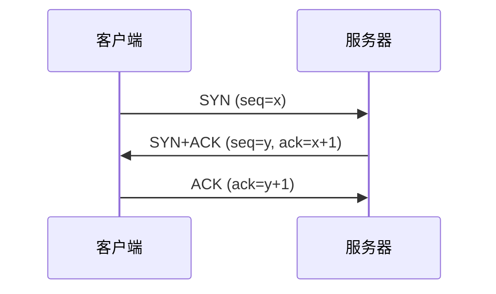

1. 客户端发送 SYN 包（seq=x），进入 SYN_SENT 状态
2. 服务器回复 SYN+ACK 包（seq=y, ack=x+1），进入 SYN_RCVD 状态
3. 客户端回复 ACK 包（ack=y+1），双方进入 ESTABLISHED 状态

**为什么需要三次握手**：
- 确认双方收发能力正常
- 同步初始序列号
- 防止已失效的连接请求报文段突然又传到服务器


> 🔍 **知识点深度解析**
>
> **作用**：TCP三次握手：客户端SYN→服务端SYN+ACK→客户端ACK。
>
> **原理**：建立连接，同步序列号。
>
> **用法要点**：① TCP三次握手：客户端SYN→服务端SYN+ACK→客户端ACK ② 建立连接，同步序列号 ③ 为什么三次：两次无法确认客户端接收能力，四次浪费 ④ SYN泛洪攻击（大量半连接）

### 64.4 TCP 四次挥手

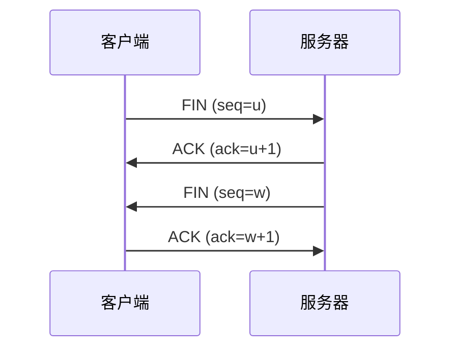

1. 客户端发送 FIN，进入 FIN_WAIT_1
2. 服务器回复 ACK，进入 CLOSE_WAIT，客户端进入 FIN_WAIT_2
3. 服务器发送 FIN，进入 LAST_ACK
4. 客户端回复 ACK，进入 TIME_WAIT，服务器收到后关闭

**TIME_WAIT 状态**：
- 持续 2MSL（最大报文段生存时间）
- 确保最后一个 ACK 能到达服务器
- 防止旧连接的报文段出现在新连接中


> 🔍 **知识点深度解析**
>
> **作用**：TCP四次挥手：客户端FIN→服务端ACK→服务端FIN→客户端ACK。
>
> **原理**：关闭连接。
>
> **用法要点**：① TCP四次挥手：客户端FIN→服务端ACK→服务端FIN→客户端ACK ② 关闭连接 ③ 为什么四次：服务端可能还有数据要发，ACK和FIN分两次 ④ TIME_WAIT状态（2MSL）确保最后ACK到达，避免旧连接数据干扰

### 64.5 Socket 编程（BIO）

#### TCP 服务端（多线程）

```java
public class TcpServer {
    public static void main(String[] args) throws IOException {
        ServerSocket serverSocket = new ServerSocket(8080);
        System.out.println("服务器启动，监听 8080 端口");

        while (true) {
            Socket socket = serverSocket.accept();  // 阻塞等待连接
            new Thread(() -> handleClient(socket)).start();
        }
    }

    private static void handleClient(Socket socket) {
        try (
            BufferedReader in = new BufferedReader(
                new InputStreamReader(socket.getInputStream()));
            PrintWriter out = new PrintWriter(socket.getOutputStream(), true)
        ) {
            String message;
            while ((message = in.readLine()) != null) {
                System.out.println("收到: " + message);
                out.println("服务器回复: " + message);
            }
        } catch (IOException e) {
            e.printStackTrace();
        }
    }
}
```

#### TCP 客户端

```java
public class TcpClient {
    public static void main(String[] args) throws IOException {
        try (
            Socket socket = new Socket("localhost", 8080);
            BufferedReader in = new BufferedReader(
                new InputStreamReader(socket.getInputStream()));
            PrintWriter out = new PrintWriter(socket.getOutputStream(), true);
            BufferedReader console = new BufferedReader(
                new InputStreamReader(System.in))
        ) {
            String input;
            while ((input = console.readLine()) != null) {
                out.println(input);
                System.out.println(in.readLine());
            }
        }
    }
}
```

#### UDP 通信

```java
// UDP 服务端
public class UdpServer {
    public static void main(String[] args) throws IOException {
        DatagramSocket socket = new DatagramSocket(8080);
        byte[] buffer = new byte[1024];

        while (true) {
            DatagramPacket packet = new DatagramPacket(buffer, buffer.length);
            socket.receive(packet);  // 阻塞接收

            String message = new String(packet.getData(), 0, packet.getLength());
            System.out.println("收到: " + message + " 来自: " + packet.getAddress());

            // 回复
            byte[] reply = "已收到".getBytes();
            DatagramPacket replyPacket = new DatagramPacket(
                reply, reply.length, packet.getAddress(), packet.getPort());
            socket.send(replyPacket);
        }
    }
}

// UDP 客户端
public class UdpClient {
    public static void main(String[] args) throws IOException {
        DatagramSocket socket = new DatagramSocket();
        String message = "Hello UDP";
        byte[] data = message.getBytes();

        DatagramPacket packet = new DatagramPacket(
            data, data.length, InetAddress.getByName("localhost"), 8080);
        socket.send(packet);

        // 接收回复
        byte[] buffer = new byte[1024];
        DatagramPacket reply = new DatagramPacket(buffer, buffer.length);
        socket.receive(reply);
        System.out.println("收到回复: " + new String(reply.getData(), 0, reply.getLength()));

        socket.close();
    }
}
```


> 🔍 **知识点深度解析**
>
> **作用**：Socket编程（BIO）：ServerSocket.accept()阻塞等待连接，Socket.getInputStream/getOutputStream读写。
>
> **原理**：每连接一线程，并发低。
>
> **用法要点**：① Socket编程（BIO）：ServerSocket.accept()阻塞等待连接，Socket.getInputStream/getOutputStream读写 ② 每连接一线程，并发低 ③ read()阻塞 ④ 高并发用NIO/Netty ⑤ 注意流关闭和编码

### 64.6 HTTP 客户端

#### Java 11 HttpClient

```java
HttpClient client = HttpClient.newHttpClient();

// GET 请求
HttpRequest request = HttpRequest.newBuilder()
    .uri(URI.create("https://api.example.com/users"))
    .header("Content-Type", "application/json")
    .GET()
    .build();

HttpResponse<String> response = client.send(request, HttpResponse.BodyHandlers.ofString());
System.out.println(response.statusCode());
System.out.println(response.body());

// POST 请求
String json = "{\"name\":\"张三\"}";
HttpRequest postRequest = HttpRequest.newBuilder()
    .uri(URI.create("https://api.example.com/users"))
    .header("Content-Type", "application/json")
    .POST(HttpRequest.BodyPublishers.ofString(json))
    .build();

// 异步请求
client.sendAsync(postRequest, HttpResponse.BodyHandlers.ofString())
    .thenApply(HttpResponse::body)
    .thenAccept(System.out::println);
```

#### URL / URI / HttpURLConnection

```java
URL url = new URL("https://api.example.com/users?id=1");
URI uri = url.toURI();

HttpURLConnection conn = (HttpURLConnection) url.openConnection();
conn.setRequestMethod("GET");
conn.setConnectTimeout(5000);
conn.setReadTimeout(5000);

int code = conn.getResponseCode();
try (BufferedReader reader = new BufferedReader(
        new InputStreamReader(conn.getInputStream()))) {
    String line;
    while ((line = reader.readLine()) != null) {
        System.out.println(line);
    }
}
conn.disconnect();
```

#### InetAddress

```java
InetAddress address = InetAddress.getByName("www.baidu.com");
System.out.println(address.getHostAddress());  // IP 地址
System.out.println(address.getHostName());     // 主机名

InetAddress local = InetAddress.getLocalHost();
System.out.println(local.getHostAddress());
```

---

> 💡 **深度讲解**：网络编程是后端开发的基础。OSI 七层模型（应用/表示/会话/传输/网络/数据链路/物理）是理论模型，实际用 TCP/IP 四层（应用/传输/网络/网络接口层）。TCP 和 UDP 是传输层两大协议：TCP 面向连接、可靠传输（三次握手建立、四次挥手断开、滑动窗口流量控制、拥塞控制、超时重传）、字节流、头部开销大；UDP 无连接、不可靠、数据报、头部小、速度快，适合实时性要求高的场景（视频直播、游戏、DNS）。TCP 三次握手是面试必考题：客户端发 SYN→服务端回 SYN+ACK→客户端发 ACK，为什么三次？两次无法确认客户端的接收能力，四次浪费，三次刚好双方都确认了收发能力。四次挥手：客户端发 FIN→服务端回 ACK→服务端发 FIN→客户端回 ACK，为什么四次？因为服务端可能还有数据没发完，ACK 和 FIN 不能合并。TIME_WAIT 状态持续 2MSL（最大报文生存时间），确保最后一个 ACK 到达服务端，避免新连接收到旧连接的延迟报文。BIO（阻塞IO）一个连接一个线程，NIO 多路复用一个线程管理多个连接，Netty 是基于 NIO 的高性能框架（Reactor 模式），是 RPC 框架（Dubbo/gRPC）的底层。
>
> **📝 精简总结**：TCP 面向连接可靠（三次握手四次挥手），UDP 无连接快；三次握手防失效连接+确认双方收发能力；四次挥手因服务端可能还有数据；TIME_WAIT 2MSL 确保最后 ACK；Netty 是 NIO 框架 Reactor 模式高并发。

---

## 65. 安全基础

<div style="background:linear-gradient(135deg,#ff9a9e,#fecfef);border-radius:16px;padding:20px;margin:16px 0;font-family:-apple-system,'Segoe UI','PingFang SC','Microsoft YaHei',sans-serif;color:#1a1a2e;overflow:hidden;box-shadow:0 6px 20px rgba(0,0,0,.08),0 2px 6px rgba(0,0,0,.04)">
<style>@keyframes webAttack{0%,100%{transform:scale(1);opacity:.85}50%{transform:scale(1.03);opacity:1}}.attack-item{display:inline-block;width:30%;vertical-align:top;margin:0 1%;background:rgba(255,255,255,.35);border-radius:8px;box-shadow:0 2px 8px rgba(0,0,0,.08);padding:8px;font-size:10px;text-align:center;animation:webAttack 3s ease-in-out infinite}.attack-item:nth-child(2){animation-delay:.5s}.attack-item:nth-child(3){animation-delay:1s}.attack-title{font-weight:700;font-size:11px;margin-bottom:4px;padding:3px;border-radius:4px;color:#fff}.attack-fix{background:rgba(255,255,255,.3);border-radius:4px;box-shadow:0 2px 8px rgba(0,0,0,.08);padding:3px 6px;margin-top:4px;font-size:9px}</style>
<div style="text-align:center;font-size:15px;font-weight:700;margin-bottom:14px;padding-bottom:10px;border-bottom:1.5px solid rgba(255,255,255,.22);letter-spacing:1px;text-shadow:0 1px 3px rgba(0,0,0,.12)">Web 三大攻击与防御</div>
<div style="text-align:center">
<div class="attack-item"><div class="attack-title" style="background:#dc3545">SQL 注入</div><div style="font-size:9px">输入拼接SQL<br>' OR 1=1 --</div><div class="attack-fix">PreparedStatement 预编译 / MyBatis #{} / 输入校验</div></div>
<div class="attack-item"><div class="attack-title" style="background:#f59e0b">XSS 跨站脚本</div><div style="font-size:9px">注入恶意JS<br>&lt;script&gt;...&lt;/script&gt;</div><div class="attack-fix">输出转义 / CSP / HttpOnly Cookie</div></div>
<div class="attack-item"><div class="attack-title" style="background:#6c5ce7">CSRF 跨站请求伪造</div><div style="font-size:9px">利用用户身份<br>发起恶意请求</div><div class="attack-fix">CSRF Token / SameSite Cookie / 验证 Referer</div></div>
</div>
</div>


> 🔍 **知识点深度解析**
>
> **作用**：HTTP客户端：HttpURLConnection（JDK内置，基础）、HttpClient（Java 11+，HTTP/2异步）、OkHttp（第三方，功能强，连接池）、RestTemplate/WebClient（Spring）。
>
> **原理**：设置超时、请求头、处理响应。
>
> **用法要点**：① HTTP客户端：HttpURLConnection（JDK内置，基础）、HttpClient（Java 11+，HTTP/2异步）、OkHttp（第三方，功能强，连接池）、RestTemplate/WebClient（Spring） ② 设置超时、请求头、处理响应

### 65.1 SQL 注入

**原理**：用户输入被拼接到 SQL 语句中，改变了 SQL 语义。

```java
// 危险：字符串拼接
String sql = "SELECT * FROM user WHERE name = '" + name + "' AND password = '" + password + "'";
// 输入: ' OR 1=1 --
// 变成: SELECT * FROM user WHERE name = '' OR 1=1 --' AND password = ''
```

**防护**：
1. 使用 PreparedStatement 预编译（推荐）
2. MyBatis 使用 #{} 而非 ${}
3. 输入校验和过滤
4. 最小权限原则


> 🔍 **知识点深度解析**
>
> **作用**：SQL注入：用户输入拼接SQL，恶意输入执行非预期SQL。
>
> **原理**：防御：参数化查询（PreparedStatement/#{}）、ORM框架、输入校验、最小权限。
>
> **用法要点**：① SQL注入：用户输入拼接SQL，恶意输入执行非预期SQL ② 防御：参数化查询（PreparedStatement/#{}）、ORM框架、输入校验、最小权限 ③ 永远不要拼接SQL

### 65.2 XSS（跨站脚本攻击）

**类型**：
- 反射型：URL 参数直接输出到页面
- 存储型：恶意脚本存储到数据库
- DOM 型：前端 JS 操作 DOM 导致

**防护**：
1. 输出转义（HTML 实体编码）
2. CSP（内容安全策略）
3. HttpOnly Cookie
4. 输入校验

```java
// HTML 转义
public String escapeHtml(String input) {
    return input
        .replace("&", "&amp;")
        .replace("<", "&lt;")
        .replace(">", "&gt;")
        .replace("\"", "&quot;")
        .replace("'", "&#x27;");
}
```


> 🔍 **知识点深度解析**
>
> **作用**：XSS跨站脚本：恶意脚本注入网页，其他用户执行。
>
> **原理**：存储型/反射型/DOM型。
>
> **用法要点**：① XSS跨站脚本：恶意脚本注入网页，其他用户执行 ② 防御：输出转义（HTML实体编码）、CSP内容安全策略、HttpOnly Cookie、输入过滤 ③ 存储型/反射型/DOM型

### 65.3 CSRF（跨站请求伪造）

**原理**：攻击者诱导用户在已登录的网站上执行非本意操作。

**防护**：
1. CSRF Token（每次请求携带随机 Token）
2. SameSite Cookie
3. 验证 Referer / Origin
4. 关键操作二次确认


> 🔍 **知识点深度解析**
>
> **作用**：CSRF跨站请求伪造：诱导用户在已登录网站执行非预期操作。
>
> **原理**：防御：CSRF Token（每次请求带token）、SameSite Cookie、验证Referer、关键操作二次确认。
>
> **用法要点**：① CSRF跨站请求伪造：诱导用户在已登录网站执行非预期操作 ② 防御：CSRF Token（每次请求带token）、SameSite Cookie、验证Referer、关键操作二次确认

### 65.4 CORS（跨域资源共享）

**同源策略**：协议、域名、端口相同。

**CORS 解决跨域**：

<div style="background:linear-gradient(135deg,#4facfe,#00f2fe);border-radius:16px;padding:20px;margin:16px 0;font-family:-apple-system,'Segoe UI','PingFang SC','Microsoft YaHei',sans-serif;color:#fff;overflow:hidden;box-shadow:0 8px 28px rgba(0,0,0,.14),0 3px 10px rgba(0,0,0,.08)">
<style>@keyframes corsFlow{0%,100%{transform:scale(1);opacity:.85}50%{transform:scale(1.03);opacity:1}}.cors-type{display:inline-block;width:46%;vertical-align:top;margin:0 1%;background:rgba(255,255,255,.15);border-radius:8px;box-shadow:0 2px 8px rgba(0,0,0,.08);padding:10px;font-size:11px;text-align:center;animation:corsFlow 3s ease-in-out infinite}.cors-type:nth-child(2){animation-delay:.5s}.cors-title{font-weight:700;font-size:12px;margin-bottom:4px;padding:3px;border-radius:4px;color:#fff}.cors-step{background:rgba(255,255,255,.1);border-radius:4px;box-shadow:0 2px 8px rgba(0,0,0,.08);padding:3px 6px;margin:3px 0;font-size:10px}</style>
<div style="text-align:center;font-size:15px;font-weight:700;margin-bottom:14px;padding-bottom:10px;border-bottom:1.5px solid rgba(255,255,255,.22);letter-spacing:1px;text-shadow:0 1px 3px rgba(0,0,0,.12)">CORS 跨域：简单请求 vs 预检请求</div>
<div style="text-align:center">
<div class="cors-type"><div class="cors-title" style="background:#28a745">简单请求</div><div class="cors-step">GET/POST/HEAD</div><div class="cors-step">Content-Type: 表单/text/plain</div><div class="cors-step">直接发请求</div><div class="cors-step">响应头 ACAO 校验</div></div>
<div class="cors-type"><div class="cors-title" style="background:#f59e0b">预检请求</div><div class="cors-step">PUT/DELETE/JSON</div><div class="cors-step">自定义 Header</div><div class="cors-step">先发 OPTIONS 预检</div><div class="cors-step">通过后再发真实请求</div></div>
</div>
<div style="text-align:center;font-size:10px;opacity:.85;margin-top:6px">Spring 解决：@CrossOrigin / WebMvcConfigurer addCorsMappings / CorsFilter；携带 Cookie 需 withCredentials + 不能用 *</div>
</div>

- 简单请求：直接请求，服务器返回 Access-Control-Allow-Origin
- 预检请求（OPTIONS）：非简单请求先发 OPTIONS 预检

```java
// Spring Boot 全局 CORS 配置
@Configuration
public class CorsConfig implements WebMvcConfigurer {
    @Override
    public void addCorsMappings(CorsRegistry registry) {
        registry.addMapping("/**")
            .allowedOriginPatterns("*")
            .allowedMethods("GET", "POST", "PUT", "DELETE", "OPTIONS")
            .allowedHeaders("*")
            .allowCredentials(true)
            .maxAge(3600);
    }
}
```


> 🔍 **知识点深度解析**
>
> **作用**：CORS跨域资源共享：浏览器同源策略限制跨域请求。
>
> **原理**：服务端设置Access-Control-Allow-Origin等响应头。
>
> **用法要点**：① CORS跨域资源共享：浏览器同源策略限制跨域请求 ② 服务端设置Access-Control-Allow-Origin等响应头 ③ 简单请求直接发，预检请求OPTIONS ④ Spring用@CrossOrigin或全局Cors配置

### 65.5 密码加密 BCrypt

<div style="background:linear-gradient(135deg,#a18cd1,#fbc2eb);border-radius:16px;padding:20px;margin:16px 0;font-family:-apple-system,'Segoe UI','PingFang SC','Microsoft YaHei',sans-serif;color:#1a1a2e;overflow:hidden;box-shadow:0 6px 20px rgba(0,0,0,.08),0 2px 6px rgba(0,0,0,.04)">
<style>@keyframes bcryptFlow{0%,100%{transform:scale(1);opacity:.85}50%{transform:scale(1.03);opacity:1}}.bcrypt-step{background:rgba(255,255,255,.35);border-left:4px solid #e63946;border-radius:8px;padding:5px 10px;margin:4px 0;font-size:11px;font-weight:600;box-shadow:0 1px 4px rgba(0,0,0,.06);animation:bcryptFlow 4s ease-in-out infinite}.bcrypt-step:nth-child(2){animation-delay:.6s}.bcrypt-step:nth-child(3){animation-delay:1.2s}.bcrypt-step:nth-child(4){animation-delay:1.8s}.bcrypt-warn{background:rgba(108,92,231,.15);border:1px dashed #6c5ce7;border-radius:6px;padding:6px;margin-top:6px;font-size:11px;text-align:center;font-weight:600}</style>
<div style="text-align:center;font-size:15px;font-weight:700;margin-bottom:14px;padding-bottom:10px;border-bottom:1.5px solid rgba(255,255,255,.22);letter-spacing:1px;text-shadow:0 1px 3px rgba(0,0,0,.12)">BCrypt 慢哈希加盐（密码加密标准）</div>
<div class="bcrypt-step">① 明文密码 + 随机盐（每次不同）→ 进入 BCrypt 算法</div>
<div class="bcrypt-step">② cost 因子（默认10）控制迭代次数 2^cost，计算慢（约100ms）</div>
<div class="bcrypt-step">③ 输出格式：$2a$10$盐(22位)+哈希(31位)，盐和哈希存在一起</div>
<div class="bcrypt-step">④ 验证时：从存储值提取盐，用相同算法计算，比对结果</div>
<div class="bcrypt-warn">⚠ 同一密码每次加密结果不同（随机盐）；不要用 MD5/SHA（快哈希易彩虹表破解）</div>
</div>

```java
// 加密
String password = "123456";
BCryptPasswordEncoder encoder = new BCryptPasswordEncoder();
String encoded = encoder.encode(password);  // $2a$10$...

// 验证
boolean matches = encoder.matches(password, encoded);  // true
```

**特点**：
- 自动加盐
- 慢哈希（可配置强度）
- 每次加密结果不同

---

> 💡 **深度讲解**：Web 安全是后端开发的必备知识，常见攻击和防护：SQL 注入（用户输入拼接 SQL，用 PreparedStatement/#{} 预编译防注入，永远不要用字符串拼接 SQL）、XSS 跨站脚本（用户输入恶意脚本在浏览器执行，转义特殊字符/输入过滤/CSP 内容安全策略/HttpOnly Cookie）、CSRF 跨站请求伪造（利用用户已登录状态发起恶意请求，用 CSRF Token/SameSite Cookie/Referer 校验）、CORS 跨域资源共享（浏览器同源策略限制跨域请求，服务端设置 Access-Control-Allow-Origin 允许指定来源，不要设为 * 同时带凭证）、密码安全（绝对不能明文存密码，用 BCrypt 慢哈希加盐，BCrypt 自动加盐且每次加密结果不同，强度可配置，防彩虹表和暴力破解，不要用 MD5/SHA 等快哈希存密码）。其他常见攻击：目录遍历（../访问上级目录）、文件上传漏洞（校验文件类型和内容，重命名存储）、SSRF 服务端请求伪造（限制请求目标）、点击劫持（X-Frame-Options）。安全原则：最小权限原则、纵深防御、永远不信任用户输入、安全左移（开发阶段就考虑安全）。
>
> **📝 精简总结**：SQL 注入用预编译防；XSS 转义过滤+CSP；CSRF 用 Token/SameSite；CORS 服务端设允许源；密码用 BCrypt 慢哈希加盐，不用 MD5/SHA；永远不信任用户输入；最小权限原则。

---

## 66. 认证授权进阶 JWT / OAuth2 / RBAC


> 🔍 **知识点深度解析**
>
> **作用**：密码加密BCrypt：慢哈希算法，自动加盐，可配置成本因子。
>
> **原理**：Spring Security的BCryptPasswordEncoder。
>
> **用法要点**：① 密码加密BCrypt：慢哈希算法，自动加盐，可配置成本因子 ② Spring Security的BCryptPasswordEncoder ③ matches验证 ④ 比MD5/SHA安全（抗彩虹表和暴力破解） ⑤ 不要用明文/MD5存密码

### 66.1 JWT（JSON Web Token）

**结构**：Header.Payload.Signature

<div style="background:linear-gradient(135deg,#a18cd1,#fbc2eb);border-radius:16px;padding:20px;margin:16px 0;font-family:-apple-system,'Segoe UI','PingFang SC','Microsoft YaHei',sans-serif;color:#1a1a2e;overflow:hidden;box-shadow:0 6px 20px rgba(0,0,0,.08),0 2px 6px rgba(0,0,0,.04)">
<style>@keyframes jwtFlow{0%,100%{transform:scale(1);opacity:.85}50%{transform:scale(1.03);opacity:1}}.jwt-part{display:inline-block;width:30%;vertical-align:top;margin:0 1%;background:rgba(255,255,255,.35);border-radius:8px;box-shadow:0 2px 8px rgba(0,0,0,.08);padding:10px;font-size:11px;text-align:center;animation:jwtFlow 3s ease-in-out infinite}.jwt-part:nth-child(2){animation-delay:.5s}.jwt-part:nth-child(3){animation-delay:1s}.jwt-title{font-weight:700;font-size:12px;margin-bottom:4px;padding:3px;border-radius:4px;color:#fff}.jwt-dot{display:inline-block;font-size:20px;font-weight:900;vertical-align:middle;color:#6c5ce7;margin:0 2px}</style>
<div style="text-align:center;font-size:15px;font-weight:700;margin-bottom:14px;padding-bottom:10px;border-bottom:1.5px solid rgba(255,255,255,.22);letter-spacing:1px;text-shadow:0 1px 3px rgba(0,0,0,.12)">JWT 三段结构（Base64URL 编码，用 . 分隔）</div>
<div style="text-align:center">
<div class="jwt-part"><div class="jwt-title" style="background:#e63946">Header</div><div style="font-size:10px">{"alg":"HS256","typ":"JWT"}</div><div style="font-size:9px;opacity:.7;margin-top:4px">签名算法</div></div>
<span class="jwt-dot">.</span>
<div class="jwt-part"><div class="jwt-title" style="background:#f59e0b">Payload</div><div style="font-size:10px">{"sub":"user123","exp":1700000000}</div><div style="font-size:9px;opacity:.7;margin-top:4px">用户信息+过期（非加密！）</div></div>
<span class="jwt-dot">.</span>
<div class="jwt-part"><div class="jwt-title" style="background:#28a745">Signature</div><div style="font-size:10px">HMACSHA256(header+"."+payload, secret)</div><div style="font-size:9px;opacity:.7;margin-top:4px">防篡改签名</div></div>
</div>
<div style="text-align:center;font-size:10px;opacity:.7;margin-top:6px">无状态认证，适合分布式；缺点：无法主动注销（黑名单/短有效期+refresh token），Payload 不存敏感信息</div>
</div>

| 部分 | 内容 |
|------|------|
| Header | 算法（alg）、类型（typ） |
| Payload | 声明（iss、exp、sub、aud 等） |
| Signature | 签名（Header + Payload + 密钥） |

```java
// 生成 JWT
String secret = "my-secret-key";
String token = Jwts.builder()
    .setSubject("user123")
    .claim("role", "admin")
    .setIssuedAt(new Date())
    .setExpiration(new Date(System.currentTimeMillis() + 3600000))
    .signWith(SignatureAlgorithm.HS256, secret)
    .compact();

// 解析 JWT
Claims claims = Jwts.parser()
    .setSigningKey(secret)
    .parseClaimsJws(token)
    .getBody();

String username = claims.getSubject();
String role = claims.get("role", String.class);
```

**优点**：
- 无状态，服务端不需要存储
- 跨域友好
- 适合微服务

**缺点**：
- 无法主动失效（除非黑名单）
- Token 过大增加请求体积
- 安全性依赖密钥管理


> 🔍 **知识点深度解析**
>
> **作用**：JWT（JSON Web Token）：Header.Payload.Signature，无状态认证。
>
> **原理**：服务端不存储session，客户端存token。
>
> **用法要点**：① JWT（JSON Web Token）：Header.Payload.Signature，无状态认证 ② 服务端不存储session，客户端存token ③ 适合微服务/前后端分离 ④ 注意：token无法主动失效（用黑名单/短有效期+refreshToken）、payload不存敏感信息

### 66.2 OAuth 2.0

<div style="background:linear-gradient(135deg,#a18cd1,#fbc2eb);border-radius:16px;padding:20px;margin:16px 0;font-family:-apple-system,'Segoe UI','PingFang SC','Microsoft YaHei',sans-serif;color:#1a1a2e;overflow:hidden;box-shadow:0 6px 20px rgba(0,0,0,.08),0 2px 6px rgba(0,0,0,.04)">
<style>@keyframes oauthStep{0%{opacity:0;transform:translateX(-6px)}10%{opacity:1;transform:translateX(0)}90%{opacity:1}100%{opacity:.35}}.oa-step{background:rgba(255,255,255,.35);border-left:4px solid #e63946;border-radius:8px;padding:6px 10px;margin:4px 0;font-size:11px;font-weight:600;box-shadow:0 1px 4px rgba(0,0,0,.06);animation:oauthStep 6s ease-in-out infinite}.oa-step:nth-child(2){animation-delay:.7s}.oa-step:nth-child(3){animation-delay:1.4s}.oa-step:nth-child(4){animation-delay:2.1s}.oa-step:nth-child(5){animation-delay:2.8s}.oa-step:nth-child(6){animation-delay:3.5s}.oa-num{display:inline-block;background:#6c5ce7;color:#fff;border-radius:50%;width:18px;height:18px;text-align:center;line-height:18px;font-size:10px;font-weight:700;margin-right:6px}.oa-actor{display:inline-block;background:rgba(255,255,255,.3);border-radius:4px;box-shadow:0 2px 8px rgba(0,0,0,.08);padding:2px 6px;font-size:10px;font-weight:600;margin:0 2px}</style>
<div style="text-align:center;font-size:15px;font-weight:700;margin-bottom:14px;padding-bottom:10px;border-bottom:1.5px solid rgba(255,255,255,.22);letter-spacing:1px;text-shadow:0 1px 3px rgba(0,0,0,.12)">OAuth 2.0 授权码模式流程</div>
<div class="oa-step"><span class="oa-num">1</span><span class="oa-actor">用户</span>访问 <span class="oa-actor">客户端</span>，客户端引导用户跳转 <span class="oa-actor">授权服务器</span> 登录授权</div>
<div class="oa-step"><span class="oa-num">2</span><span class="oa-actor">用户</span>同意授权，<span class="oa-actor">授权服务器</span>重定向回客户端并携带 <b>授权码 code</b></div>
<div class="oa-step"><span class="oa-num">3</span><span class="oa-actor">客户端</span>用 code + client_secret 向 <span class="oa-actor">授权服务器</span>请求 <b>访问令牌 access_token</b></div>
<div class="oa-step"><span class="oa-num">4</span><span class="oa-actor">授权服务器</span>验证后返回 access_token（+ refresh_token）</div>
<div class="oa-step"><span class="oa-num">5</span><span class="oa-actor">客户端</span>携带 access_token 请求 <span class="oa-actor">资源服务器</span> 获取用户资源</div>
<div class="oa-step"><span class="oa-num">6</span><span class="oa-actor">资源服务器</span>验证 token 有效性，返回受保护资源</div>
<div style="text-align:center;font-size:11px;opacity:.7;margin-top:8px">四种模式：授权码（最安全）/ 隐式（已废弃）/ 密码（可信客户端）/ 客户端凭证（服务间调用）</div>
</div>

**四种授权模式**：

| 模式 | 说明 | 适用 |
|------|------|------|
| 授权码模式 | 最完整、最安全 | Web 应用 |
| 隐式模式 | 直接返回 Token | 纯前端应用 |
| 密码模式 | 用户名密码换 Token | 可信客户端 |
| 客户端凭证模式 | 客户端凭证换 Token | 服务间调用 |

**授权码模式流程**：
1. 用户访问客户端，客户端重定向到授权服务器
2. 用户登录并授权
3. 授权服务器重定向回客户端，携带授权码
4. 客户端用授权码换取 Access Token
5. 客户端用 Access Token 访问资源


> 🔍 **知识点深度解析**
>
> **作用**：OAuth 2.0：授权框架，四种授权模式：授权码（Authorization Code，最安全，Web应用）、隐式（已弃用）、密码（Password，可信应用）、客户端凭证（Client Credentials，服务间）。
>
> **原理**：第三方登录（微信/支付宝）基于OAuth。
>
> **用法要点**：① OAuth 2.0：授权框架，四种授权模式：授权码（Authorization Code，最安全，Web应用）、隐式（已弃用）、密码（Password，可信应用）、客户端凭证（Client Credentials，服务间） ② 第三方登录（微信/支付宝）基于OAuth

### 66.3 RBAC 权限模型

**核心**：用户 → 角色 → 权限

<div style="background:linear-gradient(135deg,#43e97b,#38f9d7);border-radius:16px;padding:20px;margin:16px 0;font-family:-apple-system,'Segoe UI','PingFang SC','Microsoft YaHei',sans-serif;color:#1a1a2e;overflow:hidden;box-shadow:0 6px 20px rgba(0,0,0,.08),0 2px 6px rgba(0,0,0,.04)">
<style>@keyframes rbacFlow{0%,100%{transform:scale(1);opacity:.85}50%{transform:scale(1.03);opacity:1}}.rbac-node{display:inline-block;background:rgba(255,255,255,.35);border:2px solid #2d6a4f;border-radius:8px;padding:10px 14px;text-align:center;font-size:12px;font-weight:700;vertical-align:middle;animation:rbacFlow 3s ease-in-out infinite}.rbac-node:nth-child(2){animation-delay:.5s}.rbac-node:nth-child(3){animation-delay:1s}.rbac-arrow{display:inline-block;font-size:18px;vertical-align:middle;animation:rbacFlow 1.5s ease-in-out infinite;margin:0 4px}.rbac-detail{font-size:9px;font-weight:400;opacity:.7;margin-top:2px}</style>
<div style="text-align:center;font-size:15px;font-weight:700;margin-bottom:14px;padding-bottom:10px;border-bottom:1.5px solid rgba(255,255,255,.22);letter-spacing:1px;text-shadow:0 1px 3px rgba(0,0,0,.12)">RBAC 权限模型（用户-角色-权限）</div>
<div style="text-align:center">
<span class="rbac-node">用户 User<div class="rbac-detail">张三/李四</div></span>
<span class="rbac-arrow">⇄ 多对多</span>
<span class="rbac-node">角色 Role<div class="rbac-detail">管理员/普通用户</div></span>
<span class="rbac-arrow">⇄ 多对多</span>
<span class="rbac-node">权限 Permission<div class="rbac-detail">user:add / user:delete</div></span>
</div>
<div style="text-align:center;font-size:10px;opacity:.7;margin-top:6px">通过角色解耦用户和权限，分配角色即分配一组权限；Spring Security 用 GrantedAuthority 表示权限</div>
</div>

```
用户(User) --多对多--> 角色(Role) --多对多--> 权限(Permission)
```

```java
// 用户
public class User {
    private Long id;
    private String username;
    private List<Role> roles;
}

// 角色
public class Role {
    private Long id;
    private String name;
    private List<Permission> permissions;
}

// 权限
public class Permission {
    private Long id;
    private String name;
    private String resource;  // 资源
    private String action;    // 操作
}
```


> 🔍 **知识点深度解析**
>
> **作用**：RBAC权限模型：用户-角色-权限，用户关联角色，角色关联权限。
>
> **原理**：扩展：RBAC1（角色继承）、RBAC2（约束）、RBAC3（全部）。
>
> **用法要点**：① RBAC权限模型：用户-角色-权限，用户关联角色，角色关联权限 ② 简化权限管理 ③ 扩展：RBAC1（角色继承）、RBAC2（约束）、RBAC3（全部） ④ 后台管理系统常用

### 66.4 Spring Security 基础

<div style="background:linear-gradient(135deg,#667eea,#764ba2);border-radius:16px;padding:20px;margin:16px 0;font-family:-apple-system,'Segoe UI','PingFang SC','Microsoft YaHei',sans-serif;color:#fff;overflow:hidden;box-shadow:0 8px 28px rgba(0,0,0,.14),0 3px 10px rgba(0,0,0,.08)">
<style>@keyframes secChain{0%,100%{transform:scale(1);opacity:.85}50%{transform:scale(1.03);opacity:1}}.sec-filter{background:rgba(255,255,255,.15);border-left:4px solid rgba(255,255,255,.5);border-radius:6px;padding:5px 10px;margin:3px 0;font-size:11px;font-weight:500;animation:secChain 4s ease-in-out infinite}.sec-filter:nth-child(2){animation-delay:.4s}.sec-filter:nth-child(3){animation-delay:.8s}.sec-filter:nth-child(4){animation-delay:1.2s}.sec-filter:nth-child(5){animation-delay:1.6s}.sec-filter:nth-child(6){animation-delay:2s}</style>
<div style="text-align:center;font-size:15px;font-weight:700;margin-bottom:14px;padding-bottom:10px;border-bottom:1.5px solid rgba(255,255,255,.22);letter-spacing:1px;text-shadow:0 1px 3px rgba(0,0,0,.12)">Spring Security 过滤器链（FilterChainProxy）</div>
<div class="sec-filter">① SecurityContextPersistenceFilter — 从 Session 恢复 SecurityContext</div>
<div class="sec-filter">② UsernamePasswordAuthenticationFilter — 表单登录认证</div>
<div class="sec-filter">③ BasicAuthenticationFilter — HTTP Basic 认证</div>
<div class="sec-filter">④ RememberMeAuthenticationFilter — 记住我认证</div>
<div class="sec-filter">⑤ ExceptionTranslationFilter — 处理认证/授权异常</div>
<div class="sec-filter">⑥ FilterSecurityInterceptor — 最终权限校验（@PreAuthorize）</div>
</div>

```java
@Configuration
@EnableWebSecurity
public class SecurityConfig {

    @Bean
    public SecurityFilterChain filterChain(HttpSecurity http) throws Exception {
        http
            .csrf().disable()
            .authorizeHttpRequests(auth -> auth
                .requestMatchers("/api/auth/**").permitAll()
                .requestMatchers("/api/admin/**").hasRole("ADMIN")
                .anyRequest().authenticated()
            )
            .sessionManagement(session -> session
                .sessionCreationPolicy(SessionCreationPolicy.STATELESS)
            )
            .addFilterBefore(jwtFilter, UsernamePasswordAuthenticationFilter.class);

        return http.build();
    }

    @Bean
    public PasswordEncoder passwordEncoder() {
        return new BCryptPasswordEncoder();
    }
}
```

---

> 💡 **深度讲解**：认证授权是 Web 系统的安全基石。JWT（JSON Web Token）是无状态认证方案，由三部分组成：Header（算法类型）、Payload（用户信息和过期时间，注意不能存敏感信息因为 Base64 不是加密）、Signature（签名防篡改）。JWT 优点是无状态、适合分布式、跨域友好，缺点是无法主动注销（需黑名单或短有效期+刷新 token）、token 体积大、Payload 不安全。OAuth2.0 是授权框架，四种授权模式：授权码模式（最安全，Web 应用，通过授权码换 token）、隐式模式（已废弃，token 直接返回）、密码模式（可信客户端，直接传用户名密码）、客户端凭证模式（服务间调用，无用户参与）。RBAC（基于角色的访问控制）是最常用的权限模型：用户-角色-权限，用户关联角色，角色关联权限，通过角色间接管理权限，灵活易扩展。Spring Security 是 Spring 生态的安全框架，基于过滤器链实现，核心是 AuthenticationManager（认证）和 AccessDecisionManager（授权），支持方法级权限 @PreAuthorize("@auth.hasPermission(#id)")。实际项目中常用 Spring Security+JWT 实现无状态认证，或用 Sa-Token（更简单的国产权限框架）。
>
> **📝 精简总结**：JWT 三部分 Header.Payload.Signature，无状态适合分布式但难注销（黑名单/短有效期）；OAuth2 授权码模式最安全，客户端凭证用于服务间调用；RBAC 用户-角色-权限模型；Spring Security 过滤器链实现认证授权，@PreAuthorize 方法级权限。

---

## 67. Web 安全与加密基础


> 🔍 **知识点深度解析**
>
> **作用**：Spring Security基础：过滤器链实现认证授权。
>
> **原理**：SecurityContextHolder存储认证信息。
>
> **用法要点**：① Spring Security基础：过滤器链实现认证授权 ② UsernamePasswordAuthenticationFilter登录，BasicAuthenticationFilter Basic认证 ③ @PreAuthorize方法级权限 ④ SecurityContextHolder存储认证信息 ⑤ 比Shiro功能强

### 67.1 对称加密

<div style="background:linear-gradient(135deg,#ffecd2,#fcb69f);border-radius:16px;padding:20px;margin:16px 0;font-family:-apple-system,'Segoe UI','PingFang SC','Microsoft YaHei',sans-serif;color:#1a1a2e;overflow:hidden;box-shadow:0 6px 20px rgba(0,0,0,.08),0 2px 6px rgba(0,0,0,.04)">
<style>@keyframes encFlow{0%,100%{transform:translateX(0);opacity:.6}50%{transform:translateX(4px);opacity:1}}.enc-box{display:inline-block;width:46%;vertical-align:top;margin:0 1%;background:rgba(255,255,255,.35);border-radius:8px;box-shadow:0 2px 8px rgba(0,0,0,.08);padding:10px;font-size:11px;text-align:center}.enc-key{background:#e63946;color:#fff;border-radius:4px;padding:3px 8px;margin:4px auto;font-weight:700;font-size:11px;max-width:120px;animation:encFlow 2s ease-in-out infinite}.enc-arrow{display:inline-block;font-size:14px;animation:encFlow 1.5s ease-in-out infinite;margin:0 4px;vertical-align:middle}</style>
<div style="text-align:center;font-size:15px;font-weight:700;margin-bottom:14px;padding-bottom:10px;border-bottom:1.5px solid rgba(255,255,255,.22);letter-spacing:1px;text-shadow:0 1px 3px rgba(0,0,0,.12)">对称加密 vs 非对称加密</div>
<div style="text-align:center">
<div class="enc-box"><b>对称加密（AES）</b><div>明文 <span class="enc-arrow">→</span> 加密 <span class="enc-arrow">→</span> 密文</div><div class="enc-key">同一密钥 K</div><div>密文 <span class="enc-arrow">→</span> 解密 <span class="enc-arrow">→</span> 明文</div><div style="font-size:10px;margin-top:4px;opacity:.7">速度快，密钥分发难</div></div>
<div class="enc-box"><b>非对称加密（RSA）</b><div>明文 <span class="enc-arrow">→</span> 公钥加密 <span class="enc-arrow">→</span> 密文</div><div class="enc-key" style="background:#6c5ce7">公钥（公开）</div><div>密文 <span class="enc-arrow">→</span> 私钥解密 <span class="enc-arrow">→</span> 明文</div><div style="font-size:10px;margin-top:4px;opacity:.7">安全，速度慢，用于密钥交换</div></div>
</div>
</div>

| 算法 | 密钥长度 | 说明 |
|------|---------|------|
| DES | 56 位 | 已不安全 |
| 3DES | 168 位 | 已不推荐 |
| AES | 128/192/256 位 | 推荐 |

```java
// AES 加密
String key = "0123456789abcdef";  // 16 字节密钥
Cipher cipher = Cipher.getInstance("AES/ECB/PKCS5Padding");
SecretKeySpec secretKey = new SecretKeySpec(key.getBytes(), "AES");

// 加密
cipher.init(Cipher.ENCRYPT_MODE, secretKey);
byte[] encrypted = cipher.doFinal("Hello".getBytes());

// 解密
cipher.init(Cipher.DECRYPT_MODE, secretKey);
byte[] decrypted = cipher.doFinal(encrypted);
```

**特点**：
- 加解密使用同一密钥
- 速度快
- 密钥分发困难


> 🔍 **知识点深度解析**
>
> **作用**：对称加密：加密解密用同一密钥。
>
> **原理**：ECB/CBC/GCM模式（GCM推荐，带认证）。
>
> **用法要点**：① 对称加密：加密解密用同一密钥 ② AES（推荐，128/192/256位）、DES（不安全）、3DES ③ 速度快，适合大数据加密 ④ 密钥管理难（安全传递密钥） ⑤ ECB/CBC/GCM模式（GCM推荐，带认证）

### 67.2 非对称加密

| 算法 | 说明 |
|------|------|
| RSA | 最常用，支持加密和签名 |
| ECC | 椭圆曲线，密钥更短，安全性更高 |

```java
// RSA 加密
KeyPairGenerator generator = KeyPairGenerator.getInstance("RSA");
generator.initialize(2048);
KeyPair keyPair = generator.generateKeyPair();
PublicKey publicKey = keyPair.getPublic();
PrivateKey privateKey = keyPair.getPrivate();

// 公钥加密
Cipher cipher = Cipher.getInstance("RSA");
cipher.init(Cipher.ENCRYPT_MODE, publicKey);
byte[] encrypted = cipher.doFinal("Hello".getBytes());

// 私钥解密
cipher.init(Cipher.DECRYPT_MODE, privateKey);
byte[] decrypted = cipher.doFinal(encrypted);
```

**特点**：
- 公钥加密，私钥解密
- 私钥签名，公钥验签
- 速度慢，通常用于加密对称密钥或签名


> 🔍 **知识点深度解析**
>
> **作用**：非对称加密：公钥加密私钥解密，私钥签名公钥验签。
>
> **原理**：RSA（常用，2048位+）、ECC（椭圆曲线，更短密钥同等安全）。
>
> **用法要点**：① 非对称加密：公钥加密私钥解密，私钥签名公钥验签 ② RSA（常用，2048位+）、ECC（椭圆曲线，更短密钥同等安全） ③ 速度慢，适合小数据/密钥交换/数字签名 ④ HTTPS用非对称交换对称密钥

### 67.3 摘要算法

| 算法 | 输出长度 | 安全性 |
|------|---------|--------|
| MD5 | 128 位 | 已不安全（碰撞攻击） |
| SHA-1 | 160 位 | 已不安全 |
| SHA-256 | 256 位 | 安全 |
| SHA-512 | 512 位 | 安全 |

```java
MessageDigest md = MessageDigest.getInstance("SHA-256");
byte[] digest = md.digest("Hello".getBytes());

// 转十六进制
String hex = HexFormat.of().formatHex(digest);
```

**特点**：
- 单向，不可逆
- 相同输入相同输出
- 不同输入几乎不可能相同输出（抗碰撞）


> 🔍 **知识点深度解析**
>
> **作用**：摘要算法：单向不可逆，任意长度输入固定长度输出。
>
> **原理**：用于数据完整性校验、密码存储（加盐）。
>
> **用法要点**：① 摘要算法：单向不可逆，任意长度输入固定长度输出 ② MD5（128位，不安全）、SHA-1（160位，不安全）、SHA-256/SHA-512（安全） ③ 用于数据完整性校验、密码存储（加盐） ④ HMAC带密钥的摘要

### 67.4 HTTPS / TLS

**HTTPS = HTTP + TLS/SSL**

**TLS 握手流程**：

<div style="background:linear-gradient(135deg,#667eea,#764ba2);border-radius:16px;padding:20px;margin:16px 0;font-family:-apple-system,'Segoe UI','PingFang SC','Microsoft YaHei',sans-serif;color:#fff;overflow:hidden;box-shadow:0 8px 28px rgba(0,0,0,.14),0 3px 10px rgba(0,0,0,.08)">
<style>@keyframes tlsStep{0%{opacity:0;transform:translateX(-6px)}12%{opacity:1;transform:translateX(0)}88%{opacity:1}100%{opacity:.35}}.tls-step{background:rgba(255,255,255,.15);border-radius:6px;box-shadow:0 2px 8px rgba(0,0,0,.08);padding:5px 10px;margin:4px 0;font-size:11px;font-weight:500;animation:tlsStep 5s ease-in-out infinite;border-left:3px solid}.tls-step:nth-child(2){animation-delay:.6s}.tls-step:nth-child(3){animation-delay:1.2s}.tls-step:nth-child(4){animation-delay:1.8s}.tls-step:nth-child(5){animation-delay:2.4s}.tls-c2s{border-color:#ffd93d}.tls-s2c{border-color:#6bcb77}</style>
<div style="text-align:center;font-size:15px;font-weight:700;margin-bottom:14px;padding-bottom:10px;border-bottom:1.5px solid rgba(255,255,255,.22);letter-spacing:1px;text-shadow:0 1px 3px rgba(0,0,0,.12)">HTTPS TLS 握手（非对称交换密钥 → 对称加密通信）</div>
<div class="tls-step tls-c2s">① ClientHello：客户端发送支持的加密套件、随机数</div>
<div class="tls-step tls-s2c">② ServerHello + 证书：服务端选择套件、返回数字证书（含公钥）、随机数</div>
<div class="tls-step tls-c2s">③ 密钥交换：客户端用服务端公钥加密预主密钥发送（RSA/ECDHE）</div>
<div class="tls-step tls-s2c">④ 双方用三个随机数生成会话密钥（对称密钥）</div>
<div class="tls-step tls-c2s">⑤ Finished：双方交换加密验证消息，握手完成，后续用对称密钥通信</div>
</div>

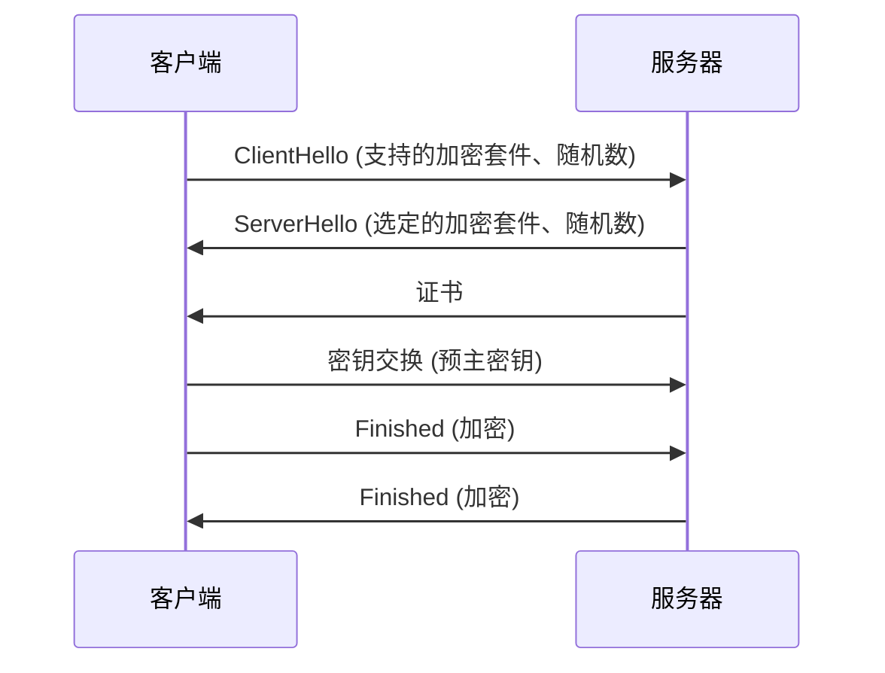

1. 客户端发送 ClientHello，包含支持的加密套件和随机数
2. 服务器回复 ServerHello，选定加密套件，发送证书
3. 客户端验证证书，生成预主密钥，用服务器公钥加密后发送
4. 双方根据随机数和预主密钥生成会话密钥
5. 双方交换 Finished 消息，验证握手完成


> 🔍 **知识点深度解析**
>
> **作用**：HTTPS/TLS：HTTP+SSL/TLS，加密传输。
>
> **原理**：握手过程：客户端Hello→服务端Hello+证书→客户端验证证书→密钥交换（非对称）→对称加密通信。
>
> **用法要点**：① HTTPS/TLS：HTTP+SSL/TLS，加密传输 ② 握手过程：客户端Hello→服务端Hello+证书→客户端验证证书→密钥交换（非对称）→对称加密通信 ③ 证书由CA签发，验证身份 ④ TLS 1.3更安全更快

### 67.5 数字签名与证书

<div style="background:linear-gradient(135deg,#667eea,#764ba2);border-radius:16px;padding:20px;margin:16px 0;font-family:-apple-system,'Segoe UI','PingFang SC','Microsoft YaHei',sans-serif;color:#fff;overflow:hidden;box-shadow:0 8px 28px rgba(0,0,0,.14),0 3px 10px rgba(0,0,0,.08)">
<style>@keyframes signFlow{0%,100%{transform:scale(1);opacity:.85}50%{transform:scale(1.03);opacity:1}}.sign-side{display:inline-block;width:46%;vertical-align:top;margin:0 1%;background:rgba(255,255,255,.15);border-radius:8px;box-shadow:0 2px 8px rgba(0,0,0,.08);padding:10px;font-size:11px;text-align:center;animation:signFlow 3s ease-in-out infinite}.sign-side:nth-child(2){animation-delay:.5s}.sign-step{background:rgba(255,255,255,.1);border-radius:4px;box-shadow:0 2px 8px rgba(0,0,0,.08);padding:3px 6px;margin:3px 0;font-size:10px}.sign-key{display:inline-block;background:#ffd93d;color:#1a1a2e;border-radius:4px;padding:2px 6px;font-weight:700;font-size:10px;margin:2px}</style>
<div style="text-align:center;font-size:15px;font-weight:700;margin-bottom:14px;padding-bottom:10px;border-bottom:1.5px solid rgba(255,255,255,.22);letter-spacing:1px;text-shadow:0 1px 3px rgba(0,0,0,.12)">数字签名 & 数字证书</div>
<div style="text-align:center">
<div class="sign-side"><b>发送方（签名）</b><div class="sign-step">原文 → SHA-256 摘要</div><div class="sign-step">摘要 + <span class="sign-key">私钥</span> → 签名</div><div class="sign-step">发送：原文 + 签名</div></div>
<div class="sign-side"><b>接收方（验签）</b><div class="sign-step">收到原文 → 计算摘要</div><div class="sign-step">签名 + <span class="sign-key" style="background:#6bcb77">公钥</span> → 解密摘要</div><div class="sign-step">两个摘要比对 → 一致则未篡改</div></div>
</div>
<div style="text-align:center;font-size:10px;opacity:.85;margin-top:6px">数字证书：CA 用私钥签名（主体+公钥），浏览器用 CA 公钥验签，证明公钥归属，防中间人攻击</div>
</div>

**数字签名**：
- 发送方用私钥对摘要加密
- 接收方用公钥解密，验证摘要
- 保证数据完整性和不可否认性

**数字证书**：
- 由 CA（证书颁发机构）签发
- 包含：公钥、持有者信息、CA 签名、有效期
- 用于验证公钥的合法性

```java
// 数字签名
Signature signature = Signature.getInstance("SHA256withRSA");
signature.initSign(privateKey);
signature.update(data);
byte[] sign = signature.sign();

// 验证签名
signature.initVerify(publicKey);
signature.update(data);
boolean valid = signature.verify(sign);
```

---

> 💡 **深度讲解**：加密算法是 Web 安全的底层基础，分为四大类：对称加密（AES/DES，同一密钥加解密，速度快，适合加密大量数据，密钥分发是难题，AES 是当前标准，DES 已不安全）、非对称加密（RSA/ECC，公钥加密私钥解密或私钥签名公钥验签，速度慢，用于密钥交换和数字签名，RSA 是最常用的，ECC 更短密钥同等安全）、摘要算法（MD5/SHA-256/SHA-3，不可逆，用于完整性校验和数字签名，MD5 和 SHA-1 已被破解不安全，用 SHA-256 及以上）。HTTPS = HTTP + TLS，TLS 握手过程是面试高频：客户端 ClientHello（支持的加密套件和随机数）→服务端 ServerHello+证书（选择加密套件、返回证书和随机数）→客户端验证证书合法性→客户端生成预主密钥用服务端公钥加密发送→双方根据三个随机数（客户端随机数、服务端随机数、预主密钥）生成会话密钥→用对称密钥加密通信。TLS 1.3 简化了握手过程，1-RTT 甚至 0-RTT。数字签名=私钥加密摘要，验证身份和完整性；数字证书=CA 用私钥签名的公钥+身份信息，浏览器内置 CA 根证书验证证书链。实际开发中用 JDK 的 Cipher/MessageDigest/Signature 类，或用 Hutool/Guava 工具类简化。
>
> **📝 精简总结**：对称加密 AES 快，非对称加密 RSA 安全用于密钥交换，摘要 SHA-256 不可逆；HTTPS TLS 握手：非对称加密交换密钥→对称加密通信；数字签名私钥签公钥验，数字证书 CA 签发验证身份；MD5/SHA-1 已不安全。

---

# 第九篇：现代化特性与工具库

> **本篇导言**：本篇涵盖 Java 版本演进、现代语法特性以及常用第三方工具库。包括 Java 8 到 Java 21 每个版本的核心特性、现代语法（var、文本块、switch 表达式、模式匹配、record、密封类、模块化）以及常用第三方库（Lombok、MapStruct、Hutool、Guava、Apache Commons、Jackson、Redis 客户端）。建议关注 LTS 版本（Java 8/11/17/21）的特性，以及实际项目中高频使用的工具库。

---

## 68. Java 版本演进与新特性


> 🔍 **知识点深度解析**
>
> **作用**：数字签名与证书：数字签名=私钥加密摘要，公钥验证（防篡改+防否认）。
>
> **原理**：数字证书=公钥+身份信息+CA签名，验证公钥归属。
>
> **用法要点**：① 数字签名与证书：数字签名=私钥加密摘要，公钥验证（防篡改+防否认） ② 数字证书=公钥+身份信息+CA签名，验证公钥归属 ③ X.509标准 ④ HTTPS/代码签名/邮件加密用证书

### 68.1 版本演进总览

<div style="background:linear-gradient(135deg,#667eea,#764ba2);border-radius:16px;padding:20px;margin:16px 0;font-family:-apple-system,'Segoe UI','PingFang SC','Microsoft YaHei',sans-serif;color:#fff;overflow:hidden;box-shadow:0 8px 28px rgba(0,0,0,.14),0 3px 10px rgba(0,0,0,.08)">
<style>@keyframes verFlow{0%,100%{transform:scale(1);opacity:.85}50%{transform:scale(1.03);opacity:1}}.ver-lts{display:inline-block;background:rgba(255,217,61,.25);border:2px solid #ffd93d;border-radius:8px;padding:8px 12px;margin:4px;text-align:center;font-size:11px;font-weight:700;animation:verFlow 3s ease-in-out infinite}.ver-lts:nth-child(2){animation-delay:.5s}.ver-lts:nth-child(3){animation-delay:1s}.ver-lts:nth-child(4){animation-delay:1.5s}.ver-year{font-size:9px;opacity:.8;font-weight:400}.ver-arrow{display:inline-block;font-size:14px;vertical-align:middle;animation:verFlow 1.5s ease-in-out infinite}</style>
<div style="text-align:center;font-size:15px;font-weight:700;margin-bottom:14px;padding-bottom:10px;border-bottom:1.5px solid rgba(255,255,255,.22);letter-spacing:1px;text-shadow:0 1px 3px rgba(0,0,0,.12)">Java LTS 版本演进时间线</div>
<div style="text-align:center;white-space:nowrap;overflow-x:auto">
<span class="ver-lts">Java 8<div class="ver-year">2014</div>Lambda/Stream</span><span class="ver-arrow">→</span>
<span class="ver-lts">Java 11<div class="ver-year">2018</div>var/HttpClient</span><span class="ver-arrow">→</span>
<span class="ver-lts">Java 17<div class="ver-year">2021</div>Record/Sealed/ZGC</span><span class="ver-arrow">→</span>
<span class="ver-lts">Java 21<div class="ver-year">2023</div>虚拟线程/模式匹配</span>
</div>
<div style="text-align:center;font-size:10px;opacity:.85;margin-top:6px">每6个月发布一个新版本，每2-3年一个 LTS（长期支持）版本；企业生产环境优先使用 LTS</div>
</div>

| 版本 | 发布年份 | 类型 | 核心特性 |
|------|---------|------|---------|
| Java 8 | 2014 | LTS | Lambda、Stream、Optional、新日期时间 API、接口默认方法、重复注解 |
| Java 9 | 2017 | 非 LTS | 模块化系统 JPMS、接口私有方法、集合工厂方法 of()、Process API |
| Java 10 | 2018 | 非 LTS | var 局部变量类型推断、G1 并行 Full GC |
| Java 11 | 2018 | LTS | HttpClient 正式、字符串 API（isBlank/strip/repeat）、Files.readString、Lambda 参数 var、ZGC 实验 |
| Java 12 | 2019 | 非 LTS | Switch 表达式预览、Shenandoah GC |
| Java 13 | 2019 | 非 LTS | 文本块预览、Switch 表达式继续预览 |
| Java 14 | 2020 | 非 LTS | Switch 表达式正式、instanceof 模式匹配预览、Record 预览、Helpful NullPointerException |
| Java 15 | 2020 | 非 LTS | 文本块正式、Sealed 类预览、Record 第二次预览、ZGC 正式 |
| Java 16 | 2021 | 非 LTS | Record 正式、instanceof 模式匹配正式、密封类第二次预览、Vector API |
| Java 17 | 2021 | LTS | 密封类正式、模式匹配 switch 预览、伪随机数生成器、强封装 JDK 内部 |
| Java 18 | 2022 | 非 LTS | 默认字符集 UTF-8、简单 Web 服务器、@snippet 标签 |
| Java 19 | 2022 | 非 LTS | 虚拟线程预览、Record 模式预览、结构化并发预览 |
| Java 20 | 2023 | 非 LTS | 虚拟线程第二次预览、Record 模式第二次预览 |
| Java 21 | 2023 | LTS | 虚拟线程正式、Record 模式正式、模式匹配 switch 正式、顺序集合、字符串模板预览 |


> 🔍 **知识点深度解析**
>
> **作用**：版本演进：Java 8（LTS，Lambda/Stream）→Java 11（LTS，var/HTTP Client）→Java 17（LTS，Sealed/强封装）→Java 21（LTS，虚拟线程/模式匹配switch）。
>
> **原理**：非LTS版本只支持6个月，生产选LTS。
>
> **用法要点**：① 版本演进：Java 8（LTS，Lambda/Stream）→Java 11（LTS，var/HTTP Client）→Java 17（LTS，Sealed/强封装）→Java 21（LTS，虚拟线程/模式匹配switch） ② 非LTS版本只支持6个月，生产选LTS

### 68.2 LTS 版本重点

**Java 8（里程碑）**：
- Lambda 表达式与函数式接口
- Stream API
- Optional
- 新日期时间 API（LocalDate/LocalDateTime）
- 接口默认方法与静态方法
- 重复注解

**Java 11**：
- HttpClient 正式（替代 HttpURLConnection）
- 字符串新方法：isBlank()、strip()、repeat()、lines()
- Files.readString() / writeString()
- Lambda 参数支持 var
- ZGC 实验性引入

**Java 17**：
- 密封类（sealed class）正式
- Pattern Matching for switch 预览
- 伪随机数生成器增强
- 强封装 JDK 内部 API

**Java 21（最新 LTS）**：
- 虚拟线程（Virtual Thread）正式——轻量级并发
- Record 模式正式
- 模式匹配 switch 正式
- 顺序集合（SequencedCollection）
- 字符串模板预览


> 🔍 **知识点深度解析**
>
> **作用**：LTS版本重点：Java 8（Lambda/Stream/Optional/新时间API。
>
> **原理**：Java 17（Sealed类/模式匹配instanceof/强封装。
>
> **用法要点**：① LTS版本重点：Java 8（Lambda/Stream/Optional/新时间API ② 最广泛）、Java 11（var/HTTP Client/字符串新方法） ③ Java 17（Sealed类/模式匹配instanceof/强封装 ④ Spring Boot 3要求） ⑤ Java 21（虚拟线程/模式匹配switch、最新）

### 68.3 虚拟线程（Java 21）

```java
// 创建虚拟线程
Thread.startVirtualThread(() -> {
    System.out.println("虚拟线程执行");
});

// 大量虚拟线程（可创建百万级）
try (var executor = Executors.newVirtualThreadPerTaskExecutor()) {
    for (int i = 0; i < 1_000_000; i++) {
        executor.submit(() -> {
            // IO 密集型任务
        });
    }
}
```

**特点**：
- 轻量级，由 JVM 调度而非操作系统
- 可创建百万级
- 阻塞操作不阻塞操作系统线程
- 适合 IO 密集型任务

---

> 💡 **深度讲解**：Java 版本演进中 LTS（长期支持）版本是生产环境的首选：Java 8（2014，函数式编程 Lambda/Stream/Optional/新日期 API，企业存量最大）、Java 11（2018，HTTP Client API、字符串增强、var 局部变量、ZGC 实验版）、Java 17（2021，密封类 sealed、模式匹配、Records 正式、伪随机数生成器增强，当前主流推荐）、Java 21（2023，虚拟线程 Virtual Threads、模式匹配 switch、Record Patterns、顺序集合，最新 LTS）。非 LTS 版本如 Java 9（模块系统）、Java 10（var）、Java 12-16（各种预览特性）、Java 18-20（特性孵化）主要用于尝鲜和过渡。Java 8 到 Java 21 的演进方向：更简洁的语法（var、Record、模式匹配）、更高的并发性能（虚拟线程）、更强的封装（模块系统、密封类）、更好的性能（ZGC、GraalVM）。虚拟线程是 Java 21 最大亮点，轻量级由 JVM 调度，可创建百万级，阻塞操作不阻塞操作系统线程，完美解决 IO 密集型场景的线程瓶颈，是 Project Loom 的成果。生产环境选型：存量项目 Java 8/11，新项目推荐 Java 17/21，Spring Boot 3.x 要求 Java 17+。
>
> **📝 精简总结**：LTS 版本 8/11/17/21 生产推荐；Java 8 函数式编程，Java 11 HTTP Client，Java 17 密封类+Record，Java 21 虚拟线程；虚拟线程轻量级可创建百万级，适合 IO 密集型；Spring Boot 3.x 要求 Java 17+。

---

## 69. 现代 Java 语法

<div style="background:linear-gradient(135deg,#43e97b,#38f9d7);border-radius:16px;padding:20px;margin:16px 0;font-family:-apple-system,'Segoe UI','PingFang SC','Microsoft YaHei',sans-serif;color:#1a1a2e;overflow:hidden;box-shadow:0 6px 20px rgba(0,0,0,.08),0 2px 6px rgba(0,0,0,.04)">
<style>@keyframes modernFlow{0%,100%{transform:scale(1);opacity:.85}50%{transform:scale(1.03);opacity:1}}.modern-item{display:inline-block;width:30%;vertical-align:top;margin:0 1%;background:rgba(255,255,255,.35);border-radius:8px;box-shadow:0 2px 8px rgba(0,0,0,.08);padding:8px;font-size:10px;text-align:center;animation:modernFlow 3s ease-in-out infinite}.modern-item:nth-child(2){animation-delay:.5s}.modern-item:nth-child(3){animation-delay:1s}.modern-name{font-weight:700;font-size:11px;color:#2d6a4f;margin-bottom:2px}.modern-ver{font-size:9px;opacity:.7}</style>
<div style="text-align:center;font-size:15px;font-weight:700;margin-bottom:14px;padding-bottom:10px;border-bottom:1.5px solid rgba(255,255,255,.22);letter-spacing:1px;text-shadow:0 1px 3px rgba(0,0,0,.12)">现代 Java 语法特性一览</div>
<div style="text-align:center">
<div class="modern-item"><div class="modern-name">var 类型推断</div><div class="modern-ver">Java 10+</div><div style="font-size:9px;margin-top:2px">局部变量自动推断类型</div></div>
<div class="modern-item"><div class="modern-name">文本块</div><div class="modern-ver">Java 15+</div><div style="font-size:9px;margin-top:2px">""" 多行字符串，保留格式</div></div>
<div class="modern-item"><div class="modern-name">Switch 表达式</div><div class="modern-ver">Java 14+</div><div style="font-size:9px;margin-top:2px">-> 箭头，yield 返回值</div></div>
<div class="modern-item"><div class="modern-name">模式匹配</div><div class="modern-ver">Java 16+</div><div style="font-size:9px;margin-top:2px">instanceof 后直接绑定变量</div></div>
<div class="modern-item"><div class="modern-name">Record 记录类</div><div class="modern-ver">Java 16+</div><div style="font-size:9px;margin-top:2px">不可变数据类，自动生成方法</div></div>
<div class="modern-item"><div class="modern-name">Sealed 密封类</div><div class="modern-ver">Java 17+</div><div style="font-size:9px;margin-top:2px">permits 限定子类，穷举匹配</div></div>
</div>
</div>


> 🔍 **知识点深度解析**
>
> **作用**：虚拟线程（Java 21，Project Loom）：轻量级线程，由JVM调度（非OS线程），百万级并发。
>
> **原理**：创建成本低，阻塞时自动卸载载体线程。
>
> **用法要点**：① 虚拟线程（Java 21，Project Loom）：轻量级线程，由JVM调度（非OS线程），百万级并发 ② 创建成本低，阻塞时自动卸载载体线程 ③ 高并发IO密集应用革命 ④ synchronized目前会pin（未来优化）

### 69.1 var 局部变量类型推断

```java
// Java 10+
var list = new ArrayList<String>();  // 推断为 ArrayList<String>
var map = new HashMap<String, Integer>();
var user = new User();

// 增强 for 循环
for (var entry : map.entrySet()) {
    System.out.println(entry.getKey() + ": " + entry.getValue());
}

// try-with-resources
try (var reader = Files.newBufferedReader(path)) {
    // ...
}
```

**限制**：
- 只能用于局部变量
- 不能用于字段、方法参数、返回值
- 必须初始化（不能为 null）
- 不能用于 Lambda 表达式（Java 11+ 支持 Lambda 参数 var）


> 🔍 **知识点深度解析**
>
> **作用**：var局部变量类型推断（Java 10+）：编译器根据右侧推断类型，减少样板代码。
>
> **原理**：不影响性能（编译时确定）。
>
> **用法要点**：① var局部变量类型推断（Java 10+）：编译器根据右侧推断类型，减少样板代码 ② 仅用于局部变量（方法内/for循环），不能用于字段/方法参数/返回值 ③ 必须有初始化值 ④ 不影响性能（编译时确定）

### 69.2 文本块

```java
// Java 15+
String json = """
    {
        "name": "张三",
        "age": 25,
        "email": "zhang@example.com"
    }
    """;

String sql = """
    SELECT * FROM user
    WHERE age > 18
    ORDER BY id DESC
    """;

// 行尾连接符 \
String text = """
    第一行 \
    第二行 \
    第三行
    """;
// 结果: "第一行 第二行 第三行"
```

**特点**：
- 保留格式和换行
- 自动去除前导空白
- 行尾 `\` 连接下一行
- 适合 JSON、SQL、HTML、XML


> 🔍 **知识点深度解析**
>
> **作用**：文本块（Java 15+）：三引号"""多行字符串，保留格式，自动处理缩进。
>
> **原理**：适合JSON/SQL/HTML。
>
> **用法要点**：① 文本块（Java 15+）：三引号"""多行字符串，保留格式，自动处理缩进 ② 适合JSON/SQL/HTML ③ 比字符串拼接简洁 ④ 注意：开头三引号后必须换行，结尾三引号位置影响缩进

### 69.3 Switch 表达式

```java
// Java 14+
// 箭头语法
String day = "MON";
int num = switch (day) {
    case "MON", "TUE", "WED", "THU", "FRI" -> 1;
    case "SAT", "SUN" -> 2;
    default -> 0;
};

// yield 返回值
int num = switch (day) {
    case "MON" -> {
        System.out.println("周一");
        yield 1;
    }
    case "SUN" -> {
        System.out.println("周日");
        yield 2;
    }
    default -> {
        yield 0;
    }
};

// 支持 null
String result = switch (day) {
    case null -> "空";
    case "MON" -> "周一";
    default -> "其他";
};
```


> 🔍 **知识点深度解析**
>
> **作用**：Switch表达式（Java 14+）：->语法（不穿透，每个case独立），yield返回值。
>
> **原理**：支持null处理（Java 21）。
>
> **用法要点**：① Switch表达式（Java 14+）：->语法（不穿透，每个case独立），yield返回值 ② 可作为表达式赋值给变量 ③ 比传统switch简洁，避免break遗漏 ④ 支持null处理（Java 21）

### 69.4 模式匹配 instanceof

```java
// Java 16+
Object obj = "Hello";

// 传统写法
if (obj instanceof String) {
    String str = (String) obj;
    System.out.println(str.length());
}

// 模式匹配写法
if (obj instanceof String str) {
    System.out.println(str.length());  // 自动类型转换
}

// 配合条件
if (obj instanceof String str && str.length() > 5) {
    System.out.println(str);
}
```


> 🔍 **知识点深度解析**
>
> **作用**：模式匹配instanceof（Java 16+）：obj instanceof String s，判断同时绑定变量s，不需要再强转。
>
> **原理**：配合if-else链处理多种类型。
>
> **用法要点**：① 模式匹配instanceof（Java 16+）：obj instanceof String s，判断同时绑定变量s，不需要再强转 ② 减少样板代码 ③ 配合if-else链处理多种类型 ④ Switch模式匹配（Java 21）进一步扩展

### 69.5 Record

```java
// Java 16+
public record User(Long id, String name, Integer age) {
    // 自动生成：
    // - 构造方法
    // - getter（id()、name()、age()）
    // - equals()、hashCode()
    // - toString()

    // 紧凑构造器（验证逻辑）
    public User {
        if (age < 0) {
            throw new IllegalArgumentException("年龄不能为负");
        }
    }

    // 实例方法
    public String display() {
        return name + "(" + age + ")";
    }

    // 静态方法
    public static User of(String name) {
        return new User(null, name, null);
    }
}

// 使用
User user = new User(1L, "张三", 25);
System.out.println(user.name());  // 张三
System.out.println(user);         // User[id=1, name=张三, age=25]
```

**特点**：
- 不可变数据类
- 字段自动为 private final
- 自动生成 equals/hashCode/toString
- 不能继承其他类（隐式继承 Record）
- 可以实现接口


> 🔍 **知识点深度解析**
>
> **作用**：Record（Java 16+）：不可变数据载体，自动生成构造器/getter/equals/hashCode/toString。
>
> **原理**：可实现接口，有实例方法。
>
> **用法要点**：① Record（Java 16+）：不可变数据载体，自动生成构造器/getter/equals/hashCode/toString ② 字段隐式final ③ 适合DTO/值对象 ④ 可实现接口，有实例方法 ⑤ 不能继承其他类

### 69.6 密封类（Sealed）

```java
// Java 17+
public sealed class Shape permits Circle, Rectangle, Triangle {
    // 只允许 Circle、Rectangle、Triangle 继承
}

public final class Circle extends Shape { }
public final class Rectangle extends Shape { }
public final class Triangle extends Shape { }

// 子类必须是 final、sealed 或 non-sealed
public non-sealed class SpecialShape extends Shape {
    // 允许任意类继承 SpecialShape
}
```

**配合模式匹配 switch**：
```java
double area = switch (shape) {
    case Circle c -> Math.PI * c.radius() * c.radius();
    case Rectangle r -> r.width() * r.height();
    case Triangle t -> 0.5 * t.base() * t.height();
};
```


> 🔍 **知识点深度解析**
>
> **作用**：密封类（Sealed，Java 17+）：sealed class permits A,B限制哪些类可继承。
>
> **原理**：控制继承层次，配合模式匹配switch穷举检查。
>
> **用法要点**：① 密封类（Sealed，Java 17+）：sealed class permits A,B限制哪些类可继承 ② permits指定允许的子类，子类必须final/sealed/non-sealed ③ 控制继承层次，配合模式匹配switch穷举检查

### 69.7 模块化系统（JPMS）

```java
// module-info.java
module com.example.myapp {
    // 依赖其他模块
    requires java.sql;
    requires spring.core;

    // 导出包（其他模块可访问）
    exports com.example.myapp.api;

    // 开放包（反射访问）
    opens com.example.myapp.model to spring.core;

    // 使用服务
    uses com.example.spi.Service;

    // 提供服务实现
    provides com.example.spi.Service with com.example.impl.ServiceImpl;
}
```


> 🔍 **知识点深度解析**
>
> **作用**：模块化系统（JPMS，Java 9+）：module-info.java定义模块，exports导出包，requires依赖模块。
>
> **原理**：强封装（内部类不可访问）。
>
> **用法要点**：① 模块化系统（JPMS，Java 9+）：module-info.java定义模块，exports导出包，requires依赖模块 ② 强封装（内部类不可访问） ③ 好处：可靠配置、强封装、可定制运行时（jlink） ④ Spring Boot 3要求模块兼容

### 69.8 现代语法汇总

| 特性 | 版本 | 说明 |
|------|------|------|
| var | Java 10 | 局部变量类型推断 |
| 文本块 | Java 15 | 多行字符串 |
| Switch 表达式 | Java 14 | 箭头语法、yield |
| instanceof 模式匹配 | Java 16 | 自动类型转换 |
| Record | Java 16 | 不可变数据类 |
| 密封类 | Java 17 | 限制继承 |
| 模块化 | Java 9 | 模块系统 |
| 虚拟线程 | Java 21 | 轻量级线程 |

---

> 💡 **深度讲解**：现代 Java 语法让代码更简洁、更安全、更易读。var 局部变量类型推断（Java 10+）让编译器根据右侧表达式推断类型，减少样板代码，但只能用于局部变量，不能用于字段、方法参数、返回值，必须初始化不能为 null，复杂逻辑不建议用（影响可读性）。文本块（Java 15+）用三个双引号 """ 定义多行字符串，自动处理换行和缩进，适合 JSON、SQL、HTML，支持 \ 行尾连接和 \s 空格。Switch 表达式（Java 14+）用箭头语法 ->，不需要 break，支持返回值，支持 yield 在复杂块中返回值，还支持模式匹配 switch（Java 21+）。模式匹配 instanceof（Java 16+）在 instanceof 判断后自动转型，if (obj instanceof String s) 直接用 s，不需要强制转换。Record（Java 16+）是不可变数据类，一行代码自动生成构造器、getter、equals、hashCode、toString，适合 DTO/VO，不能继承其他类，可实现接口。密封类 sealed（Java 17+）用 permits 限制哪些类可以继承，配合 switch 模式匹配实现穷举检查，编译器能检查是否覆盖了所有子类。模块化系统（Java 9+）通过 module-info.java 声明模块依赖和导出，强封装内部 API，但实际项目中采用率不高。这些特性组合使用能大幅提升开发效率。
>
> **📝 精简总结**：var 局部变量类型推断（Java10）；文本块 """ 多行字符串（Java15）；switch 表达式箭头语法返回值（Java14）；instanceof 模式匹配自动转型（Java16）；Record 不可变数据类（Java16）；sealed 密封类限制继承（Java17）；虚拟线程轻量级（Java21）。

---

## 70. 常用第三方库

<div style="background:linear-gradient(135deg,#fa709a,#fee140);border-radius:16px;padding:20px;margin:16px 0;font-family:-apple-system,'Segoe UI','PingFang SC','Microsoft YaHei',sans-serif;color:#1a1a2e;overflow:hidden;box-shadow:0 6px 20px rgba(0,0,0,.08),0 2px 6px rgba(0,0,0,.04)">
<style>@keyframes libFlow{0%,100%{transform:scale(1);opacity:.85}50%{transform:scale(1.03);opacity:1}}.lib-item{display:inline-block;width:30%;vertical-align:top;margin:0 1%;background:rgba(255,255,255,.35);border-radius:8px;box-shadow:0 2px 8px rgba(0,0,0,.08);padding:8px;font-size:10px;text-align:center;animation:libFlow 3s ease-in-out infinite}.lib-item:nth-child(2){animation-delay:.5s}.lib-item:nth-child(3){animation-delay:1s}.lib-name{font-weight:700;font-size:11px;color:#e63946;margin-bottom:2px}.lib-desc{font-size:9px;opacity:.8}</style>
<div style="text-align:center;font-size:15px;font-weight:700;margin-bottom:14px;padding-bottom:10px;border-bottom:1.5px solid rgba(255,255,255,.22);letter-spacing:1px;text-shadow:0 1px 3px rgba(0,0,0,.12)">Java 常用第三方库分类</div>
<div style="text-align:center">
<div class="lib-item"><div class="lib-name">Lombok</div><div class="lib-desc">注解生成样板代码<br>@Data/@Builder/@Slf4j</div></div>
<div class="lib-item"><div class="lib-name">MapStruct</div><div class="lib-desc">编译期对象映射<br>DTO/VO/PO 转换</div></div>
<div class="lib-item"><div class="lib-name">Hutool</div><div class="lib-desc">国产工具集<br>字符串/日期/加密</div></div>
<div class="lib-item"><div class="lib-name">Guava</div><div class="lib-desc">Google 工具库<br>集合/缓存/函数式</div></div>
<div class="lib-item"><div class="lib-name">Jackson</div><div class="lib-desc">JSON 序列化<br>Spring Boot 默认</div></div>
<div class="lib-item"><div class="lib-name">Redisson</div><div class="lib-desc">Redis 客户端<br>分布式锁/限流</div></div>
</div>
</div>


> 🔍 **知识点深度解析**
>
> **作用**：现代语法汇总：var（类型推断）、文本块（多行字符串）、switch表达式（->/yield）、模式匹配instanceof（自动绑定）、Record（数据载体）、Sealed（密封类）、虚拟线程（轻量并发）。
>
> **原理**：Java 21推荐使用。
>
> **用法要点**：① 现代语法汇总：var（类型推断）、文本块（多行字符串）、switch表达式（->/yield）、模式匹配instanceof（自动绑定）、Record（数据载体）、Sealed（密封类）、虚拟线程（轻量并发） ② Java 21推荐使用

### 70.1 Lombok

通过注解自动生成样板代码。

```java
@Data  // @Getter + @Setter + @ToString + @EqualsAndHashCode + @RequiredArgsConstructor
public class User {
    private Long id;
    private String name;
    private Integer age;
}

@Builder  // 建造者模式
public class User {
    private Long id;
    private String name;
}
User user = User.builder().id(1L).name("张三").build();

@NoArgsConstructor  // 无参构造
@AllArgsConstructor // 全参构造
@Slf4j              // 自动生成 Logger
@Value              // 不可变类（所有字段 final）
@Accessors(chain = true)  // 链式调用
```

**常用注解**：

| 注解 | 说明 |
|------|------|
| @Getter / @Setter | 生成 getter/setter |
| @ToString | 生成 toString |
| @EqualsAndHashCode | 生成 equals/hashCode |
| @NoArgsConstructor | 无参构造 |
| @AllArgsConstructor | 全参构造 |
| @RequiredArgsConstructor | final 字段构造 |
| @Data | 组合注解 |
| @Builder | 建造者模式 |
| @Slf4j | Logger |
| @Value | 不可变类 |
| @Accessors | 访问器配置 |
| @SneakyThrows | 偷偷抛出受检异常 |


> 🔍 **知识点深度解析**
>
> **作用**：Lombok：注解处理器，编译期生成getter/setter/构造器/equals/hashCode/builder等。
>
> **原理**：@Data/@Getter/@Setter/@Builder/@NoArgsConstructor/@AllArgsConstructor/@Slf4j。
>
> **用法要点**：① Lombok：注解处理器，编译期生成getter/setter/构造器/equals/hashCode/builder等 ② @Data/@Getter/@Setter/@Builder/@NoArgsConstructor/@AllArgsConstructor/@Slf4j ③ 减少样板代码 ④ 注意：需要IDE插件，调试可能不直观

### 70.2 MapStruct

编译期生成对象映射代码，性能优于反射。

```java
@Mapper
public interface UserMapper {
    UserMapper INSTANCE = Mappers.getMapper(UserMapper.class);

    UserDTO toDTO(User user);

    @Mapping(source = "createTime", target = "createDate", dateFormat = "yyyy-MM-dd")
    @Mapping(target = "fullName", expression = "java(user.getFirstName() + user.getLastName())")
    UserVO toVO(User user);

    List<UserDTO> toDTOList(List<User> users);
}

// 使用
UserDTO dto = UserMapper.INSTANCE.toDTO(user);
```


> 🔍 **知识点深度解析**
>
> **作用**：MapStruct：编译期生成类型安全的对象映射代码（DTO↔Entity）。
>
> **原理**：@Mapper注解，@Mapping指定字段映射。
>
> **用法要点**：① MapStruct：编译期生成类型安全的对象映射代码（DTO↔Entity） ② @Mapper注解，@Mapping指定字段映射 ③ 比BeanUtils（反射，性能差）快，类型安全 ④ 支持自定义转换、嵌套映射、集合映射

### 70.3 Hutool

国产工具类库，功能全面。

```java
// 字符串工具
StrUtil.isBlank(str);
StrUtil.format("你好，{}", "张三");

// 日期工具
DateUtil.now();
DateUtil.format(new Date(), "yyyy-MM-dd");
DateUtil.offsetDay(new Date(), 7);

// 数字工具
NumberUtil.add(1, 2);
NumberUtil.round(3.14159, 2);

// 集合工具
CollUtil.isEmpty(list);
CollUtil.sort(list, Comparator.comparing(User::getAge));

// 文件工具
FileUtil.readUtf8String("file.txt");
FileUtil.writeUtf8String("content", "file.txt");

// 加密工具
SecureUtil.md5("password");
SecureUtil.sha256("password");
AES aes = SecureUtil.aes();
String encrypt = aes.encryptBase64("content");
```


> 🔍 **知识点深度解析**
>
> **作用**：Hutool（国产）：工具类大全，封装JDK常用操作（字符串/日期/集合/IO/加密/HTTP/日志）。
>
> **原理**：注意：封装层可能隐藏细节，性能敏感场景用原生。
>
> **用法要点**：① Hutool（国产）：工具类大全，封装JDK常用操作（字符串/日期/集合/IO/加密/HTTP/日志） ② API简单中文文档，适合快速开发 ③ 注意：封装层可能隐藏细节，性能敏感场景用原生

### 70.4 Guava

Google 开源工具库。

```java
// 不可变集合
ImmutableList<String> list = ImmutableList.of("a", "b", "c");
ImmutableMap<String, Integer> map = ImmutableMap.of("a", 1, "b", 2);

// 新集合类型
Multimap<String, Integer> multimap = ArrayListMultimap.create();
multimap.put("a", 1);
multimap.put("a", 2);

BiMap<String, Integer> biMap = HashBiMap.create();
biMap.put("a", 1);
biMap.inverse().get(1);  // "a"

// 缓存
LoadingCache<String, User> cache = CacheBuilder.newBuilder()
    .maximumSize(1000)
    .expireAfterWrite(10, TimeUnit.MINUTES)
    .build(new CacheLoader<String, User>() {
        @Override
        public User load(String key) {
            return userRepository.findById(Long.valueOf(key));
        }
    });

// 布隆过滤器
BloomFilter<Integer> filter = BloomFilter.create(
    Funnels.integerFunnel(), 1000000, 0.01);
filter.put(1);
filter.mightContain(1);  // true
```


> 🔍 **知识点深度解析**
>
> **作用**：Guava（Google）：集合（ImmutableList/Multimap/BiMap）、缓存（LoadingCache）、函数式、字符串（Joiner/Splitter）、并发（ListenableFuture）、IO。
>
> **原理**：质量高，API优雅。
>
> **用法要点**：① Guava（Google）：集合（ImmutableList/Multimap/BiMap）、缓存（LoadingCache）、函数式、字符串（Joiner/Splitter）、并发（ListenableFuture）、IO ② 质量高，API优雅 ③ Java 8+部分功能已内置

### 70.5 Apache Commons

```java
// Commons Lang3
StringUtils.isBlank(str);
StringUtils.equals(str1, str2);
ArrayUtils.isEmpty(array);
NumberUtils.toInt(str, 0);

// Commons Collections
CollectionUtils.isEmpty(coll);
CollectionUtils.union(list1, list2);

// Commons IO
FileUtils.readFileToString(file, "UTF-8");
IOUtils.toString(inputStream, "UTF-8");

// Commons BeanUtils
BeanUtils.copyProperties(dest, orig);
```


> 🔍 **知识点深度解析**
>
> **作用**：Apache Commons：Lang3（字符串/数字/对象工具）、Collections（集合工具）、IO（IOUtils/FileUtils）、BeanUtils（属性拷贝，性能差不推荐）、Codec（编码）。
>
> **原理**：功能全但部分过时。
>
> **用法要点**：① Apache Commons：Lang3（字符串/数字/对象工具）、Collections（集合工具）、IO（IOUtils/FileUtils）、BeanUtils（属性拷贝，性能差不推荐）、Codec（编码） ② 功能全但部分过时

### 70.6 Jackson

JSON 处理库（Spring Boot 默认）。

```java
ObjectMapper mapper = new ObjectMapper();

// 对象转 JSON
String json = mapper.writeValueAsString(user);

// JSON 转对象
User user = mapper.readValue(json, User.class);

// JSON 转 List
List<User> users = mapper.readValue(json, new TypeReference<List<User>>() {});

// 树模型
JsonNode root = mapper.readTree(json);
String name = root.get("name").asText();

// 常用注解
@JsonProperty("user_name")  // 字段名映射
@JsonIgnore                 // 忽略字段
@JsonInclude(JsonInclude.Include.NON_NULL)  // 非 null 才序列化
@JsonFormat(pattern = "yyyy-MM-dd HH:mm:ss")  // 日期格式
@JsonAlias({"name", "userName"})  // 反序列化别名
```


> 🔍 **知识点深度解析**
>
> **作用**：Jackson：JSON序列化/反序列化，Spring MVC默认。
>
> **原理**：支持树模型、流式API、多态。
>
> **用法要点**：① Jackson：JSON序列化/反序列化，Spring MVC默认 ② ObjectMapper，@JsonProperty/@JsonIgnore/@JsonFormat/@JsonInclude ③ 支持树模型、流式API、多态 ④ 性能好，功能强

### 70.7 Redis 客户端

| 客户端 | 特点 |
|--------|------|
| Jedis | 同步阻塞，简单直接 |
| Lettuce | 异步非阻塞，Netty 实现，Spring Data Redis 默认 |
| Redisson | 功能丰富，分布式锁、集合、限流 |

```java
// Redisson 分布式锁
RLock lock = redissonClient.getLock("lock:user:1");
try {
    boolean locked = lock.tryLock(10, 30, TimeUnit.SECONDS);
    if (locked) {
        // 业务逻辑
    }
} finally {
    if (lock.isHeldByCurrentThread()) {
        lock.unlock();
    }
}
```

---

> 💡 **深度讲解**：第三方库是提升开发效率的利器，常用的有：Lombok（注解消除样板代码，@Data/@Getter/@Setter/@Builder/@Slf4j/@NoArgsConstructor，编译期通过注解处理器生成代码，IDE 需装插件，团队必须统一使用）、MapStruct（类型安全的对象映射，编译期生成映射代码，比 BeanUtils 反射拷贝性能好，支持复杂映射和自定义转换，DTO/VO/PO 转换必备）、Hutool（国产全能工具库，集合/字符串/日期/加密/IO 全覆盖，API 友好，国内项目常用）、Guava（Google 工具库，集合增强/缓存/函数式/字符串/事件总线，设计精良）、Apache Commons（Lang3/Collections/IO/Codec，老牌工具库）、Jackson（Spring Boot 默认 JSON 库，性能好功能全，ObjectMapper 线程安全）、Gson（Google JSON，API 简单）、Fastjson2（阿里 JSON，性能极致但历史有漏洞，用最新版）、Redis 客户端（Lettuce Spring Boot 默认响应式、Jedis 老牌阻塞式、Redisson 功能强大分布式锁/集合）、测试库（AssertJ 流式断言、WireMock HTTP mock、Testcontainers 容器化集成测试）。选型原则：一个领域只选一个库，避免同时引入多个同类库（如同时用 Guava 和 Hutool），关注维护活跃度和安全漏洞。
>
> **📝 精简总结**：Lombok 消除样板代码，MapStruct 编译期对象映射性能好；Hutool 国产全能工具，Guava Google 工具库；Jackson Spring Boot 默认 JSON；Redis 用 Lettuce/Redisson；AssertJ 流式断言，Testcontainers 集成测试；一个领域只选一个库。

---

# 第十篇：代码规范与学习路线

> **本篇导言**：本篇涵盖 Java 代码规范与学习路线，是提升代码质量和职业发展的重要参考。包括命名规范、代码风格、阿里巴巴 Java 开发手册要点、常见坑点、代码质量工具、性能优化建议，以及 5 阶段学习路线、工具链推荐、经典书籍推荐和面试准备建议。建议将代码规范融入日常开发，按学习路线循序渐进提升技术能力。

---

## 71. 代码规范与最佳实践

<div style="background:linear-gradient(135deg,#667eea,#764ba2);border-radius:16px;padding:20px;margin:16px 0;font-family:-apple-system,'Segoe UI','PingFang SC','Microsoft YaHei',sans-serif;color:#fff;overflow:hidden;box-shadow:0 8px 28px rgba(0,0,0,.14),0 3px 10px rgba(0,0,0,.08)">
<style>@keyframes solidFlow{0%,100%{transform:scale(1);opacity:.85}50%{transform:scale(1.03);opacity:1}}.solid-item{display:inline-block;width:18%;vertical-align:top;margin:0 1%;background:rgba(255,255,255,.15);border-radius:8px;box-shadow:0 2px 8px rgba(0,0,0,.08);padding:8px 4px;font-size:10px;text-align:center;animation:solidFlow 3s ease-in-out infinite}.solid-item:nth-child(2){animation-delay:.3s}.solid-item:nth-child(3){animation-delay:.6s}.solid-item:nth-child(4){animation-delay:.9s}.solid-item:nth-child(5){animation-delay:1.2s}.solid-letter{font-size:18px;font-weight:900;color:#ffd93d;margin-bottom:2px}.solid-name{font-size:9px;font-weight:600;margin-bottom:2px}.solid-desc{font-size:8px;opacity:.8}</style>
<div style="text-align:center;font-size:15px;font-weight:700;margin-bottom:14px;padding-bottom:10px;border-bottom:1.5px solid rgba(255,255,255,.22);letter-spacing:1px;text-shadow:0 1px 3px rgba(0,0,0,.12)">SOLID 五大设计原则</div>
<div style="text-align:center">
<div class="solid-item"><div class="solid-letter">S</div><div class="solid-name">单一职责</div><div class="solid-desc">一个类只做一件事</div></div>
<div class="solid-item"><div class="solid-letter">O</div><div class="solid-name">开闭原则</div><div class="solid-desc">对扩展开放，对修改关闭</div></div>
<div class="solid-item"><div class="solid-letter">L</div><div class="solid-name">里氏替换</div><div class="solid-desc">子类可替换父类</div></div>
<div class="solid-item"><div class="solid-letter">I</div><div class="solid-name">接口隔离</div><div class="solid-desc">接口最小化，不强迫实现</div></div>
<div class="solid-item"><div class="solid-letter">D</div><div class="solid-name">依赖倒置</div><div class="solid-desc">依赖抽象不依赖具体</div></div>
</div>
<div style="text-align:center;font-size:10px;opacity:.85;margin-top:6px">阿里巴巴 Java 开发手册 + P3C 插件静态检查；Checkstyle/SpotBugs 自动化代码审查</div>
</div>


> 🔍 **知识点深度解析**
>
> **作用**：Redis客户端：Jedis（阻塞IO，简单，需连接池）、Lettuce（响应式，Netty，Spring Data Redis默认，线程安全）、Redisson（分布式对象/锁/集合，功能强）。
>
> **原理**：Spring Boot默认Lettuce，分布式锁用Redisson。
>
> **用法要点**：① Redis客户端：Jedis（阻塞IO，简单，需连接池）、Lettuce（响应式，Netty，Spring Data Redis默认，线程安全）、Redisson（分布式对象/锁/集合，功能强） ② Spring Boot默认Lettuce，分布式锁用Redisson

### 71.1 命名规范

| 类型 | 规范 | 示例 |
|------|------|------|
| 类名 | 大驼峰 UpperCamelCase | UserService、OrderController |
| 接口名 | 大驼峰，能力后缀或无特殊 | UserService、Runnable、Cloneable |
| 方法名 | 小驼峰 lowerCamelCase | getUserById、calculateTotal |
| 变量名 | 小驼峰 | userName、orderList |
| 常量名 | 全大写下划线分隔 UPPER_SNAKE_CASE | MAX_SIZE、DEFAULT_TIMEOUT |
| 包名 | 全小写 | com.example.service |
| 布尔变量 | is/has/can 前缀 | isActive、hasPermission、canEdit |
| 抽象类 | Abstract/Base 前缀 | AbstractUserService、BaseController |
| 异常类 | Exception 后缀 | UserNotFoundException、BusinessException |
| 测试类 | Test 后缀 | UserServiceTest |
| 枚举类 | 通常 Enum 后缀或无 | StatusEnum、Color |

**方法命名动词**：

| 动词 | 含义 | 示例 |
|------|------|------|
| get/set | 获取/设置 | getName、setName |
| is/has/can | 判断 | isEmpty、hasNext、canExecute |
| create/add | 创建/添加 | createUser、addItem |
| delete/remove | 删除 | deleteById、removeItem |
| update/modify | 更新 | updateUser、modifyConfig |
| find/query/search | 查询 | findById、queryByCondition |
| check/validate | 校验 | checkParam、validateToken |
| init/initialize | 初始化 | initConfig |
| destroy/close | 销毁/关闭 | destroy、close |
| convert/parse/format | 转换 | convertToDTO、parseInt、formatDate |


> 🔍 **知识点深度解析**
>
> **作用**：命名规范：类名大驼峰（PascalCase），方法/变量小驼峰（camelCase），常量全大写下划线（UPPER_SNAKE），包名全小写。
>
> **原理**：见名知意，不用拼音/缩写（除通用缩写）。
>
> **用法要点**：① 命名规范：类名大驼峰（PascalCase），方法/变量小驼峰（camelCase），常量全大写下划线（UPPER_SNAKE），包名全小写 ② 见名知意，不用拼音/缩写（除通用缩写） ③ 布尔方法is/has前缀

### 71.2 代码风格

- **缩进**：4 个空格，不使用 Tab
- **大括号**：K&R 风格（左大括号不换行）
- **行宽**：不超过 120 字符
- **空行**：逻辑块之间用空行分隔
- **方法长度**：不超过 50 行
- **类长度**：不超过 500 行
- **参数个数**：不超过 5 个，过多用对象封装
- **导入**：避免通配符导入（import xxx.*）

```java
// 推荐
public class UserService {

    private final UserRepository userRepository;

    public UserService(UserRepository userRepository) {
        this.userRepository = userRepository;
    }

    public User findById(Long id) {
        if (id == null) {
            throw new IllegalArgumentException("id 不能为空");
        }
        return userRepository.findById(id)
            .orElseThrow(() -> new UserNotFoundException(id));
    }
}
```


> 🔍 **知识点深度解析**
>
> **作用**：代码风格：4空格缩进，一行不超过120字符，大括号不换行（K&R），运算符两侧空格，空行分隔逻辑块。
>
> **原理**：方法不超过50行，类不超过500行。
>
> **用法要点**：① 代码风格：4空格缩进，一行不超过120字符，大括号不换行（K&R），运算符两侧空格，空行分隔逻辑块 ② 方法不超过50行，类不超过500行 ③ Checkstyle/Spotless自动检查

### 71.3 阿里巴巴 Java 开发手册要点

#### OOP 规约

- 避免通过对象引用访问静态变量，应通过类名访问
- 静态方法不能被重写，只能被隐藏
- 构造方法中不要调用业务逻辑方法
- 工具类不应有 public 构造方法

#### 集合处理

- `subList` 返回的是原列表的视图，修改会影响原列表
- `Arrays.asList()` 返回定长列表，不能 add/remove
- 集合转数组使用 `toArray(new T[0])`
- 不要在 foreach 循环中删除元素，使用 Iterator
- 初始化集合时指定初始容量，避免频繁扩容

#### 并发处理

- 线程池不允许使用 `Executors` 创建，使用 `ThreadPoolExecutor`
- `SimpleDateFormat` 线程不安全，使用 ThreadLocal 或 DateTimeFormatter
- 锁的范围尽量小，避免在锁中执行 IO
- 高并发场景使用 LongAdder 而非 AtomicLong

#### MySQL 规约

- 小数类型用 DECIMAL，不用 FLOAT/DOUBLE
- varchar 预留长度，按实际需要设置
- 禁止 SELECT *，只查询需要的列
- 表必须有主键，推荐自增 ID
- 字段定义为 NOT NULL，设置默认值

#### 异常处理

- 不要 catch 后不处理（空 catch 块）
- finally 中不要 return
- 捕获异常与抛出异常必须匹配
- 异常信息要包含上下文，便于排查


> 🔍 **知识点深度解析**
>
> **作用**：阿里巴巴Java开发手册要点：Objects.equals防NPE。
>
> **原理**：线程池不允许Executors创建。
>
> **用法要点**：① 阿里巴巴Java开发手册要点：Objects.equals防NPE ② 集合初始化指定大小、HashMap容量=预期/0.75 ③ 线程池不允许Executors创建 ④ SimpleDateFormat线程不安全 ⑤ 避免返回null（返回空集合）、日志用占位符

### 71.4 常见坑点

| 坑点 | 说明 | 正确做法 |
|------|------|---------|
| == vs equals | == 比较引用，equals 比较值 | 对象用 equals，基本类型用 == |
| String 拼接用 + | 循环中 + 拼接性能差 | 使用 StringBuilder |
| ArrayList 遍历时删除 | 会抛 ConcurrentModificationException | 使用 Iterator 或 removeIf |
| SimpleDateFormat 线程不安全 | 多线程共享会出错 | ThreadLocal 或 DateTimeFormatter |
| BigDecimal 用 double 构造 | 精度丢失 | 用 String 构造或 valueOf |
| HashMap 并发死循环 | Java 7 多线程扩容死循环 | 使用 ConcurrentHashMap |
| ThreadLocal 内存泄漏 | 未 remove 导致内存泄漏 | finally 中 remove |
| @Transactional 失效 | 同类调用、非 public 等 | 注意失效场景 |
| 数据库连接未关闭 | 连接泄漏 | try-with-resources |
| 日志用字符串拼接 | 性能浪费 | 使用占位符 {} |


> 🔍 **知识点深度解析**
>
> **作用**：常见坑：==比较Integer（缓存范围）。
>
> **原理**：死锁（顺序不一致）、SimpleDateFormat线程不安全。
>
> **用法要点**：① 常见坑：==比较Integer（缓存范围） ② ConcurrentModificationException（foreach删除） ③ 内存泄漏（静态集合/ThreadLocal未remove） ④ 死锁（顺序不一致）、SimpleDateFormat线程不安全 ⑤ switch穿透（忘break）

### 71.5 代码质量工具

| 工具 | 说明 |
|------|------|
| SonarQube | 代码质量平台，持续检测 |
| CheckStyle | 代码风格检查 |
| PMD | 代码缺陷检测 |
| SpotBugs/FindBugs | 字节码缺陷检测 |
| JaCoCo | 测试覆盖率统计 |
| IDEA Inspections | IDE 内置代码检查 |
| Alibaba Java Coding Guidelines | 阿里巴巴代码规范插件 |


> 🔍 **知识点深度解析**
>
> **作用**：代码质量工具：Checkstyle（风格）、SpotBugs（bug检测）、PMD（代码规则）、SonarQube（综合平台，覆盖率/重复度/坏味道）、JaCoCo（覆盖率）。
>
> **原理**：CI集成，门禁拦截不达标代码。
>
> **用法要点**：① 代码质量工具：Checkstyle（风格）、SpotBugs（bug检测）、PMD（代码规则）、SonarQube（综合平台，覆盖率/重复度/坏味道）、JaCoCo（覆盖率） ② CI集成，门禁拦截不达标代码

### 71.6 性能优化建议

1. **避免在循环中创建对象**：对象创建和 GC 有开销
2. **使用 StringBuilder 拼接字符串**：避免 + 拼接产生大量临时对象
3. **优先使用局部变量**：栈上分配，访问更快
4. **合理使用池化技术**：连接池、线程池、对象池
5. **避免过度同步**：缩小锁范围，使用读写锁、无锁结构
6. **使用缓冲流**：BufferedReader/BufferedWriter 减少 IO 次数
7. **数据库加索引**：高频查询字段建索引
8. **缓存热点数据**：本地缓存 + 分布式缓存
9. **批量操作**：批量插入、批量更新减少网络往返
10. **延迟加载**：按需加载，避免一次性加载大量数据

---

> 💡 **深度讲解**：代码规范是团队协作和代码可维护性的基础。命名规范：类名大驼峰（UserService）、方法和变量小驼峰（getUserById）、常量全大写下划线（MAX_RETRY_COUNT）、包名全小写（com.example.service），命名要见名知意，不要用拼音和缩写（除了公认的 id/url/dto）。注释规范：类注释说明功能和作者，方法注释说明参数返回值和异常，复杂逻辑注释说明为什么这么做而不是做了什么，不要注释废话代码。方法设计：单一职责，一个方法只做一件事，长度不超过 50 行，参数不超过 5 个，过多用对象封装。异常处理：不要吞异常（catch 后什么都不做），不要捕获 Throwable/Exception，异常要包含上下文信息，自定义异常要有业务含义。代码质量：避免魔法值（用常量或枚举）、避免重复代码（DRY 原则抽取公共方法）、圈复杂度不超过 10（过多 if-else 用策略模式重构）。SOLID 原则：单一职责、开闭原则（对扩展开放对修改关闭）、里氏替换（子类可替换父类）、接口隔离（小接口而非大接口）、依赖倒置（依赖抽象不依赖具体）。阿里巴巴 Java 开发手册是国内事实标准，建议配合 P3C 插件（Alibaba Java Coding Guidelines）自动检查。
>
> **📝 精简总结**：命名大驼峰/小驼峰/常量全大写，见名知意不用拼音；方法单一职责不超50行；不吞异常不捕获Throwable；魔法值用常量，重复代码抽取；SOLID 五原则；阿里巴巴 Java 开发手册是标准，P3C 插件自动检查。

---

## 72. 学习路线与工具建议


> 🔍 **知识点深度解析**
>
> **作用**：性能优化建议：避免过早优化，先定位瓶颈（profiler）。
>
> **原理**：常用：字符串拼接用StringBuilder、循环外创建对象、批量操作、连接池、缓存、异步、合理数据结构、JVM参数调优。
>
> **用法要点**：① 性能优化建议：避免过早优化，先定位瓶颈（profiler） ② 常用：字符串拼接用StringBuilder、循环外创建对象、批量操作、连接池、缓存、异步、合理数据结构、JVM参数调优 ③ 数据库优化往往比Java代码优化收益大

### 72.1 五阶段学习路线

<div style="background:linear-gradient(135deg,#4facfe,#00f2fe);border-radius:16px;padding:20px;margin:16px 0;font-family:-apple-system,'Segoe UI','PingFang SC','Microsoft YaHei',sans-serif;color:#fff;overflow:hidden;box-shadow:0 8px 28px rgba(0,0,0,.14),0 3px 10px rgba(0,0,0,.08)">
<style>@keyframes stageFlow{0%,100%{transform:scale(1);opacity:.85}50%{transform:scale(1.03);opacity:1}}.stage-item{background:rgba(255,255,255,.15);border-left:4px solid rgba(255,255,255,.5);border-radius:6px;padding:6px 10px;margin:4px 0;font-size:11px;font-weight:500;animation:stageFlow 5s ease-in-out infinite}.stage-item:nth-child(2){animation-delay:.6s}.stage-item:nth-child(3){animation-delay:1.2s}.stage-item:nth-child(4){animation-delay:1.8s}.stage-item:nth-child(5){animation-delay:2.4s}.stage-num{display:inline-block;background:rgba(255,255,255,.3);border-radius:50%;width:20px;height:20px;text-align:center;line-height:20px;font-size:10px;font-weight:700;margin-right:6px}</style>
<div style="text-align:center;font-size:15px;font-weight:700;margin-bottom:14px;padding-bottom:10px;border-bottom:1.5px solid rgba(255,255,255,.22);letter-spacing:1px;text-shadow:0 1px 3px rgba(0,0,0,.12)">Java 后端五阶段学习路线</div>
<div class="stage-item"><span class="stage-num">1</span><b>基础阶段</b>（1-3月）：语法、面向对象、集合、异常、IO、多线程基础</div>
<div class="stage-item"><span class="stage-num">2</span><b>进阶阶段</b>（2-3月）：泛型、反射、注解、NIO、Lambda/Stream、并发编程深入</div>
<div class="stage-item"><span class="stage-num">3</span><b>JVM/并发</b>（2-3月）：内存模型、GC、类加载、JVM调优、线程池、锁、CAS</div>
<div class="stage-item"><span class="stage-num">4</span><b>数据库/框架</b>（3-4月）：MySQL、索引优化、事务、MyBatis、Spring、Spring Boot、Redis</div>
<div class="stage-item"><span class="stage-num">5</span><b>中间件/分布式</b>（3-6月）：MQ、分布式事务、微服务、Spring Cloud、Docker、K8s、系统设计</div>
</div>

| 阶段 | 时长 | 内容 | 目标 |
|------|------|------|------|
| 阶段1：基础 | 1-3 月 | Java 语法、面向对象、集合、异常、IO、多线程基础 | 能写基础 Java 程序 |
| 阶段2：进阶 | 3-6 月 | JVM、并发编程、设计模式、数据结构与算法、MySQL | 理解底层原理，能写复杂程序 |
| 阶段3：高级 | 6-9 月 | Spring 全家桶、MyBatis、Redis、消息队列、微服务 | 能独立开发后端项目 |
| 阶段4：架构 | 9-12 月 | 分布式、高并发、高可用、性能调优、源码阅读 | 能设计系统架构 |
| 阶段5：实战 | 持续 | 项目实战、开源贡献、技术博客、面试准备 | 持续提升，技术沉淀 |

#### 阶段1：基础

- Java 语法：数据类型、运算符、流程控制、数组
- 面向对象：类与对象、封装继承多态、接口、抽象类
- 集合框架：List、Set、Map、Queue
- 异常处理：try-catch-finally、自定义异常
- IO：字节流、字符流、NIO
- 多线程基础：Thread、Runnable、synchronized

#### 阶段2：进阶

- JVM：内存结构、GC、类加载、调优
- 并发编程：线程池、Lock、原子类、并发容器、JMM
- 设计模式：23 种经典模式，重点掌握常用 10 种
- 数据结构与算法：链表、树、图、排序、查找
- MySQL：SQL、索引、事务、优化

#### 阶段3：高级

- Spring：IoC、AOP、事务、MVC
- Spring Boot：自动配置、起步依赖、Actuator
- MyBatis：动态 SQL、缓存、关联查询
- Redis：数据结构、持久化、缓存、分布式锁
- 消息队列：Kafka/RabbitMQ，异步、解耦、削峰
- 微服务：Spring Cloud、注册中心、网关、熔断

#### 阶段4：架构

- 分布式：分布式事务、分布式锁、分布式 ID
- 高并发：缓存、队列、限流、降级
- 高可用：集群、负载均衡、容灾备份
- 性能调优：JVM 调优、SQL 调优、代码优化
- 源码阅读：Spring、MyBatis、JDK 源码

#### 阶段5：实战

- 完整项目：从需求到部署的全流程
- 开源贡献：参与开源项目，提升代码能力
- 技术博客：输出倒逼输入，沉淀知识
- 面试准备：刷题、项目梳理、模拟面试


> 🔍 **知识点深度解析**
>
> **作用**：五阶段学习路线：①Java基础（语法/OOP/集合/异常）→②Java进阶（IO/并发/JVM/反射）→③Web开发（Spring/SpringBoot/MySQL/MyBatis）→④微服务（SpringCloud/Redis/MQ）→⑤高级（分布式/性能调优/源码）。
>
> **原理**：Java技术栈学习遵循由浅入深的认知规律，基础语法和面向对象是编程根基，并发/JVM/反射等进阶知识提升底层理解深度，Web框架和数据库提升工程开发能力，微服务和中间件支撑分布式架构，性能调优和源码阅读是高级阶段的核心能力。
>
> **用法要点**：① 五阶段学习路线：①Java基础（语法/OOP/集合/异常）→②Java进阶（IO/并发/JVM/反射）→③Web开发（Spring/SpringBoot/MySQL/MyBatis）→④微服务（SpringCloud/Redis/MQ）→⑤高级（分布式/性能调优/源码）

### 72.2 工具链推荐

| 类别 | 推荐工具 | 说明 |
|------|---------|------|
| IDE | IntelliJ IDEA | 最强 Java IDE，推荐 Ultimate |
| 版本控制 | Git + GitHub/Gitee | 代码管理 |
| 构建工具 | Maven / Gradle | 项目构建、依赖管理 |
| 容器 | Docker + Kubernetes | 容器化部署 |
| 数据库 | MySQL + Redis | 关系型 + 缓存 |
| 消息队列 | Kafka / RabbitMQ | 异步消息 |
| 搜索引擎 | Elasticsearch | 全文搜索 |
| 监控 | Prometheus + Grafana | 指标监控可视化 |
| 链路追踪 | SkyWalking / Zipkin | 分布式追踪 |
| API 调试 | Postman / Apifox | 接口测试 |
| 数据库客户端 | Navicat / DBeaver | 数据库管理 |
| 远程连接 | Xshell / MobaXterm | SSH 连接 |
| 笔记 | Obsidian / Typora | 知识管理 |


> 🔍 **知识点深度解析**
>
> **作用**：工具链推荐：IDE（IntelliJ IDEA）。
>
> **原理**：构建（Maven/Gradle）。
>
> **用法要点**：① 工具链推荐：IDE（IntelliJ IDEA） ② 构建（Maven/Gradle） ③ 版本控制（Git）、容器（Docker） ④ 数据库（MySQL+Navicat） ⑤ 接口测试（Postman） ⑥ API文档（Swagger/Knife4j）、监控（Arthas）

### 72.3 推荐书籍

#### Java 基础与进阶

| 书名 | 作者 | 说明 |
|------|------|------|
| 《Effective Java》 | Joshua Bloch | Java 最佳实践，必读经典 |
| 《Java 核心技术》 | Cay S. Horstmann | 全面的 Java 教材 |
| 《Java 编程思想》 | Bruce Eckel | 深入理解 Java 思想 |

#### 并发与 JVM

| 书名 | 作者 | 说明 |
|------|------|------|
| 《Java 并发编程实战》 | Brian Goetz | 并发编程圣经 |
| 《深入理解 Java 虚拟机》 | 周志明 | JVM 中文最佳 |
| 《Java 并发编程的艺术》 | 方腾飞 | 并发底层原理 |

#### 设计模式与架构

| 书名 | 作者 | 说明 |
|------|------|------|
| 《设计模式》 | GoF | 设计模式经典 |
| 《Head First 设计模式》 | Eric Freeman | 入门友好 |
| 《代码整洁之道》 | Robert C. Martin | 代码质量 |
| 《重构》 | Martin Fowler | 代码重构 |
| 《架构整洁之道》 | Robert C. Martin | 架构设计 |

#### 数据库与中间件

| 书名 | 作者 | 说明 |
|------|------|------|
| 《MySQL 技术内幕》 | 姜承尧 | MySQL 深入 |
| 《Redis 设计与实现》 | 黄健宏 | Redis 源码级 |
| 《高性能 MySQL》 | Baron Schwartz | MySQL 优化 |

#### Spring 与微服务

| 书名 | 作者 | 说明 |
|------|------|------|
| 《Spring 实战》 | Craig Walls | Spring 入门 |
| 《Spring Boot 实战》 | Craig Walls | Spring Boot |
| 《微服务架构设计模式》 | Chris Richardson | 微服务设计 |


> 🔍 **知识点深度解析**
>
> **作用**：推荐书籍：基础《Java核心技术卷》。
>
> **原理**：JVM《深入理解Java虚拟机》。
>
> **用法要点**：① 推荐书籍：基础《Java核心技术卷》 ② 进阶《Effective Java》《Java并发编程实战》 ③ JVM《深入理解Java虚拟机》 ④ 架构《设计模式》《凤凰架构》 ⑤ 算法《算法导论》《LeetCode》

### 72.4 面试准备建议

1. **基础知识**：Java 基础、集合、并发、JVM，深入理解原理
2. **项目梳理**：准备 2-3 个项目，能讲清楚技术选型、难点、解决方案
3. **算法刷题**：LeetCode 热题 100，按类型刷题（数组、链表、树、动态规划）
4. **系统设计**：学习常见系统设计题（短链接、秒杀、排行榜、消息队列）
5. **模拟面试**：找同学或平台模拟，锻炼表达能力
6. **简历优化**：突出项目亮点和技术深度，量化成果
7. **持续学习**：关注技术博客、公众号、开源项目，保持技术敏感度


> 🔍 **知识点深度解析**
>
> **作用**：面试准备建议：梳理知识体系（八股文）、刷算法题（LeetCode Hot 100）、准备项目介绍（STAR法则）、模拟面试、关注高频考点（并发/JVM/MySQL/Redis/Spring）。
>
> **原理**：简历突出项目成果和技术深度。
>
> **用法要点**：① 面试准备建议：梳理知识体系（八股文）、刷算法题（LeetCode Hot 100）、准备项目介绍（STAR法则）、模拟面试、关注高频考点（并发/JVM/MySQL/Redis/Spring） ② 简历突出项目成果和技术深度

### 72.5 学习资源

- **官方文档**：Oracle Java Docs、Spring Docs
- **技术社区**：Stack Overflow、GitHub、掘金、思否
- **视频课程**：极客时间、慕课网、B站
- **技术博客**：美团技术团队、阿里技术、字节跳动技术
- **开源项目**：Spring、MyBatis、Dubbo、RocketMQ

---

> 💡 **深度讲解**：Java 学习路线是一个循序渐进的过程，分为五个阶段：第一阶段基础（语法/面向对象/集合/异常/IO，打牢基础，多写代码）、第二阶段进阶（泛型/反射/注解/Lambda/Stream/Optional，理解 JDK 高级特性）、第三阶段并发与 JVM（线程/锁/JMM/线程池/并发容器 + 内存/GC/类加载/调优，面试核心，需深入理解原理）、第四阶段数据库与框架（SQL/索引/事务/MyBatis/JPA + Spring/Spring Boot/Spring Cloud，后端开发主力）、第五阶段中间件与分布式（Redis/MQ/ElasticSearch + 微服务/分布式事务/一致性/高可用，架构师必备）。学习方法：理论+实践+源码+项目四结合，不要只看不练，每个知识点都要写代码验证，读源码理解底层原理，做项目综合运用。面试重点：并发编程、JVM、MySQL 索引和事务、Redis、Spring 原理、分布式系统。持续学习：关注新技术（虚拟线程、Quarkus、GraalVM 原生镜像、AI 编程助手），但不要盲目追新，先把基础打牢。工具链：IDE（IntelliJ IDEA）、构建（Maven/Gradle）、版本控制（Git）、容器（Docker）、调试（Arthas）、API 测试（Postman）。经典书籍：《Java 编程思想》《Effective Java》《Java 并发编程实战》《深入理解 Java 虚拟机》《Spring 实战》。
>
> **📝 精简总结**：学习路线：基础→进阶→并发/JVM→数据库/框架→中间件/分布式；方法：理论+实践+源码+项目；面试核心：并发/JVM/MySQL/Redis/Spring/分布式；工具链 IDEA+Maven+Git+Docker+Arthas；持续关注新技术但先打牢基础。

---

# 附录：知识点索引

## 按主题分类

### 语言基础
- [数据类型](#21-基本数据类型)
- [运算符](#22-运算符)
- [流程控制](#23-流程控制)
- [面向对象](#3-面向对象基础)
- [接口与抽象类](#41-抽象类与接口)
- [枚举](#43-枚举)
- [Record](#44-record)
- [数组](#6-数组)
- [异常处理](#13-异常处理)
- [泛型](#14-泛型)
- [注解](#151-注解)

### 核心类库
- [字符串](#51-字符串)
- [集合框架](#10-集合框架)
- [HashMap 底层](#11-hashmap与concurrenthashmap底层)
- [IO 与 NIO](#16-io与nio)
- [序列化](#17-序列化)
- [BigDecimal](#19-bigdecimal金额计算)
- [Lambda](#21-lambda与函数式接口)
- [Stream API](#22-stream-api)
- [Optional](#23-optional)
- [日期时间 API](#24-新日期时间api)
- [CompletableFuture](#25-异步编程completablefuture)

### 并发编程
- [线程基础](#26-线程基础与创建)
- [线程状态](#27-线程状态与生命周期)
- [synchronized 与 Lock](#28-线程安全与同步)
- [JMM 与 happens-before](#29-jmm-三大特性与happens-before)
- [线程池](#30-线程池)
- [ThreadLocal](#32-threadlocal原理与内存泄漏)
- [CAS 与 ABA](#34-cas与aba问题)
- [并发容器与工具类](#35-并发容器与工具类)
- [ForkJoinPool](#37-forkjoinpool与工作窃取)

### JVM
- [内存结构](#39-jvm-内存结构)
- [垃圾回收](#40-垃圾回收机制)
- [类加载](#41-类加载机制)
- [调优工具](#42-jvm调优与诊断工具)

### 数据库
- [JDBC](#43-jdbc)
- [连接池](#44-数据库连接池)
- [MyBatis](#45-mybatis)
- [JPA](#46-jpa--spring-data-jpa)
- [事务与隔离级别](#47-事务与隔离级别)
- [索引与 SQL 优化](#48-数据库索引与sql-优化)
- [分页与乐观锁](#49-分页与乐观锁)

### Spring
- [IoC 与 DI](#54-ioc-与-di)
- [Bean 生命周期](#55-bean-作用域与生命周期)
- [AOP](#56-aop面向切面编程)
- [事务管理](#58-事务管理)
- [缓存](#59-spring-缓存-cacheable--redis)
- [Spring Boot 自动配置](#61-spring-boot-自动配置与启动流程)
- [微服务](#63-微服务-spring-cloud-概览)

### 网络与安全
- [网络编程](#64-网络编程)
- [TCP 三次握手](#643-tcp-三次握手)
- [安全基础](#65-安全基础)
- [JWT 与 OAuth2](#66-认证授权进阶-jwt--oauth2--rbac)
- [加密基础](#67-web-安全与加密基础)

### 工程化
- [设计模式](#50-常用设计模式)
- [Maven/Gradle](#51-maven-与-gradle-构建)
- [单元测试](#52-单元测试)
- [日志体系](#53-日志体系)
- [代码规范](#71-代码规范与最佳实践)

---

> **文档说明**
>
> 本文档由两份 Java 知识点文档完整整合而成：
> - 《Java学习知识点大全》（WorkBuddy 版，13 部分 74 知识点）
> - 《java-knowledge-guide-v2》（DouBao 版，5 篇 33 章 222 小节）
>
> 整合原则：
> 1. **内容零改动**：严格保留两份文档的全部原始内容，无任何删减
> 2. **结构重组**：按逻辑关联重新组织为 10 篇 72 章，脉络更清晰
> 3. **补充完善**：对两份文档互补的内容进行整合，补充缺失知识点
> 4. **辅助理解**：添加 Mermaid 流程图、对比表格、最佳实践等辅助内容
>
> 适用人群：Java 初学者、中级开发者、面试准备者、技术架构师
>
> 建议使用方式：
> - 系统学习：按篇章顺序阅读
> - 速查参考：使用目录或附录索引定位知识点
> - 面试准备：重点关注并发、JVM、Spring、数据库、设计模式篇章

---


> 🔍 **知识点深度解析**
>
> **作用**：学习资源：官方文档（最权威）、技术博客（掘金/思否/InfoQ）、视频课程（B站/极客时间）、开源项目（GitHub阅读源码）、技术社区（Stack Overflow/GitHub Issues）。
>
> **原理**：实践是最好的学习。
>
> **用法要点**：① 学习资源：官方文档（最权威）、技术博客（掘金/思否/InfoQ）、视频课程（B站/极客时间）、开源项目（GitHub阅读源码）、技术社区（Stack Overflow/GitHub Issues） ② 实践是最好的学习


---

> 📋 **优化版说明**：本文档在原有内容基础上，为每个三级标题知识点补充了「🔍 深度解析」模块（作用+原理+用法要点）。所有原有内容完整保留，未做任何修改。